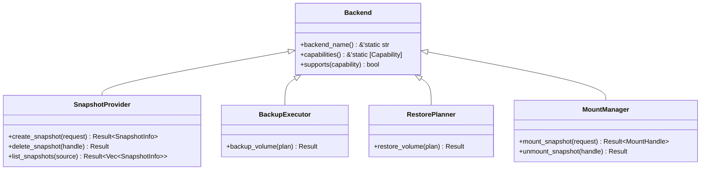
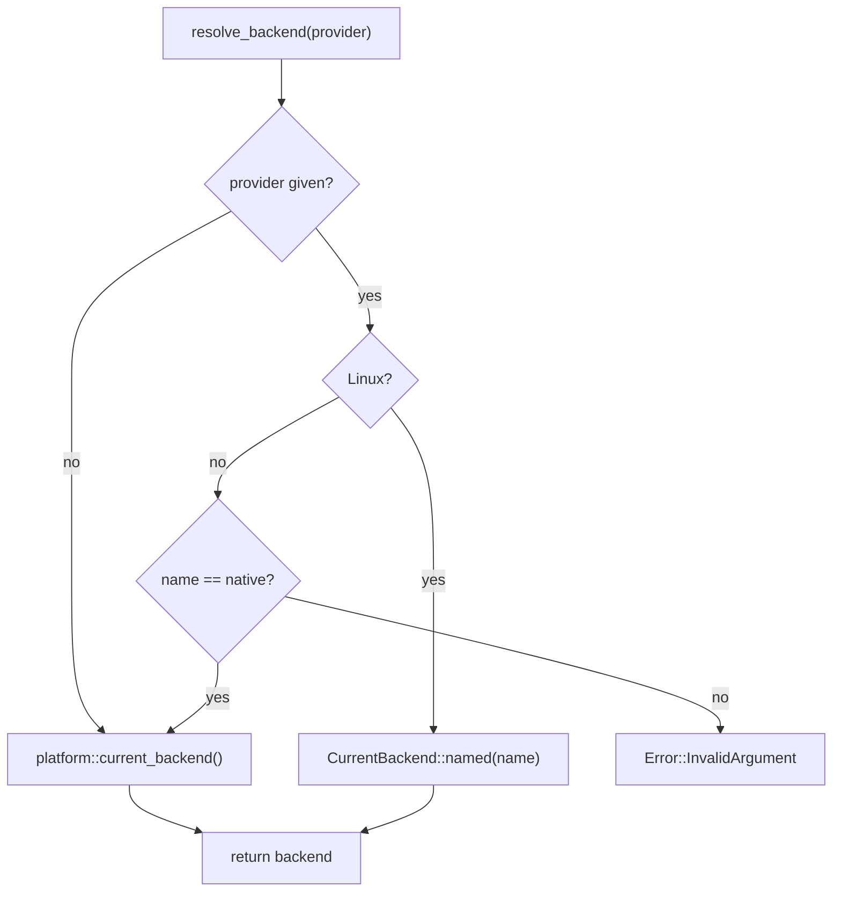

# Backend Trait

The `Backend` trait is the common interface shared by all platform backends.
Every operational trait -- `SnapshotProvider`, `BackupExecutor`, `RestorePlanner`,
and `MountManager` -- extends `Backend`, so callers can query capabilities without
knowing which specific trait a backend implements.

## Definition

The full trait definition is at `src/backend.rs:20-31`:

```rust title="src/backend.rs:20-31"
pub trait Backend: Send + Sync {
    /// Return the canonical name of this backend (e.g. "linux-btrfs", "windows-vss").
    fn backend_name(&self) -> &'static str;

    /// Return the set of capabilities this backend supports.
    fn capabilities(&self) -> &'static [Capability];

    /// Check whether this backend supports a specific capability.
    fn supports(&self, capability: Capability) -> bool {
        self.capabilities().contains(&capability)
    }
}
```

:::note
The `Backend` trait requires `Send + Sync`, meaning all backend implementations are
safe to share across threads.
:::

## Trait Hierarchy

All four operational traits extend `Backend` as a supertrait:



## Methods

### `backend_name`

```rust
fn backend_name(&self) -> &'static str;
```

Returns the canonical name of the backend as a static string. Common values include
`"linux-btrfs"`, `"linux-lvm"`, `"linux-zfs"`, and `"windows-vss"`.

### `capabilities`

```rust
fn capabilities(&self) -> &'static [Capability];
```

Returns a static slice of `Capability` values that this backend supports. The
`Capability` enum is defined in `src/types.rs:69-79`:

```rust title="src/types.rs:69-79"
pub enum Capability {
    CrashConsistentSnapshot,
    ApplicationConsistentSnapshot,
    WritableSnapshotMount,
    ReadOnlySnapshotMount,
    BlockLevelBackup,
    BlockLevelRestore,
    IncrementalSend,
    DirectDeviceAccess,
}
```

Each variant has a string representation via `as_str()` (`src/types.rs:82-93`):

| Variant | String |
|---|---|
| `CrashConsistentSnapshot` | `crash_consistent_snapshot` |
| `ApplicationConsistentSnapshot` | `application_consistent_snapshot` |
| `WritableSnapshotMount` | `writable_snapshot_mount` |
| `ReadOnlySnapshotMount` | `read_only_snapshot_mount` |
| `BlockLevelBackup` | `block_level_backup` |
| `BlockLevelRestore` | `block_level_restore` |
| `IncrementalSend` | `incremental_send` |
| `DirectDeviceAccess` | `direct_device_access` |

### `supports`

```rust
fn supports(&self, capability: Capability) -> bool;
```

A default method that checks whether a specific `Capability` is present in the slice
returned by `capabilities()`. Returns `true` if the capability is supported.

```rust title="src/backend.rs:28-31"
fn supports(&self, capability: Capability) -> bool {
    self.capabilities().contains(&capability)
}
```

:::tip
The `supports()` method is the preferred way to check capabilities rather than
manually iterating the slice. It uses `contains()` on a static slice, which is
efficient for the small number of capability variants.
:::

## Usage Examples

### Querying a backend

```rust
use vpt_rs::{Backend, Capability};

let backend = vpt_rs::platform::current_backend();
println!("backend: {}", backend.backend_name());

if backend.supports(Capability::CrashConsistentSnapshot) {
    println!("supports crash-consistent snapshots");
}

for cap in backend.capabilities() {
    println!("  - {}", cap);
}
```

### Selecting a backend on Linux

```rust
use vpt_rs::Backend;

// On Linux, select a named backend
let backend = vpt_rs::platform::CurrentBackend::named("btrfs")?;
println!("selected: {}", backend.backend_name());
```

:::tip
On non-Linux platforms, `CurrentBackend::named()` only accepts the platform's native
backend name. On Linux, it accepts any of the available backend names (`btrfs`, `lvm`,
`zfs`).
:::

## Cross-References

| Type | Path | Relationship |
|---|---|---|
| `Capability` | `src/types.rs:69-79` | Enum returned by `capabilities()` |
| `SnapshotProvider` | `src/snapshot.rs:20` | Extends `Backend` for snapshot ops |
| `BackupExecutor` | `src/backup.rs:19` | Extends `Backend` for backup ops |
| `RestorePlanner` | `src/restore.rs:19` | Extends `Backend` for restore ops |

## Resolution in the CLI

The CLI resolves a backend from the `--provider` flag via `resolve_backend()` at
`src/bin/vptcli.rs:65-87`. On Linux it delegates to `CurrentBackend::named()`; on
other platforms it falls back to `platform::current_backend()`.

```rust title="src/bin/vptcli.rs:65-87"
fn resolve_backend(provider: Option<&str>) -> vpt_rs::Result<platform::CurrentBackend> {
    #[cfg(target_os = "linux")]
    {
        if let Some(name) = provider {
            return platform::CurrentBackend::named(name);
        }
    }

    #[allow(unreachable_code)]
    {
        if let Some(name) = provider {
            let backend = platform::current_backend();
            if name == backend.backend_name() {
                return Ok(backend);
            }
            return Err(vpt_rs::Error::InvalidArgument {
                message: format!("provider selection is not supported on this platform: `{name}`"),
            });
        }
        Ok(platform::current_backend())
    }
}
```



## Capability Display

The CLI prints capabilities via the `snapshot capabilities` subcommand. The display
loop at `src/bin/vptcli.rs:168-171` iterates the `capabilities()` slice and prints
each one using its `Display` implementation:

```rust title="src/bin/vptcli.rs:168-171"
println!("{}", descriptor.backend_name);
for capability in descriptor.capabilities {
    println!("- {capability}");
}
```

The `Display` impl for `Capability` delegates to `as_str()` at
`src/types.rs:96-100`:

```rust title="src/types.rs:96-100"
impl std::fmt::Display for Capability {
    fn fmt(&self, f: &mut std::fmt::Formatter<'_>) -> std::fmt::Result {
        f.write_str(self.as_str())
    }
}
```

## Error Conditions

The `Backend` trait methods themselves do not return errors, but the operational
traits that extend it do. When a backend does not support a requested operation, it
returns one of the error variants from `src/error.rs:10-52`:

| Error Variant | Condition |
|---|---|
| `UnsupportedOperation` | The backend does not implement the requested trait |
| `MissingCapability` | The requested capability is not available |
| `InvalidArgument` | Invalid parameter passed to a method |
| `CommandFailed` | The underlying platform tool failed |

:::caution
Always check `supports()` before calling an operational method. Backends that do not
implement a trait will return `UnsupportedOperation`, but checking capabilities first
allows for graceful degradation.
:::
