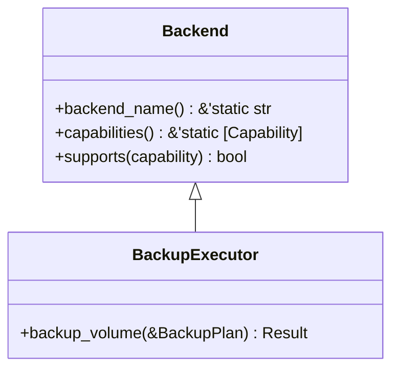
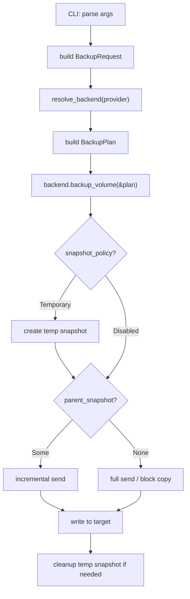

# BackupExecutor Trait

The `BackupExecutor` trait exports a volume to a stream or image file.
Implementations may use stream-based send (Btrfs `send`, ZFS `send`) or
block-level copy (LVM `dd`-style, VSS snapshot + copy). The trait name
reflects the execution role, not the underlying mechanism.

## Definition

The full trait definition is at `src/backup.rs:19-22`:

```rust title="src/backup.rs:19-22"
pub trait BackupExecutor: Backend {
    /// Execute a backup according to the given plan.
    fn backup_volume(&self, plan: &BackupPlan) -> Result<()>;
}
```

:::note
`BackupExecutor` extends `Backend` as a supertrait, so every implementation must
also implement `backend_name()` and `capabilities()`.
:::

## Trait Hierarchy



## Methods

### `backup_volume`

```rust
fn backup_volume(&self, plan: &BackupPlan) -> Result<()>;
```

Executes a backup according to the given plan. The plan specifies the source,
target, snapshot policy, optional parent snapshot for incremental backups, and
block size.

**Parameter: `plan`** -- A reference to a `BackupPlan` struct defined at
`src/types.rs:303-310`:

```rust title="src/types.rs:303-310"
pub struct BackupPlan {
    pub source: BackupSource,
    pub target: BackupTarget,
    pub snapshot_policy: SnapshotPolicy,
    pub parent_snapshot: Option<SnapshotRef>,
    pub block_size: Option<usize>,
}
```

| Field | Type | Description |
|---|---|---|
| `source` | `BackupSource` | Live volume or explicit snapshot to back up |
| `target` | `BackupTarget` | Output destination (image file or device) |
| `snapshot_policy` | `SnapshotPolicy` | Whether to create a temporary snapshot first |
| `parent_snapshot` | `Option<SnapshotRef>` | Parent for incremental send-style backups |
| `block_size` | `Option<usize>` | I/O chunk size in bytes; `None` uses provider default (4 MiB) |

## Supporting Types

### BackupSource

The `BackupSource` enum (`src/types.rs:234-238`) specifies what to back up:

```rust title="src/types.rs:234-238"
pub enum BackupSource {
    Volume(VolumeRef),
    Snapshot(SnapshotRef),
}
```

| Variant | Description |
|---|---|
| `Volume(VolumeRef)` | Back up a live volume directly |
| `Snapshot(SnapshotRef)` | Back up an existing snapshot |

### BackupTarget

The `BackupTarget` enum (`src/types.rs:221-225`) specifies the output destination:

```rust title="src/types.rs:221-225"
pub enum BackupTarget {
    ImageFile(PathBuf),
    Device(PathBuf),
}
```

| Variant | Description |
|---|---|
| `ImageFile(PathBuf)` | Write to a file on the filesystem |
| `Device(PathBuf)` | Write directly to a block device |

:::caution
Not all backends support both target types. Stream-based backends (Btrfs, ZFS) only
support `ImageFile`. Block-level backends (LVM, VSS) may support both. The backend
returns `InvalidArgument` if the target type is unsupported.
:::

### SnapshotPolicy

The `SnapshotPolicy` enum (`src/types.rs:253-261`) controls temporary snapshot
creation:

```rust title="src/types.rs:253-261"
pub enum SnapshotPolicy {
    Disabled,
    Temporary {
        kind: SnapshotKind,
        label: Option<String>,
        read_only: bool,
    },
}
```

| Variant | Description |
|---|---|
| `Disabled` | No temporary snapshot; back up the source as-is |
| `Temporary { kind, label, read_only }` | Create a temporary snapshot before backup |

Constructor methods are available at `src/types.rs:263-275`:

```rust title="src/types.rs:263-275"
impl SnapshotPolicy {
    pub const fn disabled() -> Self {
        Self::Disabled
    }

    pub fn temporary(kind: SnapshotKind, label: Option<String>, read_only: bool) -> Self {
        Self::Temporary {
            kind,
            label,
            read_only,
        }
    }
}
```

### SnapshotRef

The `SnapshotRef` type (`src/types.rs:185-203`) is used for the `parent_snapshot`
field to enable incremental backups:

```rust title="src/types.rs:185-203"
pub struct SnapshotRef {
    pub id: String,
    pub origin: Option<VolumeRef>,
}

impl SnapshotRef {
    pub fn new(id: impl Into<String>) -> Self {
        Self {
            id: id.into(),
            origin: None,
        }
    }

    pub fn with_origin(mut self, origin: VolumeRef) -> Self {
        self.origin = Some(origin);
        self
    }
}
```

## Error Conditions

All methods return `vpt_rs::Result<()>`. Common errors include:

| Error | Condition |
|---|---|
| `UnsupportedOperation` | Backend does not support backup |
| `InvalidArgument` | Target type not supported by this backend |
| `CommandFailed` | Underlying tool (e.g. `btrfs send`) failed |
| `Io` | File I/O failed during block copy |

These are defined in `src/error.rs:10-52`.

## Usage Examples

### Full backup to an image file

```rust
use vpt_rs::{BackupExecutor, BackupPlan, BackupSource, BackupTarget,
             SnapshotPolicy, SnapshotKind, VolumeRef};
use std::path::PathBuf;

let backend = vpt_rs::platform::current_backend();

let plan = BackupPlan {
    source: BackupSource::Volume(VolumeRef::new("/mnt/data/subvol")),
    target: BackupTarget::ImageFile(PathBuf::from("/tmp/backup.img")),
    snapshot_policy: SnapshotPolicy::temporary(
        SnapshotKind::CrashConsistent,
        Some("backup".to_string()),
        true,
    ),
    parent_snapshot: None,
    block_size: None,
};

backend.backup_volume(&plan)?;
```

### Incremental backup with a parent snapshot

```rust
use vpt_rs::{BackupExecutor, BackupPlan, BackupSource, BackupTarget,
             SnapshotPolicy, SnapshotRef, SnapshotKind, VolumeRef};
use std::path::PathBuf;

let backend = vpt_rs::platform::current_backend();

let plan = BackupPlan {
    source: BackupSource::Volume(VolumeRef::new("/mnt/data/subvol")),
    target: BackupTarget::ImageFile(PathBuf::from("/tmp/incr.img")),
    snapshot_policy: SnapshotPolicy::temporary(
        SnapshotKind::CrashConsistent,
        None,
        true,
    ),
    parent_snapshot: Some(SnapshotRef::new("/mnt/data/snapshots/subvol-nightly")),
    block_size: None,
};

backend.backup_volume(&plan)?;
```

### Backup without temporary snapshot

```rust
use vpt_rs::{BackupExecutor, BackupPlan, BackupSource, BackupTarget,
             SnapshotPolicy, VolumeRef};
use std::path::PathBuf;

let backend = vpt_rs::platform::current_backend();

let plan = BackupPlan {
    source: BackupSource::Volume(VolumeRef::new("/dev/vg0/data")),
    target: BackupTarget::ImageFile(PathBuf::from("/tmp/backup.img")),
    snapshot_policy: SnapshotPolicy::disabled(),
    parent_snapshot: None,
    block_size: Some(4 * 1024 * 1024), // 4 MiB
};

backend.backup_volume(&plan)?;
```

## CLI Integration

The CLI constructs a `BackupPlan` from parsed arguments at
`src/bin/vptcli.rs:414-427` and delegates to `backup_volume()`:

```rust title="src/bin/vptcli.rs:414-427"
let request = parse_backup_request(args)?;
let backend = resolve_backend(request.provider.as_deref())?;
backend.backup_volume(&BackupPlan {
    source: request.source,
    target: BackupTarget::ImageFile(request.output.clone()),
    snapshot_policy: request.snapshot_policy,
    parent_snapshot: request.parent_snapshot,
    block_size: request.block_size,
})?;
```



## Cross-References

| Type | Path | Relationship |
|---|---|---|
| `Backend` | `src/backend.rs:20` | Supertrait |
| `BackupPlan` | `src/types.rs:303` | Parameter for `backup_volume` |
| `BackupSource` | `src/types.rs:234` | Source enum in `BackupPlan` |
| `BackupTarget` | `src/types.rs:221` | Target enum in `BackupPlan` |
| `SnapshotPolicy` | `src/types.rs:253` | Snapshot policy in `BackupPlan` |
| `SnapshotRef` | `src/types.rs:185` | Parent snapshot reference |
| `Error` | `src/error.rs:10` | Error variants returned by methods |
| `RestorePlanner` | `src/restore.rs:19` | Companion trait for restore |
