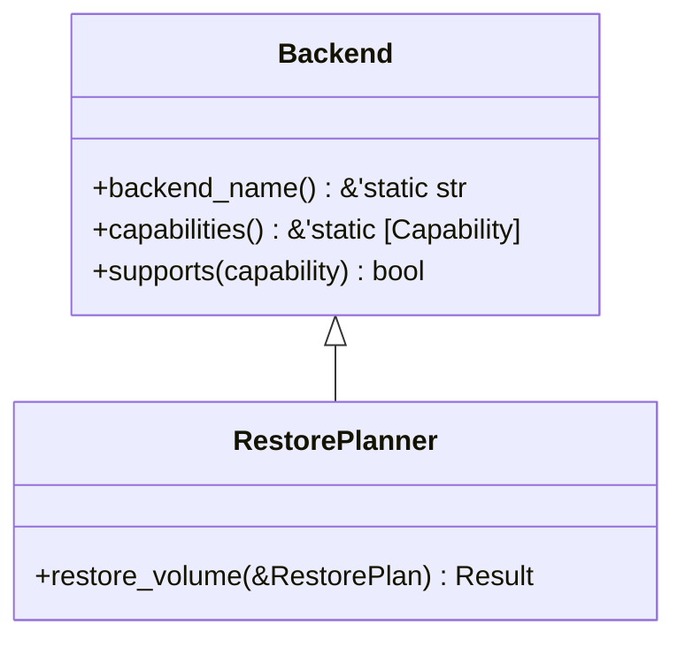
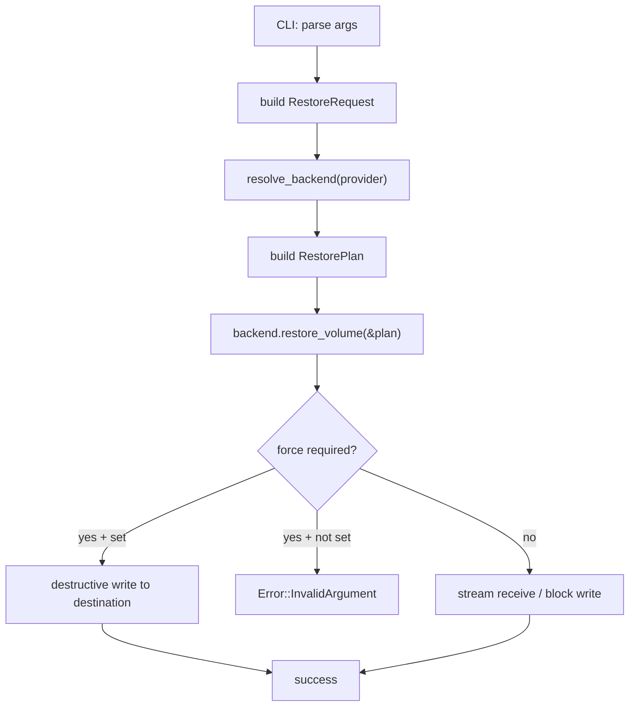
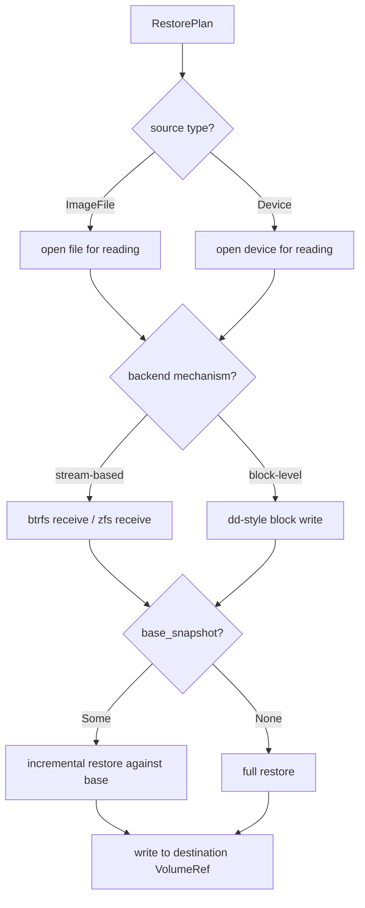

# RestorePlanner Trait

The `RestorePlanner` trait restores a volume from a backup stream or image file.
Implementations may use stream-based receive (Btrfs `receive`, ZFS `receive`) or
block-level write (LVM, VSS). Destructive backends require `force: true` in the
plan.

## Definition

The full trait definition is at `src/restore.rs:19-22`:

```rust title="src/restore.rs:19-22"
pub trait RestorePlanner: Backend {
    /// Execute a restore according to the given plan.
    fn restore_volume(&self, plan: &RestorePlan) -> Result<()>;
}
```

:::note
`RestorePlanner` extends `Backend` as a supertrait, so every implementation must
also implement `backend_name()` and `capabilities()`.
:::

## Trait Hierarchy



## Methods

### `restore_volume`

```rust
fn restore_volume(&self, plan: &RestorePlan) -> Result<()>;
```

Executes a restore according to the given plan. The plan specifies the source
backup file, destination volume, force flag, optional base snapshot for incremental
restore, and block size.

**Parameter: `plan`** -- A reference to a `RestorePlan` struct defined at
`src/types.rs:319-326`:

```rust title="src/types.rs:319-326"
pub struct RestorePlan {
    pub source: BackupTarget,
    pub destination: VolumeRef,
    pub force: bool,
    pub base_snapshot: Option<SnapshotRef>,
    pub block_size: Option<usize>,
}
```

| Field | Type | Description |
|---|---|---|
| `source` | `BackupTarget` | Input backup file or device |
| `destination` | `VolumeRef` | Target volume or directory to restore to |
| `force` | `bool` | Required for destructive backends (LVM, VSS) |
| `base_snapshot` | `Option<SnapshotRef>` | Base snapshot for incremental restore |
| `block_size` | `Option<usize>` | I/O chunk size in bytes; `None` uses provider default (4 MiB) |

## Supporting Types

### BackupTarget (as source)

The `BackupTarget` enum (`src/types.rs:221-225`) is reused as the restore source:

```rust title="src/types.rs:221-225"
pub enum BackupTarget {
    ImageFile(PathBuf),
    Device(PathBuf),
}
```

| Variant | Description |
|---|---|
| `ImageFile(PathBuf)` | Read from a file on the filesystem |
| `Device(PathBuf)` | Read directly from a block device |

### VolumeRef (as destination)

The `VolumeRef` type (`src/types.rs:40-43`) identifies the restore destination:

```rust title="src/types.rs:40-43"
pub struct VolumeRef {
    pub id: String,
}
```

The `id` string is interpreted by each backend:
- **Btrfs**: absolute subvolume path (e.g. `"/mnt/data/subvol"`)
- **LVM**: `/dev/<vg>/<lv>` path (e.g. `"/dev/vg0/data"`)
- **ZFS**: dataset name (e.g. `"tank/data"`) or mount path
- **Windows**: drive letter (e.g. `"C:"`) or volume GUID path

### SnapshotRef (as base)

The `SnapshotRef` type (`src/types.rs:185-203`) is used for the `base_snapshot`
field to support incremental restore workflows:

```rust title="src/types.rs:185-203"
pub struct SnapshotRef {
    pub id: String,
    pub origin: Option<VolumeRef>,
}

impl SnapshotRef {
    pub fn new(id: impl Into<String>) -> Self {
        Self {
            id: id.into(),
            origin: None,
        }
    }

    pub fn with_origin(mut self, origin: VolumeRef) -> Self {
        self.origin = Some(origin);
        self
    }
}
```

## Error Conditions

All methods return `vpt_rs::Result<()>`. Common errors include:

| Error | Condition |
|---|---|
| `UnsupportedOperation` | Backend does not support restore |
| `InvalidArgument` | `force` required but not set, or source type unsupported |
| `MissingPath` | Source file does not exist |
| `CommandFailed` | Underlying tool (e.g. `btrfs receive`) failed |

These are defined in `src/error.rs:10-52`.

:::caution
Destructive backends (LVM, VSS) overwrite the destination volume. The `force` field
must be `true` or the backend returns `InvalidArgument`. Always verify the
destination before using `force`.
:::

## Usage Examples

### Basic restore from an image file

```rust
use vpt_rs::{RestorePlanner, RestorePlan, BackupTarget, VolumeRef};
use std::path::PathBuf;

let backend = vpt_rs::platform::current_backend();

let plan = RestorePlan {
    source: BackupTarget::ImageFile(PathBuf::from("/tmp/backup.img")),
    destination: VolumeRef::new("/mnt/data/subvol"),
    force: false,
    base_snapshot: None,
    block_size: None,
};

backend.restore_volume(&plan)?;
```

### Force-restore to an LVM volume

```rust
use vpt_rs::{RestorePlanner, RestorePlan, BackupTarget, VolumeRef};
use std::path::PathBuf;

let backend = vpt_rs::platform::current_backend();

let plan = RestorePlan {
    source: BackupTarget::ImageFile(PathBuf::from("/tmp/backup.img")),
    destination: VolumeRef::new("/dev/vg0/data"),
    force: true,  // required for LVM
    base_snapshot: None,
    block_size: Some(4 * 1024 * 1024), // 4 MiB
};

backend.restore_volume(&plan)?;
```

### Incremental restore with a base snapshot

```rust
use vpt_rs::{RestorePlanner, RestorePlan, BackupTarget, SnapshotRef, VolumeRef};
use std::path::PathBuf;

let backend = vpt_rs::platform::current_backend();

let plan = RestorePlan {
    source: BackupTarget::ImageFile(PathBuf::from("/tmp/incr.img")),
    destination: VolumeRef::new("/mnt/data/subvol"),
    force: false,
    base_snapshot: Some(SnapshotRef::new("/mnt/data/snapshots/subvol-nightly")),
    block_size: None,
};

backend.restore_volume(&plan)?;
```

## CLI Integration

The CLI constructs a `RestorePlan` from parsed arguments at
`src/bin/vptcli.rs:544-557` and delegates to `restore_volume()`:

```rust title="src/bin/vptcli.rs:544-557"
let request = parse_restore_request(args)?;
let backend = resolve_backend(request.provider.as_deref())?;
backend.restore_volume(&RestorePlan {
    source: BackupTarget::ImageFile(request.input.clone()),
    destination: request.destination,
    force: request.force,
    base_snapshot: request.base_snapshot,
    block_size: request.block_size,
})?;

println!("backend: {}", backend.backend_name());
println!("input: {}", request.input.display());
```



## Restore Workflow



## Cross-References

| Type | Path | Relationship |
|---|---|---|
| `Backend` | `src/backend.rs:20` | Supertrait |
| `RestorePlan` | `src/types.rs:319` | Parameter for `restore_volume` |
| `BackupTarget` | `src/types.rs:221` | Source type in `RestorePlan` |
| `VolumeRef` | `src/types.rs:40` | Destination type in `RestorePlan` |
| `SnapshotRef` | `src/types.rs:185` | Base snapshot reference |
| `Error` | `src/error.rs:10` | Error variants returned by methods |
| `BackupExecutor` | `src/backup.rs:19` | Companion trait for backup |
