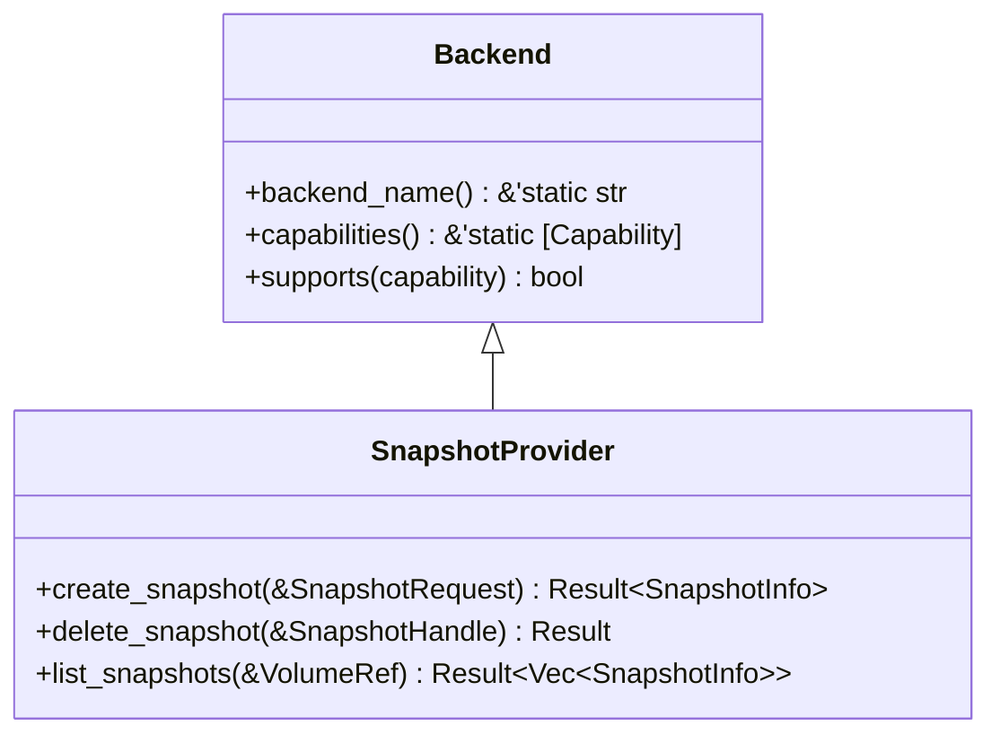
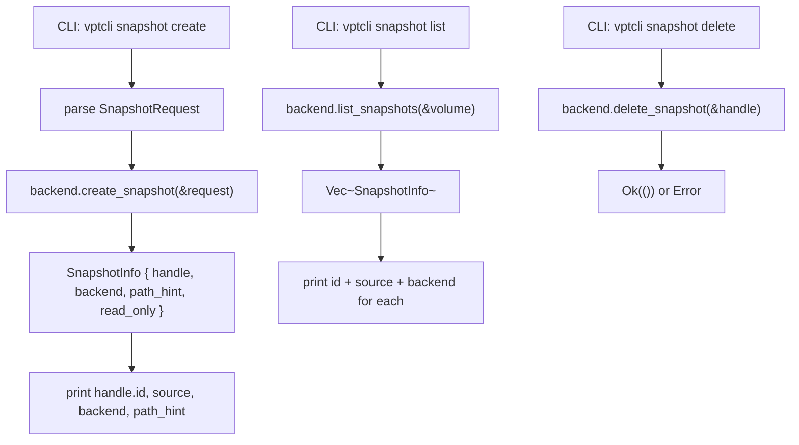

# SnapshotProvider Trait

The `SnapshotProvider` trait handles snapshot lifecycle management: creating,
deleting, and listing provider-managed snapshots. Each platform backend implements
this trait for its native snapshot mechanism (Btrfs subvolume snapshots, LVM
snapshots, ZFS snapshots, Windows VSS).

## Definition

The full trait definition is at `src/snapshot.rs:20-31`:

```rust title="src/snapshot.rs:20-31"
pub trait SnapshotProvider: Backend {
    /// Create a new snapshot of the given volume.
    ///
    /// Returns a [`SnapshotInfo`] containing the snapshot handle and metadata.
    fn create_snapshot(&self, request: &SnapshotRequest) -> Result<SnapshotInfo>;

    /// Delete an existing snapshot by its handle.
    fn delete_snapshot(&self, snapshot: &SnapshotHandle) -> Result<()>;

    /// List all snapshots managed by this backend for the given volume.
    fn list_snapshots(&self, source: &VolumeRef) -> Result<Vec<SnapshotInfo>>;
}
```

:::note
`SnapshotProvider` extends `Backend` as a supertrait, so every implementation must
also implement `backend_name()` and `capabilities()`.
:::

## Trait Hierarchy



## Methods

### `create_snapshot`

```rust
fn create_snapshot(&self, request: &SnapshotRequest) -> Result<SnapshotInfo>;
```

Creates a new snapshot of the specified volume. Returns a `SnapshotInfo` containing
the snapshot handle and metadata.

**Parameter: `request`** -- A reference to a `SnapshotRequest` struct defined at
`src/types.rs:160-166`:

```rust title="src/types.rs:160-166"
pub struct SnapshotRequest {
    pub source: VolumeRef,
    pub kind: SnapshotKind,
    pub label: Option<String>,
    pub read_only: bool,
}
```

| Field | Type | Description |
|---|---|---|
| `source` | `VolumeRef` | The volume to snapshot |
| `kind` | `SnapshotKind` | Consistency kind (`CrashConsistent` or `ApplicationConsistent`) |
| `label` | `Option<String>` | Optional human-readable label |
| `read_only` | `bool` | Whether the snapshot should be read-only |

**Return: `SnapshotInfo`** -- Defined at `src/types.rs:212-218`:

```rust title="src/types.rs:212-218"
pub struct SnapshotInfo {
    pub handle: SnapshotHandle,
    pub backend: &'static str,
    pub path_hint: Option<PathBuf>,
    pub read_only: bool,
}
```

| Field | Type | Description |
|---|---|---|
| `handle` | `SnapshotHandle` | Snapshot handle with ID and optional source |
| `backend` | `&'static str` | Backend name that created the snapshot |
| `path_hint` | `Option<PathBuf>` | Optional filesystem path to the snapshot |
| `read_only` | `bool` | Whether the snapshot is read-only |

### `delete_snapshot`

```rust
fn delete_snapshot(&self, snapshot: &SnapshotHandle) -> Result<()>;
```

Deletes an existing snapshot identified by its handle.

**Parameter: `snapshot`** -- A reference to a `SnapshotHandle` defined at
`src/types.rs:175-179`:

```rust title="src/types.rs:175-179"
pub struct SnapshotHandle {
    pub id: String,
    pub source: Option<VolumeRef>,
}
```

| Field | Type | Description |
|---|---|---|
| `id` | `String` | Provider-specific snapshot identifier |
| `source` | `Option<VolumeRef>` | Optional source volume reference |

:::caution
Deleting a snapshot is irreversible. The `id` format is provider-specific: Btrfs uses
absolute paths, LVM uses `/dev/<vg>/<lv>`, ZFS uses `dataset@name`, and VSS uses
`{GUID}`.
:::

### `list_snapshots`

```rust
fn list_snapshots(&self, source: &VolumeRef) -> Result<Vec<SnapshotInfo>>;
```

Lists all snapshots managed by this backend for the given volume.

**Parameter: `source`** -- A reference to a `VolumeRef` defined at
`src/types.rs:40-43`:

```rust title="src/types.rs:40-43"
pub struct VolumeRef {
    pub id: String,
}
```

The `id` string is interpreted by each backend:
- **Btrfs**: absolute subvolume path (e.g. `"/mnt/data/subvol"`)
- **LVM**: `/dev/<vg>/<lv>` path (e.g. `"/dev/vg0/data"`)
- **ZFS**: dataset name (e.g. `"tank/data"`) or mount path
- **Windows**: drive letter (e.g. `"C:"`) or volume GUID path

## Supporting Types

### SnapshotKind

The `SnapshotKind` enum (`src/types.rs:109-113`) controls snapshot consistency:

```rust title="src/types.rs:109-113"
pub enum SnapshotKind {
    CrashConsistent,
    ApplicationConsistent,
}
```

| Variant | Description | CLI value |
|---|---|---|
| `CrashConsistent` | Filesystem-consistent, no app quiescing | `crash` |
| `ApplicationConsistent` | Coordinates with VSS writers to flush app buffers | `application` |

### SnapshotRef

The `SnapshotRef` type (`src/types.rs:185-203`) is a reference to an existing snapshot,
separate from `SnapshotHandle` so plans can refer to snapshots created outside the
current process:

```rust title="src/types.rs:185-203"
pub struct SnapshotRef {
    pub id: String,
    pub origin: Option<VolumeRef>,
}

impl SnapshotRef {
    pub fn new(id: impl Into<String>) -> Self {
        Self {
            id: id.into(),
            origin: None,
        }
    }

    pub fn with_origin(mut self, origin: VolumeRef) -> Self {
        self.origin = Some(origin);
        self
    }
}
```

## Error Conditions

All methods return `vpt_rs::Result<_>`. Common errors include:

| Error | Condition |
|---|---|
| `UnsupportedOperation` | Backend does not implement snapshots |
| `MissingCapability` | Requested snapshot kind is not supported |
| `InvalidVolume` | Volume reference is empty |
| `MissingPath` | Source path does not exist |
| `CommandFailed` | Underlying tool (e.g. `btrfs subvolume snapshot`) failed |

## Usage Example

```rust
use vpt_rs::{SnapshotProvider, SnapshotRequest, SnapshotKind, VolumeRef};

let backend = vpt_rs::platform::current_backend();

// Create a crash-consistent snapshot
let request = SnapshotRequest {
    source: VolumeRef::new("/mnt/data/subvol"),
    kind: SnapshotKind::CrashConsistent,
    label: Some("nightly".to_string()),
    read_only: true,
};
let info = backend.create_snapshot(&request)?;
println!("created snapshot: {}", info.handle.id);

// List snapshots
let snapshots = backend.list_snapshots(&VolumeRef::new("/mnt/data/subvol"))?;
for snap in &snapshots {
    println!("{} {}", snap.handle.id, snap.backend);
}

// Delete the snapshot
backend.delete_snapshot(&info.handle)?;
```

## Data Flow



## Cross-References

| Type | Path | Relationship |
|---|---|---|
| `Backend` | `src/backend.rs:20` | Supertrait |
| `SnapshotRequest` | `src/types.rs:160` | Parameter for `create_snapshot` |
| `SnapshotHandle` | `src/types.rs:175` | Parameter for `delete_snapshot` |
| `SnapshotInfo` | `src/types.rs:212` | Return type of `create_snapshot` and `list_snapshots` |
| `VolumeRef` | `src/types.rs:40` | Parameter for `list_snapshots` |
| `SnapshotRef` | `src/types.rs:185` | Used in backup/restore plans |
| `Capability` | `src/types.rs:69` | Queried via `Backend::supports()` |
