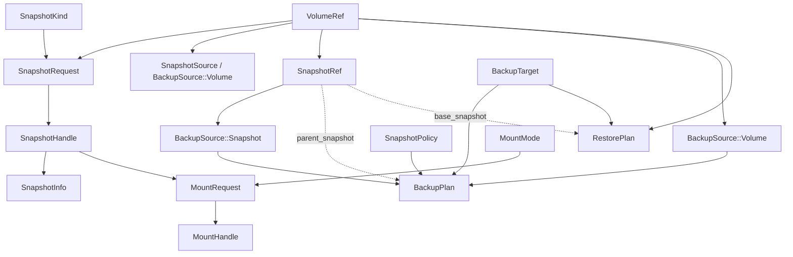

# Core Types Reference

This page documents every public type exported by `vpt_rs`. All types live in the
`vpt_rs::types` module and are re-exported from the crate root.

## VolumeRef

A stable identifier for a live volume, filesystem, dataset, or provider-specific source.
The `id` string is interpreted differently by each backend.

| Backend   | `id` format                                | Example                    |
|-----------|--------------------------------------------|----------------------------|
| Btrfs     | Absolute subvolume path                    | `"/mnt/data/subvol"`       |
| LVM       | `/dev/<vg>/<lv>` path                      | `"/dev/vg0/data"`          |
| ZFS       | Dataset name or mount path                 | `"tank/data"`              |
| Windows   | Drive letter or volume GUID path           | `"C:"`                     |

```rust
use vpt_rs::VolumeRef;

// Construct from a string literal
let vol = VolumeRef::new("/mnt/data/subvol");

// From<String> is implemented, so the ? operator and .into() both work
let id = String::from("/dev/vg0/data");
let vol2: VolumeRef = id.into();

// Display prints the raw id
println!("volume: {vol}"); // "volume: /mnt/data/subvol"
```

## Capability

An enum listing every feature a backend might support. Used by
[`Backend::capabilities()`](crate::Backend::capabilities) and
[`Backend::supports()`](crate::Backend::supports).

```rust
use vpt_rs::Capability;

let caps = vec![
    Capability::CrashConsistentSnapshot,
    Capability::BlockLevelBackup,
    Capability::IncrementalSend,
];
```

| Variant                      | `as_str()`                        | Description                                        |
|------------------------------|-----------------------------------|----------------------------------------------------|
| `CrashConsistentSnapshot`    | `"crash_consistent_snapshot"`     | Filesystem-consistent snapshot (no app quiescing)  |
| `ApplicationConsistentSnapshot` | `"application_consistent_snapshot"` | App-quiesced snapshot (VSS writers on Windows)  |
| `WritableSnapshotMount`      | `"writable_snapshot_mount"`       | Can mount snapshots read-write                     |
| `ReadOnlySnapshotMount`      | `"read_only_snapshot_mount"`      | Can mount snapshots read-only                      |
| `BlockLevelBackup`           | `"block_level_backup"`            | Supports dd-style block copy backup                |
| `BlockLevelRestore`          | `"block_level_restore"`           | Supports dd-style block copy restore               |
| `IncrementalSend`            | `"incremental_send"`              | Supports incremental send/receive streams          |
| `DirectDeviceAccess`         | `"direct_device_access"`          | Can read/write raw block devices                   |

## SnapshotKind

Consistency intent for a snapshot operation.

```rust
use vpt_rs::SnapshotKind;

let kind: SnapshotKind = "crash".parse().unwrap();
assert_eq!(kind, SnapshotKind::CrashConsistent);

let kind2: SnapshotKind = "application".parse().unwrap();
assert_eq!(kind2, SnapshotKind::ApplicationConsistent);
```

| Variant               | Accepted parse strings                  | Meaning                                          |
|-----------------------|-----------------------------------------|--------------------------------------------------|
| `CrashConsistent`     | `"crash"`, `"crash-consistent"`         | Like pulling the power plug; filesystem-safe     |
| `ApplicationConsistent` | `"app"`, `"application"`, `"application-consistent"` | Coordinates with VSS writers to flush buffers |

## SnapshotRequest

A provider-neutral request to create a snapshot.

```rust
use vpt_rs::{SnapshotRequest, SnapshotKind, VolumeRef};

let request = SnapshotRequest {
    source: VolumeRef::new("/mnt/data/subvol"),
    kind: SnapshotKind::CrashConsistent,
    label: Some("nightly".to_string()),
    read_only: true,
};
```

| Field       | Type              | Description                                           |
|-------------|-------------------|-------------------------------------------------------|
| `source`    | `VolumeRef`       | The volume to snapshot                                |
| `kind`      | `SnapshotKind`    | Consistency level                                     |
| `label`     | `Option<String>`  | Optional human-readable label (sanitized on use)      |
| `read_only` | `bool`            | Whether the snapshot should be read-only              |

## SnapshotHandle

A concrete snapshot identifier returned after creation. The `id` format varies
by provider (e.g. absolute path for Btrfs, `/dev/<vg>/<snap_lv>` for LVM,
`dataset@name` for ZFS, `{GUID}` for VSS).

```rust
use vpt_rs::SnapshotHandle;

let handle = SnapshotHandle {
    id: "/mnt/data/snapshots/nightly-20260607".to_string(),
    source: None,
};
```

| Field    | Type                | Description                           |
|----------|---------------------|---------------------------------------|
| `id`     | `String`            | Provider-specific snapshot identifier |
| `source` | `Option<VolumeRef>` | The originating volume, if known      |

## SnapshotRef

A reference to an existing snapshot, used in backup/restore planning. Separate
from `SnapshotHandle` so plans can refer to snapshots created outside the
current process.

```rust
use vpt_rs::{SnapshotRef, VolumeRef};

let snap_ref = SnapshotRef::new("tank/data@backup-20260601")
    .with_origin(VolumeRef::new("tank/data"));
```

| Field    | Type                | Description                             |
|----------|---------------------|-----------------------------------------|
| `id`     | `String`            | Provider-specific snapshot identifier   |
| `origin` | `Option<VolumeRef>` | The volume this snapshot belongs to     |

## SnapshotInfo

Provider-reported metadata about a snapshot.

```rust
use vpt_rs::{SnapshotInfo, SnapshotHandle};
use std::path::PathBuf;

let info = SnapshotInfo {
    handle: SnapshotHandle { id: "vg0-data-snap".to_string(), source: None },
    backend: "linux-lvm",
    path_hint: Some(PathBuf::from("/dev/vg0/data-snap")),
    read_only: true,
};
```

| Field       | Type              | Description                              |
|-------------|-------------------|------------------------------------------|
| `handle`    | `SnapshotHandle`  | The snapshot handle                      |
| `backend`   | `&'static str`    | Backend name that created it             |
| `path_hint` | `Option<PathBuf>` | Suggested filesystem path, if applicable |
| `read_only` | `bool`            | Whether the snapshot is read-only        |

## BackupTarget

Destination for a backup operation.

```rust
use vpt_rs::BackupTarget;
use std::path::PathBuf;

let img = BackupTarget::ImageFile(PathBuf::from("/tmp/backup.img"));
let dev = BackupTarget::Device(PathBuf::from("/dev/sdb1"));
```

| Variant       | Inner       | Description                            |
|---------------|-------------|----------------------------------------|
| `ImageFile`   | `PathBuf`   | Write backup to a regular file         |
| `Device`      | `PathBuf`   | Write backup to a raw block device     |

## BackupSource

Source for a backup -- either a live volume or an explicit snapshot.

```rust
use vpt_rs::{BackupSource, VolumeRef, SnapshotRef};

let from_vol = BackupSource::Volume(VolumeRef::new("/dev/vg0/data"));
let from_snap = BackupSource::Snapshot(SnapshotRef::new("tank@daily"));
```

## SnapshotPolicy

Controls whether the provider should create a temporary snapshot before
backing up.

```rust
use vpt_rs::{SnapshotPolicy, SnapshotKind};

// No automatic snapshot
let disabled = SnapshotPolicy::disabled();

// Create a temporary crash-consistent snapshot
let temp = SnapshotPolicy::temporary(
    SnapshotKind::CrashConsistent,
    Some("backup".to_string()),
    true,
);
```

| Variant     | Fields                                          | Meaning                                |
|-------------|-------------------------------------------------|----------------------------------------|
| `Disabled`  | *(none)*                                        | Use the source as-is                   |
| `Temporary` | `kind`, `label: Option<String>`, `read_only`    | Create a temp snapshot, use it, clean up |

## BackupPlan

A provider-neutral plan that describes what to back up, where, and how.

```rust
use vpt_rs::{BackupPlan, BackupSource, BackupTarget, SnapshotPolicy, SnapshotKind, VolumeRef};
use std::path::PathBuf;

let plan = BackupPlan {
    source: BackupSource::Volume(VolumeRef::new("/dev/vg0/data")),
    target: BackupTarget::ImageFile(PathBuf::from("/tmp/backup.img")),
    snapshot_policy: SnapshotPolicy::temporary(
        SnapshotKind::CrashConsistent, Some("backup".to_string()), true,
    ),
    parent_snapshot: None,
    block_size: None,
};
```

| Field             | Type                  | Description                                       |
|-------------------|-----------------------|---------------------------------------------------|
| `source`          | `BackupSource`        | Live volume or explicit snapshot                  |
| `target`          | `BackupTarget`        | Image file or block device                        |
| `snapshot_policy` | `SnapshotPolicy`      | Whether to create a temp snapshot first           |
| `parent_snapshot` | `Option<SnapshotRef>` | Base snapshot for incremental send                |
| `block_size`      | `Option<usize>`       | I/O chunk size; `None` = provider default (4 MiB) |

## RestorePlan

A provider-neutral plan for restoring from a backup.

```rust
use vpt_rs::{RestorePlan, BackupTarget, VolumeRef};
use std::path::PathBuf;

let plan = RestorePlan {
    source: BackupTarget::ImageFile(PathBuf::from("/tmp/backup.img")),
    destination: VolumeRef::new("/dev/vg0/restored"),
    force: true,
    base_snapshot: None,
    block_size: None,
};
```

| Field           | Type              | Description                                          |
|-----------------|-------------------|------------------------------------------------------|
| `source`        | `BackupTarget`    | Image file or device to restore from                 |
| `destination`   | `VolumeRef`       | Target volume                                        |
| `force`         | `bool`            | Required for destructive backends (LVM, VSS)         |
| `base_snapshot` | `Option<SnapshotRef>` | Base for incremental restore workflows           |
| `block_size`    | `Option<usize>`   | I/O chunk size; `None` = provider default (4 MiB)    |

## MountMode, MountRequest, MountHandle

Types for snapshot mounting.

```rust
use vpt_rs::{MountMode, MountRequest, MountHandle, SnapshotHandle};
use std::path::PathBuf;

let request = MountRequest {
    snapshot: SnapshotHandle { id: "/dev/vg0/snap".to_string(), source: None },
    mode: MountMode::ReadOnly,
    target: Some(PathBuf::from("/mnt/browse")),
};

// After a successful mount:
let handle = MountHandle {
    id: "mount-1".to_string(),
    mount_point: PathBuf::from("/mnt/browse"),
};
```

| Type           | Key fields                    | Purpose                        |
|----------------|-------------------------------|--------------------------------|
| `MountMode`    | `ReadOnly`, `ReadWrite`       | Access level for the mount     |
| `MountRequest` | `snapshot`, `mode`, `target`  | What to mount and how          |
| `MountHandle`  | `id`, `mount_point`           | Result of a successful mount   |

## sanitize_snapshot_label()

Sanitizes a user-provided label into a safe snapshot name component.
Characters outside `[a-zA-Z0-9\-_.+:]` are replaced with `-`.
Returns `"snapshot"` if the result would be empty or all dashes.

```rust
use vpt_rs::sanitize_snapshot_label;

assert_eq!(sanitize_snapshot_label("nightly backup"), "nightly-backup");
assert_eq!(sanitize_snapshot_label("2026/06/07"), "2026-06-07");
assert_eq!(sanitize_snapshot_label("---"), "snapshot");
assert_eq!(sanitize_snapshot_label("valid_name.test"), "valid_name.test");
```

## Type Relationship Diagram

The following diagram shows how the core types relate to each other.



