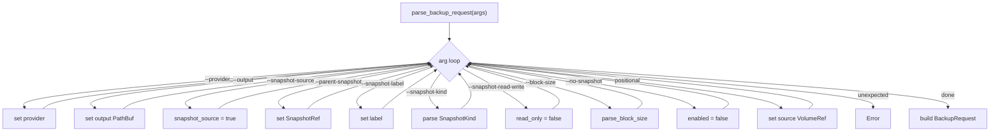
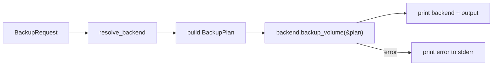

# vptcli backup

Back up a volume to a stream or image file. The backup command supports both
live-volume and snapshot-based sources, optional temporary snapshot creation,
incremental (parent-based) backups, and configurable block sizes.

## Usage

```
vptcli backup <source> --output <stream-file> [options]
```

Running `vptcli backup` with no arguments, or with `--help` / `-h`, prints the usage
text. The help detection is at `src/bin/vptcli.rs:404-412`:

```rust title="src/bin/vptcli.rs:404-412"
fn run_backup(args: Vec<String>) -> vpt_rs::Result<()> {
    if args.is_empty()
        || args
            .iter()
            .any(|a| a == "--help" || a == "-h" || a == "help")
    {
        print_backup_usage();
        return Ok(());
    }
    // ...
}
```

## Options

| Flag | Required | Default | Description |
|---|---|---|---|
| `<source>` | Yes | -- | Source volume path or identifier |
| `--output <path>` | Yes | -- | Output image file path |
| `--provider <name>` | No | platform default | Backend provider to use |
| `--snapshot-source` | No | `false` | Treat the source argument as a snapshot ID |
| `--no-snapshot` | No | `false` | Disable automatic temporary snapshot creation |
| `--snapshot-kind crash\|application` | No | `crash` | Consistency kind for the temporary snapshot |
| `--snapshot-label <name>` | No | (none) | Label for the temporary snapshot |
| `--snapshot-read-write` | No | read-only | Create the temporary snapshot as writable |
| `--parent-snapshot <id>` | No | (none) | Parent snapshot ID for incremental backup |
| `--block-size <N[K\|M\|G]>` | No | provider default | I/O chunk size for block-level copy |

## Argument Parsing

All flags are parsed by `parse_backup_request()` at `src/bin/vptcli.rs:429-513`. The
function iterates through arguments manually, matching each one against known flags:

```rust title="src/bin/vptcli.rs:442-486"
let mut iter = args.into_iter();
while let Some(arg) = iter.next() {
    match arg.as_str() {
        "--provider" => {
            provider = Some(iter.next().ok_or_else(|| missing("--provider"))?);
        }
        "--output" => {
            output = Some(PathBuf::from(
                iter.next().ok_or_else(|| missing("--output"))?,
            ));
        }
        "--snapshot-source" => {
            snapshot_source = true;
        }
        "--parent-snapshot" => {
            parent_snapshot = Some(SnapshotRef::new(
                iter.next().ok_or_else(|| missing("--parent-snapshot"))?,
            ));
        }
        "--snapshot-label" => {
            snapshot_label = Some(iter.next().ok_or_else(|| missing("--snapshot-label"))?);
        }
        "--snapshot-kind" => {
            let value = iter.next().ok_or_else(|| missing("--snapshot-kind"))?;
            snapshot_kind = value.parse()?;
        }
        "--snapshot-read-write" => {
            snapshot_read_only = false;
        }
        "--block-size" => {
            let value = iter.next().ok_or_else(|| missing("--block-size"))?;
            block_size = Some(parse_block_size(&value)?);
        }
        "--no-snapshot" => {
            snapshot_enabled = false;
        }
        value if source.is_none() => {
            source = Some(VolumeRef::new(value));
        }
        _ => {
            return Err(vpt_rs::Error::InvalidArgument {
                message: format!("unexpected argument `{arg}`"),
            });
        }
    }
}
```



## Snapshot Source vs Volume Source

The `--snapshot-source` flag changes how the positional `<source>` argument is
interpreted. When set, the source volume ID is reused as the snapshot ID and the
source becomes a `BackupSource::Snapshot`:

```rust title="src/bin/vptcli.rs:496-503"
source: if snapshot_source {
    let volume = source;
    let snapshot_id = volume.id.clone();
    BackupSource::Snapshot(SnapshotRef::new(snapshot_id).with_origin(volume))
} else {
    BackupSource::Volume(source)
},
```

| Flag | Source Type | Behavior |
|---|---|---|
| (default) | `BackupSource::Volume` | Backup the live volume directly |
| `--snapshot-source` | `BackupSource::Snapshot` | Use the source ID as a snapshot reference |

## Snapshot Policy

The snapshot policy controls whether a temporary snapshot is created before backup.
The policy is built at `src/bin/vptcli.rs:505-510`:

```rust title="src/bin/vptcli.rs:505-510"
snapshot_policy: if snapshot_enabled {
    SnapshotPolicy::temporary(snapshot_kind, snapshot_label, snapshot_read_only)
} else {
    SnapshotPolicy::disabled()
},
```

| Combination | Policy |
|---|---|
| (default) | Temporary crash-consistent, read-only snapshot |
| `--snapshot-kind application` | Temporary application-consistent snapshot |
| `--snapshot-label nightly` | Snapshot with label "nightly" |
| `--no-snapshot` | No temporary snapshot; backup the source as-is |

:::note
The `SnapshotPolicy::temporary()` constructor is defined in `src/types.rs:268-275`.
When set to `Disabled`, the backend will attempt to back up the source directly
without creating an intermediate snapshot.
:::

## Plan Construction

After parsing, the command constructs a `BackupPlan` and delegates to the backend
at `src/bin/vptcli.rs:414-427`:

```rust title="src/bin/vptcli.rs:414-427"
let request = parse_backup_request(args)?;
let backend = resolve_backend(request.provider.as_deref())?;
backend.backup_volume(&BackupPlan {
    source: request.source,
    target: BackupTarget::ImageFile(request.output.clone()),
    snapshot_policy: request.snapshot_policy,
    parent_snapshot: request.parent_snapshot,
    block_size: request.block_size,
})?;

println!("backend: {}", backend.backend_name());
println!("output: {}", request.output.display());
```

The `BackupPlan` struct is defined in `src/types.rs:303-310`:

```rust title="src/types.rs:303-310"
pub struct BackupPlan {
    pub source: BackupSource,
    pub target: BackupTarget,
    pub snapshot_policy: SnapshotPolicy,
    pub parent_snapshot: Option<SnapshotRef>,
    pub block_size: Option<usize>,
}
```



## Output

On success the command prints:

```
backend: linux-btrfs
output: /tmp/backup.img
```

On failure the error is printed to stderr with the prefix `error: `.

## Examples

### Basic backup

```bash
vptcli backup /mnt/data/subvol --output /tmp/backup.img
```

### Backup with a specific provider

```bash
vptcli backup --provider btrfs /mnt/data/subvol --output /tmp/backup.img
```

### Application-consistent backup with a label

```bash
vptcli backup /dev/vg0/data --output /tmp/backup.img \
    --snapshot-kind application --snapshot-label pre-upgrade
```

### Incremental backup against a parent snapshot

```bash
vptcli backup /mnt/data/subvol --output /tmp/incr.img \
    --parent-snapshot /mnt/data/snapshots/subvol-nightly
```

### Backup without temporary snapshot

```bash
vptcli backup /dev/vg0/data --output /tmp/backup.img --no-snapshot
```

### Backup with custom block size

```bash
vptcli backup /dev/vg0/data --output /tmp/backup.img --block-size 4M
```

### Use an existing snapshot as the source

```bash
vptcli backup /mnt/data/snapshots/subvol-nightly --output /tmp/backup.img --snapshot-source
```

:::caution
The `--output` flag is mandatory. Omitting it produces an `InvalidArgument` error
with the message `missing '--output <path>'`.
:::
