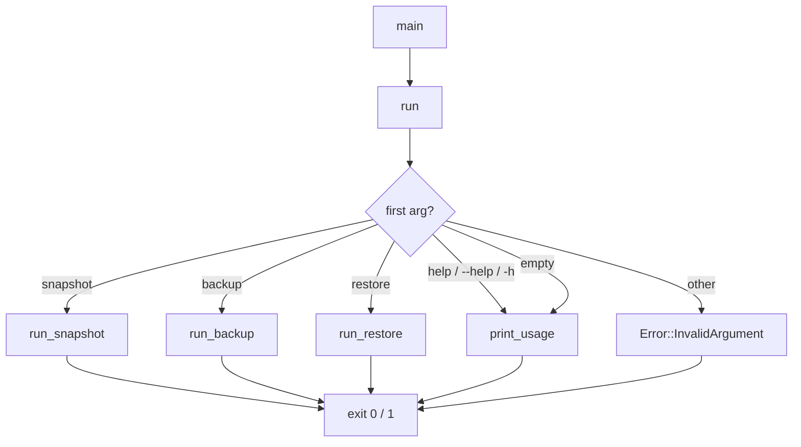
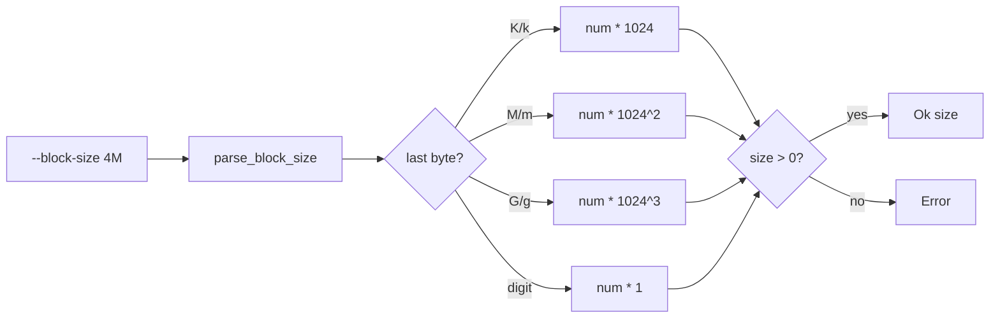
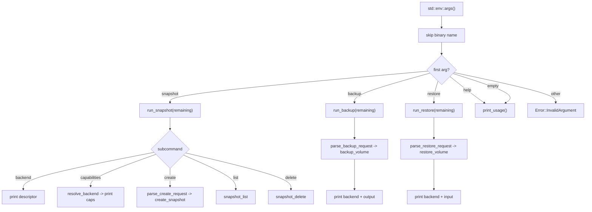

# CLI Overview

`vptcli` is the command-line interface for the **vpt-rs** volume backup toolkit. It
exposes the core library operations -- snapshot management, backup, and restore -- as a
single binary with three top-level subcommands.

## Binary

```
vptcli <command> [args]
```

Run `vptcli` with no arguments (or pass `help`) to see the available commands. The
binary returns exit code `0` on success and `1` on failure.

### Entry Point

The `main` function at `src/bin/vptcli.rs:15` initializes structured logging via
`tracing`, calls `run()`, and maps the result to an exit code:

```rust title="src/bin/vptcli.rs:15-26"
fn main() -> ExitCode {
    logging::init_logging();
    info!(tool = "vptcli", "cli started");
    match run() {
        Ok(()) => ExitCode::SUCCESS,
        Err(err) => {
            error!(tool = "vptcli", error = %err, timeout_secs = err.timeout_secs(), "cli failed");
            eprintln!("error: {err}");
            ExitCode::from(1)
        }
    }
}
```

:::tip
On failure the error is printed to **stderr** with a structured `tracing` log entry
that includes the error message and any timeout duration. Success produces no output
on stderr.
:::

## Subcommands

| Subcommand | Description |
|---|---|
| `snapshot` | Create, list, delete snapshots; query backends and capabilities |
| `backup` | Back up a volume to a stream or image file |
| `restore` | Restore a volume from a stream or image file |

Every subcommand accepts `--help` or `-h` to print its own usage text.

## Command Dispatch

The `run()` function at `src/bin/vptcli.rs:28` consumes the first positional argument
as the command name and delegates to the corresponding handler:

```rust title="src/bin/vptcli.rs:28-48"
fn run() -> vpt_rs::Result<()> {
    let mut args = std::env::args().skip(1);
    let Some(command) = args.next() else {
        print_usage();
        return Ok(());
    };

    let remaining: Vec<String> = args.collect();
    match command.as_str() {
        "snapshot" => run_snapshot(remaining),
        "backup" => run_backup(remaining),
        "restore" => run_restore(remaining),
        "help" | "--help" | "-h" => {
            print_usage();
            Ok(())
        }
        _ => Err(vpt_rs::Error::InvalidArgument {
            message: format!("unknown command `{command}`"),
        }),
    }
}
```



## Common Options

### `--provider`

The `--provider <name>` flag selects the snapshot provider backend. It appears in
every subcommand. On Linux the flag accepts backend names such as `btrfs`, `lvm`, or
`zfs`. On other platforms the flag is accepted but must match the platform's native
backend name.

The resolution logic lives in `resolve_backend()` at `src/bin/vptcli.rs:65`:

```rust title="src/bin/vptcli.rs:65-87"
fn resolve_backend(provider: Option<&str>) -> vpt_rs::Result<platform::CurrentBackend> {
    #[cfg(target_os = "linux")]
    {
        if let Some(name) = provider {
            return platform::CurrentBackend::named(name);
        }
    }

    #[allow(unreachable_code)]
    {
        if let Some(name) = provider {
            let backend = platform::current_backend();
            if name == backend.backend_name() {
                return Ok(backend);
            }
            return Err(vpt_rs::Error::InvalidArgument {
                message: format!("provider selection is not supported on this platform: `{name}`"),
            });
        }
        Ok(platform::current_backend())
    }
}
```

:::note
On Linux `--provider` actively selects among available backends. On Windows and macOS
the flag is purely informational and must either be omitted or match the platform's
single native backend name.
:::

### `--block-size`

The `--block-size <N[K|M|G]>` flag controls the I/O chunk size for block-level copy
operations. It accepts a numeric value with an optional suffix:

| Suffix | Multiplier |
|---|---|
| (none) | 1 byte |
| `K` or `k` | 1024 bytes |
| `M` or `m` | 1,048,576 bytes |
| `G` or `g` | 1,073,741,824 bytes |

Parsing is handled by `parse_block_size()` at `src/bin/vptcli.rs:95`:

```rust title="src/bin/vptcli.rs:95-131"
fn parse_block_size(value: &str) -> vpt_rs::Result<usize> {
    let value = value.trim();
    if value.is_empty() {
        return Err(vpt_rs::Error::InvalidArgument {
            message: "block size must not be empty".to_string(),
        });
    }

    let last = value.as_bytes()[value.len() - 1];
    let (num_str, multiplier) = match last {
        b'K' | b'k' => (&value[..value.len() - 1], 1024usize),
        b'M' | b'm' => (&value[..value.len() - 1], 1024 * 1024),
        b'G' | b'g' => (&value[..value.len() - 1], 1024 * 1024 * 1024),
        _ => (value, 1),
    };

    let num: usize = num_str
        .parse()
        .map_err(|_| vpt_rs::Error::InvalidArgument {
            message: format!(
                "invalid block size `{value}`; expected a number with optional K/M/G suffix"
            ),
        })?;

    let size = num
        .checked_mul(multiplier)
        .ok_or_else(|| vpt_rs::Error::InvalidArgument {
            message: format!("block size `{value}` overflows"),
        })?;
    if size == 0 {
        return Err(vpt_rs::Error::InvalidArgument {
            message: "block size must be greater than zero".to_string(),
        });
    }

    Ok(size)
}
```

:::caution
The block size must be greater than zero. A value of `0` or a multiplicative overflow
results in an `InvalidArgument` error.
:::



## Error Handling

All subcommands return `vpt_rs::Result<()>`. Errors are printed to stderr with the
prefix `error: `. The `Error` type is defined in `src/error.rs` and carries structured
context for each variant. See the [Error reference](../api/errors.md) for the full
enum definition.

:::note
Timeout errors include a `timeout_secs` field that is logged as a structured tracing
field at `src/bin/vptcli.rs:21`.
:::

## Examples

### Show usage

```bash
vptcli
vptcli help
vptcli snapshot --help
```

### Select a specific backend on Linux

```bash
vptcli snapshot --provider lvm list /dev/vg0/data
vptcli backup /dev/vg0/data --output /tmp/backup.img --provider btrfs
```

### Specify a custom block size

```bash
vptcli backup /dev/vg0/data --output /tmp/backup.img --block-size 4M
vptcli restore /dev/vg0/data --input /tmp/backup.img --block-size 1G
```

### Full backup workflow

```bash
# 1. Check available backends
vptcli snapshot backend list

# 2. Check capabilities
vptcli snapshot capabilities --provider btrfs

# 3. Create a snapshot
vptcli snapshot create /mnt/data/subvol --kind crash --label pre-backup

# 4. Back up using the snapshot
vptcli backup /mnt/data/subvol --output /tmp/backup.img --snapshot-source

# 5. List snapshots
vptcli snapshot list /mnt/data/subvol

# 6. Restore to a new location
vptcli restore /mnt/restore/subvol --input /tmp/backup.img

# 7. Clean up the snapshot
vptcli snapshot delete /mnt/data/snapshots/subvol-pre-backup
```

## Full Argument Parsing Flow



:::tip
Every subcommand prints its own usage text when called with no arguments or with
`--help` / `-h`. This makes it easy to discover available options without consulting
documentation.
:::
