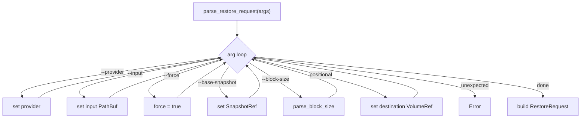
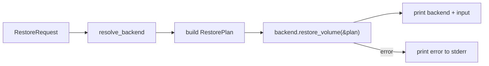
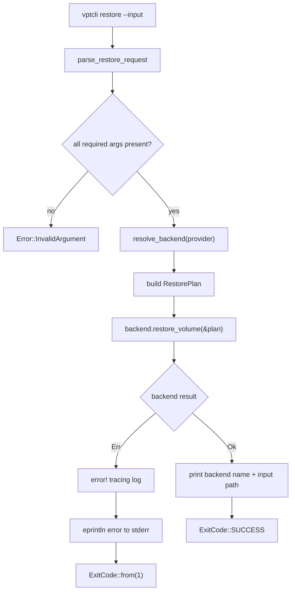
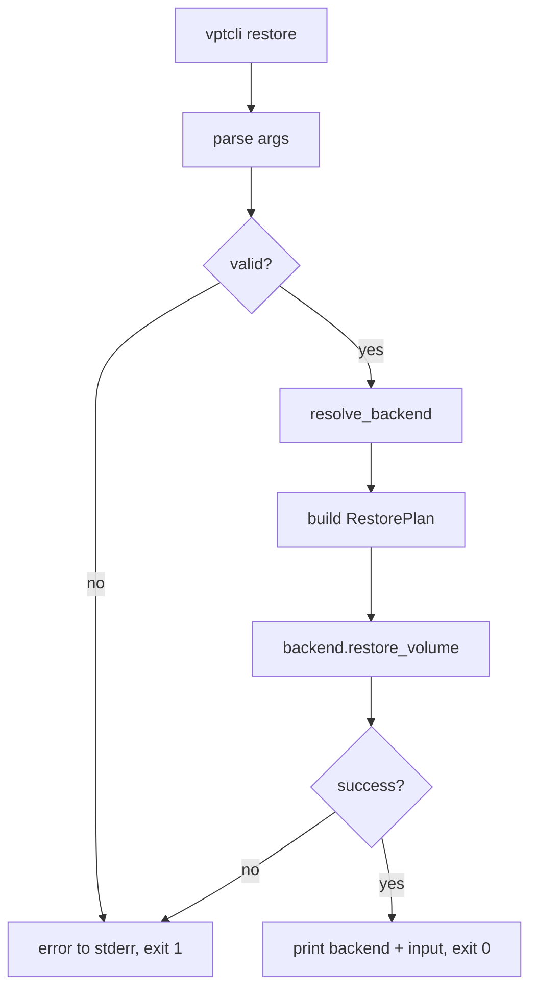

# vptcli restore

Restore a volume from a backup stream or image file created by `vptcli backup`.

## Usage

```
vptcli restore <destination-dir> --input <stream-file> [options]
```

Running `vptcli restore` with no arguments, or with `--help` / `-h`, prints the usage
text. The help detection is at `src/bin/vptcli.rs:534-542`:

```rust title="src/bin/vptcli.rs:534-542"
fn run_restore(args: Vec<String>) -> vpt_rs::Result<()> {
    if args.is_empty()
        || args
            .iter()
            .any(|a| a == "--help" || a == "-h" || a == "help")
    {
        print_restore_usage();
        return Ok(());
    }
    // ...
}
```

## Options

| Flag | Required | Default | Description |
|---|---|---|---|
| `<destination-dir>` | Yes | -- | Destination volume or directory path |
| `--input <path>` | Yes | -- | Input image file path |
| `--provider <name>` | No | platform default | Backend provider to use |
| `--force` | No | `false` | Force destructive restore (required for some backends) |
| `--base-snapshot <id>` | No | (none) | Base snapshot reference for incremental restore |
| `--block-size <N[K\|M\|G]>` | No | provider default | I/O chunk size for block-level copy |

## Argument Parsing

All flags are parsed by `parse_restore_request()` at `src/bin/vptcli.rs:559-616`. The
function uses a manual iterator loop that matches each argument:

```rust title="src/bin/vptcli.rs:567-599"
let mut iter = args.into_iter();
while let Some(arg) = iter.next() {
    match arg.as_str() {
        "--provider" => {
            provider = Some(iter.next().ok_or_else(|| missing("--provider"))?);
        }
        "--input" => {
            input = Some(PathBuf::from(
                iter.next().ok_or_else(|| missing("--input"))?,
            ));
        }
        "--force" => {
            force = true;
        }
        "--base-snapshot" => {
            base_snapshot = Some(SnapshotRef::new(
                iter.next().ok_or_else(|| missing("--base-snapshot"))?,
            ));
        }
        "--block-size" => {
            let value = iter.next().ok_or_else(|| missing("--block-size"))?;
            block_size = Some(parse_block_size(&value)?);
        }
        value if destination.is_none() => {
            destination = Some(VolumeRef::new(value));
        }
        _ => {
            return Err(vpt_rs::Error::InvalidArgument {
                message: format!("unexpected argument `{arg}`"),
            });
        }
    }
}
```



## The `--force` Flag

Some backends perform destructive restores that overwrite the destination volume. These
backends require the `--force` flag to be set in the `RestorePlan`. The flag is a
boolean toggle with no value argument (`src/bin/vptcli.rs:577-579`):

```rust title="src/bin/vptcli.rs:577-579"
"--force" => {
    force = true;
}
```

:::caution
Destructive backends (LVM, VSS) require `--force`. Without it, the backend returns
an `InvalidArgument` error. Always verify the destination volume before using this
flag.
:::

## Plan Construction

After parsing, the command constructs a `RestorePlan` and delegates to the backend
at `src/bin/vptcli.rs:544-557`:

```rust title="src/bin/vptcli.rs:544-557"
let request = parse_restore_request(args)?;
let backend = resolve_backend(request.provider.as_deref())?;
backend.restore_volume(&RestorePlan {
    source: BackupTarget::ImageFile(request.input.clone()),
    destination: request.destination,
    force: request.force,
    base_snapshot: request.base_snapshot,
    block_size: request.block_size,
})?;

println!("backend: {}", backend.backend_name());
println!("input: {}", request.input.display());
```

The `RestorePlan` struct is defined in `src/types.rs:319-326`:

```rust title="src/types.rs:319-326"
pub struct RestorePlan {
    pub source: BackupTarget,
    pub destination: VolumeRef,
    pub force: bool,
    pub base_snapshot: Option<SnapshotRef>,
    pub block_size: Option<usize>,
}
```



## Output

On success the command prints:

```
backend: linux-btrfs
input: /tmp/backup.img
```

On failure the error is printed to stderr with the prefix `error: `.

## Examples

### Basic restore

```bash
vptcli restore /mnt/data/subvol --input /tmp/backup.img
```

### Restore with a specific provider

```bash
vptcli restore --provider btrfs /mnt/data/subvol --input /tmp/backup.img
```

### Force-restore to an LVM volume

```bash
vptcli restore /dev/vg0/data --input /tmp/backup.img --provider lvm --force
```

### Restore with a custom block size

```bash
vptcli restore /dev/vg0/data --input /tmp/backup.img --block-size 4M
```

### Incremental restore with a base snapshot

```bash
vptcli restore /mnt/data/subvol --input /tmp/incr.img --base-snapshot /mnt/data/snapshots/subvol-nightly
```

## Error Conditions

| Condition | Error Variant | Message |
|---|---|---|
| Missing `--input` | `InvalidArgument` | `missing '--input <path>'` |
| Missing destination | `InvalidArgument` | `missing destination volume/directory` |
| Missing `--provider` value | `InvalidArgument` | `missing value after '--provider'` |
| Invalid block size | `InvalidArgument` | `invalid block size '...'` |
| Unknown flag | `InvalidArgument` | `unexpected argument '...'` |

:::note
All argument validation errors are produced by the `missing()` helper at
`src/bin/vptcli.rs:89-93`, which wraps the message in `Error::InvalidArgument`.
:::

## RestoreRequest Internal Struct

The parsed arguments are held in a local `RestoreRequest` struct at
`src/bin/vptcli.rs:525-532`:

```rust title="src/bin/vptcli.rs:525-532"
struct RestoreRequest {
    provider: Option<String>,
    input: PathBuf,
    destination: VolumeRef,
    force: bool,
    base_snapshot: Option<SnapshotRef>,
    block_size: Option<usize>,
}
```

This struct is an internal CLI detail and is not part of the public API. It is
converted into a `RestorePlan` before being passed to the backend.

## Full Restore Pipeline



## Restore Workflow


