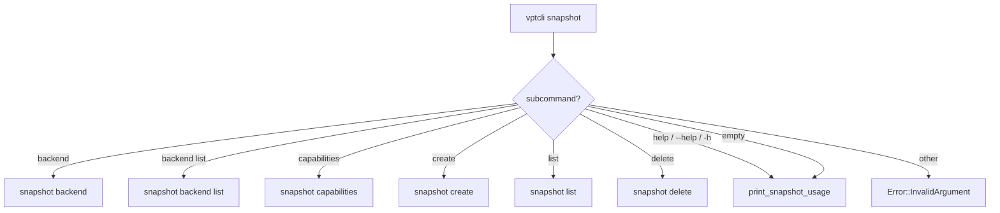
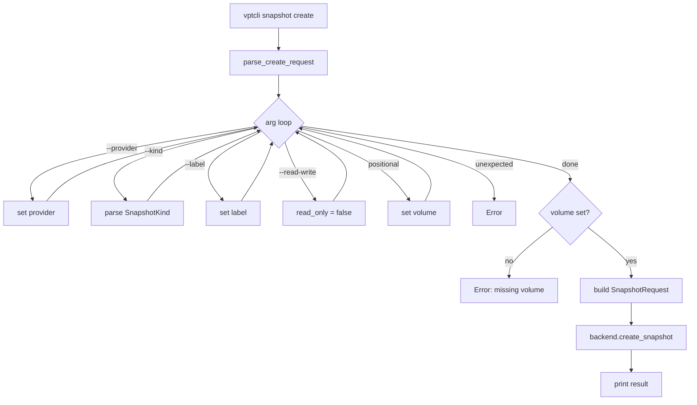
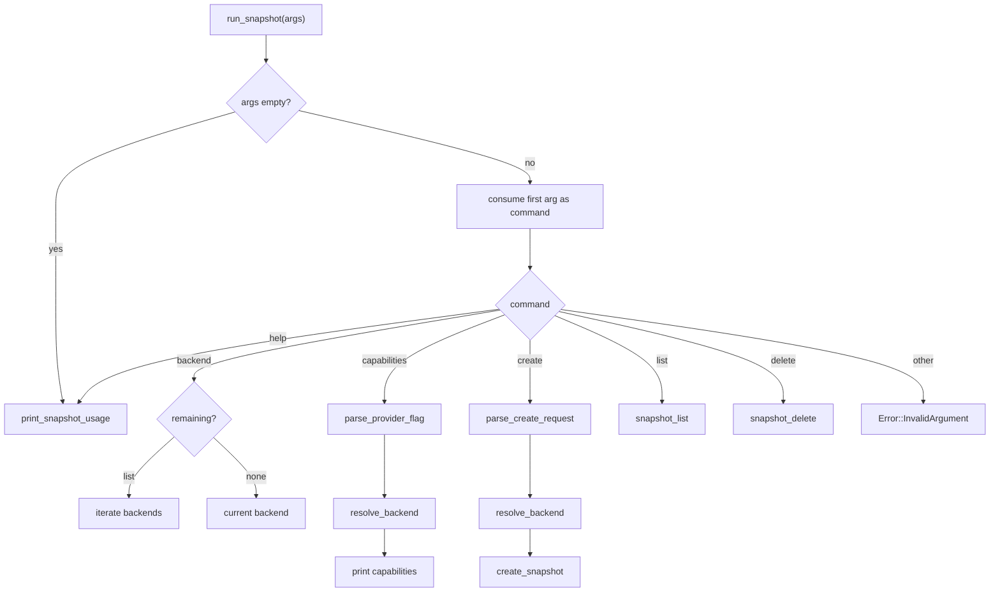

# vptcli snapshot

The `snapshot` subcommand manages provider-managed snapshots: creating, listing, and
deleting them. It also exposes backend discovery and capability queries.

## Usage

```
vptcli snapshot <command> [args]
```

Running `vptcli snapshot` with no arguments prints the available subcommands
(`src/bin/vptcli.rs:377-389`).



## Subcommands

| Subcommand | Description |
|---|---|
| `backend` | Print the current platform backend descriptor |
| `backend list` | List all available backend descriptors |
| `capabilities` | Print backend name and capability list |
| `create` | Create a new snapshot of a volume |
| `list` | List existing snapshots on a volume |
| `delete` | Delete an existing snapshot by ID |

## `snapshot backend`

Prints the platform, optional provider name, and backend name for the current (or
selected) backend.

```bash
vptcli snapshot backend
vptcli snapshot backend list
```

The output format is produced by `print_descriptor()` at `src/bin/vptcli.rs:369-375`:

```rust title="src/bin/vptcli.rs:369-375"
fn print_descriptor(descriptor: &platform::BackendDescriptor) {
    println!("platform: {}", descriptor.platform);
    if let Some(provider) = descriptor.provider_name {
        println!("provider: {provider}");
    }
    println!("backend: {}", descriptor.backend_name);
}
```

**Example output:**

```
platform: linux
backend: linux-btrfs
```

:::tip
`backend list` iterates over `platform::available_backend_descriptors()` and prints
each descriptor. This is useful on Linux where multiple backends (btrfs, lvm, zfs) may
be available simultaneously.
:::

## `snapshot capabilities`

Prints the backend name followed by each supported capability on its own line prefixed
with `- `.

```
vptcli snapshot capabilities [--provider <name>]
```

| Flag | Required | Description |
|---|---|---|
| `--provider <name>` | No | Select the backend provider (Linux only) |

The flag is parsed by `parse_provider_flag()` at `src/bin/vptcli.rs:332-352`:

```rust title="src/bin/vptcli.rs:332-352"
fn parse_provider_flag(args: Vec<String>) -> vpt_rs::Result<Option<String>> {
    let mut provider = None;
    let mut iter = args.into_iter();

    while let Some(arg) = iter.next() {
        match arg.as_str() {
            "--provider" => {
                provider = Some(iter.next().ok_or_else(|| vpt_rs::Error::InvalidArgument {
                    message: "missing value after `--provider`".to_string(),
                })?);
            }
            _ => {
                return Err(vpt_rs::Error::InvalidArgument {
                    message: format!("unexpected argument `{arg}`"),
                });
            }
        }
    }

    Ok(provider)
}
```

**Example output:**

```
linux-btrfs
- crash_consistent_snapshot
- incremental_send
- read_only_snapshot_mount
```

## `snapshot create`

Creates a new snapshot of a volume.

```
vptcli snapshot create [--provider <name>] <volume> [--kind crash|application] [--label <name>] [--read-write]
```

### Options

| Flag | Required | Default | Description |
|---|---|---|---|
| `<volume>` | Yes | -- | Volume path or identifier |
| `--provider <name>` | No | platform default | Backend provider to use |
| `--kind crash\|application` | No | `crash` | Snapshot consistency kind |
| `--label <name>` | No | (none) | Human-readable label for the snapshot |
| `--read-write` | No | read-only | Create a writable snapshot instead of read-only |

Arguments are parsed by `parse_create_request()` at `src/bin/vptcli.rs:277-330`. The
`--kind` flag accepts values parsed by `SnapshotKind::from_str` in `src/types.rs:130-144`:

```rust title="src/types.rs:130-144"
impl std::str::FromStr for SnapshotKind {
    type Err = crate::Error;

    fn from_str(value: &str) -> Result<Self, Self::Err> {
        match value {
            "crash" | "crash-consistent" => Ok(Self::CrashConsistent),
            "app" | "application" | "application-consistent" => Ok(Self::ApplicationConsistent),
            _ => Err(crate::Error::InvalidArgument {
                message: format!(
                    "unknown snapshot kind `{value}`; expected `crash` or `application`"
                ),
            }),
        }
    }
}
```

The `--read-write` flag is a boolean toggle with no value argument
(`src/bin/vptcli.rs:303-305`):

```rust title="src/bin/vptcli.rs:303-305"
"--read-write" => {
    read_only = false;
}
```

**Example:**

```bash
# Crash-consistent, read-only snapshot (default)
vptcli snapshot create /mnt/data/subvol

# Application-consistent snapshot with a label
vptcli snapshot create /mnt/data/subvol --kind application --label pre-upgrade

# Writable snapshot using a specific provider
vptcli snapshot create --provider btrfs /mnt/data/subvol --read-write
```

**Example output:**

```
snapshot: /mnt/data/snapshots/subvol-20240101
source: /mnt/data/subvol
backend: linux-btrfs
path: /mnt/data/snapshots/subvol-20240101
```

:::note
The output includes the snapshot handle ID, the source volume (if available), the
backend name, and an optional path hint. See `src/bin/vptcli.rs:178-186` for the
exact fields printed.
:::



## `snapshot list`

Lists all snapshots managed by the backend for a given volume.

```
vptcli snapshot list [--provider <name>] <volume>
```

| Flag | Required | Description |
|---|---|---|
| `<volume>` | Yes | Volume path or identifier |
| `--provider <name>` | No | Backend provider to use |

Parsing is handled by `snapshot_list()` at `src/bin/vptcli.rs:200-241`. The function
iterates arguments manually, treating the first non-flag value as the volume ID.

**Example:**

```bash
vptcli snapshot list /mnt/data/subvol
vptcli snapshot list --provider lvm /dev/vg0/data
```

**Example output** (space-separated columns):

```
/mnt/data/snapshots/subvol-nightly /mnt/data/subvol linux-btrfs
/mnt/data/snapshots/subvol-pre-upgrade /mnt/data/subvol linux-btrfs
```

The output format is `<handle-id> <source-id|-> <backend>` as shown in
`src/bin/vptcli.rs:229-240`.

## `snapshot delete`

Deletes an existing snapshot by its handle ID.

```
vptcli snapshot delete [--provider <name>] <snapshot-id>
```

| Flag | Required | Description |
|---|---|---|
| `<snapshot-id>` | Yes | Snapshot handle ID to delete |
| `--provider <name>` | No | Backend provider to use |

Parsing is handled by `snapshot_delete()` at `src/bin/vptcli.rs:243-275`. The
snapshot ID is wrapped in a `SnapshotHandle` with `source: None`:

```rust title="src/bin/vptcli.rs:270-274"
backend.delete_snapshot(&vpt_rs::SnapshotHandle {
    id: snapshot_id,
    source: None,
})?;
```

:::caution
Deleting a snapshot is irreversible. Ensure the snapshot ID is correct before
running this command.
:::

**Example:**

```bash
vptcli snapshot delete /mnt/data/snapshots/subvol-nightly
vptcli snapshot delete --provider btrfs /mnt/data/snapshots/subvol-old
```

## Argument Parsing Flow

All snapshot subcommands share a common pattern: a manual iterator loop that matches
each argument against known flags, collecting positional values in order.


