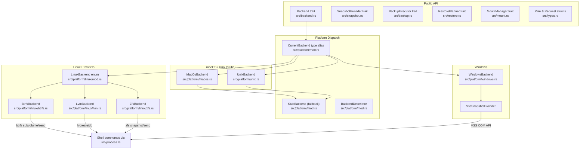
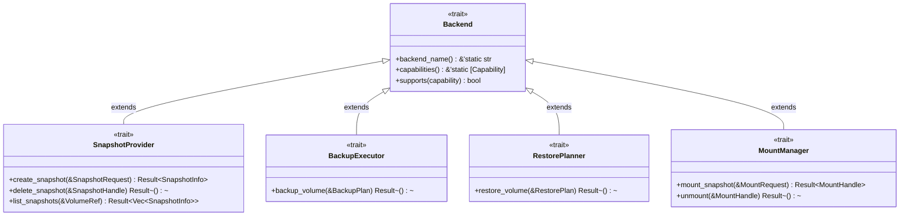
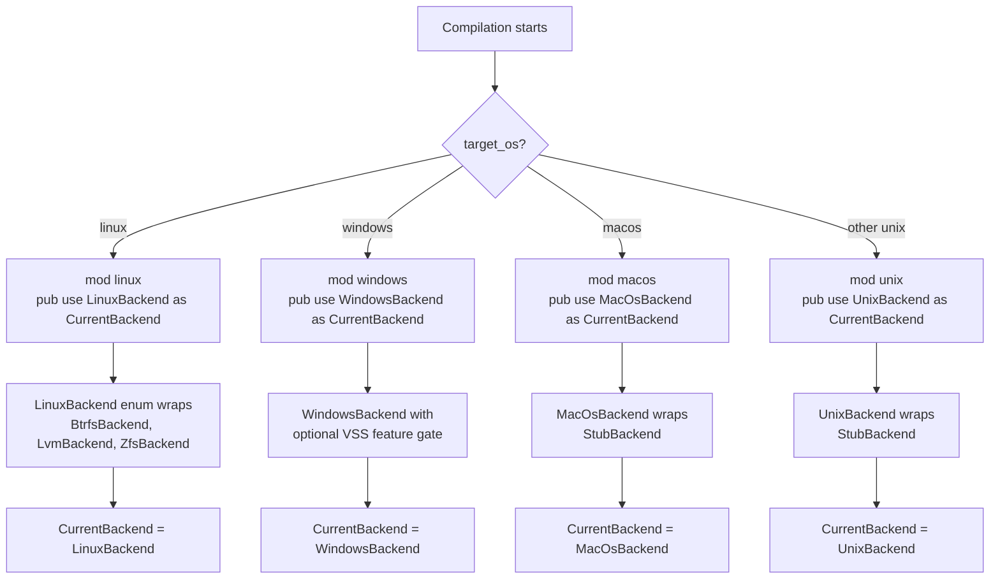
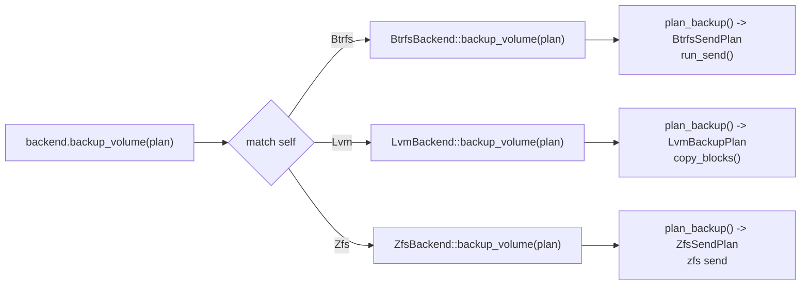
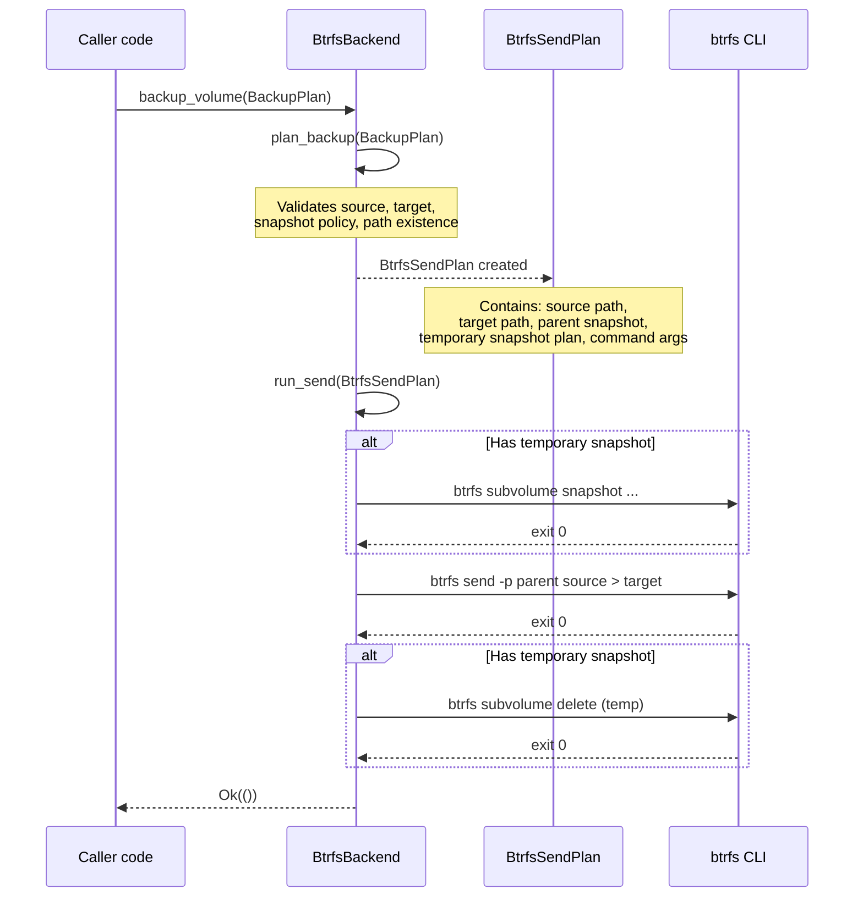
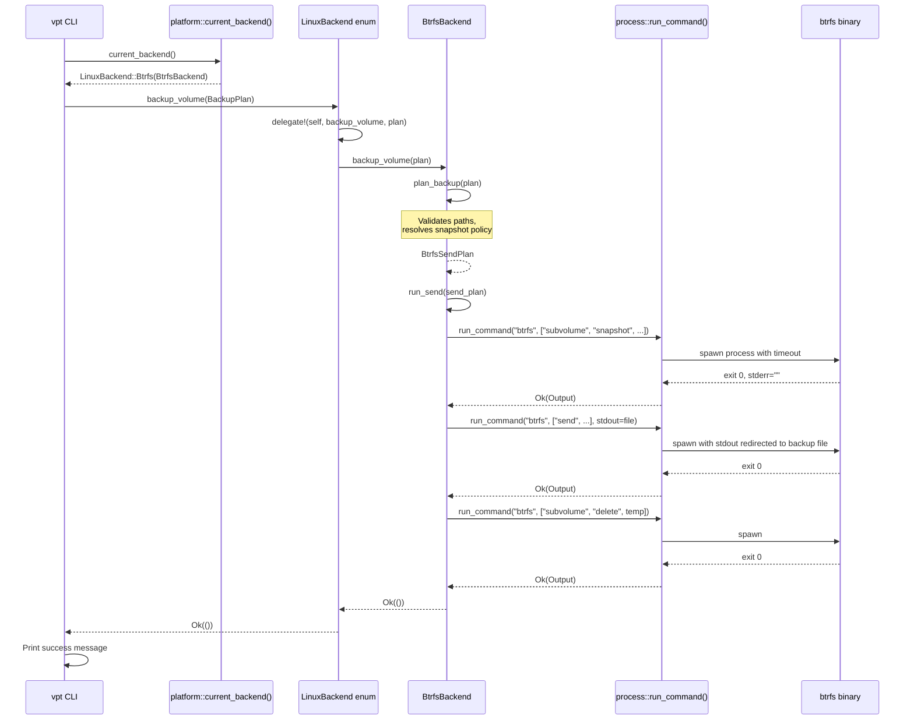

# Architecture

This page explains how vpt-rs is organized, how its layers connect, and how a
backup request flows from the CLI down to the platform-specific tool that does
the actual work. If you are new to the project, start here.

## High-level overview

vpt-rs is structured as three layers:

1. **Public API** -- the five traits (`Backend`, `SnapshotProvider`,
   `BackupExecutor`, `RestorePlanner`, `MountManager`) and the plan/request
   structs that callers interact with.
2. **Platform dispatch** -- compile-time `cfg` selects the right backend for the
   target OS, while runtime helpers let the CLI enumerate available backends.
3. **Provider implementations** -- each backend wraps a native tool (`btrfs`,
   `lvcreate`, `zfs`, VSS) and translates plans into shell commands.



## Source file map

Every source file has a clear responsibility. This table is your map for
navigating the codebase:

| File | Purpose |
|------|---------|
| `src/lib.rs` | Public re-exports; the crate's front door |
| `src/backend.rs` | The `Backend` supertrait (identity + capabilities) |
| `src/snapshot.rs` | The `SnapshotProvider` trait (create/delete/list) |
| `src/backup.rs` | The `BackupExecutor` trait (backup a volume) |
| `src/restore.rs` | The `RestorePlanner` trait (restore a volume) |
| `src/mount.rs` | The `MountManager` trait (mount/unmount snapshots) |
| `src/types.rs` | All plan/request/handle structs and the `Capability` enum |
| `src/error.rs` | The `Error` enum and `Result<T>` alias |
| `src/process.rs` | Shell command runner with timeout and I/O redirection |
| `src/copy.rs` | Block-level copy helper (used by LVM backend) |
| `src/logging.rs` | Tracing/logging setup |
| `src/platform/mod.rs` | `CurrentBackend` alias, `StubBackend`, `BackendDescriptor` |
| `src/platform/linux/mod.rs` | `LinuxBackend` enum + `delegate!` macro |
| `src/platform/linux/btrfs.rs` | `BtrfsBackend` (subvolume snapshots + send/receive) |
| `src/platform/linux/lvm.rs` | `LvmBackend` (LVM snapshots + block copy) |
| `src/platform/linux/zfs.rs` | `ZfsBackend` (ZFS snapshots + send/receive) |
| `src/platform/windows.rs` | `WindowsBackend` + VSS integration |
| `src/platform/macos.rs` | `MacOsBackend` (stub) |
| `src/platform/unix.rs` | `UnixBackend` (stub) |

:::tip How to navigate
Start from the trait you want to understand (e.g. `SnapshotProvider` in
`src/snapshot.rs`), then follow the implementations into the platform modules.
Each backend file is self-contained -- it declares its capabilities, implements
the traits, and defines its internal plan types all in one place.
:::

## The trait hierarchy

All five traits share a common supertrait pattern. `Backend` sits at the root
and provides identity (`backend_name()`) and capability metadata
(`capabilities()`, `supports()`). The four operational traits extend it.



Every operational trait uses `: Backend` as a supertrait bound. This means if
you have a `Box<dyn SnapshotProvider>`, you can always call `backend_name()` on
it without downcasting. The compiler guarantees the method exists.

:::note
The `Backend` trait also requires `Send + Sync` (`src/backend.rs:20`). This
means all backends are safe to share across threads -- a requirement for async
executors and thread pools that may run backup operations concurrently.
:::

## Platform dispatch with cfg(target_os)

The `platform` module (`src/platform/mod.rs`) uses Rust's `#[cfg(target_os)]`
attribute to select exactly one backend type per compilation target. This
happens at compile time, so there is zero runtime branching cost.



The key code in `src/platform/mod.rs`:

```rust
// src/platform/mod.rs:1-12
#[cfg(target_os = "linux")]
mod linux;
#[cfg(target_os = "macos")]
mod macos;
#[cfg(all(
    target_family = "unix",
    not(target_os = "linux"),
    not(target_os = "macos")
))]
mod unix;
#[cfg(target_os = "windows")]
mod windows;
```

And the type alias that selects the concrete backend:

```rust
// src/platform/mod.rs:14-16
#[cfg(target_os = "linux")]
pub use linux::LinuxBackend as CurrentBackend;
```

:::tip Why compile-time dispatch?
Using `cfg` instead of trait objects means `CurrentBackend` is a concrete type.
This gives the compiler full visibility for inlining, monomorphization, and
dead-code elimination. There is no vtable indirection.
:::

## The StubBackend pattern

`StubBackend` (`src/platform/mod.rs:88-170`) is a concrete struct that
implements all five traits but returns `Error::UnsupportedOperation` for every
operational method. It serves two purposes:

1. **Default backend for unsupported platforms** -- macOS and generic Unix
   backends wrap a `StubBackend` and delegate to it.
2. **Capability declaration** -- even when operations are stubbed, the backend
   still declares its capabilities so callers can check what *would* be
   supported.

Here is the full struct definition:

```rust
// src/platform/mod.rs:88-100
#[derive(Debug, Clone, Default)]
pub struct StubBackend {
    backend_name: &'static str,
    capabilities: &'static [Capability],
}

impl StubBackend {
    pub const fn new(backend_name: &'static str, capabilities: &'static [Capability]) -> Self {
        Self {
            backend_name,
            capabilities,
        }
    }
}
```

Every operational method follows the same pattern -- build an error, log it,
and return `Err`:

```rust
// src/platform/mod.rs:122-128
impl SnapshotProvider for StubBackend {
    fn create_snapshot(&self, _request: &SnapshotRequest) -> Result<SnapshotInfo> {
        let error = unsupported("create_snapshot", self.backend_name);
        error!(backend = self.backend_name, error = %error, "create_snapshot failed");
        Err(error)
    }
    // delete_snapshot, list_snapshots follow the same pattern
}
```

:::caution
A `StubBackend` is not useless. Its `capabilities()` method still returns real
data. Code that only checks capabilities (e.g. to decide whether to offer
incremental backups in a UI) will work correctly even on stubbed platforms.
:::

## LinuxBackend and the delegate! macro

On Linux, three snapshot technologies coexist (Btrfs, LVM, ZFS). The
`LinuxBackend` enum (`src/platform/linux/mod.rs:34-39`) wraps all three:

```rust
// src/platform/linux/mod.rs:34-39
#[derive(Debug, Clone)]
pub enum LinuxBackend {
    Btrfs(BtrfsBackend),
    Lvm(LvmBackend),
    Zfs(ZfsBackend),
}
```

To avoid repeating the same `match` block for every trait method, the module
defines a `delegate!` macro:

```rust
// src/platform/linux/mod.rs:24-32
macro_rules! delegate {
    ($self:expr, $method:ident $(, $arg:expr)*) => {
        match $self {
            Self::Btrfs(inner) => inner.$method($($arg),*),
            Self::Lvm(inner) => inner.$method($($arg),*),
            Self::Zfs(inner) => inner.$method($($arg),*),
        }
    };
}
```

This macro is used in every trait implementation:

```rust
// src/platform/linux/mod.rs:85-93
impl Backend for LinuxBackend {
    fn backend_name(&self) -> &'static str {
        delegate!(self, backend_name)
    }
    fn capabilities(&self) -> &'static [Capability] {
        delegate!(self, capabilities)
    }
}
```



:::note
The `delegate!` macro eliminates ~120 lines of boilerplate that would otherwise
be needed for the 6 methods across 5 traits (Backend, SnapshotProvider,
BackupExecutor, RestorePlanner, MountManager). Adding a new method to any trait
requires only one extra `delegate!` call in the `LinuxBackend` implementation.
:::

## The plan-then-execute pattern

Every backup, restore, and snapshot operation follows a two-phase pattern:

1. **Plan** -- build a backend-specific plan struct that describes *what* will
   happen. Plans are pure data; they do not touch the filesystem.
2. **Execute** -- run the plan by invoking shell commands or copy routines.



This separation has concrete benefits:

- **Unit testing** -- you can call `plan_backup()` on a `BtrfsBackend` in a
  test without root privileges or a real Btrfs filesystem. The plan struct is
  just data you can inspect with `assert_eq!`.
- **Validation** -- plans reject invalid inputs (missing paths, unsupported
  snapshot kinds) before any work begins.
- **Composability** -- a plan can include a nested plan (e.g. a temporary
  snapshot plan inside a send plan).

## End-to-end backup flow

Here is the full sequence when a user runs `vpt backup /mnt/data /tmp/backup.img`:



:::caution
Backends require elevated privileges. Btrfs snapshot operations, LVM
`lvcreate`, and Windows VSS all need root or Administrator access. The library
returns `Error::CommandFailed` with the stderr output if the underlying tool
is denied permission.
:::

## File layout

```
src/
  lib.rs              -- public re-exports (the crate's front door)
  backend.rs          -- Backend supertrait (20 lines)
  snapshot.rs         -- SnapshotProvider trait (31 lines)
  backup.rs           -- BackupExecutor trait (22 lines)
  restore.rs          -- RestorePlanner trait (22 lines)
  mount.rs            -- MountManager trait (17 lines)
  types.rs            -- plan/request structs, Capability enum (~350 lines)
  error.rs            -- Error enum, Result alias (~60 lines)
  process.rs          -- shell command runner with timeout + I/O redirect
  copy.rs             -- block-level copy helper for LVM
  logging.rs          -- tracing setup
  platform/
    mod.rs            -- CurrentBackend alias, StubBackend, BackendDescriptor
    linux/
      mod.rs          -- LinuxBackend enum + delegate! macro
      btrfs.rs        -- BtrfsBackend (~700 lines, includes tests)
      lvm.rs          -- LvmBackend (~670 lines, includes tests)
      zfs.rs          -- ZfsBackend (~750 lines, includes tests)
    windows.rs        -- WindowsBackend + VSS integration
    macos.rs          -- MacOsBackend (stub)
    unix.rs           -- UnixBackend (stub)
```

:::tip How to explore
1. Start with `src/lib.rs` to see what the crate exports.
2. Read `src/backend.rs` (20 lines) to understand the supertrait.
3. Read `src/types.rs` to understand the data structures.
4. Pick one backend (e.g. `src/platform/linux/btrfs.rs`) and trace a single
   operation from trait implementation through plan creation to execution.
5. Return to `src/platform/mod.rs` to understand how dispatch works.
:::

## Next steps

- [Traits](./traits.md) -- deep dive into each of the five traits
- [Backends](./backends.md) -- how backends are selected and how to add a new one
- [Capabilities](./capabilities.md) -- the capability system and graceful degradation
- [Plans](./plans.md) -- the plan-then-execute pattern in detail
- [Error Handling](./error-handling.md) -- structured errors with context
