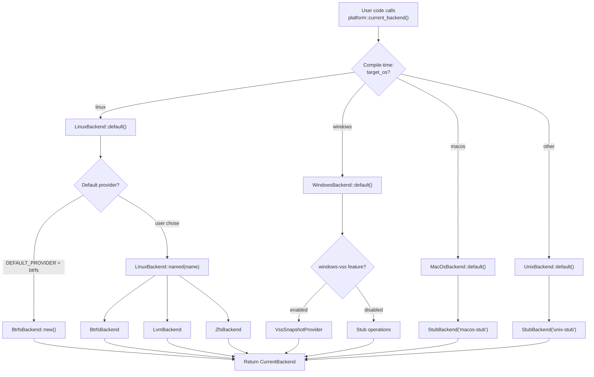

# Backends

A "backend" in vpt-rs is a concrete implementation of the five core traits for
a specific platform and volume management technology. This page explains how
backends are organized, selected at compile time and runtime, and how to add a
new one.

## What is a backend?

A backend is a struct that implements all five traits: `Backend`,
`SnapshotProvider`, `BackupExecutor`, `RestorePlanner`, and `MountManager`.
Each backend wraps a native volume management tool and translates the
generic plan types into platform-specific commands.

| Backend | Native tool | Snapshot mechanism | Backup mechanism |
|---------|------------|-------------------|-----------------|
| `BtrfsBackend` | `btrfs` CLI | `btrfs subvolume snapshot` | `btrfs send` (stream) |
| `LvmBackend` | `lvcreate`/`lvremove` | `lvcreate --snapshot` | `copy_blocks()` (block copy) |
| `ZfsBackend` | `zfs` CLI | `zfs snapshot` | `zfs send` (stream) |
| `WindowsBackend` | VSS COM API | VSS snapshot | Block-level copy |
| `MacOsBackend` | (stub) | Unsupported | Unsupported |
| `UnixBackend` | (stub) | Unsupported | Unsupported |

```mermaid
graph TB
    subgraph "Compile-time selection"
        CFG["#[cfg(target_os)]<br/>src/platform/mod.rs"]
    end

    subgraph "Linux (3 providers)"
        LinuxBackend["LinuxBackend enum<br/>src/platform/linux/mod.rs"]
        Btrfs["BtrfsBackend<br/>wraps btrfs CLI"]
        Lvm["LvmBackend<br/>wraps lvcreate/lvremove"]
        Zfs["ZfsBackend<br/>wraps zfs CLI"]
    end

    subgraph "Windows"
        Windows["WindowsBackend<br/>src/platform/windows.rs"]
        VSS["VssSnapshotProvider<br/>VSS COM API"]
    end

    subgraph "macOS / Unix (stubs)"
        MacOS["MacOsBackend"]
        Unix["UnixBackend"]
        Stub["StubBackend<br/>returns UnsupportedOperation"]
    end

    CFG -->|"target_os = linux"| LinuxBackend
    CFG -->|"target_os = windows"| Windows
    CFG -->|"target_os = macos"| MacOS
    CFG -->|"other unix"| Unix

    LinuxBackend --> Btrfs
    LinuxBackend --> Lvm
    LinuxBackend --> Zfs
    Windows --> VSS
    MacOS --> Stub
    Unix --> Stub
```

## CurrentBackend type alias

The `platform` module (`src/platform/mod.rs`) defines a `CurrentBackend` type
alias that resolves to exactly one backend per target OS. When you call
`platform::current_backend()`, it returns `CurrentBackend::default()`:

```rust
// src/platform/mod.rs:53-55
pub fn current_backend() -> CurrentBackend {
    CurrentBackend::default()
}
```

The type alias is selected at compile time:

```rust
// src/platform/mod.rs:14-25
#[cfg(target_os = "linux")]
pub use linux::LinuxBackend as CurrentBackend;
#[cfg(target_os = "macos")]
pub use macos::MacOsBackend as CurrentBackend;
#[cfg(all(
    target_family = "unix",
    not(target_os = "linux"),
    not(target_os = "macos")
))]
pub use unix::UnixBackend as CurrentBackend;
#[cfg(target_os = "windows")]
pub use windows::WindowsBackend as CurrentBackend;
```

Usage:

```rust
let backend = vpt_rs::platform::current_backend();
println!("Running on: {}", backend.backend_name());
```

:::tip
`CurrentBackend` is a concrete type, not a trait object -- zero dynamic
dispatch overhead. The compiler knows the exact type and can inline method
calls.
:::

## BackendDescriptor

A `BackendDescriptor` is a lightweight metadata struct for enumerating
available backends at runtime. It is defined in `src/platform/mod.rs:45-51`:

```rust
// src/platform/mod.rs:45-51
#[derive(Debug, Clone, Copy, PartialEq, Eq)]
pub struct BackendDescriptor {
    pub platform: &'static str,
    pub provider_name: Option<&'static str>,
    pub backend_name: &'static str,
    pub capabilities: &'static [Capability],
}
```

The `available_backend_descriptors()` function returns all backends for the
current platform:

```rust
// src/platform/mod.rs:73-82
pub fn available_backend_descriptors() -> Vec<BackendDescriptor> {
    #[cfg(target_os = "linux")]
    {
        linux::available_descriptors()
    }
    #[cfg(not(target_os = "linux"))]
    {
        vec![current_backend_descriptor()]
    }
}
```

On Linux this returns three descriptors (btrfs, lvm, zfs). On other platforms
it returns exactly one.

```rust
let descriptors = vpt_rs::platform::available_backend_descriptors();
for desc in &descriptors {
    println!("[{}] {} (provider: {:?}, {} capabilities)",
        desc.platform,
        desc.backend_name,
        desc.provider_name,
        desc.capabilities.len()
    );
}
// On Linux output:
// [linux] linux-btrfs (provider: Some("btrfs"), 4 capabilities)
// [linux] linux-lvm (provider: Some("lvm"), 4 capabilities)
// [linux] linux-zfs (provider: Some("zfs"), 5 capabilities)
```

## LinuxBackend: the enum + delegate! pattern

Linux is unique because three snapshot technologies coexist. `LinuxBackend`
(`src/platform/linux/mod.rs:34-39`) is an enum that wraps all three:

```rust
// src/platform/linux/mod.rs:34-39
#[derive(Debug, Clone)]
pub enum LinuxBackend {
    Btrfs(BtrfsBackend),
    Lvm(LvmBackend),
    Zfs(ZfsBackend),
}
```

The default is Btrfs (`src/platform/linux/mod.rs:21`):

```rust
// src/platform/linux/mod.rs:21
pub const DEFAULT_PROVIDER: &str = "btrfs";
```

Every trait method delegates to the inner variant using the `delegate!` macro
(`src/platform/linux/mod.rs:24-32`):

```rust
// src/platform/linux/mod.rs:24-32
macro_rules! delegate {
    ($self:expr, $method:ident $(, $arg:expr)*) => {
        match $self {
            Self::Btrfs(inner) => inner.$method($($arg),*),
            Self::Lvm(inner) => inner.$method($($arg),*),
            Self::Zfs(inner) => inner.$method($($arg),*),
        }
    };
}
```

This macro is used in every trait implementation. For example:

```rust
// src/platform/linux/mod.rs:95-107
impl SnapshotProvider for LinuxBackend {
    fn create_snapshot(&self, request: &SnapshotRequest) -> Result<SnapshotInfo> {
        delegate!(self, create_snapshot, request)
    }
    fn delete_snapshot(&self, snapshot: &SnapshotHandle) -> Result<()> {
        delegate!(self, delete_snapshot, snapshot)
    }
    fn list_snapshots(&self, source: &VolumeRef) -> Result<Vec<SnapshotInfo>> {
        delegate!(self, list_snapshots, source)
    }
}
```

```mermaid
flowchart LR
    Call["LinuxBackend::backup_volume(plan)"]
    Call --> Match{"match self"}
    Match -->|Btrfs(BtrfsBackend)| B["BtrfsBackend::backup_volume(plan)<br/>Uses btrfs send"]
    Match -->|Lvm(LvmBackend)| L["LvmBackend::backup_volume(plan)<br/>Uses copy_blocks()"]
    Match -->|Zfs(ZfsBackend)| Z["ZfsBackend::backup_volume(plan)<br/>Uses zfs send"]
```

### Selecting a provider at runtime

You can explicitly select a provider by name:

```rust
// src/platform/linux/mod.rs:42-51
let backend = LinuxBackend::named("zfs")?;  // returns ZfsBackend
```

The `named()` method returns `Err(Error::InvalidArgument)` for unknown
provider names. Valid names are `"btrfs"`, `"lvm"`, and `"zfs"`.

You can also get all available backends:

```rust
// src/platform/linux/mod.rs:53-59
let backends = LinuxBackend::available();
for backend in &backends {
    println!("{}", backend.provider_name());
}
```

:::note
`LinuxBackend::default()` uses `DEFAULT_PROVIDER` which is `"btrfs"`. If you
need a different default, use `LinuxBackend::named()` explicitly.
:::

## WindowsBackend with feature gates

The Windows backend uses Cargo feature flags to control VSS support. The
relevant code in `src/platform/mod.rs`:

```rust
// src/platform/mod.rs:26-27
#[cfg(all(target_os = "windows", feature = "windows-vss"))]
pub use windows::vss::VssSnapshotProvider;
```

With `features = ["windows-vss"]` enabled, snapshot and backup operations
delegate to the real VSS provider. Without the feature, they return
`Error::UnsupportedOperation`.

:::caution
The `windows-vss` feature requires the Windows SDK and COM interop. It is only
available on Windows build targets. The VSS provider coordinates with
application writers to create application-consistent snapshots -- the only
backend that supports `Capability::ApplicationConsistentSnapshot`.
:::

## StubBackend for macOS/Unix

`StubBackend` (`src/platform/mod.rs:88-170`) implements all five traits but
returns `Error::UnsupportedOperation` for every operational method. macOS and
generic Unix backends wrap it as their inner implementation.

Here is the full implementation:

```rust
// src/platform/mod.rs:88-120
#[derive(Debug, Clone, Default)]
pub struct StubBackend {
    backend_name: &'static str,
    capabilities: &'static [Capability],
}

impl StubBackend {
    pub const fn new(backend_name: &'static str, capabilities: &'static [Capability]) -> Self {
        Self {
            backend_name,
            capabilities,
        }
    }

    pub fn descriptor(&self) -> BackendDescriptor {
        BackendDescriptor {
            platform: current_platform(),
            provider_name: None,
            backend_name: self.backend_name,
            capabilities: self.capabilities,
        }
    }
}

impl Backend for StubBackend {
    fn backend_name(&self) -> &'static str {
        self.backend_name
    }
    fn capabilities(&self) -> &'static [Capability] {
        self.capabilities
    }
}
```

Every operational method follows the same pattern:

```rust
// src/platform/mod.rs:122-140
impl SnapshotProvider for StubBackend {
    fn create_snapshot(&self, _request: &SnapshotRequest) -> Result<SnapshotInfo> {
        let error = unsupported("create_snapshot", self.backend_name);
        error!(backend = self.backend_name, error = %error, "create_snapshot failed");
        Err(error)
    }
    fn delete_snapshot(&self, _snapshot: &SnapshotHandle) -> Result<()> {
        let error = unsupported("delete_snapshot", self.backend_name);
        error!(backend = self.backend_name, error = %error, "delete_snapshot failed");
        Err(error)
    }
    fn list_snapshots(&self, _source: &VolumeRef) -> Result<Vec<SnapshotInfo>> {
        let error = unsupported("list_snapshots", self.backend_name);
        error!(backend = self.backend_name, error = %error, "list_snapshots failed");
        Err(error)
    }
}
```

:::note
The `unsupported()` helper function (`src/platform/mod.rs:84-86`) creates a
structured `Error::UnsupportedOperation` with the operation name and backend
name. This means even stub errors carry useful context for debugging.
:::

## Backend selection flowchart



## LinuxBackend dispatch diagram

When a method is called on `LinuxBackend`, the `delegate!` macro dispatches to
the correct inner backend:

```mermaid
flowchart TD
    Input["LinuxBackend::create_snapshot(request)"]
    Input --> Delegate["delegate!(self, create_snapshot, request)"]
    Delegate --> Match{"match self"}
    Match -->|Btrfs(inner)| BtrfsImpl["BtrfsBackend::create_snapshot(request)"]
    Match -->|Lvm(inner)| LvmImpl["LvmBackend::create_snapshot(request)"]
    Match -->|Zfs(inner)| ZfsImpl["ZfsBackend::create_snapshot(request)"]

    BtrfsImpl --> BtrfsPlan["plan_create_snapshot(request)<br/>-> BtrfsSnapshotPlan"]
    BtrfsPlan --> BtrfsExec["run_command(btrfs subvolume snapshot ...)"]
    BtrfsExec --> BtrfsResult["Ok(SnapshotInfo)"]

    LvmImpl --> LvmPlan["plan_create_snapshot(request)<br/>-> LvmSnapshotPlan"]
    LvmPlan --> LvmExec["run_command(lvcreate --snapshot ...)"]
    LvmExec --> LvmResult["Ok(SnapshotInfo)"]

    ZfsImpl --> ZfsPlan["plan_create_snapshot(request)<br/>-> ZfsSnapshotPlan"]
    ZfsPlan --> ZfsExec["run_command(zfs snapshot ...)"]
    ZfsExec --> ZfsResult["Ok(SnapshotInfo)"]
```

## How to add a new backend

Here is a step-by-step guide for adding a new backend (e.g. FreeBSD ZFS):

### Step 1: Create the backend file

Create `src/platform/freebsd.rs`:

```rust
// src/platform/freebsd.rs
use super::StubBackend;
use crate::types::Capability;

const CAPABILITIES: &[Capability] = &[
    Capability::CrashConsistentSnapshot,
    Capability::BlockLevelBackup,
    Capability::BlockLevelRestore,
];

#[derive(Debug, Clone)]
pub struct FreeBSDBackend(StubBackend);

impl FreeBSDBackend {
    pub fn new() -> Self {
        Self(StubBackend::new("freebsd-zfs", CAPABILITIES))
    }
}
```

### Step 2: Implement the Backend trait

```rust
use crate::backend::Backend;

impl Backend for FreeBSDBackend {
    fn backend_name(&self) -> &'static str {
        self.0.backend_name()
    }
    fn capabilities(&self) -> &'static [Capability] {
        self.0.capabilities()
    }
}
```

### Step 3: Implement operational traits (start with stubs)

```rust
use crate::snapshot::SnapshotProvider;
use crate::error::{Error, Result};
use crate::types::*;

impl SnapshotProvider for FreeBSDBackend {
    fn create_snapshot(&self, _request: &SnapshotRequest) -> Result<SnapshotInfo> {
        Err(Error::UnsupportedOperation {
            operation: "create_snapshot",
            backend: self.backend_name(),
        })
    }
    fn delete_snapshot(&self, _snapshot: &SnapshotHandle) -> Result<()> {
        Err(Error::UnsupportedOperation {
            operation: "delete_snapshot",
            backend: self.backend_name(),
        })
    }
    fn list_snapshots(&self, _source: &VolumeRef) -> Result<Vec<SnapshotInfo>> {
        Err(Error::UnsupportedOperation {
            operation: "list_snapshots",
            backend: self.backend_name(),
        })
    }
}
// Implement BackupExecutor, RestorePlanner, MountManager similarly...
```

### Step 4: Register in the platform module

```rust
// src/platform/mod.rs -- add these lines:
#[cfg(target_os = "freebsd")]
mod freebsd;
#[cfg(target_os = "freebsd")]
pub use freebsd::FreeBSDBackend as CurrentBackend;
```

### Step 5: Add real implementations incrementally

Replace the stub implementations one method at a time. Each backend file is
self-contained -- you define internal plan types, implement `plan_*` methods
for validation, and `run_*` methods for execution.

:::tip
Start with a stub and add real logic incrementally. The capability system
lets callers discover what works at runtime, so a stubbed backend is still
useful. Declare only the capabilities that actually work.
:::

:::caution
When adding a new backend, write tests for the `plan_*` methods first. They
do not require root privileges or real volumes. The test pattern used by
`BtrfsBackend`, `LvmBackend`, and `ZfsBackend` creates temporary directories
and validates the plan structs without executing any commands.
:::

## Next steps

- [Capabilities](./capabilities.md) -- what each backend supports
- [Plans](./plans.md) -- how plans work with backends
- [Error Handling](./error-handling.md) -- how backend errors are structured
- [Traits](./traits.md) -- the traits that backends implement
