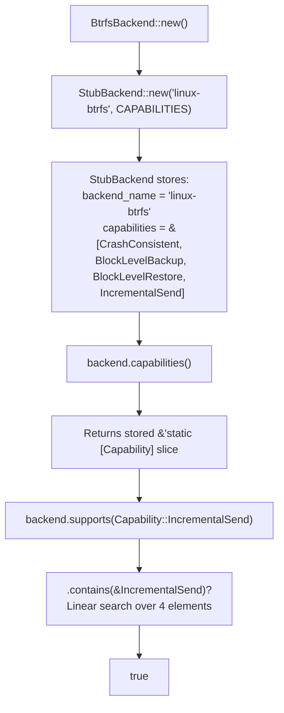
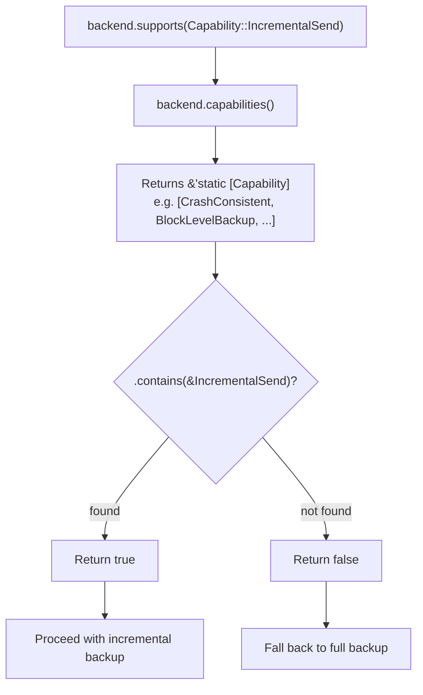
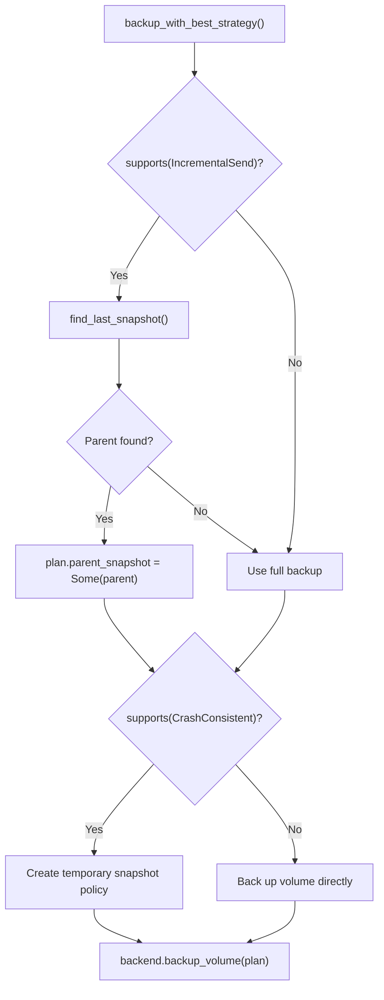

# Capabilities

The capability system lets callers discover what a backend can do *at runtime*
without hardcoding platform knowledge. Instead of writing
`if cfg!(target_os = "linux")`, you write
`if backend.supports(Capability::IncrementalSend)`. This enables graceful
degradation -- your code adapts to what is available instead of failing
unexpectedly.

## What is a capability?

A `Capability` is a unit enum variant that describes a single feature a
backend might support. It is defined in `src/types.rs:70-79`:

```rust
// src/types.rs:70-79
#[derive(Debug, Clone, Copy, PartialEq, Eq, Hash)]
pub enum Capability {
    CrashConsistentSnapshot,
    ApplicationConsistentSnapshot,
    WritableSnapshotMount,
    ReadOnlySnapshotMount,
    BlockLevelBackup,
    BlockLevelRestore,
    IncrementalSend,
    DirectDeviceAccess,
}
```

Each variant maps to a canonical snake_case string via `as_str()`
(`src/types.rs:82-93`):

```rust
// src/types.rs:82-93
impl Capability {
    pub const fn as_str(self) -> &'static str {
        match self {
            Self::CrashConsistentSnapshot => "crash_consistent_snapshot",
            Self::ApplicationConsistentSnapshot => "application_consistent_snapshot",
            Self::WritableSnapshotMount => "writable_snapshot_mount",
            Self::ReadOnlySnapshotMount => "read_only_snapshot_mount",
            Self::BlockLevelBackup => "block_level_backup",
            Self::BlockLevelRestore => "block_level_restore",
            Self::IncrementalSend => "incremental_send",
            Self::DirectDeviceAccess => "direct_device_access",
        }
    }
}
```

:::tip First principles
Think of capabilities as feature flags that live on the backend itself. Instead
of checking which OS you are on, you check what the backend *actually*
supports. This is more robust because it reflects reality -- a Linux system
might not have Btrfs installed, but it might have ZFS.
:::

## The eight capabilities explained

### CrashConsistentSnapshot

Equivalent to pulling the power plug. The filesystem is consistent (journal
replay will fix things) but application buffers may not be flushed. This is the
baseline -- all backends support it.

- **Btrfs**: `btrfs subvolume snapshot` (no quiescing)
- **LVM**: `lvcreate --snapshot` (no quiescing)
- **ZFS**: `zfs snapshot` (no quiescing)
- **Windows VSS**: VSS snapshot without writer coordination

### ApplicationConsistentSnapshot

Coordinates with application writers to flush buffers before snapshotting.
Only Windows VSS currently supports this, and only when VSS writer
coordination is enabled. Linux backends return `Error::MissingCapability` if
you request `SnapshotKind::ApplicationConsistent`.

```rust
// src/platform/linux/btrfs.rs:213-220
fn validate_snapshot_request(&self, request: &SnapshotRequest) -> Result<()> {
    if matches!(request.kind, SnapshotKind::ApplicationConsistent) {
        return Err(Error::MissingCapability {
            capability: Capability::ApplicationConsistentSnapshot.as_str(),
            backend: self.backend_name(),
        });
    }
    // ...
}
```

### WritableSnapshotMount

Mount a snapshot in read-write mode so you can modify it. Useful for
copy-mount workflows where you want to extract files from a snapshot and
modify them in place.

### ReadOnlySnapshotMount

Mount a snapshot in read-only mode for browsing. Safer than writable mount
because the snapshot cannot be accidentally modified.

### BlockLevelBackup

Backup by copying raw blocks from the volume device. Used by LVM (`copy_blocks()`)
and Windows VSS. Does not require filesystem-specific knowledge.

### BlockLevelRestore

Restore by writing raw blocks to the volume device. The counterpart to
`BlockLevelBackup`. Destructive -- overwrites the entire destination.

### IncrementalSend

Send only the differences between two snapshots. Used by Btrfs (`btrfs send -p`)
and ZFS (`zfs send -i`). Significantly faster than full backups when only a
small portion of the volume has changed.

```rust
// Btrfs incremental send -- src/platform/linux/btrfs.rs:155-164
let parent = match &plan.parent_snapshot {
    Some(snapshot) => Some(self.snapshot_ref_path(snapshot)?),
    None => None,
};
let mut args = vec!["send".to_string()];
if let Some(parent) = &parent {
    args.push("-p".to_string());
    args.push(parent.display().to_string());
}
```

### DirectDeviceAccess

Access volumes through device paths like `/dev/vg0/data`. Required by LVM
and ZFS. Btrfs works with subvolume paths (not device paths) so it does not
declare this capability.

## How capabilities are declared per backend

Each backend declares a static slice of capabilities as a constant. This
slice is passed to the inner `StubBackend` which stores it and returns it
from the `capabilities()` trait method.

### BtrfsBackend

```rust
// src/platform/linux/btrfs.rs:19-24
const CAPABILITIES: &[Capability] = &[
    Capability::CrashConsistentSnapshot,
    Capability::BlockLevelBackup,
    Capability::BlockLevelRestore,
    Capability::IncrementalSend,
];
```

### LvmBackend

```rust
// src/platform/linux/lvm.rs:19-24
const CAPABILITIES: &[Capability] = &[
    Capability::CrashConsistentSnapshot,
    Capability::BlockLevelBackup,
    Capability::BlockLevelRestore,
    Capability::DirectDeviceAccess,
];
```

### ZfsBackend

```rust
// src/platform/linux/zfs.rs:20-26
const CAPABILITIES: &[Capability] = &[
    Capability::CrashConsistentSnapshot,
    Capability::BlockLevelBackup,
    Capability::BlockLevelRestore,
    Capability::IncrementalSend,
    Capability::DirectDeviceAccess,
];
```

:::note
ZFS is the most capable Linux backend -- it supports both incremental send
and direct device access. Btrfs supports incremental send but not direct
device access (it uses subvolume paths). LVM supports direct device access
but not incremental send (it uses block-level copy).
:::

## How backends declare capabilities internally

Each backend wraps a `StubBackend` and passes its capability slice to the
constructor. The `StubBackend` stores the slice and returns it from the
`capabilities()` trait method.



## Capability matrix

Here is what each backend currently supports:

| Capability | Btrfs | LVM | ZFS | Windows VSS | macOS | Unix |
|-----------|:-----:|:---:|:---:|:-----------:|:-----:|:----:|
| CrashConsistentSnapshot | Yes | Yes | Yes | Yes | Stub* | Stub* |
| ApplicationConsistentSnapshot | -- | -- | -- | Yes | -- | -- |
| WritableSnapshotMount | -- | -- | -- | -- | -- | -- |
| ReadOnlySnapshotMount | -- | -- | -- | -- | -- | -- |
| BlockLevelBackup | Yes | Yes | Yes | Yes | Stub* | Stub* |
| BlockLevelRestore | Yes | Yes | Yes | Yes | Stub* | Stub* |
| IncrementalSend | Yes | -- | Yes | -- | -- | -- |
| DirectDeviceAccess | -- | Yes | Yes | Yes | Stub* | Stub* |

\* Declared as capabilities but operations return `Error::UnsupportedOperation`
because the backend is a stub.

:::note
The macOS and Unix backends declare capabilities but all operations are
stubbed. The capabilities represent what the platform *could* support with a
real implementation. This is intentional -- it lets code that only checks
capabilities work correctly even before the backend is fully implemented.
:::

## The supports() method

The `Backend` trait provides a default `supports()` method that checks
membership in the capabilities slice (`src/backend.rs:28-30`):

```rust
// src/backend.rs:28-30
fn supports(&self, capability: Capability) -> bool {
    self.capabilities().contains(&capability)
}
```

This is a simple linear search over a small slice (typically 3-5 elements).
No hashing or indexing is needed.



## Why capabilities matter: graceful degradation

Instead of failing hard when a feature is missing, you can adapt your behavior
based on what the backend supports:

```rust
fn backup_with_best_strategy(
    backend: &dyn vpt_rs::BackupExecutor + vpt_rs::Backend,
    plan: &mut vpt_rs::BackupPlan,
) -> vpt_rs::Result<()> {
    // Try incremental if supported
    if backend.supports(vpt_rs::Capability::IncrementalSend) {
        if let Some(parent) = find_last_snapshot(backend)? {
            plan.parent_snapshot = Some(parent);
            println!("Using incremental backup with parent: {}", parent);
        }
    } else {
        println!("Incremental not supported, using full backup");
    }

    // Auto-create a snapshot for live volumes
    if backend.supports(vpt_rs::Capability::CrashConsistentSnapshot) {
        if matches!(plan.snapshot_policy, vpt_rs::SnapshotPolicy::Disabled) {
            plan.snapshot_policy = vpt_rs::SnapshotPolicy::temporary(
                vpt_rs::SnapshotKind::CrashConsistent,
                Some("auto".to_string()),
                true,
            );
        }
    }

    backend.backup_volume(plan)
}
```



:::warning
Checking `supports()` is a best practice but not a guarantee. A backend may
report a capability but still fail with `Error::CommandFailed` if the
underlying tool is not installed or lacks permissions. Always handle errors
even after checking capabilities.
:::

## Capability as a Display type

`Capability` implements `Display` and `as_str()` returns the canonical
snake_case name (`src/types.rs:96-100`):

```rust
// src/types.rs:96-100
impl std::fmt::Display for Capability {
    fn fmt(&self, f: &mut std::fmt::Formatter<'_>) -> std::fmt::Result {
        f.write_str(self.as_str())
    }
}
```

Usage:

```rust
let cap = vpt_rs::Capability::IncrementalSend;
println!("{}", cap);  // "incremental_send"
assert_eq!(cap.as_str(), "incremental_send");
```

This is useful for logging and error messages. The `Error::MissingCapability`
variant stores the capability as a `&'static str` (via `as_str()`), so error
messages are human-readable.

## Checking capabilities in your code

```rust
use vpt_rs::{Backend, Capability};

let backend = vpt_rs::platform::current_backend();

// Check a single capability
if backend.supports(Capability::IncrementalSend) {
    println!("Incremental backups are supported");
}

// Check multiple capabilities
let can_snapshot_and_mount = backend.supports(Capability::CrashConsistentSnapshot)
    && backend.supports(Capability::ReadOnlySnapshotMount);

// Iterate all capabilities
for cap in backend.capabilities() {
    println!("  - {}", cap);
}

// Build a capability report
let mut report = String::from("Backend capabilities:\n");
for cap in backend.capabilities() {
    report.push_str(&format!("  [x] {}\n", cap));
}
println!("{}", report);
```

:::tip
When building a CLI or API that exposes backend information, iterate
`backend.capabilities()` and present them to the user. This helps with
debugging and support requests -- the user can say "my backend supports X, Y, Z"
and you can immediately see what is available.
:::

## Next steps

- [Plans](./plans.md) -- how plans use capabilities for validation
- [Error Handling](./error-handling.md) -- how missing capabilities surface as errors
- [Backends](./backends.md) -- how backends declare their capabilities
- [Traits](./traits.md) -- the `supports()` method on the `Backend` trait
