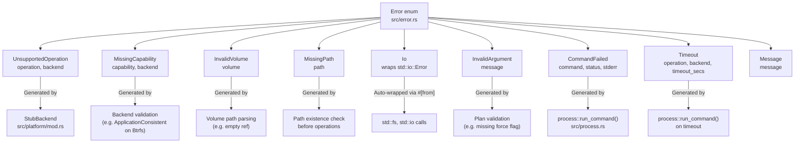
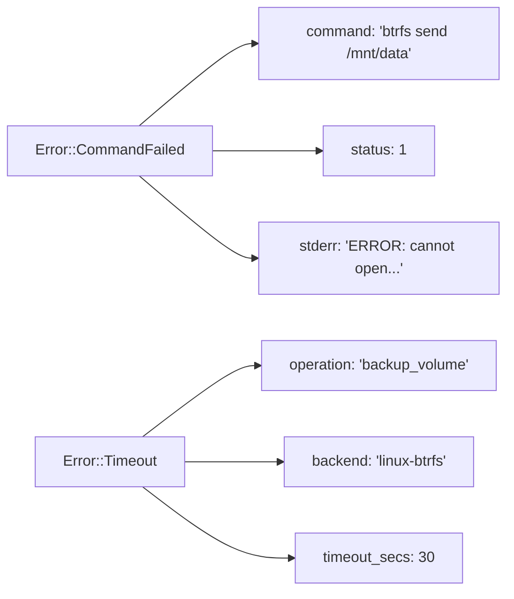
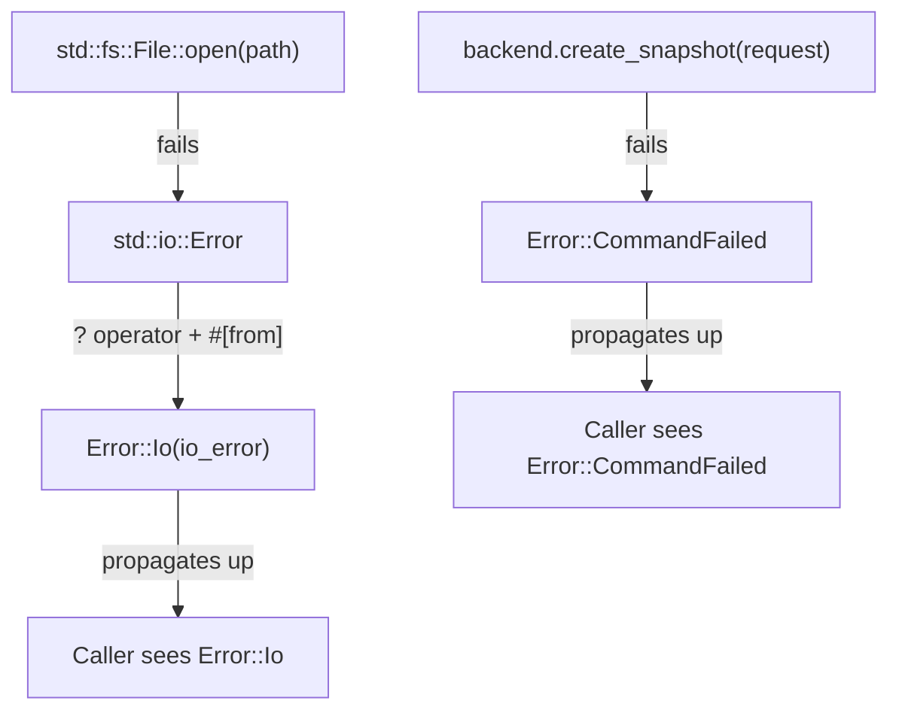
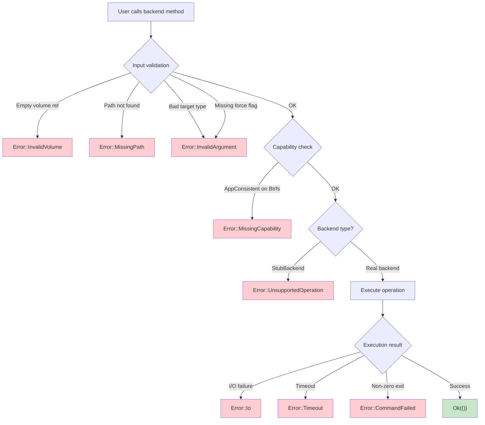

# Error Handling

vpt-rs uses a single `Error` enum with structured context on every variant.
This page explains each error type in detail, how errors carry context, how
to match on them, and best practices for handling errors in your code.

## The Error enum

The full `Error` enum is defined in `src/error.rs:10-52`:

```rust
// src/error.rs:4-5
pub type Result<T> = std::result::Result<T, Error>;

// src/error.rs:10-52
#[derive(Debug, thiserror::Error)]
pub enum Error {
    #[error("operation `{operation}` is not supported by backend `{backend}`")]
    UnsupportedOperation {
        operation: &'static str,
        backend: &'static str,
    },

    #[error("capability `{capability}` is not available on backend `{backend}`")]
    MissingCapability {
        capability: &'static str,
        backend: &'static str,
    },

    #[error("invalid volume reference `{volume}`")]
    InvalidVolume { volume: String },

    #[error("path does not exist: {path}")]
    MissingPath { path: PathBuf },

    #[error("io error: {0}")]
    Io(#[from] std::io::Error),

    #[error("invalid argument: {message}")]
    InvalidArgument { message: String },

    #[error("command `{command}` failed with status {status}: {stderr}")]
    CommandFailed {
        command: String,
        status: i32,
        stderr: String,
    },

    #[error("operation `{operation}` on backend `{backend}` timed out after {timeout_secs}s")]
    Timeout {
        operation: &'static str,
        backend: &'static str,
        timeout_secs: u64,
    },

    #[error("{message}")]
    Message { message: String },
}
```

There is also a convenience alias (`src/error.rs:4`):

```rust
pub type Result<T> = std::result::Result<T, Error>;
```

:::tip Design principle
Every variant carries structured context -- not just a string. This means you
can match on specific variants and extract fields programmatically, without
parsing error messages. For example, `CommandFailed` carries the command name,
exit status, and stderr output as separate fields.
:::

## Error variant hierarchy



## Error variant details

### UnsupportedOperation

Returned when a backend does not implement a particular operation. The
`StubBackend` (`src/platform/mod.rs:122-170`) returns this for all
operational methods on macOS and Unix. Individual backends also return it for
specific unsupported methods (e.g. `BtrfsBackend::mount_snapshot()`).

Fields:
- `operation: &'static str` -- the method name (e.g. `"create_snapshot"`)
- `backend: &'static str` -- the backend name (e.g. `"linux-btrfs"`)

```rust
// src/platform/mod.rs:84-86
fn unsupported(operation: &'static str, backend: &'static str) -> Error {
    Error::UnsupportedOperation { operation, backend }
}
```

Example matching:

```rust
match backend.mount_snapshot(&request) {
    Err(Error::UnsupportedOperation { operation, backend }) => {
        println!("The {} backend does not support {}", backend, operation);
    }
    Ok(handle) => { /* use handle */ }
    Err(e) => eprintln!("Other error: {}", e),
}
```

### MissingCapability

Returned when a backend does not declare the required capability. More
specific than `UnsupportedOperation` -- names the exact missing capability.
Used by Linux backends when `SnapshotKind::ApplicationConsistent` is requested
(`src/platform/linux/btrfs.rs:213-220`):

```rust
// src/platform/linux/btrfs.rs:213-220
fn validate_snapshot_request(&self, request: &SnapshotRequest) -> Result<()> {
    if matches!(request.kind, SnapshotKind::ApplicationConsistent) {
        return Err(Error::MissingCapability {
            capability: Capability::ApplicationConsistentSnapshot.as_str(),
            backend: self.backend_name(),
        });
    }
    // ...
}
```

Fields:
- `capability: &'static str` -- the capability name (e.g. `"application_consistent_snapshot"`)
- `backend: &'static str` -- the backend name (e.g. `"linux-btrfs"`)

```rust
match backend.create_snapshot(&request) {
    Err(Error::MissingCapability { capability, backend }) => {
        println!("The {} backend does not support `{}`", backend, capability);
    }
    // ...
}
```

### InvalidVolume

Returned when a volume reference is empty or malformed. Each backend has its
own validation:

- **Btrfs** (`src/platform/linux/btrfs.rs:229-246`): requires absolute
  subvolume paths
- **LVM** (`src/platform/linux/lvm.rs:91-125`): requires `/dev/<vg>/<lv>`
  format
- **ZFS** (`src/platform/linux/zfs.rs:91-117`): requires dataset name or
  mount path (not snapshot IDs)

```rust
// src/platform/linux/btrfs.rs:229-246
fn volume_path(&self, source: &VolumeRef) -> Result<PathBuf> {
    if source.id.trim().is_empty() {
        return Err(Error::InvalidVolume {
            volume: source.id.clone(),
        });
    }
    let path = PathBuf::from(&source.id);
    if !path.is_absolute() {
        return Err(Error::InvalidArgument {
            message: format!(
                "btrfs provider expects an absolute subvolume path, got `{}`",
                source.id
            ),
        });
    }
    Ok(path)
}
```

### MissingPath

Returned when a required filesystem path does not exist. Checked before
operations begin to avoid partial work.

```rust
// src/platform/linux/btrfs.rs:127-134
(BackupSource::Volume(volume), SnapshotPolicy::Disabled) => {
    let source = self.volume_path(volume)?;
    if !source.exists() {
        return Err(Error::MissingPath { path: source });
    }
    (source, None)
}
```

### Io

A wrapper around `std::io::Error`. Covers permission denied, disk full,
broken pipes, file not found, and all other I/O errors. The `#[from]`
attribute (`src/error.rs:31`) means `std::io::Error` automatically converts
to `Error::Io` via the `?` operator.

```rust
// src/error.rs:30-31
#[error("io error: {0}")]
Io(#[from] std::io::Error),
```

Example:

```rust
match backend.backup_volume(&plan) {
    Err(Error::Io(io_err)) => {
        println!("I/O error (kind: {:?}): {}", io_err.kind(), io_err);
    }
    // ...
}
```

### InvalidArgument

Returned when a plan or request contains invalid values. Each backend has its
own validation logic:

- **Btrfs**: device target not supported for send (`src/platform/linux/btrfs.rs:118-124`)
- **LVM**: `force` flag required for restore (`src/platform/linux/lvm.rs:265-268`)
- **ZFS**: non-snapshot source without temporary policy (`src/platform/linux/zfs.rs:233-239`)

```rust
// src/platform/linux/lvm.rs:265-268
if !plan.force {
    return Err(Error::InvalidArgument {
        message: "lvm restore requires `--force` because it overwrites the destination logical volume".to_string(),
    });
}
```

### CommandFailed

Returned when an external command exits with a non-zero status. This is the
most common error in production. The `process::run_command()` function
(`src/process.rs`) captures the command, exit status, and stderr output.

Fields:
- `command: String` -- the full command line (e.g. `"btrfs send /mnt/data"`)
- `status: i32` -- the exit code (e.g. `1`, `13` for permission denied)
- `stderr: String` -- the stderr output (usually contains the error reason)

```rust
match backend.backup_volume(&plan) {
    Err(Error::CommandFailed { command, status, stderr }) => {
        eprintln!("Command `{}` failed (exit {}): {}", command, status, stderr);
    }
    // ...
}
```

:::tip
The `stderr` field often contains the exact reason for failure. Always surface
it to the user. For example, `btrfs send` might print
`"ERROR: cannot open /mnt/data: Permission denied"` to stderr.
:::

### Timeout

Returned when an external command exceeds the configured timeout. The default
timeout is 30 seconds, configurable via `VPT_COMMAND_TIMEOUT_SECS`. The
process module uses exponential backoff polling (10ms to 200ms) to check for
completion.

Fields:
- `operation: &'static str` -- the operation name (e.g. `"backup_volume"`)
- `backend: &'static str` -- the backend name (e.g. `"linux-btrfs"`)
- `timeout_secs: u64` -- the timeout that was exceeded

The `timeout_secs()` accessor (`src/error.rs:55-60`) provides programmatic
access:

```rust
// src/error.rs:55-60
impl Error {
    pub fn timeout_secs(&self) -> Option<u64> {
        match self {
            Self::Timeout { timeout_secs, .. } => Some(*timeout_secs),
            _ => None,
        }
    }
}
```

### Message

A generic error with a free-form message. Used as a catch-all when none of
the other variants fit.

## How errors carry context

Every error variant carries structured fields that provide context without
parsing strings. The three most important context fields are:

1. **`backend`** -- which backend generated the error (e.g. `"linux-btrfs"`)
2. **`operation`** -- which operation was attempted (e.g. `"create_snapshot"`)
3. **`path`** or **`volume`** -- what resource was involved



:::note
The `#[error(...)]` attributes (from the `thiserror` crate) generate the
`Display` implementation automatically. Each variant's display format includes
all its fields, so `eprintln!("{}", error)` produces a human-readable message
like `"command `btrfs send` failed with status 1: ERROR: cannot open"`.
:::

## Error propagation with the ? operator

The `?` operator propagates errors up the call stack. Because `Error`
implements `From<std::io::Error>` (via the `#[from]` attribute), I/O errors
automatically wrap into `Error::Io`:

```rust
// This I/O error automatically becomes Error::Io
let file = std::fs::File::open(path)?;  // std::io::Error -> Error::Io

// Backend methods return Error directly
let info = backend.create_snapshot(&request)?;  // Error propagated as-is
```



## Pattern matching on errors

### Exhaustive match

```rust
let result = backend.backup_volume(&plan);

match result {
    Ok(()) => println!("Backup completed successfully"),
    Err(Error::UnsupportedOperation { operation, backend }) => {
        eprintln!("{} not supported on {}", operation, backend);
    }
    Err(Error::MissingCapability { capability, backend }) => {
        eprintln!("{} missing capability: {}", backend, capability);
    }
    Err(Error::InvalidVolume { volume }) => {
        eprintln!("Bad volume reference: `{}`", volume);
    }
    Err(Error::MissingPath { path }) => {
        eprintln!("Path does not exist: {}", path.display());
    }
    Err(Error::Io(io_err)) => {
        eprintln!("I/O error: {}", io_err);
    }
    Err(Error::InvalidArgument { message }) => {
        eprintln!("Invalid argument: {}", message);
    }
    Err(Error::CommandFailed { command, status, stderr }) => {
        eprintln!("Command `{}` failed (exit {}): {}", command, status, stderr);
    }
    Err(Error::Timeout { operation, backend, timeout_secs }) => {
        eprintln!("{} on {} timed out after {}s", operation, backend, timeout_secs);
    }
    Err(Error::Message { message }) => {
        eprintln!("Error: {}", message);
    }
}
```

### Matching on a specific variant

```rust
// Check for timeout specifically
if matches!(&result, Err(Error::Timeout { .. })) {
    println!("Operation timed out -- consider increasing VPT_COMMAND_TIMEOUT_SECS");
}

// Extract timeout duration
if let Err(e) = &result {
    if let Some(secs) = e.timeout_secs() {
        println!("Timed out after {}s", secs);
    }
}
```

### Catching and retrying

```rust
fn backup_with_retry(backend: &dyn BackupExecutor, plan: &BackupPlan, max_retries: u32) -> Result<()> {
    let mut attempts = 0;
    loop {
        match backend.backup_volume(plan) {
            Ok(()) => return Ok(()),
            Err(Error::Timeout { .. }) if attempts < max_retries => {
                attempts += 1;
                eprintln!("Timeout, retrying ({}/{})...", attempts, max_retries);
                continue;
            }
            Err(Error::CommandFailed { status, .. }) if status == 13 && attempts < max_retries => {
                // Exit code 13 = permission denied, might be transient
                attempts += 1;
                eprintln!("Permission denied, retrying ({}/{})...", attempts, max_retries);
                continue;
            }
            Err(e) => return Err(e),
        }
    }
}
```

## Error context in logs

Every backend logs errors with structured `tracing` context before returning
them. For example, `BtrfsBackend::create_snapshot()` (`src/platform/linux/btrfs.rs:399-422`):

```rust
// src/platform/linux/btrfs.rs:418-420
if let Err(error) = &result {
    error!(backend = self.backend_name(), source = %request.source, error = %error, "create_snapshot failed");
}
```

This means errors appear in logs with structured fields like:

```
ERROR create_snapshot failed backend=linux-btrfs source=/mnt/data/subvol error=path does not exist: /mnt/data/subvol
```

:::caution
Errors are logged before being returned. If your application also logs errors
at the call site, you may see duplicates. The recommendation is to log only at
the application boundary (CLI main, API handler) and not in library code that
calls vpt-rs.
:::

## Error propagation flowchart



## Best practices

### 1. Always handle CommandFailed

It is the most common error in production. Surface the `stderr` field to the
user -- it usually contains the exact reason for failure.

```rust
if let Err(Error::CommandFailed { stderr, .. }) = backend.backup_volume(&plan) {
    eprintln!("Backup failed: {}", stderr);
}
```

### 2. Check capabilities before calling operations

Prevents `MissingCapability` errors. Adjust your plan before calling:

```rust
if !backend.supports(Capability::ApplicationConsistentSnapshot) {
    plan.snapshot_policy = SnapshotPolicy::temporary(
        SnapshotKind::CrashConsistent,  // fall back to crash-consistent
        Some("auto".to_string()), true,
    );
}
backend.backup_volume(&plan)?;
```

### 3. Use the ? operator

`Error` implements `From<std::io::Error>`, so I/O errors inside the library
propagate cleanly via `?`. Do not manually wrap errors unless you need to
add context.

### 4. Distinguish transient from permanent errors

| Error | Type | Retryable? |
|-------|------|-----------|
| `Timeout` | Transient | Yes, with increased timeout |
| `CommandFailed` (exit 13) | Transient | Yes, permission might change |
| `CommandFailed` (other) | Permanent | No |
| `InvalidArgument` | Permanent | No |
| `MissingCapability` | Permanent | No |
| `MissingPath` | Permanent | No (fix the path first) |
| `UnsupportedOperation` | Permanent | No |

### 5. Use timeout_secs() for adaptive behavior

```rust
if let Err(e) = backend.backup_volume(&plan) {
    if let Some(secs) = e.timeout_secs() {
        eprintln!("Timed out after {}s. Consider setting VPT_COMMAND_TIMEOUT_SECS to {}",
            secs, secs * 2);
    }
}
```

### 6. Avoid duplicate logging

Backends already log errors with `tracing`. Do not log the same error again
at your call site. Instead, log only at the application boundary (CLI, API
handler) where you handle the final result.

## Next steps

- [Architecture](./architecture.md) -- how errors fit into the overall design
- [Traits](./traits.md) -- which errors each trait may return
- [Backends](./backends.md) -- platform-specific error scenarios
- [Plans](./plans.md) -- how plan validation produces errors before execution
