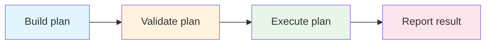
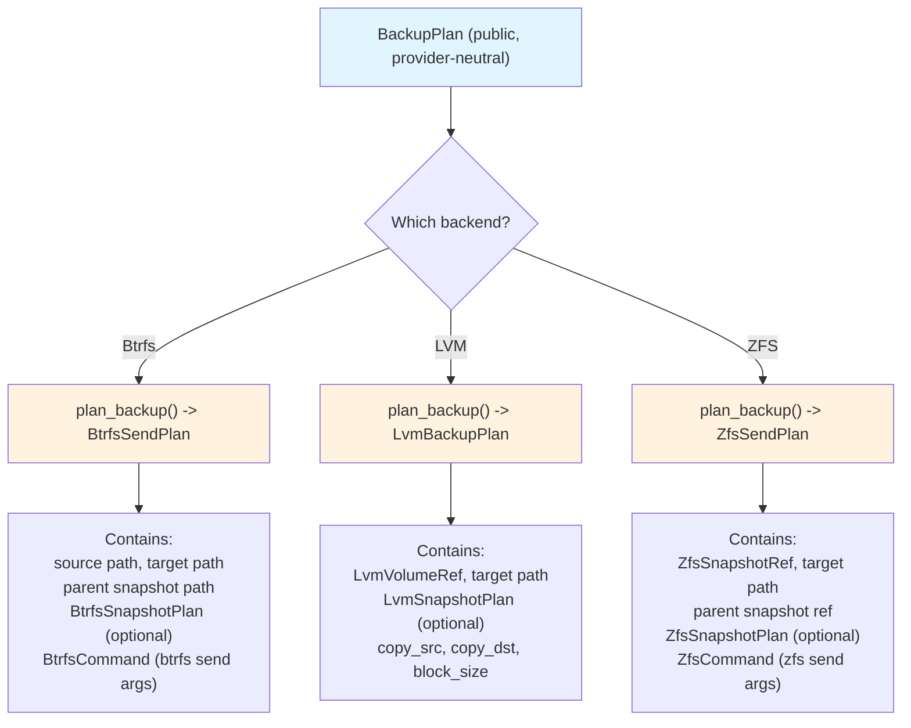
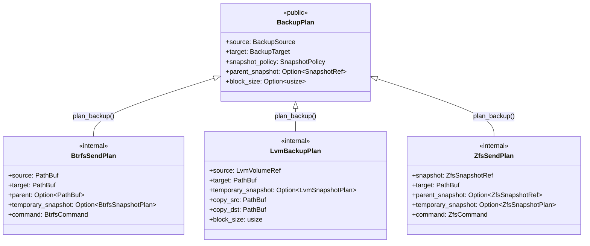
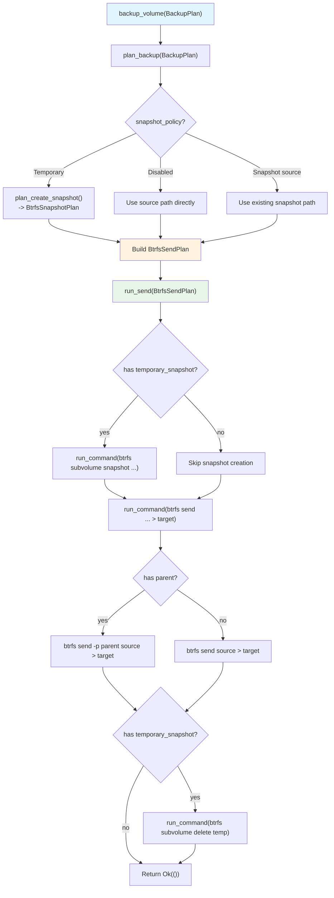

# Plans

vpt-rs uses a "plan-then-execute" pattern for all operations. A plan is a
plain data struct that describes *what* should happen. Execution is a separate
step that *makes* it happen. This page explains why this pattern exists, shows
every plan type in detail, and demonstrates how to test with plans.

## Why plans?



Separating planning from execution gives you three concrete benefits:

1. **Testability** -- you can call `plan_backup()` on a `BtrfsBackend` in a
   `#[test]` function without root privileges or a real Btrfs filesystem. The
   plan is just a struct you can inspect with `assert_eq!`.

2. **Validation** -- plans reject invalid inputs (missing paths, unsupported
   snapshot kinds, wrong target types) before any work begins. No half-finished
   operations to clean up.

3. **Composability** -- a plan can contain a nested plan. For example,
   `BtrfsSendPlan` contains an optional `BtrfsSnapshotPlan` for the temporary
   snapshot it will create before sending.



:::tip The key insight
Plans are the "compiled" form of a user request. `BackupPlan` is the source
language; the backend-specific plan (e.g. `BtrfsSendPlan`) is the compiled
form with all ambiguities resolved and commands constructed.
:::

## BackupPlan

`BackupPlan` (`src/types.rs:303-310`) is the public plan type for backup
operations. It is provider-neutral -- it does not know about Btrfs, LVM, or
ZFS.

```rust
// src/types.rs:303-310
#[derive(Debug, Clone, PartialEq, Eq)]
pub struct BackupPlan {
    pub source: BackupSource,
    pub target: BackupTarget,
    pub snapshot_policy: SnapshotPolicy,
    pub parent_snapshot: Option<SnapshotRef>,
    pub block_size: Option<usize>,
}
```

### Fields explained

| Field | Type | Description |
|-------|------|-------------|
| `source` | `BackupSource` | What to back up -- a live `Volume` or an existing `Snapshot`. |
| `target` | `BackupTarget` | Where to write -- an `ImageFile` path or a `Device` path. |
| `snapshot_policy` | `SnapshotPolicy` | Whether to create a temporary snapshot first. |
| `parent_snapshot` | `Option<SnapshotRef>` | Previous snapshot for incremental backups (Btrfs/ZFS only). |
| `block_size` | `Option<usize>` | I/O chunk size for block copy. `None` uses default (4 MiB). |

### Creating a full backup

```rust
use vpt_rs::{BackupPlan, BackupSource, BackupTarget, SnapshotPolicy, SnapshotKind, VolumeRef};
use std::path::PathBuf;

let plan = BackupPlan {
    source: BackupSource::Volume(VolumeRef::new("/dev/vg0/data")),
    target: BackupTarget::ImageFile(PathBuf::from("/backups/data.img")),
    snapshot_policy: SnapshotPolicy::temporary(
        SnapshotKind::CrashConsistent,
        Some("backup".to_string()),
        true,
    ),
    parent_snapshot: None,
    block_size: None,
};

backend.backup_volume(&plan)?;
```

### Creating an incremental backup

```rust
use vpt_rs::SnapshotRef;

let plan = BackupPlan {
    source: BackupSource::Snapshot(
        SnapshotRef::new("tank/data@snap2")
            .with_origin(VolumeRef::new("tank/data")),
    ),
    target: BackupTarget::ImageFile(PathBuf::from("/backups/data-incr.zfs")),
    snapshot_policy: SnapshotPolicy::disabled(),
    parent_snapshot: Some(
        SnapshotRef::new("tank/data@snap1")
            .with_origin(VolumeRef::new("tank/data")),
    ),
    block_size: None,
};

backend.backup_volume(&plan)?;
```

:::note
The `parent_snapshot` field is only used by backends that support
`Capability::IncrementalSend` (Btrfs and ZFS). LVM ignores it. The backend
translates it into `-p` (Btrfs) or `-i` (ZFS) flags on the send command.
:::

## BackupSource

`BackupSource` (`src/types.rs:234-238`) tells the backend whether to work
with a live volume or an existing snapshot:

```rust
// src/types.rs:234-238
#[derive(Debug, Clone, PartialEq, Eq)]
pub enum BackupSource {
    Volume(VolumeRef),
    Snapshot(SnapshotRef),
}
```

- **`Volume`** -- the backend may create a temporary snapshot or read directly.
  Combined with `SnapshotPolicy::Temporary`, the backend creates a snapshot,
  backs it up, then deletes it.
- **`Snapshot`** -- the backend uses the existing snapshot as-is. Required for
  ZFS send unless a temporary snapshot policy is provided.

## BackupTarget

`BackupTarget` (`src/types.rs:221-225`) specifies where the backup output
goes:

```rust
// src/types.rs:221-225
#[derive(Debug, Clone, PartialEq, Eq)]
pub enum BackupTarget {
    ImageFile(PathBuf),
    Device(PathBuf),
}
```

- **`ImageFile`** -- write to a file. Supported by all backends.
- **`Device`** -- write directly to a block device. Not supported by Btrfs or
  ZFS (they return `Error::InvalidArgument`).

## SnapshotPolicy

`SnapshotPolicy` (`src/types.rs:253-275`) controls whether the backend should
create a temporary snapshot before backing up:

```rust
// src/types.rs:253-275
#[derive(Debug, Clone, PartialEq, Eq)]
pub enum SnapshotPolicy {
    Disabled,
    Temporary {
        kind: SnapshotKind,
        label: Option<String>,
        read_only: bool,
    },
}

impl SnapshotPolicy {
    pub const fn disabled() -> Self {
        Self::Disabled
    }

    pub fn temporary(kind: SnapshotKind, label: Option<String>, read_only: bool) -> Self {
        Self::Temporary { kind, label, read_only }
    }
}
```

- **`Disabled`** -- back up the source as-is. Fine for snapshots, risky for
  live volumes.
- **`Temporary`** -- create a snapshot, back it up, then delete it. The
  recommended default for live volumes.

:::caution
Backing up a live volume without a temporary snapshot may produce an
inconsistent image, especially if applications are writing to the volume.
Always use `SnapshotPolicy::temporary()` for live volumes unless you have a
specific reason not to.
:::

## SnapshotRequest

`SnapshotRequest` (`src/types.rs:160-166`) is used directly with
`SnapshotProvider::create_snapshot()`:

```rust
// src/types.rs:160-166
#[derive(Debug, Clone, PartialEq, Eq)]
pub struct SnapshotRequest {
    pub source: VolumeRef,
    pub kind: SnapshotKind,
    pub label: Option<String>,
    pub read_only: bool,
}
```

Usage:

```rust
let request = SnapshotRequest {
    source: VolumeRef::new("/mnt/data/subvol"),
    kind: SnapshotKind::CrashConsistent,
    label: Some("pre-upgrade".to_string()),
    read_only: true,
};

let info = backend.create_snapshot(&request)?;
println!("Snapshot created: {}", info.handle.id);
```

The `SnapshotKind` enum (`src/types.rs:109-113`) has two variants:

```rust
// src/types.rs:109-113
pub enum SnapshotKind {
    CrashConsistent,
    ApplicationConsistent,
}
```

## RestorePlan

`RestorePlan` (`src/types.rs:319-326`) describes how to restore a volume from
a backup:

```rust
// src/types.rs:319-326
#[derive(Debug, Clone, PartialEq, Eq)]
pub struct RestorePlan {
    pub source: BackupTarget,
    pub destination: VolumeRef,
    pub force: bool,
    pub base_snapshot: Option<SnapshotRef>,
    pub block_size: Option<usize>,
}
```

| Field | Type | Description |
|-------|------|-------------|
| `source` | `BackupTarget` | The backup file or device to restore from. |
| `destination` | `VolumeRef` | The target volume to restore to. |
| `force` | `bool` | Required for destructive backends (LVM, VSS). |
| `base_snapshot` | `Option<SnapshotRef>` | Reserved for incremental restore workflows. |
| `block_size` | `Option<usize>` | I/O chunk size. `None` uses default (4 MiB). |

Usage:

```rust
let plan = RestorePlan {
    source: BackupTarget::ImageFile(PathBuf::from("/backups/data.img")),
    destination: VolumeRef::new("/dev/vg0/restore"),
    force: true,  // required for LVM and VSS
    base_snapshot: None,
    block_size: None,
};

backend.restore_volume(&plan)?;
```

:::warning
The `force` flag is a safety mechanism. LVM restore requires `force: true`
because it overwrites the entire destination logical volume via block-level
copy. The LVM backend returns `Error::InvalidArgument` if `force` is `false`
(`src/platform/linux/lvm.rs:265-268`).
:::

## Backend-specific plan types

Each backend translates the public plan into an internal plan that describes
the exact commands to run. These are not part of the public API but help you
understand what happens under the hood.

### BtrfsSendPlan

```rust
// src/platform/linux/btrfs.rs:55-61
#[derive(Debug, Clone, PartialEq, Eq)]
pub struct BtrfsSendPlan {
    pub source: PathBuf,           // snapshot path to send
    pub target: PathBuf,           // output file path
    pub parent: Option<PathBuf>,   // parent snapshot for incremental
    pub temporary_snapshot: Option<BtrfsSnapshotPlan>,  // nested plan
    pub command: BtrfsCommand,     // btrfs send args
}
```

Contains a nested `BtrfsSnapshotPlan` if a temporary snapshot is needed:

```rust
// src/platform/linux/btrfs.rs:47-52
#[derive(Debug, Clone, PartialEq, Eq)]
pub struct BtrfsSnapshotPlan {
    pub source: PathBuf,
    pub snapshot_path: PathBuf,
    pub read_only: bool,
    pub command: BtrfsCommand,  // btrfs subvolume snapshot args
}
```

### LvmBackupPlan

```rust
// src/platform/linux/lvm.rs:57-65
#[derive(Debug, Clone, PartialEq, Eq)]
pub struct LvmBackupPlan {
    pub source: LvmVolumeRef,      // parsed VG/LV reference
    pub target: PathBuf,           // output file path
    pub temporary_snapshot: Option<LvmSnapshotPlan>,
    pub copy_src: PathBuf,         // source for copy_blocks()
    pub copy_dst: PathBuf,         // destination for copy_blocks()
    pub block_size: usize,         // I/O chunk size
}
```

### ZfsSendPlan

```rust
// src/platform/linux/zfs.rs:62-69
#[derive(Debug, Clone, PartialEq, Eq)]
pub struct ZfsSendPlan {
    pub snapshot: ZfsSnapshotRef,  // dataset@snapshot
    pub target: PathBuf,           // output file path
    pub parent_snapshot: Option<ZfsSnapshotRef>,  // for incremental
    pub temporary_snapshot: Option<ZfsSnapshotPlan>,
    pub command: ZfsCommand,       // zfs send args
}
```



## The plan-then-execute flow

Here is how `BtrfsBackend::backup_volume()` uses plans internally:



## Unit testing with plans

The plan-then-execute pattern makes unit testing straightforward. You can call
`plan_*` methods on backend structs without root privileges or real volumes.
The tests only validate that the plan structs contain the expected data.

### Testing a Btrfs backup plan

```rust
// src/platform/linux/btrfs.rs:600-631
#[test]
fn backup_plan_uses_btrfs_send_to_image_file() {
    let backend = BtrfsBackend::new();
    let root = std::env::temp_dir().join(format!("vpt-rs-btrfs-send-{}", std::process::id()));
    std::fs::create_dir_all(&root).unwrap();
    let source = root.join("subvol");
    std::fs::create_dir_all(&source).unwrap();
    let target = root.join("backup.stream");

    let plan = backend.plan_backup(&BackupPlan {
        source: BackupSource::Volume(VolumeRef::new(source.display().to_string())),
        target: BackupTarget::ImageFile(target.clone()),
        snapshot_policy: SnapshotPolicy::temporary(
            SnapshotKind::CrashConsistent,
            Some("tmp".to_string()),
            true,
        ),
        parent_snapshot: None,
        block_size: None,
    }).unwrap();

    // Verify the plan uses btrfs send with a temporary snapshot
    assert_eq!(plan.source, root.join(".vb-snapshots").join("tmp"));
    assert_eq!(plan.target, target);
    assert_eq!(
        plan.command.args,
        vec!["send", plan.source.to_string_lossy().as_ref()]
    );
    assert!(plan.temporary_snapshot.is_some());

    let _ = std::fs::remove_dir_all(&root);
}
```

### Testing incremental backup planning

```rust
// src/platform/linux/btrfs.rs:634-670
#[test]
fn backup_plan_uses_parent_snapshot_for_incremental_send() {
    let backend = BtrfsBackend::new();
    let root = std::env::temp_dir().join(format!("vpt-rs-btrfs-parent-{}", std::process::id()));
    std::fs::create_dir_all(&root).unwrap();
    let source = root.join("subvol");
    let parent = root.join(".vb-snapshots").join("base");
    std::fs::create_dir_all(&source).unwrap();

    let plan = backend.plan_backup(&BackupPlan {
        source: BackupSource::Snapshot(
            SnapshotRef::new(source.display().to_string())
                .with_origin(VolumeRef::new(source.display().to_string())),
        ),
        target: BackupTarget::ImageFile(root.join("backup.stream")),
        snapshot_policy: SnapshotPolicy::disabled(),
        parent_snapshot: Some(
            SnapshotRef::new(parent.display().to_string())
                .with_origin(VolumeRef::new(source.display().to_string())),
        ),
        block_size: None,
    }).unwrap();

    // Verify the plan includes -p flag for incremental send
    assert_eq!(
        plan.command.args,
        vec![
            "send",
            "-p",
            parent.to_string_lossy().as_ref(),
            source.to_string_lossy().as_ref(),
        ]
    );
    assert_eq!(plan.parent, Some(parent));

    let _ = std::fs::remove_dir_all(&root);
}
```

### Testing validation (error cases)

```rust
// src/platform/linux/lvm.rs:637-650
#[test]
fn restore_plan_requires_force_flag() {
    let backend = LvmBackend::new();
    let error = backend.plan_restore(&RestorePlan {
        source: BackupTarget::ImageFile(PathBuf::from("/tmp/data.img")),
        destination: VolumeRef::new("/dev/vg0/restore"),
        force: false,  // missing force flag
        base_snapshot: None,
        block_size: None,
    }).unwrap_err();

    // Should fail with InvalidArgument
    assert!(matches!(error, Error::InvalidArgument { .. }));
}
```

:::tip
The `plan_*` methods on backend structs are public. You can call them directly
in tests without root privileges or real volumes. The tests create temporary
directories, construct plans, and verify the plan structs contain the expected
command arguments and paths.
:::

:::note
Every backend test cleans up its temporary directory at the end with
`std::fs::remove_dir_all()`. Use unique directory names (e.g. with process ID)
to avoid conflicts when tests run in parallel.
:::

## Next steps

- [Error Handling](./error-handling.md) -- what happens when plans fail
- [Capabilities](./capabilities.md) -- how capabilities affect plan validation
- [Traits](./traits.md) -- the traits that accept plans
- [Backends](./backends.md) -- how backends translate plans into commands
