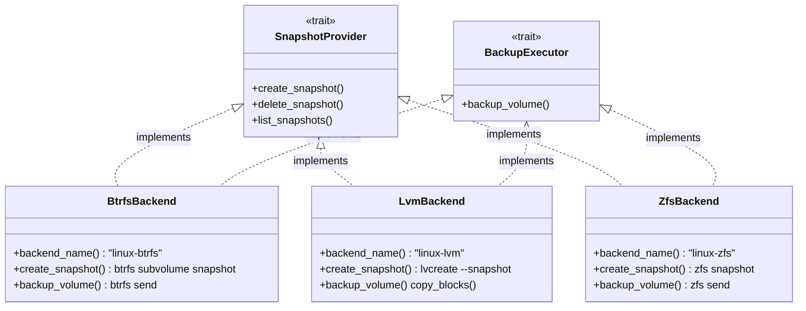
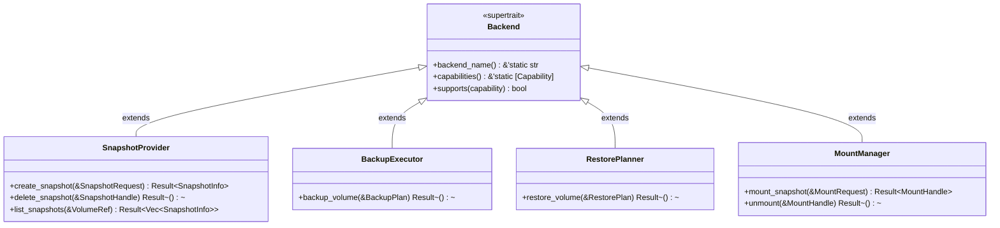
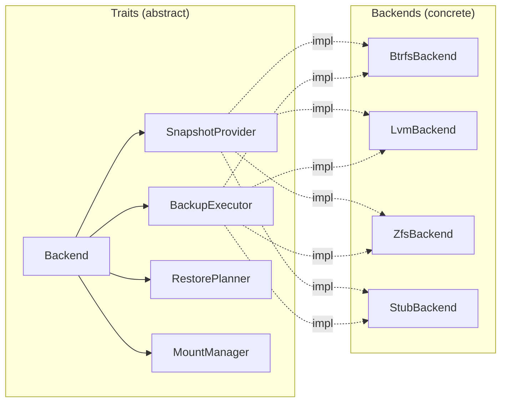
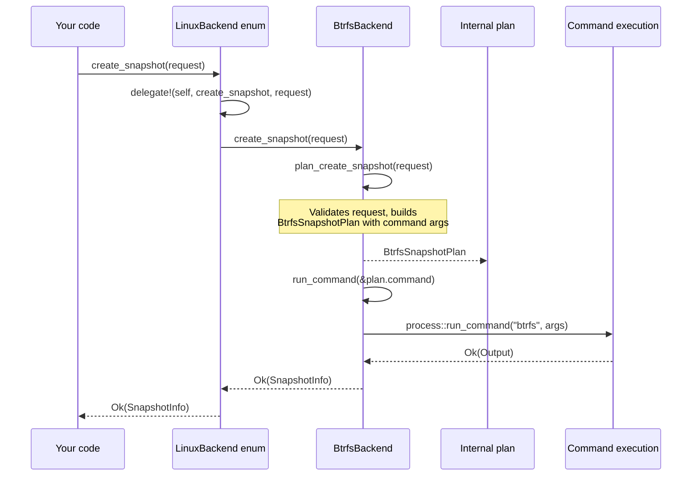

# Traits

vpt-rs exposes five traits that together form the complete public API. This
page explains each trait from first principles, shows the full source code,
and demonstrates how to use them in your own code.

## Why traits? (For non-Rust developers)

If you are coming from Python, Java, or Go, think of Rust traits as interfaces
or abstract base classes. A trait defines a set of methods that a type must
implement. The key difference from class inheritance is that traits are
*decoupled* from the type -- any type can implement any trait as long as it
provides the required methods.

In vpt-rs, this means:

- `BtrfsBackend`, `LvmBackend`, and `ZfsBackend` are completely separate types
  with no shared base class.
- Each one independently implements the same set of traits (`Backend`,
  `SnapshotProvider`, `BackupExecutor`, etc.).
- Code that accepts `&dyn SnapshotProvider` works with all of them without
  knowing which backend it is.

This is **polymorphism without inheritance** -- the Rust way.



:::tip Key insight
Traits let you write code that says "I don't care *how* you do it, just that
you *can* do it." The `BackupExecutor` trait says: "give me a `BackupPlan` and
I will back up the volume." The Btrfs backend does it with `btrfs send`, the
LVM backend does it with block-level copy. The caller does not need to know.
:::

## Trait hierarchy overview

Every operational trait extends `Backend` with `: Backend` (see
`src/snapshot.rs:20`, `src/backup.rs:19`, `src/restore.rs:19`,
`src/mount.rs:11`). This is Rust's supertrait syntax -- it means any type
that implements `SnapshotProvider` must *also* implement `Backend`. The
compiler enforces this.



The relationship between traits and backends looks like this:



## Backend (supertrait)

`Backend` is the foundation. It carries no operations -- only identity and
capability metadata. Every other trait extends it.

**Full source code** (`src/backend.rs`):

```rust
use crate::types::Capability;

pub trait Backend: Send + Sync {
    /// Return the canonical name of this backend (e.g. "linux-btrfs", "windows-vss").
    fn backend_name(&self) -> &'static str;

    /// Return the set of capabilities this backend supports.
    fn capabilities(&self) -> &'static [Capability];

    /// Check whether this backend supports a specific capability.
    fn supports(&self, capability: Capability) -> bool {
        self.capabilities().contains(&capability)
    }
}
```

Key details:

- **`Send + Sync`** (`src/backend.rs:20`) -- all backends are safe to share
  across threads. This is required because backup operations may run on async
  executors or thread pools.
- **`backend_name()`** (`src/backend.rs:22`) -- returns a static string like
  `"linux-btrfs"`, `"linux-lvm"`, `"linux-zfs"`, or `"windows-vss"`. Used
  in log messages and error context.
- **`capabilities()`** (`src/backend.rs:25`) -- returns a static slice of
  `Capability` variants. The default `supports()` method
  (`src/backend.rs:28-30`) checks membership in this slice.

```rust
// Usage example
let backend = vpt_rs::platform::current_backend();
println!("Using backend: {}", backend.backend_name());

if backend.supports(Capability::IncrementalSend) {
    println!("Incremental backups are available");
}
```

:::tip Why a supertrait?
The supertrait lets you write generic code that works with *any* backend
without knowing which operational trait it implements. For example, a CLI
progress reporter only needs `Backend` to display the backend name and
enumerate capabilities.
:::

## SnapshotProvider

`SnapshotProvider` (`src/snapshot.rs:20-31`) manages the lifecycle of
provider-native snapshots. Each platform has its own mechanism:

- **Btrfs**: `btrfs subvolume snapshot`
- **LVM**: `lvcreate --snapshot`
- **ZFS**: `zfs snapshot`
- **Windows**: VSS COM API

**Full source code** (`src/snapshot.rs`):

```rust
use crate::backend::Backend;
use crate::error::Result;
use crate::types::{SnapshotHandle, SnapshotInfo, SnapshotRequest, VolumeRef};

pub trait SnapshotProvider: Backend {
    /// Create a new snapshot of the given volume.
    fn create_snapshot(&self, request: &SnapshotRequest) -> Result<SnapshotInfo>;

    /// Delete an existing snapshot by its handle.
    fn delete_snapshot(&self, snapshot: &SnapshotHandle) -> Result<()>;

    /// List all snapshots managed by this backend for the given volume.
    fn list_snapshots(&self, source: &VolumeRef) -> Result<Vec<SnapshotInfo>>;
}
```

Usage example:

```rust
let backend = vpt_rs::platform::current_backend();

// Create a read-only crash-consistent snapshot
let info = backend.create_snapshot(&SnapshotRequest {
    source: VolumeRef::new("/mnt/data/subvol"),
    kind: SnapshotKind::CrashConsistent,
    label: Some("nightly".to_string()),
    read_only: true,
})?;

println!("Snapshot created: {}", info.handle.id);

// List all snapshots for this volume
let snapshots = backend.list_snapshots(&VolumeRef::new("/mnt/data/subvol"))?;
for snap in &snapshots {
    println!("  {} (read_only={})", snap.handle.id, snap.read_only);
}

// Delete the snapshot when done
backend.delete_snapshot(&info.handle)?;
```

:::caution
Snapshot deletion is permanent. On Btrfs and ZFS this removes the subvolume
or dataset. On LVM it calls `lvremove`. Always confirm with the user before
deleting.
:::

## BackupExecutor

`BackupExecutor` (`src/backup.rs:19-22`) exports a volume to a stream or image file.
Different backends use different mechanisms:

- **Btrfs**: `btrfs send` (stream-based, supports incremental)
- **ZFS**: `zfs send` (stream-based, supports incremental)
- **LVM**: block-level copy via `copy_blocks()` (no incremental)

**Full source code** (`src/backup.rs`):

```rust
use crate::backend::Backend;
use crate::error::Result;
use crate::types::BackupPlan;

pub trait BackupExecutor: Backend {
    /// Execute a backup according to the given plan.
    fn backup_volume(&self, plan: &BackupPlan) -> Result<()>;
}
```

Usage example:

```rust
let plan = BackupPlan {
    source: BackupSource::Volume(VolumeRef::new("/dev/vg0/data")),
    target: BackupTarget::ImageFile(PathBuf::from("/tmp/backup.img")),
    snapshot_policy: SnapshotPolicy::temporary(
        SnapshotKind::CrashConsistent,
        Some("backup".to_string()),
        true,
    ),
    parent_snapshot: None,
    block_size: None,
};

backend.backup_volume(&plan)?;
println!("Backup written to /tmp/backup.img");
```

:::note
The `snapshot_policy` field tells the backend whether to create a temporary
snapshot before backing up. Backing up a live volume without a snapshot may
produce an inconsistent image. The `SnapshotPolicy::temporary()` constructor
creates a crash-consistent snapshot, backs it up, then deletes it
automatically.
:::

## RestorePlanner

`RestorePlanner` (`src/restore.rs:19-22`) imports a volume from a backup stream or
image file. Destructive backends (LVM, VSS) require the `force` flag.

**Full source code** (`src/restore.rs`):

```rust
use crate::backend::Backend;
use crate::error::Result;
use crate::types::RestorePlan;

pub trait RestorePlanner: Backend {
    /// Execute a restore according to the given plan.
    fn restore_volume(&self, plan: &RestorePlan) -> Result<()>;
}
```

Usage example:

```rust
let plan = RestorePlan {
    source: BackupTarget::ImageFile(PathBuf::from("/tmp/backup.img")),
    destination: VolumeRef::new("/dev/vg0/restore"),
    force: true,  // required for LVM and VSS
    base_snapshot: None,
    block_size: None,
};

backend.restore_volume(&plan)?;
println!("Volume restored to /dev/vg0/restore");
```

:::caution
Restoring is destructive. LVM writes directly to the device via block-level
copy. ZFS receives the stream into the destination dataset, overwriting it.
The `force` flag is a safety mechanism -- LVM and VSS backends return
`Error::InvalidArgument` if `force` is `false`.
:::

## MountManager

`MountManager` (`src/mount.rs:11-17`) mounts an existing snapshot for browsing or
file extraction. Not all backends support this -- check
`Capability::ReadOnlySnapshotMount` and `Capability::WritableSnapshotMount`
before calling.

**Full source code** (`src/mount.rs`):

```rust
use crate::backend::Backend;
use crate::error::Result;
use crate::types::{MountHandle, MountRequest};

pub trait MountManager: Backend {
    /// Mount an existing snapshot at the requested location.
    fn mount_snapshot(&self, request: &MountRequest) -> Result<MountHandle>;

    /// Unmount a previously mounted snapshot.
    fn unmount(&self, handle: &MountHandle) -> Result<()>;
}
```

Usage example:

```rust
let request = MountRequest {
    snapshot: SnapshotHandle {
        id: "tank/data@snap1".to_string(),
        source: None,
    },
    mode: MountMode::ReadOnly,
    target: Some(PathBuf::from("/mnt/snap1")),
};

let handle = backend.mount_snapshot(&request)?;
println!("Snapshot mounted at {}", handle.mount_point.display());

// ... browse files at handle.mount_point ...

backend.unmount(&handle)?;
```

:::note
Currently none of the Linux backends (Btrfs, LVM, ZFS) implement mount
operations -- they all return `Error::UnsupportedOperation`. Mount support is
planned for future releases. Check `backend.supports(Capability::ReadOnlySnapshotMount)`
to see if it is available on your platform.
:::

## Method call flow

When you call a trait method, here is what happens internally:



## How to use traits as function parameters

All five traits are object-safe. You can use them as trait objects (`&dyn Trait`)
or as generic bounds:

### Using trait objects (dynamic dispatch)

```rust
fn run_backup(executor: &dyn BackupExecutor, plan: &BackupPlan) -> vpt_rs::Result<()> {
    if !executor.supports(vpt_rs::Capability::BlockLevelBackup) {
        eprintln!("Warning: backend does not support block-level backup");
    }
    executor.backup_volume(plan)
}
```

### Using generic bounds (static dispatch)

```rust
fn run_backup<E: BackupExecutor>(executor: &E, plan: &BackupPlan) -> vpt_rs::Result<()> {
    println!("Using backend: {}", executor.backend_name());
    executor.backup_volume(plan)
}
```

### Combining multiple traits

If your function needs both snapshot and backup capabilities, use a trait
object for the `LinuxBackend` enum which implements all traits, or use a
generic bound:

```rust
fn backup_with_snapshot<E: SnapshotProvider + BackupExecutor>(
    backend: &E,
    volume: &VolumeRef,
    target: &Path,
) -> vpt_rs::Result<()> {
    // Create snapshot
    let info = backend.create_snapshot(&SnapshotRequest {
        source: volume.clone(),
        kind: SnapshotKind::CrashConsistent,
        label: Some("temp".to_string()),
        read_only: true,
    })?;

    // Back up the snapshot
    let plan = BackupPlan {
        source: BackupSource::Snapshot(SnapshotRef::new(&info.handle.id)),
        target: BackupTarget::ImageFile(target.to_path_buf()),
        snapshot_policy: SnapshotPolicy::disabled(),
        parent_snapshot: None,
        block_size: None,
    };
    backend.backup_volume(&plan)?;

    // Clean up
    backend.delete_snapshot(&info.handle)?;
    Ok(())
}
```

:::tip Prefer concrete types when possible
Dynamic dispatch (`dyn Trait`) has a small runtime cost from vtable lookups.
When you know the backend type at compile time, use the concrete type for
better performance and access to backend-specific methods like `plan_backup()`.
:::

:::note
The `plan_*` methods (e.g. `plan_backup()`, `plan_create_snapshot()`) are
public on the concrete backend structs but are *not* part of the traits. This
is intentional -- they return backend-specific plan types that the generic
traits do not know about. Use them in tests and backend-specific code.
:::

## Next steps

- [Backends](./backends.md) -- how backends are selected and implemented
- [Capabilities](./capabilities.md) -- what each backend can do
- [Plans](./plans.md) -- the plan-then-execute pattern in detail
- [Error Handling](./error-handling.md) -- how trait methods report failures
