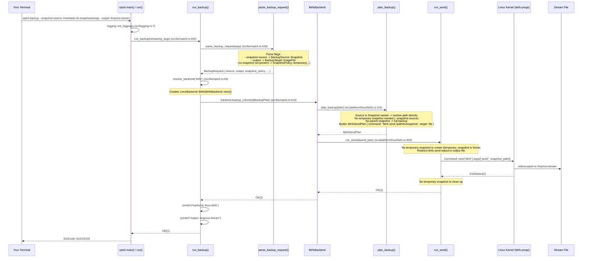
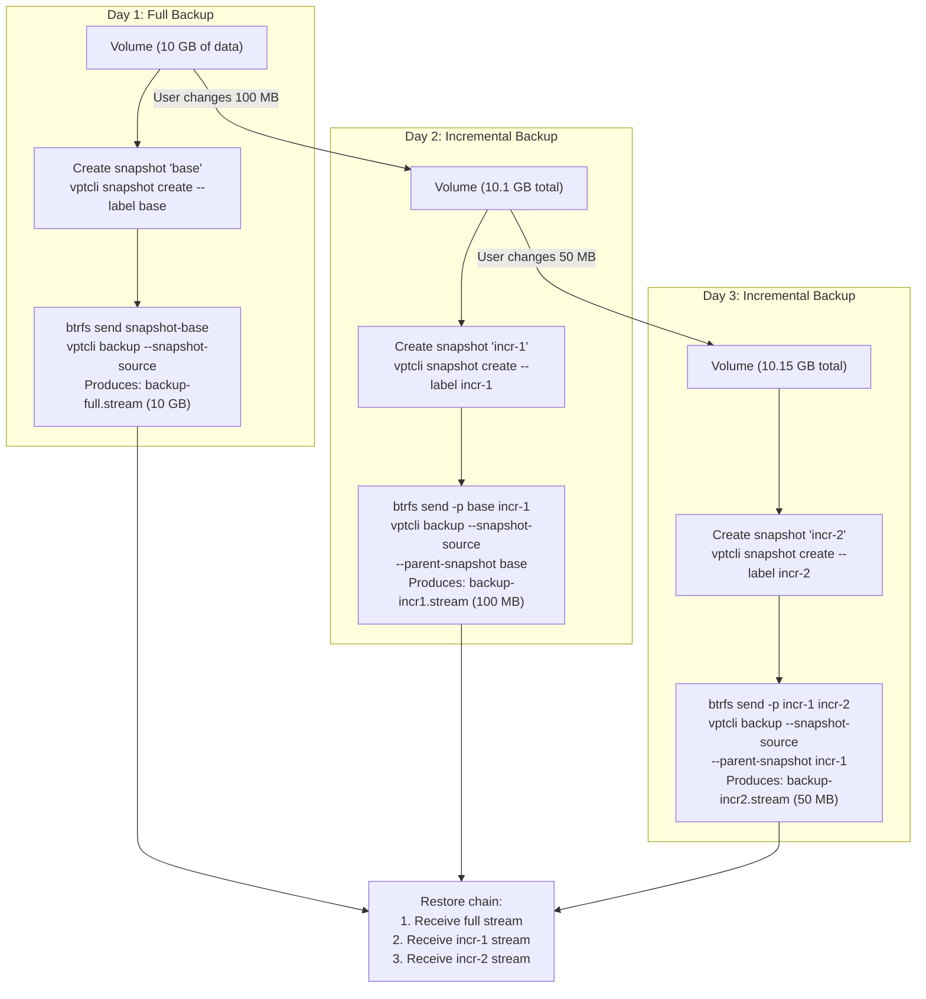
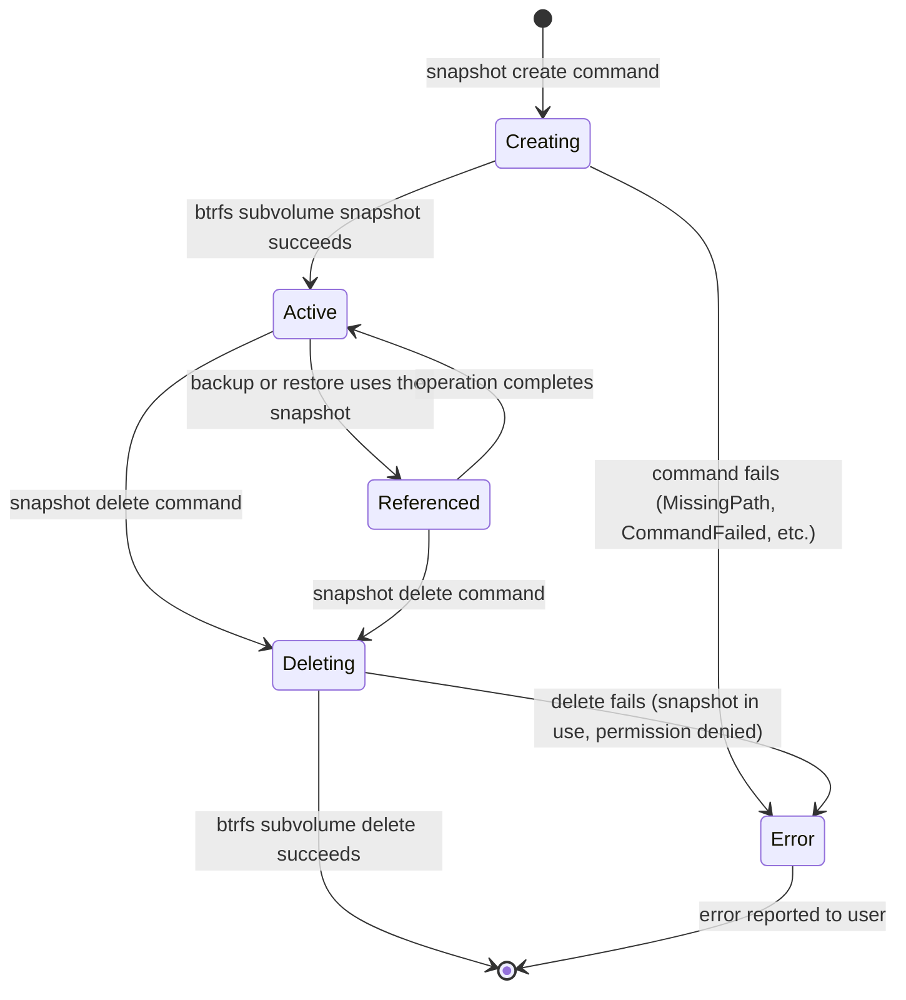

# First Backup -- A Deeper Dive

The [Quick Start](./quick-start.md) walked you through a complete backup cycle using the CLI. This guide explains **what happened at each step**, introduces snapshot policies and incremental backups, and covers error handling and cleanup patterns in depth.

Every code reference below includes the file path so you can look it up yourself.

---

## Understanding the Backup Process

When you run `vptcli backup --snapshot-source /path/to/snapshot --output /path/to/stream`, a carefully orchestrated sequence of events unfolds. Here is exactly what happens, traced through the source code:



The key insight is that vpt-rs follows a **plan-then-execute** pattern. Every operation is split into two phases:

1. **Planning**: Build a data structure describing what commands to run (e.g., `BtrfsSendPlan`, `BtrfsSnapshotPlan`). This phase does validation but does not modify anything.
2. **Execution**: Run the planned commands. This phase is where actual filesystem changes happen.

This pattern is consistent across all backends. For the Btrfs backend, the planning methods are:

| Method | What It Plans | Defined In |
|---|---|---|
| `plan_create_snapshot()` | `btrfs subvolume snapshot -r ...` | `src/platform/linux/btrfs.rs:75-93` |
| `plan_delete_snapshot()` | `btrfs subvolume delete ...` | `src/platform/linux/btrfs.rs:95-102` |
| `plan_list_snapshots()` | `btrfs subvolume list -s ...` | `src/platform/linux/btrfs.rs:104-112` |
| `plan_backup()` | `btrfs send [-p parent] snapshot` | `src/platform/linux/btrfs.rs:114-175` |
| `plan_restore()` | `btrfs receive destination` | `src/platform/linux/btrfs.rs:177-211` |

:::tip
The plan-then-execute pattern makes the code easier to test. Unit tests (see the `#[cfg(test)] mod tests` block at `src/platform/linux/btrfs.rs:518-702`) call the `plan_*` methods directly and assert on the command arguments without actually running `btrfs`. This is fast and does not require root privileges.
:::

---

## BackupSource: Volume vs Snapshot

The `BackupSource` enum (defined in `src/types.rs:234-238`) is one of the most important types in the library. It determines how the backend handles the source of a backup:

```rust title="src/types.rs:234-247"
/// Backup source can be either a live volume or an explicit snapshot.
///
/// Providers may support different combinations:
///
/// - Btrfs supports live volume backup with optional temporary snapshots.
/// - ZFS requires a snapshot source for send-based backup unless a temporary snapshot
///   policy is provided.
#[derive(Debug, Clone, PartialEq, Eq)]
pub enum BackupSource {
    Volume(VolumeRef),
    Snapshot(SnapshotRef),
}
```

When the CLI parses `--snapshot-source`, it wraps the source in `BackupSource::Snapshot`. Without that flag, it uses `BackupSource::Volume`. Here is the relevant code from `src/bin/vptcli.rs:496-513`:

```rust title="src/bin/vptcli.rs:496-513 (simplified)"
Ok(BackupRequest {
    source: if snapshot_source {
        // --snapshot-source was passed: treat the path as an existing snapshot
        let volume = source;
        let snapshot_id = volume.id.clone();
        BackupSource::Snapshot(SnapshotRef::new(snapshot_id).with_origin(volume))
    } else {
        // Default: treat the path as a live volume
        BackupSource::Volume(source)
    },
    // ...
})
```

The Btrfs backend's `plan_backup()` method (at `src/platform/linux/btrfs.rs:127-153`) uses a match expression to handle all three combinations:

```rust title="src/platform/linux/btrfs.rs:127-153 (simplified)"
let (source, temporary_snapshot) = match (&plan.source, &plan.snapshot_policy) {
    // Case 1: Explicit snapshot -- use it directly, no temp snapshot
    (BackupSource::Snapshot(snapshot), _) => {
        (self.snapshot_ref_path(snapshot)?, None)
    }

    // Case 2: Live volume, no snapshot policy -- use the volume as-is
    (BackupSource::Volume(volume), SnapshotPolicy::Disabled) => {
        let source = self.volume_path(volume)?;
        if !source.exists() {
            return Err(Error::MissingPath { path: source });
        }
        (source, None)
    }

    // Case 3: Live volume + temporary snapshot policy -- create a temp snapshot first
    (BackupSource::Volume(volume), SnapshotPolicy::Temporary { kind, label, read_only }) => {
        let request = SnapshotRequest {
            source: volume.clone(),
            kind: *kind,
            label: label.clone(),
            read_only: *read_only,
        };
        let snapshot_plan = self.plan_create_snapshot(&request)?;
        (snapshot_plan.snapshot_path.clone(), Some(snapshot_plan))
    }
};
```

This three-way match is the heart of the backup logic. Understanding it will help you choose the right CLI flags for your use case.

---

## SnapshotPolicy: Disabled vs Temporary

The `SnapshotPolicy` enum (defined in `src/types.rs:254-261`) controls whether the backend automatically creates a temporary snapshot before backing up:

```rust title="src/types.rs:254-275"
/// Policy for how a provider should obtain a snapshot for backup.
///
/// `Disabled` means the provider should use the source as-is. `Temporary` tells the
/// provider to create a temporary snapshot first when that backend supports it.
#[derive(Debug, Clone, PartialEq, Eq)]
pub enum SnapshotPolicy {
    Disabled,
    Temporary {
        kind: SnapshotKind,
        label: Option<String>,
        read_only: bool,
    },
}

impl SnapshotPolicy {
    pub const fn disabled() -> Self {
        Self::Disabled
    }

    pub fn temporary(kind: SnapshotKind, label: Option<String>, read_only: bool) -> Self {
        Self::Temporary { kind, label, read_only }
    }
}
```

### Disabled Policy

The `Disabled` policy means the backend uses whatever source you give it without creating a snapshot. Use the `--no-snapshot` CLI flag:

```bash
sudo vptcli backup --provider btrfs --no-snapshot \
    /mnt/data/subvol --output /tmp/backup.stream
```

In library code:

```rust
use vpt_rs::SnapshotPolicy;

let policy = SnapshotPolicy::disabled();
```

:::warning
With `SnapshotPolicy::Disabled` on a live volume, the backup reflects whatever state the filesystem happens to be in at the moment the `btrfs send` command starts. On Btrfs (which is copy-on-write), this is generally safe because `btrfs send` captures a consistent view. On other backends that use block-level copy (like LVM with `dd`), skipping the snapshot can produce an inconsistent backup if files are being written concurrently.
:::

### Temporary Policy

The `Temporary` policy (the **default**) tells the backend to create a temporary snapshot, use it for the backup, and then delete it automatically. This is the safest option for live volumes.

```bash
# Default: creates a temporary crash-consistent snapshot
sudo vptcli backup --provider btrfs /mnt/data/subvol --output /tmp/backup.stream
```

You can customize the snapshot kind and label:

```bash
sudo vptcli backup --provider btrfs \
    --snapshot-kind crash \
    --snapshot-label "pre-upgrade" \
    /mnt/data/subvol --output /tmp/backup.stream
```

In library code:

```rust
use vpt_rs::{SnapshotPolicy, SnapshotKind};

let policy = SnapshotPolicy::temporary(
    SnapshotKind::CrashConsistent,
    Some("pre-upgrade".to_string()),
    true, // read_only
);
```

The `SnapshotKind` enum (at `src/types.rs:109-113`) has two variants:

```rust title="src/types.rs:109-113"
pub enum SnapshotKind {
    CrashConsistent,       // filesystem-consistent, no app quiescing
    ApplicationConsistent, // coordinates with VSS writers (Windows only)
}
```

On Btrfs, only `CrashConsistent` is supported. Requesting `ApplicationConsistent` triggers a `MissingCapability` error (see the check at `src/platform/linux/btrfs.rs:213-219`).

:::tip
In production, always use `SnapshotPolicy::temporary()` (the default) unless you have a specific reason to skip the snapshot. The temporary snapshot is created, used, and deleted in a single `backup_volume()` call, so you never have to manage its lifecycle.
:::

---

## How Temporary Snapshots Are Cleaned Up

When the `Temporary` policy is active, the Btrfs backend's `run_send()` method (at `src/platform/linux/btrfs.rs:302-337`) handles the full lifecycle:

```rust title="src/platform/linux/btrfs.rs:302-337 (simplified)"
fn run_send(&self, plan: &BtrfsSendPlan) -> Result<()> {
    // Phase 1: Create the temporary snapshot (if any)
    if let Some(snapshot_plan) = &plan.temporary_snapshot {
        if let Some(parent) = snapshot_plan.snapshot_path.parent() {
            std::fs::create_dir_all(parent)?;  // ensure .vb-snapshots dir exists
        }
        self.run_command(&snapshot_plan.command)?;  // btrfs subvolume snapshot -r ...
    }

    // Phase 2: Run btrfs send, piping stdout to the output file
    let result = process::run_command(
        self.backend_name(),
        "backup_volume",
        plan.command.program,
        &plan.command.args,
        CommandIo {
            stdin_file: None,
            stdout_file: Some(plan.target.clone()),
        },
    );

    // Phase 3: Clean up the temporary snapshot (always, even if send failed)
    if let Some(snapshot_plan) = &plan.temporary_snapshot
        && let Err(cleanup_err) = self.run_command(&BtrfsCommand::new(vec![
            "subvolume".to_string(),
            "delete".to_string(),
            snapshot_plan.snapshot_path.display().to_string(),
        ]))
    {
        tracing::warn!(
            backend = self.backend_name(),
            snapshot = %snapshot_plan.snapshot_path.display(),
            error = %cleanup_err,
            "failed to clean up temporary snapshot"
        );
    }

    result.map(|_| ())
}
```

Notice the critical detail: **the cleanup always runs**, even if the `btrfs send` command fails. This prevents leaked snapshots from accumulating on your filesystem. If cleanup itself fails, a warning is logged but the original error from `btrfs send` is still propagated.

---

## Incremental Backups

After the first full backup, subsequent backups can be **incremental** -- only the differences since a parent snapshot are sent. This dramatically saves time and storage for large volumes with small changes.

Here is the incremental backup flow:



### Creating an Incremental Backup

```bash
# Step 1: Full backup (same as before)
sudo vptcli snapshot create --provider btrfs /mnt/data/subvol --label base
sudo vptcli backup --provider btrfs --snapshot-source \
    /mnt/data/.vb-snapshots/base \
    --output /tmp/backup-full.stream

# Step 2: Make some changes to the volume
echo "New data added later" | sudo tee /mnt/data/subvol/updated.txt
echo "Another change" | sudo tee /mnt/data/subvol/extra.txt

# Step 3: Create a new snapshot of the changed volume
sudo vptcli snapshot create --provider btrfs /mnt/data/subvol --label incremental-1

# Step 4: Incremental backup -- only differences since 'base'
sudo vptcli backup --provider btrfs --snapshot-source \
    /mnt/data/.vb-snapshots/incremental-1 \
    --parent-snapshot /mnt/data/.vb-snapshots/base \
    --output /tmp/backup-incr1.stream
```

The incremental stream file will be much smaller than the full backup:

```bash
ls -lh /tmp/backup-full.stream /tmp/backup-incr1.stream
# backup-full.stream   10G
# backup-incr1.stream  12K   (only the changed blocks)
```

**What happens internally?** When `--parent-snapshot` is provided, the `plan_backup()` method (at `src/platform/linux/btrfs.rs:155-164) adds the `-p` flag to the `btrfs send` command:

```rust title="src/platform/linux/btrfs.rs:155-164"
let parent = match &plan.parent_snapshot {
    Some(snapshot) => Some(self.snapshot_ref_path(snapshot)?),
    None => None,
};

let mut args = vec!["send".to_string()];
if let Some(parent) = &parent {
    args.push("-p".to_string());                    // parent flag
    args.push(parent.display().to_string());         // parent snapshot path
}
args.push(source.display().to_string());             // source snapshot path
```

This translates `--parent-snapshot /mnt/data/.vb-snapshots/base` into the command:

```
btrfs send -p /mnt/data/.vb-snapshots/base /mnt/data/.vb-snapshots/incremental-1
```

### Restoring Incremental Backups

To restore an incremental chain, restore the full backup first, then apply each incremental stream in order:

```bash
# Step 1: Restore the full backup
sudo vptcli restore --provider btrfs \
    --input /tmp/backup-full.stream \
    /mnt/restore-target

# Step 2: Apply the incremental stream
sudo vptcli restore --provider btrfs \
    --input /tmp/backup-incr1.stream \
    /mnt/restore-target
```

:::note
The Btrfs backend uses `btrfs send -p <parent> <source>` for incremental sends and `btrfs receive` for restores. The ZFS backend uses `zfs send -i <parent> <source>` and `zfs receive`. The LVM backend does not support incremental backups -- it always performs full block-level copies.
:::

---

## Snapshot Lifecycle

A snapshot goes through three phases: **create**, **use**, and **delete**. Understanding this lifecycle helps you avoid common mistakes like leaked snapshots or restoring from a deleted snapshot.



### Create

```bash
sudo vptcli snapshot create --provider btrfs /mnt/data/subvol --label nightly
```

This calls `SnapshotProvider::create_snapshot()` (implemented at `src/platform/linux/btrfs.rs:399-422`). The implementation:

1. Validates the request (checks path exists, checks snapshot kind is supported).
2. Plans the command via `plan_create_snapshot()`.
3. Creates the `.vb-snapshots` directory if it does not exist.
4. Runs `btrfs subvolume snapshot -r <source> <snapshot-path>`.
5. Returns a `SnapshotInfo` containing the handle and metadata.

### Use

Snapshots are referenced during backup operations. The `SnapshotRef` struct (at `src/types.rs:185-209`) is how plans refer to existing snapshots. It holds an `id` (the snapshot path) and an optional `origin` pointing to the source volume (see `src/bin/vptcli.rs:498-500`).

### Delete

```bash
sudo vptcli snapshot delete --provider btrfs /mnt/data/.vb-snapshots/nightly
```

This calls `SnapshotProvider::delete_snapshot()` (implemented at `src/platform/linux/btrfs.rs:424-435`), which plans and executes `btrfs subvolume delete <path>`.

:::caution
Deleting a snapshot is permanent and cannot be undone. If a backup operation is currently referencing the snapshot, the delete may fail or the backup may produce incorrect results. Always ensure no backup or restore is in progress before deleting a snapshot.
:::

---

## Error Handling

vpt-rs returns structured errors through the `Error` enum (defined in `src/error.rs:11-52`). Each variant carries enough context for the CLI to print a meaningful message and for library callers to handle errors programmatically.

```rust title="src/error.rs:11-52"
#[derive(Debug, thiserror::Error)]
pub enum Error {
    #[error("operation `{operation}` is not supported by backend `{backend}`")]
    UnsupportedOperation { operation: &'static str, backend: &'static str },

    #[error("capability `{capability}` is not available on backend `{backend}`")]
    MissingCapability { capability: &'static str, backend: &'static str },

    #[error("invalid volume reference `{volume}`")]
    InvalidVolume { volume: String },

    #[error("path does not exist: {path}")]
    MissingPath { path: PathBuf },

    #[error("io error: {0}")]
    Io(#[from] std::io::Error),

    #[error("invalid argument: {message}")]
    InvalidArgument { message: String },

    #[error("command `{command}` failed with status {status}: {stderr}")]
    CommandFailed { command: String, status: i32, stderr: String },

    #[error("operation `{operation}` on backend `{backend}` timed out after {timeout_secs}s")]
    Timeout { operation: &'static str, backend: &'static str, timeout_secs: u64 },

    #[error("{message}")]
    Message { message: String },
}
```

### Common Errors Reference

| Error Variant | Typical Cause | How to Fix | Code Location |
|---|---|---|---|
| `MissingPath` | The volume or snapshot path does not exist on disk | Check the path with `ls -la /path` | Raised at `src/platform/linux/btrfs.rs:132,191,196` |
| `InvalidVolume` | Empty string passed as a volume reference | Provide a non-empty path | Raised at `src/platform/linux/btrfs.rs:231` |
| `InvalidArgument` | Bad CLI flag, empty block size, or relative path | Run `vptcli <command> --help` | Raised at `src/bin/vptcli.rs:44,98,113` |
| `CommandFailed` | The underlying tool (`btrfs`, `lvs`, `zfs`) returned non-zero | Read the `stderr` field; check if the tool is installed | Raised at `src/process.rs:103-110` |
| `MissingCapability` | Requested an unsupported feature (e.g. app-consistent on Btrfs) | Check capabilities with `vptcli snapshot capabilities --provider <name>` | Raised at `src/platform/linux/btrfs.rs:215-218` |
| `UnsupportedOperation` | Operation not implemented for this backend | Use a different backend | Raised at `src/platform/mod.rs:84-86` |
| `Timeout` | External command exceeded the time limit | Increase timeout with `VPT_COMMAND_TIMEOUT_SECS` | Raised at `src/process.rs:69-76` |

### Example: Missing Path

```bash
sudo vptcli backup --provider btrfs /nonexistent --output /tmp/out.stream
# stderr: error: path does not exist: /nonexistent
# exit code: 1
```

The CLI prints the error to stderr and exits with code 1. If logging is enabled, the error is also logged with structured fields (see `src/bin/vptcli.rs:21-24`).

### Example: Timeout on a Large Volume

```bash
sudo vptcli backup --provider btrfs /mnt/huge-volume --output /tmp/backup.stream
# After 30 seconds:
# error: operation `backup_volume` on backend `linux-btrfs` timed out after 30s
```

Fix by increasing the timeout:

```bash
VPT_COMMAND_TIMEOUT_SECS=600 sudo vptcli backup --provider btrfs \
    /mnt/huge-volume --output /tmp/backup.stream
```

### Logging for Debugging

When something unexpected happens, enable debug logging to see every external command:

```bash
RUST_LOG=vpt_rs=debug sudo vptcli backup --provider btrfs \
    /mnt/data/subvol --output /tmp/out.stream 2>&1 | head -50
```

At the `debug` level, you will see the exact sequence of external commands: create temp snapshot, send it, delete it. Each log line includes the backend name, operation, command, and exit status.

---

## Cleanup Patterns

After backup operations, you should delete snapshots you no longer need. Temporary snapshots are cleaned up automatically by the backend (see the `run_send()` method), but labeled snapshots created with `vptcli snapshot create` persist until you delete them.

### Manual Cleanup

```bash
# List all snapshots on a volume
sudo vptcli snapshot list --provider btrfs /mnt/data/subvol

# Delete each one
sudo vptcli snapshot delete --provider btrfs /mnt/data/.vb-snapshots/base
sudo vptcli snapshot delete --provider btrfs /mnt/data/.vb-snapshots/incremental-1
```

### Automated Cleanup with Bash `trap`

In production backup scripts, use a `trap` to ensure snapshots are cleaned up even if the script fails:

```bash
#!/bin/bash
set -euo pipefail

VOLUME="/mnt/data/subvol"
SNAP_LABEL="backup-$(date +%Y%m%d-%H%M%S)"
BACKUP_DIR="/backups"

# Create the snapshot
sudo vptcli snapshot create --provider btrfs "$VOLUME" --label "$SNAP_LABEL"

# Register cleanup: delete the snapshot when the script exits (success or failure)
trap 'sudo vptcli snapshot delete --provider btrfs "/mnt/data/.vb-snapshots/$SNAP_LABEL"' EXIT

# Run the backup
sudo vptcli backup --provider btrfs --snapshot-source \
    "/mnt/data/.vb-snapshots/$SNAP_LABEL" \
    --output "$BACKUP_DIR/$(date +%F).stream"

echo "Backup complete. Snapshot will be cleaned up automatically."
# The EXIT trap fires here, deleting the snapshot
```

:::tip
The `trap '...' EXIT` pattern is idiomatic Bash for cleanup. It ensures the snapshot is deleted whether the backup succeeds, fails, or the script is interrupted with Ctrl+C. This prevents stale snapshots from accumulating over time.
:::

### Incremental Backup Cleanup

For incremental backup chains, you need to keep the parent snapshot alive until all incremental backups based on it are complete. A simple pattern is to store the latest snapshot label in a file and read it back on the next run. Pass `--parent-snapshot` with the previous label to create incremental streams, then delete the old parent after the new backup succeeds.

---

## Summary

| Concept | What It Means |
|---|---|
| **Plan-then-execute** | Every operation first builds a plan struct, then executes it |
| **BackupSource** | `Volume` (live) or `Snapshot` (existing) |
| **SnapshotPolicy** | `Disabled` (use as-is) or `Temporary` (auto-create and delete) |
| **SnapshotKind** | `CrashConsistent` or `ApplicationConsistent` |
| **Incremental backup** | Only sends differences since a parent snapshot |
| **Stream file** | Binary output of `btrfs send` / `zfs send` |
| **Error enum** | Structured errors with context fields (`src/error.rs:11-52`) |
| **Cleanup trap** | Bash `trap` to delete snapshots on script exit |

---

## Next Steps

- [CLI Reference](../cli/overview.md) -- Full documentation of every `vptcli` command and flag.
- [Library API](../api/backend.md) -- Use vpt-rs as a Rust library in your own applications.
- [Provider Guides](../providers/btrfs.md) -- Platform-specific details for Btrfs, LVM, ZFS, and VSS.
