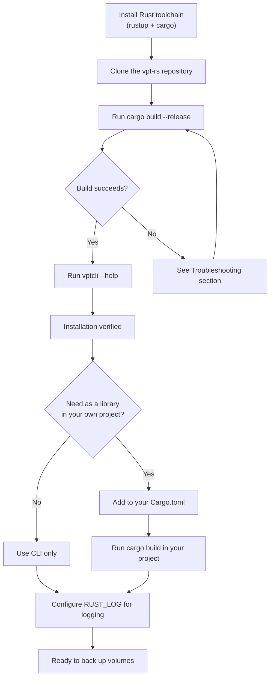
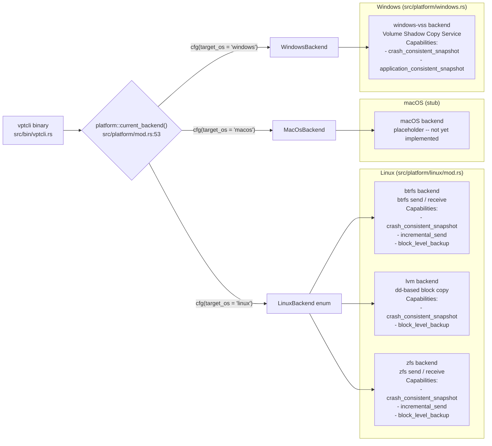

# Installation

This guide walks you through installing **vpt-rs** and its command-line tool `vptcli`. By the end you will have a working binary ready to create snapshots and run backups.

If you have never used Rust before, do not worry -- this guide explains every command and concept along the way.

## What Is vpt-rs?

vpt-rs is a volume backup toolkit written in Rust. It provides a single, unified interface for creating filesystem snapshots, backing up volumes to portable stream files, and restoring them -- all regardless of whether your system uses Btrfs, LVM, ZFS, or Windows VSS under the hood. The project ships as two things at once: a command-line tool called `vptcli` that you run from your terminal, and a library that other Rust programs can import to perform backup operations programmatically. The CLI binary is defined in `src/bin/vptcli.rs`, while the public library surface is exported from `src/lib.rs:32-36`.

---

## How Installation Works

Before diving into commands, here is the high-level flow you will follow:



## Platform Support

vpt-rs compiles on Linux, macOS, and Windows. Each platform has a different native storage backend selected automatically at runtime. On Linux, all three backends are compiled in and you choose which one to use with the `--provider` flag. The platform dispatch logic lives in `src/platform/mod.rs:14-26`.



---

## Prerequisites

### Rust Toolchain

vpt-rs is written in Rust. You need a working Rust installation. The project's `Cargo.toml` (line 4) specifies `edition = "2024"`, which requires Rust **1.82 or newer**.

If you have never installed Rust, it is a single command. The `rustup` tool manages your Rust compiler (`rustc`) and build tool (`cargo`) together:

```bash
# Install rustup if you do not have it yet
# This downloads a shell script and runs it -- it will ask you questions;
# pressing Enter for the defaults is fine.
curl --proto '=https' --tlsv1.2 -sSf https://sh.rustup.rs | sh
```

After the installer finishes, load the Rust tools into your current shell session:

```bash
source "$HOME/.cargo/env"
```

Now verify both tools are available:

```bash
rustc --version
# Expected output looks like: rustc 1.82.0 (f6e511eec 2024-10-15)

cargo --version
# Expected output looks like: cargo 1.82.0 (8f40fc59f 2024-08-21)
```

:::tip
`rustc` is the Rust compiler. `cargo` is the build tool and package manager -- think of it like `npm` for JavaScript or `pip` for Python. Almost everything you do in Rust goes through `cargo`.
:::

### System Packages by Platform

vpt-rs delegates snapshot and backup operations to the native storage tools on your platform. It does this by spawning external processes -- for example, the Btrfs backend in `src/platform/linux/btrfs.rs:26` defines `const BTRFS_BIN: &str = "btrfs";` and executes it as a subprocess. If the tool is not installed, the backend will fail at runtime with a `CommandFailed` error.

| OS | Provider | Required Packages | Install Command |
|---|---|---|---|
| Linux | **Btrfs** (default) | `btrfs-progs` | Debian/Ubuntu: `sudo apt install btrfs-progs`<br/>Arch: `sudo pacman -S btrfs-progs`<br/>Fedora: `sudo dnf install btrfs-progs` |
| Linux | **LVM** | `lvm2` | Debian/Ubuntu: `sudo apt install lvm2`<br/>Arch: `sudo pacman -S lvm2` |
| Linux | **ZFS** | `zfsutils-linux` | Debian/Ubuntu: `sudo apt install zfsutils-linux`<br/>Arch: `sudo pacman -S zfs-utils` |
| Windows | **VSS** | Windows SDK headers | Install Visual Studio Build Tools with "Desktop development with C++" workload |
| macOS | (stub) | none | No packages needed -- the macOS backend is a placeholder |

:::caution
You only need the package for the provider you plan to use. If you only plan to use Btrfs on Linux, you only need `btrfs-progs`. However, all three Linux backends are compiled into the binary unconditionally (see `src/platform/linux/mod.rs:17-19` where `BtrfsBackend`, `LvmBackend`, and `ZfsBackend` are all imported).
:::

---

## Install from Source (Recommended)

### Step 1: Clone the Repository

```bash
git clone https://github.com/xuranus/vpt-rs.git
cd vpt-rs
```

This creates a directory containing the project source. The most important files are:

| File | What It Contains |
|---|---|
| `Cargo.toml` | Project metadata, dependencies, and feature flags |
| `src/lib.rs` | Public API -- the types and traits you can import |
| `src/bin/vptcli.rs` | The CLI binary entry point |
| `src/types.rs` | Core data structures (`VolumeRef`, `BackupPlan`, etc.) |
| `src/error.rs` | The `Error` enum with all error variants |

### Step 2: Install via cargo install

The simplest way to get the `vptcli` binary on your `PATH` is `cargo install`. This compiles the project and copies the binary into `~/.cargo/bin/`:

```bash
cd vpt-rs
cargo install --path .
```

This may take a minute or two the first time because Cargo downloads and compiles the dependencies listed in `Cargo.toml`:

```toml title="Cargo.toml:16-19 (dependencies)"
[dependencies]
thiserror = "2"          # derive macro for error types
tracing = "0.1"          # structured logging framework
tracing-subscriber = { version = "0.3", features = ["env-filter", "fmt"] }
windows = { version = "0.62", optional = true }  # only used with windows-vss feature
```

After installation, verify the binary is on your `PATH`:

```bash
which vptcli
# Expected: /home/<your-username>/.cargo/bin/vptcli
```

:::note
`cargo install --path .` reads the `[[bin]]` target from `Cargo.toml` implicitly. The binary entry point is `src/bin/vptcli.rs` (Cargo auto-discovers files in `src/bin/`). The `main()` function at `src/bin/vptcli.rs:15-26` initializes logging and dispatches to the `run()` function.
:::

---

## Build Manually

If you prefer not to install globally, build a release binary directly:

```bash
cd vpt-rs
cargo build --release
```

The binary is produced at:

```
target/release/vptcli
```

You can run it with its full path or copy it somewhere on your `PATH`:

```bash
# Option A: run directly with the full path
./target/release/vptcli --help

# Option B: copy to a local bin directory
mkdir -p ~/.local/bin
cp target/release/vptcli ~/.local/bin/
# Make sure ~/.local/bin is on your PATH:
export PATH="$HOME/.local/bin:$PATH"
```

:::tip
`cargo build` (without `--release`) produces a **debug** binary at `target/debug/vptcli`. Debug builds compile faster but run slower. Use debug builds during development and release builds for actual backups.
:::

---

## Verify the Installation

Run the built-in help command to confirm everything works:

```bash
vptcli --help
```

Expected output:

```
vptcli <command> [args]

Commands:
  snapshot    Create, list, delete snapshots; query backends and capabilities
  backup      Back up a volume to a stream or image file
  restore     Restore a volume from a stream or image file

Run `vptcli <command>` with no args for subcommand usage.
```

You can also check what backends are available on your system:

```bash
vptcli snapshot backend
```

On a Linux system this shows the default (Btrfs) backend:

```
platform: linux
backend: linux-btrfs
```

To list **all** compiled-in backends:

```bash
vptcli snapshot backend list
```

Expected output on Linux:

```
platform: linux
provider: btrfs
backend: linux-btrfs

platform: linux
provider: lvm
backend: linux-lvm

platform: linux
provider: zfs
backend: linux-zfs
```

:::note
The backend list is determined at compile time by the `LinuxBackend::available()` function in `src/platform/linux/mod.rs:53-58`. On Linux, all three backends are always compiled in. On other platforms, only the native backend is listed.
:::

---

## Enable Windows VSS Feature (Windows Only)

On Windows, the Volume Shadow Copy Service (VSS) backend requires enabling the `windows-vss` Cargo feature. This pulls in the `windows` crate (version 0.62, see `Cargo.toml:19`) and links against the Win32 VSS COM interfaces.

Build with the feature flag:

```bash
cargo build --release --features windows-vss
```

Or, if using vpt-rs as a library dependency in your own project, enable it in your `Cargo.toml`:

```toml
[dependencies]
vpt-rs = { version = "0.1.0", features = ["windows-vss"] }
```

The feature flag activates three Win32 API groups (see `Cargo.toml:8-13`):

```toml title="Cargo.toml:8-13"
[features]
windows-vss = [
    "dep:windows",
    "windows/Win32_Foundation",
    "windows/Win32_Security",
    "windows/Win32_System_Com",
]
```

:::warning
The `windows-vss` feature requires the Windows SDK headers. Make sure Visual Studio Build Tools with the "Desktop development with C++" workload is installed before building. Without it, the build will fail with missing header errors.
:::

---

## Configure Logging

vpt-rs uses the [`tracing`](https://docs.rs/tracing) crate for structured logging. The logging system is initialized once at startup in `src/logging.rs:7-19` using `tracing-subscriber` with an environment filter.

The `init_logging()` function in `src/logging.rs` does the following (simplified):

```rust title="src/logging.rs:7-19 (simplified)"
pub fn init_logging() {
    // Read RUST_LOG from the environment; fall back to "vpt_rs=info"
    let filter = EnvFilter::try_from_default_env()
        .or_else(|_| EnvFilter::try_new("vpt_rs=info"))
        .expect("default log filter must be valid");

    tracing_subscriber::fmt()
        .with_env_filter(filter)    // apply the filter
        .with_target(false)         // hide the module path
        .with_thread_ids(true)      // show thread IDs
        .compact()                  // compact output format
        .init();
}
```

Set the `RUST_LOG` environment variable to control log verbosity:

```bash
# Show only info-level messages from vpt-rs (this is the default)
RUST_LOG=vpt_rs=info vptcli snapshot backend

# Show debug-level messages -- includes every external command vpt-rs runs
RUST_LOG=vpt_rs=debug vptcli snapshot list /mnt/data

# Show everything including trace-level details
RUST_LOG=vpt_rs=trace vptcli backup /mnt/data --output /tmp/backup.stream

# Silence all logging
RUST_LOG=off vptcli --help
```

The available log levels, from most to least verbose, are: `trace`, `debug`, `info`, `warn`, `error`. The `info` level (the default) shows major operations. The `debug` level shows the exact commands being executed (e.g. `btrfs subvolume snapshot -r ...`). The `trace` level is very verbose and intended for developers debugging the library itself.

:::tip
When troubleshooting a failed backup, set `RUST_LOG=vpt_rs=debug` to see the exact external commands (like `btrfs send` or `btrfs receive`) that vpt-rs spawns, along with their exit codes and stderr output.
:::

---

## Add as a Library Dependency

If you want to use vpt-rs as a library in your own Rust project instead of (or in addition to) the CLI, add it to your project's `Cargo.toml`.

Since vpt-rs is not published on crates.io yet, use a path or git dependency:

```toml
# In your project's Cargo.toml -- path dependency (local development)
[dependencies]
vpt-rs = { path = "/path/to/vpt-rs" }
```

Or for a git dependency:

```toml
[dependencies]
vpt-rs = { git = "https://github.com/xuranus/vpt-rs.git" }
```

Once added, you can import and use the library API. The public types and traits are re-exported from `src/lib.rs:32-36`:

```rust
use vpt_rs::{
    BackupPlan, BackupSource, BackupTarget,
    RestorePlan, SnapshotKind, SnapshotPolicy,
    SnapshotProvider, SnapshotRef, SnapshotRequest,
    VolumeRef, Error, Result,
};
```

Here is a minimal example that lists snapshots on a Btrfs subvolume:

```rust title="Using vpt-rs as a library"
use vpt_rs::platform;
use vpt_rs::{Backend, SnapshotProvider, VolumeRef};

fn main() -> vpt_rs::Result<()> {
    // Get the default backend for the current platform
    let backend = platform::current_backend();
    println!("Using backend: {}", backend.backend_name());

    // List all snapshots for a subvolume
    let snapshots = backend.list_snapshots(&VolumeRef::new("/mnt/data"))?;
    for snap in snapshots {
        println!("  {} [{}]", snap.handle.id, snap.backend);
    }
    Ok(())
}
```

The main library types and where they are defined:

| Type | Purpose | Defined In |
|---|---|---|
| `VolumeRef` | Identifies a volume by path or name (`src/types.rs:40-43`) | `src/types.rs:40` |
| `BackupPlan` | Describes a full backup operation | `src/types.rs:303-310` |
| `RestorePlan` | Describes a full restore operation | `src/types.rs:319-326` |
| `SnapshotRequest` | Parameters for creating a snapshot | `src/types.rs:160-166` |
| `SnapshotHandle` | A handle to a created snapshot | `src/types.rs:175-179` |
| `SnapshotPolicy` | Whether to auto-create a temporary snapshot | `src/types.rs:254-261` |
| `BackupSource` | Either `Volume(VolumeRef)` or `Snapshot(SnapshotRef)` | `src/types.rs:234-238` |
| `BackupTarget` | Either `ImageFile(PathBuf)` or `Device(PathBuf)` | `src/types.rs:222-225` |
| `Error` | All error variants | `src/error.rs:11-52` |
| `Backend` | Trait: `backend_name()` and `capabilities()` | `src/backend.rs:20-31` |
| `SnapshotProvider` | Trait: `create_snapshot`, `delete_snapshot`, `list_snapshots` | `src/snapshot.rs:20-31` |
| `BackupExecutor` | Trait: `backup_volume` | `src/backup.rs:19-22` |
| `RestorePlanner` | Trait: `restore_volume` | `src/restore.rs:19-22` |

:::note
When using vpt-rs as a library on Windows, the `windows-vss` feature must be enabled explicitly in your `Cargo.toml`:

```toml
[dependencies]
vpt-rs = { path = "/path/to/vpt-rs", features = ["windows-vss"] }
```
:::

---

## Project Structure at a Glance

Understanding the source layout helps when navigating the codebase or filing issues:

```
vpt-rs/
  Cargo.toml                  Project manifest (edition 2024, features, deps)
  src/
    lib.rs                    Public API re-exports (lines 32-36)
    bin/
      vptcli.rs               CLI binary entry point (main at line 15)
    types.rs                  Core types: VolumeRef, BackupPlan, SnapshotPolicy, etc.
    error.rs                  Error enum with structured context
    logging.rs                Tracing/logging initialization
    backend.rs                Backend supertrait (name + capabilities)
    snapshot.rs               SnapshotProvider trait (create/delete/list)
    backup.rs                 BackupExecutor trait (backup_volume)
    restore.rs                RestorePlanner trait (restore_volume)
    mount.rs                  MountManager trait (mount/unmount snapshots)
    process.rs                External command runner with timeout
    copy.rs                   Block-level copy utilities
    platform/
      mod.rs                  Platform dispatch + CurrentBackend type alias
      linux/
        mod.rs                LinuxBackend enum (Btrfs | Lvm | Zfs)
        btrfs.rs              Btrfs backend implementation
        lvm.rs                LVM backend implementation
        zfs.rs                ZFS backend implementation
      windows.rs              Windows VSS backend
      macos.rs                macOS stub backend
      unix.rs                 Generic Unix stub backend
```

---

## Troubleshooting

### `btrfs: command not found`

The Btrfs backend shells out to the `btrfs` CLI tool, defined as the constant `BTRFS_BIN` in `src/platform/linux/btrfs.rs:26`. Install it with your package manager:

```bash
# Debian/Ubuntu
sudo apt install btrfs-progs

# Arch Linux
sudo pacman -S btrfs-progs

# Fedora
sudo dnf install btrfs-progs
```

### `unknown linux snapshot provider 'xyz'`

The `LinuxBackend::named` function in `src/platform/linux/mod.rs:42-50` only accepts three provider names: `btrfs`, `lvm`, and `zfs`. Double-check your `--provider` flag:

```bash
# Correct
vptcli snapshot capabilities --provider btrfs
vptcli snapshot capabilities --provider lvm
vptcli snapshot capabilities --provider zfs

# Wrong -- will produce an error
vptcli snapshot capabilities --provider ext4
```

### Build fails with "edition 2024" error

Your Rust toolchain is too old. The project requires `edition = "2024"` (see `Cargo.toml:4`), which needs Rust 1.82 or newer. Update with:

```bash
rustup update stable
rustc --version
```

### `linker not found` or `cc` not found during build

Rust needs a C linker to produce the final binary. Install the basic C toolchain:

```bash
# Debian/Ubuntu
sudo apt install build-essential

# Arch Linux
sudo pacman -S base-devel

# Fedora
sudo dnf groupinstall "Development Tools"
```

### `vptcli: command not found` after `cargo install`

Make sure `~/.cargo/bin` is on your `PATH`. Add this to your shell profile (`~/.bashrc`, `~/.zshrc`, etc.):

```bash
export PATH="$HOME/.cargo/bin:$PATH"
```

Then reload your shell or run `source ~/.bashrc`.

### Command times out after 30 seconds

The default command timeout is 30 seconds, defined in `src/process.rs:13`:

```rust title="src/process.rs:13"
const DEFAULT_TIMEOUT_SECS: u64 = 30;
```

For large volumes that take longer, override this with the `VPT_COMMAND_TIMEOUT_SECS` environment variable (parsed in `src/process.rs:145-152`):

```bash
VPT_COMMAND_TIMEOUT_SECS=600 vptcli backup /mnt/large-vol --output /tmp/backup.stream
```

### `invalid volume reference ''`

The `VolumeRef` struct (defined in `src/types.rs:40-43`) requires a non-empty string. For Btrfs specifically, it must be an **absolute path** -- the check is in `src/platform/linux/btrfs.rs:229-246`:

```rust title="src/platform/linux/btrfs.rs:237-244"
let path = PathBuf::from(&source.id);
if !path.is_absolute() {
    return Err(Error::InvalidArgument {
        message: format!(
            "btrfs provider expects an absolute subvolume path, got `{}`",
            source.id
        ),
    });
}
```

```bash
# Wrong -- relative path
vptcli snapshot create data

# Correct -- absolute path
vptcli snapshot create /mnt/data/subvol
```

### Permission denied

Most storage operations require root privileges because they interact with kernel-level filesystem features. Run with `sudo`:

```bash
sudo vptcli snapshot create /mnt/data/subvol
```

---

## Next Steps

Once installation is verified, proceed to the [Quick Start](./quick-start.md) guide to create your first backup in under five minutes.
