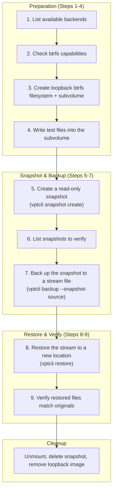
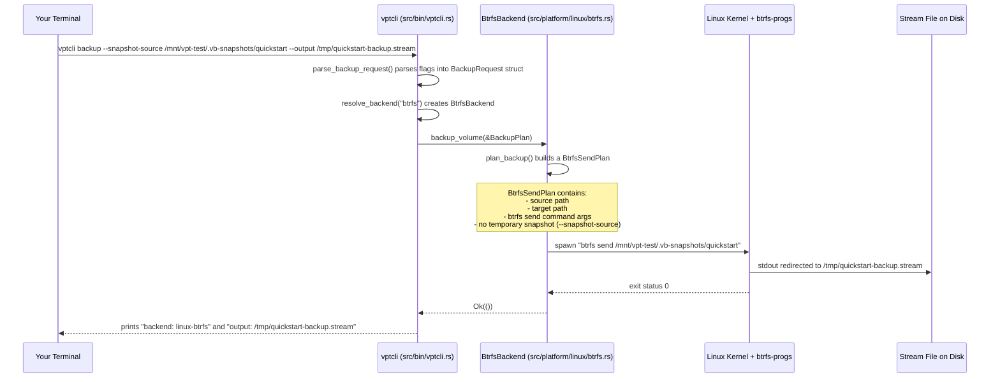

# Quick Start

This tutorial walks you through a complete backup-and-restore cycle in nine steps. By the end you will have created a snapshot, backed it up to a stream file, restored it to a new location, and verified the data -- all from the command line.

If you are new to Rust, do not worry: every concept is explained as we encounter it.

:::tip
This guide uses the **btrfs** provider on Linux. If you are using LVM or ZFS, substitute `--provider lvm` or `--provider zfs` where shown. The workflow is the same -- only the underlying commands change.
:::

---

## Overview: What We Will Do

The following diagram shows the entire backup-and-restore cycle you are about to perform. Each numbered step in this guide corresponds to a step in the diagram.



And here is how the data flows through the system during a backup operation. Each arrow represents a function call or data transfer:



---

## Step 1 -- Check Available Backends

List every backend that vpt-rs knows about on your system. This calls `platform::available_backend_descriptors()` (defined in `src/platform/mod.rs:73-82`), which on Linux returns all three registered backends.

```bash
vptcli snapshot backend list
```

Expected output on Linux:

```
platform: linux
provider: btrfs
backend: linux-btrfs

platform: linux
provider: lvm
backend: linux-lvm

platform: linux
provider: zfs
backend: linux-zfs
```

The `snapshot` subcommand is handled by `run_snapshot()` in `src/bin/vptcli.rs:137-198`. When you pass `backend list`, it iterates over `platform::available_backend_descriptors()` and prints each one via the `print_descriptor()` helper at `src/bin/vptcli.rs:369-375`.

:::note
On non-Linux platforms only one backend is listed -- the native one for your OS. On macOS you will see a stub backend, and on Windows you will see the VSS backend (if built with `--features windows-vss`).
:::

## Step 2 -- Check Backend Capabilities

Each backend reports what it can do through the `Backend` trait (defined in `src/backend.rs:20-31`). The `capabilities()` method returns a static slice of `Capability` enum variants.

Inspect what the btrfs backend can do:

```bash
vptcli snapshot capabilities --provider btrfs
```

```
linux-btrfs
- crash_consistent_snapshot
- block_level_backup
- block_level_restore
- incremental_send
```

These four capabilities are defined in `src/platform/linux/btrfs.rs:19-24`:

```rust title="src/platform/linux/btrfs.rs:19-24"
const CAPABILITIES: &[Capability] = &[
    Capability::CrashConsistentSnapshot,
    Capability::BlockLevelBackup,
    Capability::BlockLevelRestore,
    Capability::IncrementalSend,
];
```

The `Capability` enum itself is in `src/types.rs:69-79`. Here is what each one means:

| Capability | Meaning |
|---|---|
| `crash_consistent_snapshot` | Can create snapshots equivalent to pulling the power plug -- filesystem-consistent but no application quiescing |
| `block_level_backup` | Can back up volumes at the block level (not just files) |
| `block_level_restore` | Can restore volumes at the block level |
| `incremental_send` | Can send only the differences between two snapshots (used for incremental backups) |

:::note
The Btrfs backend does **not** support `application_consistent_snapshot`. If you request an application-consistent snapshot, the backend returns a `MissingCapability` error (see the validation at `src/platform/linux/btrfs.rs:213-219`). Application-consistent snapshots are only available on Windows with VSS.
:::

## Step 3 -- Create a Test Volume

You need a real btrfs filesystem to experiment with. We will create a loopback-backed btrfs filesystem -- a regular file that pretends to be a disk. This is safe to create and delete without affecting your real data.

```bash
# Step 3a: Create a 1 GB sparse file
# "Sparse" means the file does not actually use 1 GB of disk space until you write to it.
truncate -s 1G /tmp/vpt-test.img

# Step 3b: Format it as a btrfs filesystem
# -f forces overwrite (the file is empty, so this is safe)
sudo mkfs.btrfs -f /tmp/vpt-test.img

# Step 3c: Create a mount point
sudo mkdir -p /mnt/vpt-test

# Step 3d: Mount the filesystem
sudo mount /tmp/vpt-test.img /mnt/vpt-test

# Step 3e: Create a subvolume inside the filesystem
# Btrfs snapshots work on subvolumes, not on entire filesystems.
sudo btrfs subvolume create /mnt/vpt-test/data
```

The last command should print:

```
Create subvolume '/mnt/vpt-test/data'
```

:::caution
These commands require root privileges (`sudo`). The `mount` and `btrfs` commands interact with kernel-level filesystem code and cannot be run as an unprivileged user.
:::

:::tip
A **subvolume** in Btrfs is like a directory that can be independently snapshotted. Think of it as a lightweight partition inside the filesystem. When we later run `vptcli snapshot create /mnt/vpt-test/data`, vpt-rs will create a read-only copy of this subvolume at a specific point in time.
:::

## Step 4 -- Write Test Data

Populate the subvolume with some sample files so we have something to verify after restore:

```bash
# Create some files in the subvolume
echo "Hello from vpt-rs!" | sudo tee /mnt/vpt-test/data/greeting.txt
echo "This file will survive backup and restore." | sudo tee /mnt/vpt-test/data/note.txt
sudo mkdir /mnt/vpt-test/data/docs
echo "Documentation content" | sudo tee /mnt/vpt-test/data/docs/readme.txt
```

Verify the data is there:

```bash
sudo ls -la /mnt/vpt-test/data/
```

You should see:

```
total 4
drwxr-xr-x 1 root root  0 Jan  1 00:00 .
drwxr-xr-x 1 root root  8 Jan  1 00:00 ..
drwxr-xr-x 1 root root  0 Jan  1 00:00 docs
-rw-r--r-- 1 root root 19 Jan  1 00:00 greeting.txt
-rw-r--r-- 1 root root 41 Jan  1 00:00 note.txt
```

Read back a file to confirm:

```bash
cat /mnt/vpt-test/data/greeting.txt
# Output: Hello from vpt-rs!
```

## Step 5 -- Create a Snapshot

Now use `vptcli` to create a read-only snapshot of the subvolume:

```bash
sudo vptcli snapshot create --provider btrfs /mnt/vpt-test/data --label quickstart
```

Expected output:

```
snapshot: /mnt/vpt-test/.vb-snapshots/quickstart
source: /mnt/vpt-test/data
backend: linux-btrfs
path: /mnt/vpt-test/.vb-snapshots/quickstart
```

**What just happened internally?** The CLI called `run_snapshot("create", ...)` at `src/bin/vptcli.rs:137`, which parsed the arguments into a `SnapshotRequest` struct (defined in `src/types.rs:160-166`):

```rust title="The SnapshotRequest created by the CLI"
SnapshotRequest {
    source: VolumeRef { id: "/mnt/vpt-test/data" },
    kind: SnapshotKind::CrashConsistent,  // default
    label: Some("quickstart"),
    read_only: true,                       // default
}
```

The `VolumeRef` struct (at `src/types.rs:40-43`) is simply a wrapper around a string:

```rust title="src/types.rs:40-48"
#[derive(Debug, Clone, PartialEq, Eq, Hash)]
pub struct VolumeRef {
    pub id: String,
}

impl VolumeRef {
    pub fn new(id: impl Into<String>) -> Self {
        Self { id: id.into() }
    }
}
```

The Btrfs backend's `plan_create_snapshot` method (at `src/platform/linux/btrfs.rs:75-93`) translated this request into the following shell command:

```
btrfs subvolume snapshot -r /mnt/vpt-test/data /mnt/vpt-test/.vb-snapshots/quickstart
```

The `-r` flag makes the snapshot read-only. The snapshot path is derived by `derive_snapshot_path()` at `src/platform/linux/btrfs.rs:249-259`: it places the snapshot in a `.vb-snapshots` directory next to the source, using the sanitized label as the name.

The label sanitization function at `src/types.rs:7-21` replaces any character outside `[a-zA-Z0-9\-_.+:]` with a hyphen:

```rust title="src/types.rs:7-21"
pub fn sanitize_snapshot_label(label: &str) -> String {
    let sanitized: String = label
        .chars()
        .map(|ch| match ch {
            'a'..='z' | 'A'..='Z' | '0'..='9' | '-' | '_' | '.' | '+' | ':' => ch,
            _ => '-',
        })
        .collect();

    if sanitized.trim_matches('-').is_empty() {
        "snapshot".to_string()
    } else {
        sanitized
    }
}
```

So the label `"quickstart"` passes through unchanged, but something like `"my backup!"` would become `"my-backup-"`.

:::tip
The snapshot is read-only by default (`read_only: true`). This is intentional -- read-only snapshots cannot be accidentally modified, which makes them safe to use as backup sources. You can override this with the `--read-write` flag, but this is rarely needed.
:::

## Step 6 -- List Snapshots

Confirm the snapshot was created by listing all snapshots for the subvolume:

```bash
sudo vptcli snapshot list --provider btrfs /mnt/vpt-test/data
```

```
/mnt/vpt-test/.vb-snapshots/quickstart /mnt/vpt-test/data linux-btrfs
```

The output format is `<snapshot-id> <source-id> <backend-name>`. This comes from the `snapshot_list` function at `src/bin/vptcli.rs:200-241`, which calls `backend.list_snapshots()` and formats each `SnapshotInfo`.

Under the hood, the Btrfs backend runs:

```
btrfs subvolume list -s /mnt/vpt-test/data
```

The `-s` flag tells `btrfs` to show only snapshots (not regular subvolumes). The output is parsed by `parse_list_output()` at `src/platform/linux/btrfs.rs:353-385`.

:::note
If you have multiple snapshots, each one appears on its own line. The listing is ordered by Btrfs internal generation number, not creation time.
:::

## Step 7 -- Back Up to a Stream File

Create a backup stream from the snapshot you just created:

```bash
sudo vptcli backup --provider btrfs --snapshot-source \
    /mnt/vpt-test/.vb-snapshots/quickstart \
    --output /tmp/quickstart-backup.stream
```

```
backend: linux-btrfs
output: /tmp/quickstart-backup.stream
```

**What happened internally?** The CLI called `parse_backup_request()` at `src/bin/vptcli.rs:429-513`, which built a `BackupRequest` with `snapshot_source: true`. This caused the source to be wrapped in `BackupSource::Snapshot(SnapshotRef { ... })` instead of `BackupSource::Volume(VolumeRef { ... })`.

The `BackupPlan` struct (defined at `src/types.rs:303-310`) that was passed to the backend looked like this:

```rust title="The BackupPlan created by the CLI"
BackupPlan {
    source: BackupSource::Snapshot(SnapshotRef {
        id: "/mnt/vpt-test/.vb-snapshots/quickstart",
        origin: Some(VolumeRef { id: "/mnt/vpt-test/.vb-snapshots/quickstart" }),
    }),
    target: BackupTarget::ImageFile(PathBuf::from("/tmp/quickstart-backup.stream")),
    snapshot_policy: SnapshotPolicy::temporary(
        SnapshotKind::CrashConsistent,
        None,
        true,
    ),
    parent_snapshot: None,  // no parent = full backup
    block_size: None,       // use default
}
```

The Btrfs backend's `plan_backup()` method (at `src/platform/linux/btrfs.rs:114-175`) saw that the source was a `BackupSource::Snapshot` and skipped creating a temporary snapshot. It built a `BtrfsSendPlan` containing the command:

```
btrfs send /mnt/vpt-test/.vb-snapshots/quickstart
```

The `run_send()` method (at `src/platform/linux/btrfs.rs:302-337`) then executed this command with its stdout redirected to the output file. The stream file is a binary format specific to Btrfs -- it contains the complete filesystem data needed to reconstruct the subvolume.

Check the stream file size:

```bash
ls -lh /tmp/quickstart-backup.stream
```

:::tip
The `--snapshot-source` flag tells vptcli that the source argument is an **existing snapshot**, not a live volume. Without it, vptcli would treat `/mnt/vpt-test/.vb-snapshots/quickstart` as a live volume and attempt to create a temporary snapshot of it (which would fail or be redundant). When you create a snapshot manually and then back it up, always use `--snapshot-source`.
:::

## Step 8 -- Restore to a New Location

Create a fresh destination directory and restore the backup into it:

```bash
sudo mkdir -p /mnt/vpt-test/restore-target
sudo vptcli restore --provider btrfs \
    --input /tmp/quickstart-backup.stream \
    /mnt/vpt-test/restore-target
```

```
backend: linux-btrfs
input: /tmp/quickstart-backup.stream
```

The CLI called `parse_restore_request()` at `src/bin/vptcli.rs:559-616`, which built a `RestorePlan` (defined at `src/types.rs:319-326`):

```rust title="The RestorePlan created by the CLI"
RestorePlan {
    source: BackupTarget::ImageFile(PathBuf::from("/tmp/quickstart-backup.stream")),
    destination: VolumeRef { id: "/mnt/vpt-test/restore-target" },
    force: false,
    base_snapshot: None,
    block_size: None,
}
```

The Btrfs backend's `plan_restore()` method (at `src/platform/linux/btrfs.rs:177-211`) validated that both the stream file and destination directory exist, then built a `BtrfsReceivePlan` containing:

```
btrfs receive /mnt/vpt-test/restore-target
```

The `run_receive()` method (at `src/platform/linux/btrfs.rs:339-351`) executed this command with the stream file attached as stdin. Btrfs `receive` reads the stream and creates a new subvolume inside the destination directory.

The restored subvolume will have an automatically generated name:

```bash
sudo ls /mnt/vpt-test/restore-target/
# Output: quickstart  (the name comes from the snapshot label embedded in the stream)
```

## Step 9 -- Verify the Data

Compare the restored files with the originals. Every file should be identical:

```bash
# Read the restored files
sudo cat /mnt/vpt-test/restore-target/quickstart/greeting.txt
# Expected: Hello from vpt-rs!

sudo cat /mnt/vpt-test/restore-target/quickstart/note.txt
# Expected: This file will survive backup and restore.

sudo cat /mnt/vpt-test/restore-target/quickstart/docs/readme.txt
# Expected: Documentation content
```

For a programmatic check, run a recursive diff. No output means the files are identical:

```bash
sudo diff -r /mnt/vpt-test/data /mnt/vpt-test/restore-target/quickstart
# No output = success
```

You can also compare file counts:

```bash
# Original
sudo find /mnt/vpt-test/data -type f | wc -l
# Expected: 3

# Restored
sudo find /mnt/vpt-test/restore-target/quickstart -type f | wc -l
# Expected: 3
```

:::tip
If the `diff` command shows differences, something went wrong during backup or restore. Enable debug logging (`RUST_LOG=vpt_rs=debug`) and re-run the backup to see the exact commands vpt-rs executed and whether any of them returned errors.
:::

---

## Cleanup

When you are done experimenting, clean up all the resources you created. It is important to delete the snapshot first, then unmount, then remove the loopback image:

```bash
# Delete the snapshot
sudo vptcli snapshot delete --provider btrfs /mnt/vpt-test/.vb-snapshots/quickstart

# Delete the restored subvolume (optional, will be removed with the filesystem anyway)
sudo btrfs subvolume delete /mnt/vpt-test/restore-target/quickstart

# Unmount the filesystem
sudo umount /mnt/vpt-test

# Remove the mount point directory
sudo rmdir /mnt/vpt-test

# Remove the loopback image file
rm /tmp/vpt-test.img

# Remove the backup stream file
rm /tmp/quickstart-backup.stream
```

:::caution
Always unmount before deleting the loopback image. Deleting the image while it is still mounted can cause filesystem errors or leave dangling mount points.
:::

---

## What Just Happened? (Full Lifecycle)

Here is the complete lifecycle you just completed, mapped to the code paths that executed:

```mermaid
flowchart TD
    subgraph "Steps 3-4: Prepare"
        A["truncate -s 1G /tmp/vpt-test.img"] --> B["mkfs.btrfs + mount + subvolume create"]
        B --> C["Write 3 test files"]
    end

    subgraph "Steps 5-6: Snapshot"
        C --> D["vptcli snapshot create"]
        D --> D1["parse_create_request()<br/>src/bin/vptcli.rs:277"]
        D1 --> D2["BtrfsBackend::create_snapshot()<br/>src/platform/linux/btrfs.rs:399"]
        D2 --> D3["plan_create_snapshot()<br/>src/platform/linux/btrfs.rs:75"]
        D3 --> D4["btrfs subvolume snapshot -r ..."]
        D4 --> E["Read-only snapshot in .vb-snapshots/"]
        E --> F["vptcli snapshot list"]
        F --> F1["BtrfsBackend::list_snapshots()<br/>src/platform/linux/btrfs.rs:437"]
        F1 --> F2["btrfs subvolume list -s ..."]
    end

    subgraph "Step 7: Backup"
        F2 --> G["vptcli backup --snapshot-source"]
        G --> G1["parse_backup_request()<br/>src/bin/vptcli.rs:429"]
        G1 --> G2["BtrfsBackend::backup_volume()<br/>src/platform/linux/btrfs.rs:452"]
        G2 --> G3["plan_backup() builds BtrfsSendPlan<br/>src/platform/linux/btrfs.rs:114"]
        G3 --> G4["btrfs send > stream file"]
        G4 --> H["Stream file on disk"]
    end

    subgraph "Steps 8-9: Restore & Verify"
        H --> I["vptcli restore"]
        I --> I1["parse_restore_request()<br/>src/bin/vptcli.rs:559"]
        I1 --> I2["BtrfsBackend::restore_volume()<br/>src/platform/linux/btrfs.rs:466"]
        I2 --> I3["plan_restore() builds BtrfsReceivePlan<br/>src/platform/linux/btrfs.rs:177"]
        I3 --> I4["btrfs receive < stream file"]
        I4 --> J["Restored subvolume"]
        J --> K["diff -r: files are identical"]
    end
```



Each CLI command maps to a trait method in the library:

| CLI Command | Trait Method | Implementation |
|---|---|---|
| `vptcli snapshot create` | `SnapshotProvider::create_snapshot()` | `src/platform/linux/btrfs.rs:399-422` |
| `vptcli snapshot list` | `SnapshotProvider::list_snapshots()` | `src/platform/linux/btrfs.rs:437-448` |
| `vptcli snapshot delete` | `SnapshotProvider::delete_snapshot()` | `src/platform/linux/btrfs.rs:424-435` |
| `vptcli backup` | `BackupExecutor::backup_volume()` | `src/platform/linux/btrfs.rs:452-463` |
| `vptcli restore` | `RestorePlanner::restore_volume()` | `src/platform/linux/btrfs.rs:466-477` |

The pattern is always the same: the CLI parses arguments into a typed request struct, resolves the backend, calls the appropriate trait method, and prints the result. This separation of concerns (CLI in `src/bin/vptcli.rs`, planning in the backend, execution via `src/process.rs`) makes each part independently testable.

---

## Next Steps

- Read [First Backup](./first-backup.md) for a deeper understanding of snapshot policies, incremental backups, error handling, and cleanup patterns.
- Explore the library API if you want to use vpt-rs from your own Rust code (see [Installation: Add as a Library Dependency](./installation.md#add-as-a-library-dependency)).
- Check `vptcli <command> --help` for full flag documentation on each subcommand.
