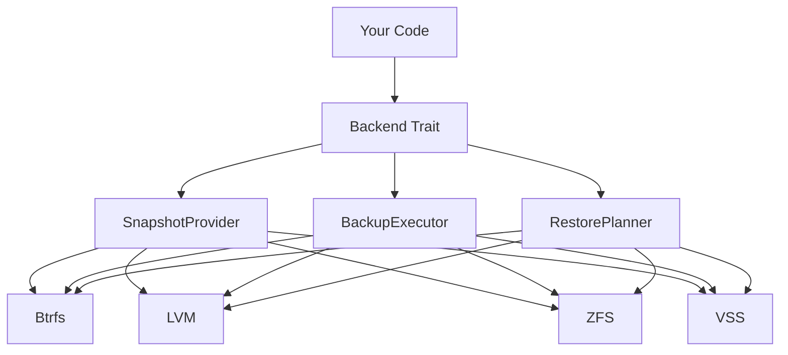

# vpt-rs Documentation

**vpt-rs** is a cross-platform volume backup library and CLI tool written in Rust. It provides a unified trait-based architecture for snapshot creation, block-level backup, and restore across multiple storage backends.

## What Does It Do?

vpt-rs lets you:

- **Create snapshots** of volumes using native storage APIs (Btrfs subvolumes, LVM snapshots, ZFS snapshots, Windows VSS)
- **Back up** volumes to stream or image files (incremental or full)
- **Restore** volumes from backup files
- **Manage** snapshot lifecycle (create, list, delete)

## Who Is This For?

- **System administrators** who need reliable volume backup across different storage backends
- **Backup tool developers** who want a library that handles the complexity of platform-specific snapshot APIs
- **Rust developers** who need volume backup functionality in their applications

## How Does It Work?

vpt-rs uses a **trait-based architecture** where each storage backend implements the same set of traits:



This means you write your backup logic once, and it works across all supported storage backends.

## Quick Example

```rust
use vpt_rs::platform;
use vpt_rs::{BackupExecutor, BackupPlan, BackupSource, BackupTarget, VolumeRef};

let backend = platform::current_backend();
let plan = BackupPlan {
    source: BackupSource::Volume(VolumeRef::new("/mnt/data")),
    target: BackupTarget::ImageFile("/tmp/backup.img".into()),
    ..Default::default()
};
backend.backup_volume(&plan)?;
```

## Supported Platforms

| Platform | Backend | Status |
|----------|---------|--------|
| Linux | Btrfs | ✅ Full support |
| Linux | LVM | ✅ Full support |
| Linux | ZFS | ✅ Full support |
| Windows | VSS | ✅ Full support |
| macOS | APFS | 🔧 Stubbed |
| Unix | Generic | 🔧 Stubbed |

## Next Steps

- **[Installation](./getting-started/installation)** — Get vpt-rs installed
- **[Quick Start](./getting-started/quick-start)** — Your first backup in 5 minutes
- **[Architecture](./concepts/architecture)** — Understand how vpt-rs works internally
