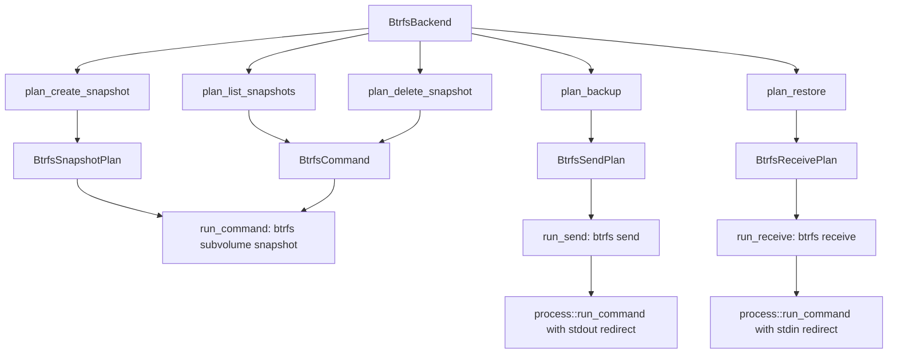
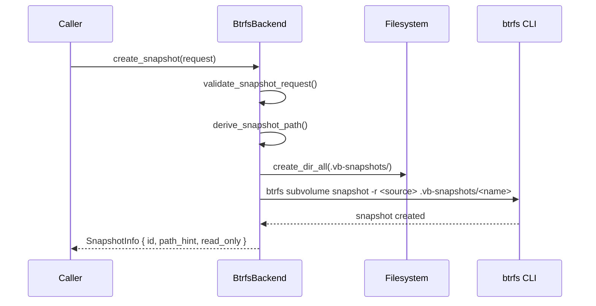
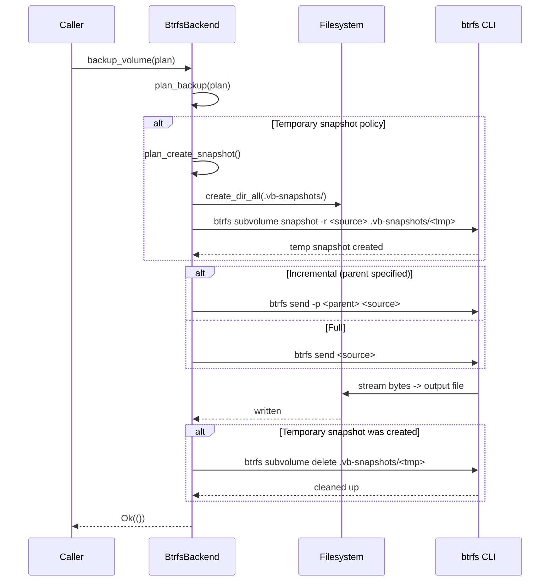
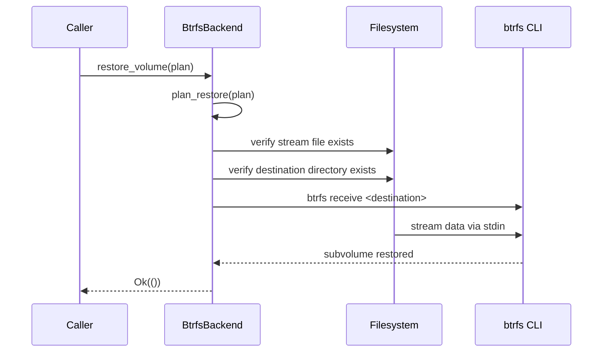
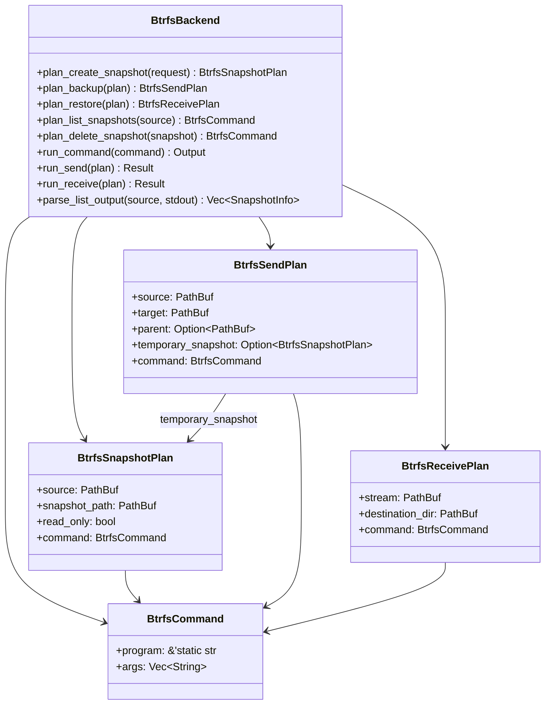

# Btrfs Provider

The Btrfs provider uses `btrfs send` and `btrfs receive` for stream-based volume backup and
restore. It creates read-only snapshots of Btrfs subvolumes and exports them as binary streams
that can be saved to files or piped across the network. It is the only Linux provider that
supports **incremental send**, meaning only the blocks that changed between two snapshots are
transmitted.

## Capabilities

| Capability | Supported | Notes |
|---|---|---|
| `crash_consistent_snapshot` | Yes | Uses `btrfs subvolume snapshot -r` |
| `application_consistent_snapshot` | No | Returns `MissingCapability` error |
| `block_level_backup` | Yes | Via `btrfs send` stream export |
| `block_level_restore` | Yes | Via `btrfs receive` stream import |
| `incremental_send` | Yes | `btrfs send -p <parent> <snap>` |
| `direct_device_access` | No | Operates on subvolume paths, not raw devices |
| `writable_snapshot_mount` | No | `mount_snapshot` returns `UnsupportedOperation` |
| `read_only_snapshot_mount` | No | `unmount` returns `UnsupportedOperation` |

:::info
The Btrfs provider does not support mount or unmount operations. To browse snapshot contents,
mount the snapshot subvolume manually using standard Linux `mount` commands or access the
`.vb-snapshots/` directory directly.
:::

## Source File

| File | Purpose |
|---|---|
| `src/platform/linux/btrfs.rs` | Full provider implementation: snapshot, backup, restore, list, delete |

The provider is registered under the backend name `"linux-btrfs"` (`src/platform/linux/btrfs.rs:72`).

## Architecture Overview

The Btrfs provider wraps the `btrfs` command-line tool. Every operation is planned first as a
data structure (`BtrfsSnapshotPlan`, `BtrfsSendPlan`, `BtrfsReceivePlan`) and then executed
by calling `process::run_command`. This separation allows the library to inspect, log, and
test the exact commands that will be issued without actually running them.



## Snapshot Directory Layout

The provider stores snapshots in a hidden directory called `.vb-snapshots/` located in the
**parent directory** of the source subvolume. This keeps backup metadata co-located with the
data it protects:

| Source subvolume | Snapshot directory |
|---|---|
| `/mnt/data/subvol` | `/mnt/data/.vb-snapshots/` |
| `/srv/db/main` | `/srv/db/.vb-snapshots/` |
| `/home/user/documents` | `/home/user/.vb-snapshots/` |

The snapshot path derivation logic is in `src/platform/linux/btrfs.rs:249`:

```rust
fn derive_snapshot_path(&self, request: &SnapshotRequest, source: &Path) -> Result<PathBuf> {
    let parent = source.parent().ok_or_else(|| Error::InvalidArgument {
        message: format!("cannot derive snapshot path from `{}`", source.display()),
    })?;
    let snapshot_root = parent.join(".vb-snapshots");
    let name = match &request.label {
        Some(label) => sanitize_label(label),
        None => default_snapshot_name(source),
    };
    Ok(snapshot_root.join(name))
}
```

When no label is provided, the snapshot name defaults to `{stem}-{unix_timestamp}`, where
`stem` is the last component of the source path (`src/platform/linux/btrfs.rs:503`):

```rust
fn default_snapshot_name(source: &Path) -> String {
    let stem = source
        .file_name()
        .and_then(|segment| segment.to_str())
        .filter(|segment| !segment.is_empty())
        .unwrap_or("volume");
    let ts = SystemTime::now()
        .duration_since(UNIX_EPOCH)
        .map(|duration| duration.as_secs())
        .unwrap_or(0);
    format!("{stem}-{ts}")
}
```

## How Snapshots Work

### Creating a Snapshot

The `plan_create_snapshot` method validates the request, derives the snapshot path, and
constructs the `btrfs subvolume snapshot` command (`src/platform/linux/btrfs.rs:75`):

```rust
pub fn plan_create_snapshot(&self, request: &SnapshotRequest) -> Result<BtrfsSnapshotPlan> {
    self.validate_snapshot_request(request)?;
    let source = PathBuf::from(&request.source.id);
    let snapshot_path = self.derive_snapshot_path(request, &source)?;
    let mut args = vec!["subvolume".to_string(), "snapshot".to_string()];
    if request.read_only {
        args.push("-r".to_string());
    }
    args.push(source.display().to_string());
    args.push(snapshot_path.display().to_string());
    Ok(BtrfsSnapshotPlan {
        source,
        snapshot_path,
        read_only: request.read_only,
        command: BtrfsCommand::new(args),
    })
}
```

The validation step (`src/platform/linux/btrfs.rs:213`) rejects `ApplicationConsistent`
requests and verifies the source path exists:

```rust
fn validate_snapshot_request(&self, request: &SnapshotRequest) -> Result<()> {
    if matches!(request.kind, SnapshotKind::ApplicationConsistent) {
        return Err(Error::MissingCapability {
            capability: Capability::ApplicationConsistentSnapshot.as_str(),
            backend: self.backend_name(),
        });
    }
    let source = self.volume_path(&request.source)?;
    if !source.exists() {
        return Err(Error::MissingPath { path: source });
    }
    Ok(())
}
```

The `SnapshotProvider::create_snapshot` trait implementation executes the plan
(`src/platform/linux/btrfs.rs:399`):

```rust
fn create_snapshot(&self, request: &SnapshotRequest) -> Result<SnapshotInfo> {
    info!(backend = self.backend_name(), source = %request.source, read_only = request.read_only, "create_snapshot called");
    let result = (|| {
        let plan = self.plan_create_snapshot(request)?;
        if let Some(parent) = plan.snapshot_path.parent() {
            std::fs::create_dir_all(parent)?;
        }
        self.run_command(&plan.command)?;
        Ok(SnapshotInfo {
            handle: SnapshotHandle {
                id: plan.snapshot_path.display().to_string(),
                source: Some(request.source.clone()),
            },
            backend: self.backend_name(),
            path_hint: Some(plan.snapshot_path),
            read_only: plan.read_only,
        })
    })();
    if let Err(error) = &result {
        error!(backend = self.backend_name(), source = %request.source, error = %error, "create_snapshot failed");
    }
    result
}
```



### Deleting a Snapshot

The `plan_delete_snapshot` method builds a `btrfs subvolume delete` command
(`src/platform/linux/btrfs.rs:95`):

```rust
pub fn plan_delete_snapshot(&self, snapshot: &SnapshotHandle) -> Result<BtrfsCommand> {
    let path = self.snapshot_handle_path(snapshot)?;
    Ok(BtrfsCommand::new(vec![
        "subvolume".to_string(),
        "delete".to_string(),
        path.display().to_string(),
    ]))
}
```

### Listing Snapshots

The `plan_list_snapshots` method builds a `btrfs subvolume list -s` command
(`src/platform/linux/btrfs.rs:104`):

```rust
pub fn plan_list_snapshots(&self, source: &VolumeRef) -> Result<BtrfsCommand> {
    let path = self.volume_path(source)?;
    Ok(BtrfsCommand::new(vec![
        "subvolume".to_string(),
        "list".to_string(),
        "-s".to_string(),
        path.display().to_string(),
    ]))
}
```

The output is parsed by `parse_list_output` (`src/platform/linux/btrfs.rs:353`). It splits
each line on ` path ` to extract the snapshot path, resolves relative paths against the
parent directory, and returns `SnapshotInfo` entries:

```rust
fn parse_list_output(&self, source: &VolumeRef, stdout: &[u8]) -> Vec<SnapshotInfo> {
    let source_path = PathBuf::from(&source.id);
    let parent = source_path.parent().map(Path::to_path_buf);
    let mut snapshots = Vec::new();
    for line in String::from_utf8_lossy(stdout).lines() {
        let Some(path_part) = line.split(" path ").nth(1) else {
            continue;
        };
        let raw_path = PathBuf::from(path_part.trim());
        let path_hint = if raw_path.is_absolute() {
            raw_path
        } else {
            parent
                .as_ref()
                .map(|base| base.join(&raw_path))
                .unwrap_or(raw_path.clone())
        };
        snapshots.push(SnapshotInfo {
            handle: SnapshotHandle {
                id: path_hint.display().to_string(),
                source: Some(source.clone()),
            },
            backend: self.backend_name(),
            path_hint: Some(path_hint),
            read_only: true,
        });
    }
    snapshots
}
```

## How Backup Works

### Plan Construction

The `plan_backup` method handles three source modes (`src/platform/linux/btrfs.rs:114`):

1. **Explicit snapshot source** -- uses the snapshot path directly, no temporary snapshot.
2. **Volume source with `SnapshotPolicy::Disabled`** -- uses the live subvolume path directly.
3. **Volume source with `SnapshotPolicy::Temporary`** -- creates a temporary read-only
   snapshot first, then sends it.

```rust
pub fn plan_backup(&self, plan: &BackupPlan) -> Result<BtrfsSendPlan> {
    let target = match &plan.target {
        crate::types::BackupTarget::ImageFile(path) => path.clone(),
        crate::types::BackupTarget::Device(path) => {
            return Err(Error::InvalidArgument {
                message: format!(
                    "btrfs send backup requires an image file target, got device `{}`",
                    path.display()
                ),
            });
        }
    };
    let (source, temporary_snapshot) = match (&plan.source, &plan.snapshot_policy) {
        (BackupSource::Snapshot(snapshot), _) => (self.snapshot_ref_path(snapshot)?, None),
        (BackupSource::Volume(volume), SnapshotPolicy::Disabled) => {
            let source = self.volume_path(volume)?;
            if !source.exists() {
                return Err(Error::MissingPath { path: source });
            }
            (source, None)
        }
        (BackupSource::Volume(volume), SnapshotPolicy::Temporary { kind, label, read_only }) => {
            let request = SnapshotRequest {
                source: volume.clone(),
                kind: *kind,
                label: label.clone(),
                read_only: *read_only,
            };
            let snapshot_plan = self.plan_create_snapshot(&request)?;
            (snapshot_plan.snapshot_path.clone(), Some(snapshot_plan))
        }
    };
    let parent = match &plan.parent_snapshot {
        Some(snapshot) => Some(self.snapshot_ref_path(snapshot)?),
        None => None,
    };
    let mut args = vec!["send".to_string()];
    if let Some(parent) = &parent {
        args.push("-p".to_string());
        args.push(parent.display().to_string());
    }
    args.push(source.display().to_string());
    let command = BtrfsCommand::new(args);
    Ok(BtrfsSendPlan {
        source, target, parent, temporary_snapshot, command,
    })
}
```

### Execution (run_send)

The `run_send` method executes the backup (`src/platform/linux/btrfs.rs:302`). It first
creates the temporary snapshot if needed, then runs `btrfs send` with stdout redirected to
the target file, and finally cleans up the temporary snapshot:

```rust
fn run_send(&self, plan: &BtrfsSendPlan) -> Result<()> {
    if let Some(snapshot_plan) = &plan.temporary_snapshot {
        if let Some(parent) = snapshot_plan.snapshot_path.parent() {
            std::fs::create_dir_all(parent)?;
        }
        self.run_command(&snapshot_plan.command)?;
    }
    let result = process::run_command(
        self.backend_name(),
        "backup_volume",
        plan.command.program,
        &plan.command.args,
        CommandIo {
            stdin_file: None,
            stdout_file: Some(plan.target.clone()),
        },
    );
    if let Some(snapshot_plan) = &plan.temporary_snapshot
        && let Err(cleanup_err) = self.run_command(&BtrfsCommand::new(vec![
            "subvolume".to_string(),
            "delete".to_string(),
            snapshot_plan.snapshot_path.display().to_string(),
        ]))
    {
        tracing::warn!(
            backend = self.backend_name(),
            snapshot = %snapshot_plan.snapshot_path.display(),
            error = %cleanup_err,
            "failed to clean up temporary snapshot"
        );
    }
    result.map(|_| ())
}
```



## How Restore Works

The `plan_restore` method validates the stream file and destination directory, then builds a
`btrfs receive` command (`src/platform/linux/btrfs.rs:177`):

```rust
pub fn plan_restore(&self, plan: &RestorePlan) -> Result<BtrfsReceivePlan> {
    let stream = match &plan.source {
        crate::types::BackupTarget::ImageFile(path) => path.clone(),
        crate::types::BackupTarget::Device(path) => {
            return Err(Error::InvalidArgument {
                message: format!(
                    "btrfs receive restore requires an image file source, got device `{}`",
                    path.display()
                ),
            });
        }
    };
    if !stream.exists() {
        return Err(Error::MissingPath { path: stream });
    }
    let destination_dir = self.volume_path(&plan.destination)?;
    if !destination_dir.exists() {
        return Err(Error::MissingPath { path: destination_dir });
    }
    let command = BtrfsCommand::new(vec![
        "receive".to_string(),
        destination_dir.display().to_string(),
    ]);
    Ok(BtrfsReceivePlan { stream, destination_dir, command })
}
```

The `run_receive` method reads the stream from the file and pipes it into `btrfs receive` via
stdin (`src/platform/linux/btrfs.rs:339`):

```rust
fn run_receive(&self, plan: &BtrfsReceivePlan) -> Result<()> {
    process::run_command(
        self.backend_name(),
        "restore_volume",
        plan.command.program,
        &plan.command.args,
        CommandIo {
            stdin_file: Some(plan.stream.clone()),
            stdout_file: None,
        },
    )?;
    Ok(())
}
```



## Internal Data Structures

### BtrfsCommand

Wraps a `btrfs` CLI invocation with its arguments (`src/platform/linux/btrfs.rs:32`):

```rust
#[derive(Debug, Clone, PartialEq, Eq)]
pub struct BtrfsCommand {
    pub program: &'static str,
    pub args: Vec<String>,
}
```

### BtrfsSnapshotPlan

Represents a planned snapshot creation (`src/platform/linux/btrfs.rs:47`):

```rust
#[derive(Debug, Clone, PartialEq, Eq)]
pub struct BtrfsSnapshotPlan {
    pub source: PathBuf,
    pub snapshot_path: PathBuf,
    pub read_only: bool,
    pub command: BtrfsCommand,
}
```

### BtrfsSendPlan

Represents a planned backup operation (`src/platform/linux/btrfs.rs:54`):

```rust
#[derive(Debug, Clone, PartialEq, Eq)]
pub struct BtrfsSendPlan {
    pub source: PathBuf,
    pub target: PathBuf,
    pub parent: Option<PathBuf>,
    pub temporary_snapshot: Option<BtrfsSnapshotPlan>,
    pub command: BtrfsCommand,
}
```

### BtrfsReceivePlan

Represents a planned restore operation (`src/platform/linux/btrfs.rs:63`):

```rust
#[derive(Debug, Clone, PartialEq, Eq)]
pub struct BtrfsReceivePlan {
    pub stream: PathBuf,
    pub destination_dir: PathBuf,
    pub command: BtrfsCommand,
}
```



## Trait Implementations

The `BtrfsBackend` struct implements four traits:

| Trait | File:Line | Notes |
|---|---|---|
| `Backend` | `src/platform/linux/btrfs.rs:388` | Returns `"linux-btrfs"` and capabilities |
| `SnapshotProvider` | `src/platform/linux/btrfs.rs:398` | `create_snapshot`, `delete_snapshot`, `list_snapshots` |
| `BackupExecutor` | `src/platform/linux/btrfs.rs:451` | `backup_volume` delegates to `plan_backup` + `run_send` |
| `RestorePlanner` | `src/platform/linux/btrfs.rs:465` | `restore_volume` delegates to `plan_restore` + `run_receive` |
| `MountManager` | `src/platform/linux/btrfs.rs:479` | Both methods return `UnsupportedOperation` |

## CLI Examples

### Create a read-only snapshot

```bash
vptcli snapshot create /mnt/data/subvol --provider linux-btrfs --label "nightly"
```

### List snapshots for a subvolume

```bash
vptcli snapshot list --provider linux-btrfs /mnt/data/subvol
```

### Delete a snapshot

```bash
vptcli snapshot delete --provider linux-btrfs /mnt/data/.vb-snapshots/nightly
```

### Full backup with automatic temporary snapshot

```bash
vptcli backup /mnt/data/subvol \
  --provider linux-btrfs \
  --output /backup/subvol.stream \
  --snapshot-label "backup"
```

### Incremental backup using a parent snapshot

```bash
vptcli backup /mnt/data/.vb-snapshots/snap2 \
  --provider linux-btrfs \
  --snapshot-source \
  --output /backup/incr.stream \
  --parent-snapshot /mnt/data/.vb-snapshots/snap1
```

### Restore from a stream file

```bash
vptcli restore /mnt/restore \
  --provider linux-btrfs \
  --input /backup/subvol.stream
```

## Rust Library Usage

### Creating a snapshot programmatically

```rust
use vpt_rs::{SnapshotRequest, SnapshotKind, VolumeRef, SnapshotProvider};
use vpt_rs::platform::linux::btrfs::BtrfsBackend;

let backend = BtrfsBackend::new();
let request = SnapshotRequest {
    source: VolumeRef::new("/mnt/data/subvol"),
    kind: SnapshotKind::CrashConsistent,
    label: Some("pre-upgrade".to_string()),
    read_only: true,
};
let snapshot = backend.create_snapshot(&request)?;
println!("Snapshot at: {}", snapshot.handle.id);
```

### Full backup with temporary snapshot

```rust
use vpt_rs::{BackupPlan, BackupSource, BackupTarget, SnapshotPolicy, SnapshotKind, VolumeRef};
use vpt_rs::platform::linux::btrfs::BtrfsBackend;
use std::path::PathBuf;

let backend = BtrfsBackend::new();
let plan = BackupPlan {
    source: BackupSource::Volume(VolumeRef::new("/mnt/data/subvol")),
    target: BackupTarget::ImageFile(PathBuf::from("/backup/subvol.stream")),
    snapshot_policy: SnapshotPolicy::temporary(
        SnapshotKind::CrashConsistent,
        Some("backup".to_string()),
        true,
    ),
    parent_snapshot: None,
    block_size: None,
};
backend.backup_volume(&plan)?;
```

### Incremental backup

```rust
use vpt_rs::{BackupPlan, BackupSource, BackupTarget, SnapshotPolicy, SnapshotRef, VolumeRef};
use vpt_rs::platform::linux::btrfs::BtrfsBackend;
use std::path::PathBuf;

let backend = BtrfsBackend::new();
let plan = BackupPlan {
    source: BackupSource::Snapshot(
        SnapshotRef::new("/mnt/data/.vb-snapshots/snap2")
            .with_origin(VolumeRef::new("/mnt/data/subvol")),
    ),
    target: BackupTarget::ImageFile(PathBuf::from("/backup/incr.stream")),
    snapshot_policy: SnapshotPolicy::disabled(),
    parent_snapshot: Some(
        SnapshotRef::new("/mnt/data/.vb-snapshots/snap1")
            .with_origin(VolumeRef::new("/mnt/data/subvol")),
    ),
    block_size: None,
};
backend.backup_volume(&plan)?;
```

### Restore from a stream

```rust
use vpt_rs::{RestorePlan, BackupTarget, VolumeRef};
use vpt_rs::platform::linux::btrfs::BtrfsBackend;
use std::path::PathBuf;

let backend = BtrfsBackend::new();
let plan = RestorePlan {
    source: BackupTarget::ImageFile(PathBuf::from("/backup/subvol.stream")),
    destination: VolumeRef::new("/mnt/restore"),
    force: false,
    base_snapshot: None,
    block_size: None,
};
backend.restore_volume(&plan)?;
```

## Snapshot Command Reference

| Operation | CLI Command | Rust Plan Method |
|---|---|---|
| Create read-only snapshot | `btrfs subvolume snapshot -r <source> <path>` | `plan_create_snapshot` |
| List snapshots | `btrfs subvolume list -s <path>` | `plan_list_snapshots` |
| Delete snapshot | `btrfs subvolume delete <path>` | `plan_delete_snapshot` |
| Full send | `btrfs send <snapshot>` | `plan_backup` (no parent) |
| Incremental send | `btrfs send -p <parent> <snapshot>` | `plan_backup` (with parent) |
| Receive | `btrfs receive <destination-dir>` | `plan_restore` |

## Limitations and Caveats

:::caution
Keep these limitations in mind when using the Btrfs provider:

- **No mount/unmount support**: The provider returns `UnsupportedOperation` for
  `mount_snapshot` and `unmount` (`src/platform/linux/btrfs.rs:480-496`). Mount subvolumes
  manually if you need to browse contents.
- **No application-consistent snapshots**: Requesting `SnapshotKind::ApplicationConsistent`
  returns a `MissingCapability` error (`src/platform/linux/btrfs.rs:214`).
- **Stream-based only**: Backup and restore operate on image files (streams), not raw block
  devices. Passing a `Device` target or source returns an `InvalidArgument` error.
- **Absolute path required**: The source must be an absolute path to a Btrfs subvolume.
  Relative paths are rejected by `volume_path()` (`src/platform/linux/btrfs.rs:237`).
:::

:::warning
The temporary snapshot cleanup in `run_send` uses a `tracing::warn` log if deletion fails,
but the original send error (if any) takes precedence. In rare cases where the send fails
and cleanup also fails, the `.vb-snapshots/` directory may contain orphaned temporary
snapshots. Periodically run `btrfs subvolume list -s <parent>` to check for stale entries.
:::

:::tip
For incremental backups, always keep the parent snapshot alive until the incremental send
completes. Deleting the parent before the send finishes will cause `btrfs send` to fail with
an error about the missing parent.
:::
