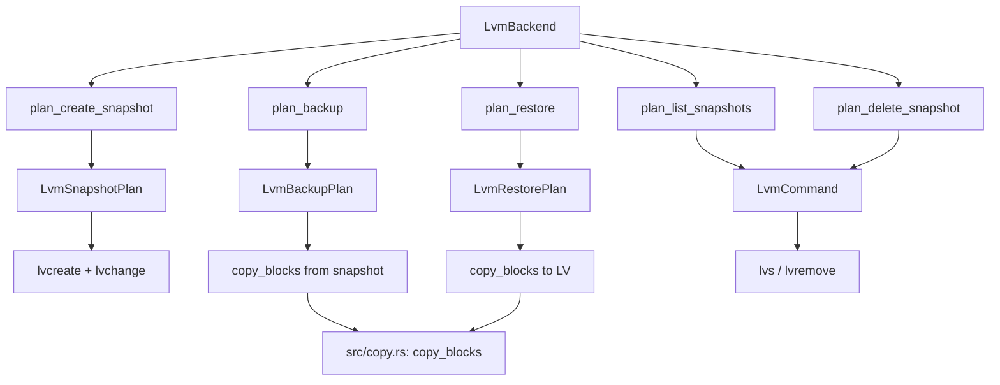
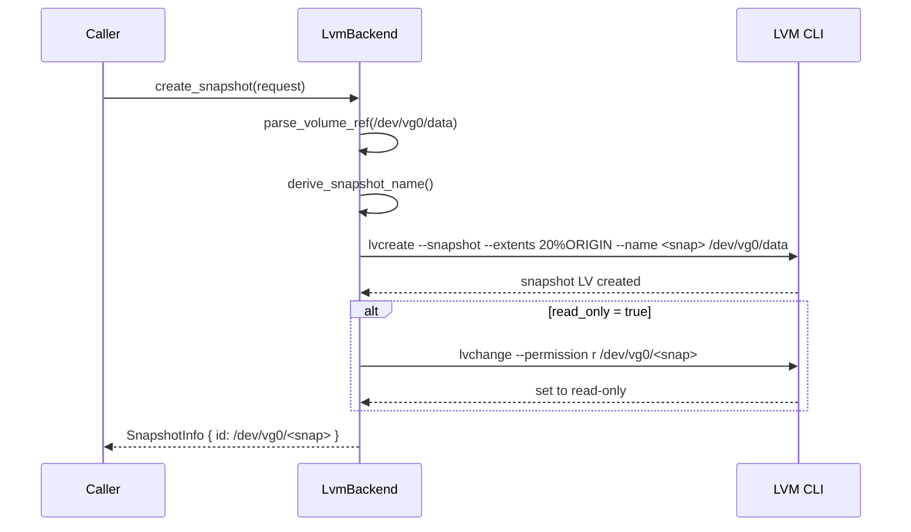
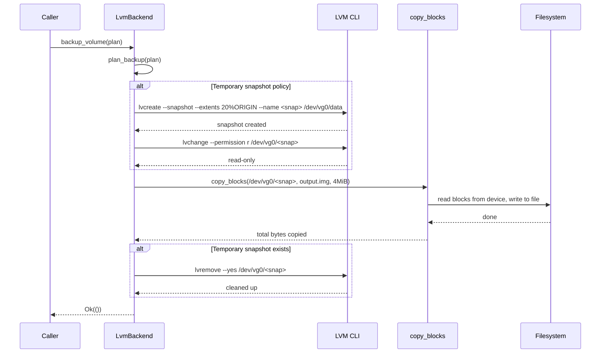
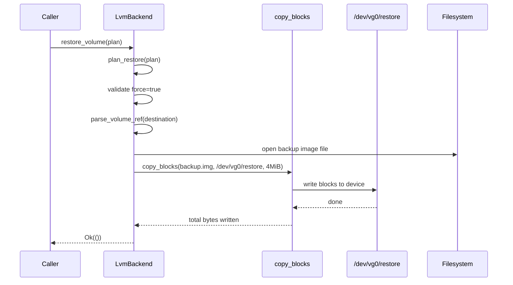
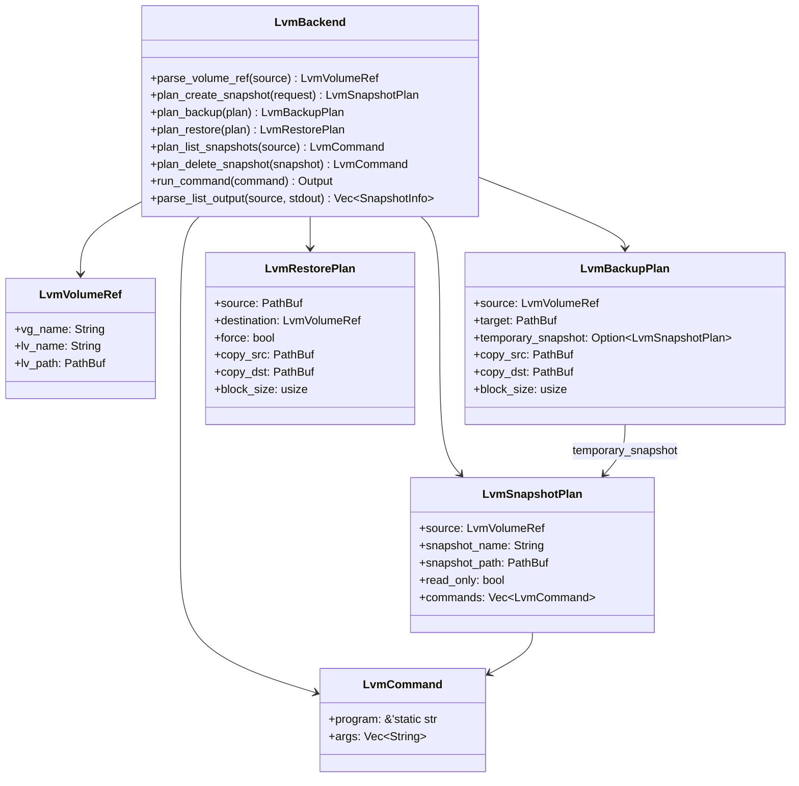

# LVM Provider

The LVM provider uses Linux Logical Volume Manager (LVM) snapshots combined with block-level
copying to back up and restore logical volumes. It creates temporary LVM snapshots via
`lvcreate`, copies the raw blocks to an image file using `copy_blocks`, and then cleans up
with `lvremove`. Unlike Btrfs and ZFS, LVM does not support incremental sends -- every backup
is a full block-level copy.

## Capabilities

| Capability | Supported | Notes |
|---|---|---|
| `crash_consistent_snapshot` | Yes | Uses `lvcreate --snapshot` |
| `application_consistent_snapshot` | No | Returns `MissingCapability` error |
| `block_level_backup` | Yes | Via `copy_blocks` from snapshot device |
| `block_level_restore` | Yes | Via `copy_blocks` to LV device |
| `incremental_send` | No | Every backup is a full copy |
| `direct_device_access` | Yes | Operates on `/dev/<vg>/<lv>` paths |
| `writable_snapshot_mount` | No | `mount_snapshot` returns `UnsupportedOperation` |
| `read_only_snapshot_mount` | No | `unmount` returns `UnsupportedOperation` |

:::info
The LVM provider does not support incremental backups. Every backup copies all blocks from the
source volume or snapshot. For large volumes, consider scheduling backups during low-activity
periods.
:::

## Source File

| File | Purpose |
|---|---|
| `src/platform/linux/lvm.rs` | Full provider implementation: snapshot, backup, restore, list, delete |
| `src/copy.rs` | The `copy_blocks` function used for raw block I/O |

The provider is registered under the backend name `"linux-lvm"` (`src/platform/linux/lvm.rs:88`).

## Architecture Overview

The LVM provider is the only Linux provider that uses raw block-level I/O instead of
stream-based send/receive. It leverages the `copy_blocks` function from `src/copy.rs` which
reads and writes in fixed-size chunks (default 4 MiB), reports throughput every 5 seconds,
and calls `fsync` on the destination.



## Volume Path Parsing

LVM logical volumes are identified by device paths in the format `/dev/<vg_name>/<lv_name>`.
The `parse_volume_ref` method validates this format (`src/platform/linux/lvm.rs:91`):

```rust
pub fn parse_volume_ref(&self, source: &VolumeRef) -> Result<LvmVolumeRef> {
    let raw = source.id.trim();
    if raw.is_empty() {
        return Err(Error::InvalidVolume {
            volume: source.id.clone(),
        });
    }
    let path = Path::new(raw);
    if !path.is_absolute() {
        return Err(Error::InvalidArgument {
            message: format!("lvm provider expects an absolute LV path, got `{raw}`"),
        });
    }
    let components: Vec<_> = path
        .iter()
        .map(|segment| segment.to_string_lossy().to_string())
        .collect();
    if components.len() != 4 || components[1] != "dev" {
        return Err(Error::InvalidArgument {
            message: format!(
                "lvm provider expects `/dev/<vg>/<lv>` paths, got `{}`",
                path.display()
            ),
        });
    }
    Ok(LvmVolumeRef {
        vg_name: components[2].clone(),
        lv_name: components[3].clone(),
        lv_path: path.to_path_buf(),
    })
}
```

| Valid | Invalid | Reason |
|---|---|---|
| `/dev/vg0/data` | `vg0/data` | Relative path |
| `/dev/vg_data/backup` | `/dev/vg0` | Missing LV name (3 components) |
| `/dev/pool/db` | `/home/user` | Wrong prefix |

## How Snapshots Work

### Creating a Snapshot

The `plan_create_snapshot` method constructs one or two LVM commands
(`src/platform/linux/lvm.rs:127`):

```rust
pub fn plan_create_snapshot(&self, request: &SnapshotRequest) -> Result<LvmSnapshotPlan> {
    if matches!(request.kind, SnapshotKind::ApplicationConsistent) {
        return Err(Error::MissingCapability {
            capability: Capability::ApplicationConsistentSnapshot.as_str(),
            backend: self.backend_name(),
        });
    }
    let source = self.parse_volume_ref(&request.source)?;
    let snapshot_name = derive_snapshot_name(&source.lv_name, request.label.as_deref());
    let snapshot_path = PathBuf::from(format!("/dev/{}/{}", source.vg_name, snapshot_name));
    let mut commands = vec![LvmCommand::new(
        LVCREATE_BIN,
        vec![
            "--snapshot".to_string(),
            "--extents".to_string(),
            DEFAULT_SNAPSHOT_SIZE.to_string(),
            "--name".to_string(),
            snapshot_name.clone(),
            source.lv_path.display().to_string(),
        ],
    )];
    if request.read_only {
        commands.push(LvmCommand::new(
            LVCHANGE_BIN,
            vec![
                "--permission".to_string(),
                "r".to_string(),
                snapshot_path.display().to_string(),
            ],
        ));
    }
    Ok(LvmSnapshotPlan {
        source,
        snapshot_name,
        snapshot_path,
        read_only: request.read_only,
        commands,
    })
}
```

The snapshot size defaults to `20%ORIGIN` (`src/platform/linux/lvm.rs:31`), which allocates
20% of the origin volume's extents for copy-on-write tracking. The snapshot name is derived
from the LV name plus a label or Unix timestamp (`src/platform/linux/lvm.rs:483`):

```rust
fn derive_snapshot_name(lv_name: &str, label: Option<&str>) -> String {
    match label {
        Some(label) => sanitize_snapshot_segment(label),
        None => {
            let ts = SystemTime::now()
                .duration_since(UNIX_EPOCH)
                .map(|duration| duration.as_secs())
                .unwrap_or(0);
            format!("{lv_name}-snap-{ts}")
        }
    }
}
```

The `SnapshotProvider::create_snapshot` trait implementation executes all commands in the plan
sequentially (`src/platform/linux/lvm.rs:348`):

```rust
fn create_snapshot(&self, request: &SnapshotRequest) -> Result<SnapshotInfo> {
    info!(backend = self.backend_name(), source = %request.source, read_only = request.read_only, "create_snapshot called");
    let result = (|| {
        let plan = self.plan_create_snapshot(request)?;
        for command in &plan.commands {
            self.run_command(command)?;
        }
        Ok(SnapshotInfo {
            handle: SnapshotHandle {
                id: plan.snapshot_path.display().to_string(),
                source: Some(request.source.clone()),
            },
            backend: self.backend_name(),
            path_hint: Some(plan.snapshot_path),
            read_only: plan.read_only,
        })
    })();
    if let Err(error) = &result {
        error!(backend = self.backend_name(), source = %request.source, error = %error, "create_snapshot failed");
    }
    result
}
```



### Deleting a Snapshot

The `plan_delete_snapshot` method builds a `lvremove --yes` command
(`src/platform/linux/lvm.rs:171`):

```rust
pub fn plan_delete_snapshot(&self, snapshot: &SnapshotHandle) -> Result<LvmCommand> {
    let snapshot_path = PathBuf::from(snapshot.id.trim());
    if snapshot.id.trim().is_empty() {
        return Err(Error::InvalidArgument {
            message: "snapshot id must not be empty".to_string(),
        });
    }
    Ok(LvmCommand::new(
        LVREMOVE_BIN,
        vec!["--yes".to_string(), snapshot_path.display().to_string()],
    ))
}
```

### Listing Snapshots

The `plan_list_snapshots` method builds an `lvs` command with pipe-separated output
(`src/platform/linux/lvm.rs:185`):

```rust
pub fn plan_list_snapshots(&self, source: &VolumeRef) -> Result<(LvmVolumeRef, LvmCommand)> {
    let volume = self.parse_volume_ref(source)?;
    let command = LvmCommand::new(
        LVS_BIN,
        vec![
            "--noheadings".to_string(),
            "--separator".to_string(),
            "|".to_string(),
            "--options".to_string(),
            "lv_name,origin,lv_path,lv_attr".to_string(),
            volume.vg_name.clone(),
        ],
    );
    Ok((volume, command))
}
```

The output is parsed by `parse_list_output` (`src/platform/linux/lvm.rs:294`). It filters
for entries whose `origin` field matches the source LV and whose attributes start with `s`
or `S` (LVM snapshot indicator):

```rust
fn parse_list_output(&self, source: &LvmVolumeRef, stdout: &[u8]) -> Vec<SnapshotInfo> {
    let mut snapshots = Vec::new();
    for line in String::from_utf8_lossy(stdout).lines() {
        let line = line.trim();
        if line.is_empty() { continue; }
        let parts: Vec<_> = line.split('|').map(str::trim).collect();
        if parts.len() != 4 { continue; }
        let _lv_name = parts[0];
        let origin = parts[1];
        let lv_path = parts[2];
        let lv_attr = parts[3];
        if origin != source.lv_name { continue; }
        if !lv_attr.starts_with('s') && !lv_attr.starts_with('S') { continue; }
        let path = PathBuf::from(lv_path);
        snapshots.push(SnapshotInfo {
            handle: SnapshotHandle {
                id: path.display().to_string(),
                source: Some(VolumeRef::new(source.lv_path.display().to_string())),
            },
            backend: self.backend_name(),
            path_hint: Some(path),
            read_only: lv_attr.contains('r'),
        });
    }
    snapshots
}
```

The `lv_attr` field encodes the volume type and permissions. The first character indicates:
- `s` = active snapshot, `S` = inactive snapshot
- The 5th character: `r` = read-only, `w` = read-write

## How Backup Works

### Plan Construction

The `plan_backup` method resolves the copy source and destination
(`src/platform/linux/lvm.rs:202`):

```rust
pub fn plan_backup(&self, plan: &BackupPlan) -> Result<LvmBackupPlan> {
    let source = match &plan.source {
        crate::types::BackupSource::Volume(source) => self.parse_volume_ref(source)?,
        crate::types::BackupSource::Snapshot(snapshot) => {
            self.parse_volume_ref(&VolumeRef::new(snapshot.id.clone()))?
        }
    };
    let target = match &plan.target {
        crate::types::BackupTarget::ImageFile(path) => path.clone(),
        crate::types::BackupTarget::Device(path) => {
            return Err(Error::InvalidArgument {
                message: format!(
                    "lvm backup currently supports only image-file targets, got `{}`",
                    path.display()
                ),
            });
        }
    };
    let temporary_snapshot = match (&plan.source, &plan.snapshot_policy) {
        (crate::types::BackupSource::Volume(source),
         crate::types::SnapshotPolicy::Temporary { kind, label, .. }) => {
            Some(self.plan_create_snapshot(&SnapshotRequest {
                source: source.clone(),
                kind: *kind,
                label: label.clone(),
                read_only: true,
            })?)
        }
        _ => None,
    };
    let copy_src = temporary_snapshot
        .as_ref()
        .map(|snapshot| snapshot.snapshot_path.clone())
        .unwrap_or_else(|| source.lv_path.clone());
    let block_size = plan.block_size.unwrap_or(copy::DEFAULT_BLOCK_SIZE);
    Ok(LvmBackupPlan {
        copy_dst: target.clone(),
        source, target, temporary_snapshot, copy_src, block_size,
    })
}
```

### Execution

The `BackupExecutor::backup_volume` implementation executes the plan
(`src/platform/linux/lvm.rs:400`):

```rust
fn backup_volume(&self, plan: &BackupPlan) -> Result<()> {
    info!(backend = self.backend_name(), source = %plan.source, "backup_volume called");
    let result = (|| {
        let plan = self.plan_backup(plan)?;
        if let Some(snapshot) = &plan.temporary_snapshot {
            for command in &snapshot.commands {
                self.run_command(command)?;
            }
        }
        let copy_result =
            copy::copy_blocks(&plan.copy_src, &plan.copy_dst, plan.block_size).map(|_| ());
        let cleanup_result = if let Some(snapshot) = &plan.temporary_snapshot {
            self.run_command(&LvmCommand::new(
                LVREMOVE_BIN,
                vec!["--yes".to_string(), snapshot.snapshot_path.display().to_string()],
            )).map(|_| ())
        } else { Ok(()) };
        match (copy_result, cleanup_result) {
            (Ok(_), Ok(())) => Ok(()),
            (Err(error), Ok(())) => Err(error),
            (Ok(_), Err(error)) => Err(error),
            (Err(error), Err(cleanup_error)) => {
                error!(backend = self.backend_name(), source = %plan.source.lv_path.display(),
                    cleanup_error = %cleanup_error, "backup cleanup failed after copy error");
                Err(error)
            }
        }
    })();
    if let Err(error) = &result {
        error!(backend = self.backend_name(), source = %plan.source, error = %error, "backup_volume failed");
    }
    result
}
```

The `copy_blocks` function (`src/copy.rs:18`) reads and writes in 4 MiB chunks by default,
reports progress every 5 seconds, and calls `fsync` when complete:

```rust
pub fn copy_blocks(src: &Path, dst: &Path, block_size: usize) -> Result<u64> {
    // ... opens src and dst files ...
    let mut buffer = vec![0u8; block_size];
    let mut total_bytes: u64 = 0;
    // ... loop: read from src, write to dst, report progress ...
    dst_file.flush()?;
    dst_file.sync_all()?;
    Ok(total_bytes)
}
```



## How Restore Works

The `plan_restore` method validates the source and destination, and **requires** the `force`
flag (`src/platform/linux/lvm.rs:252`):

```rust
pub fn plan_restore(&self, plan: &RestorePlan) -> Result<LvmRestorePlan> {
    let source = match &plan.source {
        crate::types::BackupTarget::ImageFile(path) => path.clone(),
        crate::types::BackupTarget::Device(path) => {
            return Err(Error::InvalidArgument {
                message: format!(
                    "lvm restore currently supports only image-file sources, got `{}`",
                    path.display()
                ),
            });
        }
    };
    if !plan.force {
        return Err(Error::InvalidArgument {
            message: "lvm restore requires `--force` because it overwrites the destination logical volume".to_string(),
        });
    }
    let destination = self.parse_volume_ref(&plan.destination)?;
    let block_size = plan.block_size.unwrap_or(copy::DEFAULT_BLOCK_SIZE);
    Ok(LvmRestorePlan {
        copy_src: source.clone(),
        copy_dst: destination.lv_path.clone(),
        source, destination,
        force: plan.force,
        block_size,
    })
}
```

The `RestorePlanner::restore_volume` implementation runs `copy_blocks` from the image file
to the destination LV device (`src/platform/linux/lvm.rs:449`):

```rust
fn restore_volume(&self, plan: &RestorePlan) -> Result<()> {
    info!(backend = self.backend_name(), destination = %plan.destination, "restore_volume called");
    let result = (|| {
        let plan = self.plan_restore(plan)?;
        copy::copy_blocks(&plan.copy_src, &plan.copy_dst, plan.block_size)?;
        Ok(())
    })();
    if let Err(error) = &result {
        error!(backend = self.backend_name(), destination = %plan.destination, error = %error, "restore_volume failed");
    }
    result
}
```



## Internal Data Structures

### LvmVolumeRef

Represents a parsed LVM volume reference (`src/platform/linux/lvm.rs:36`):

```rust
#[derive(Debug, Clone, PartialEq, Eq)]
pub struct LvmVolumeRef {
    pub vg_name: String,
    pub lv_name: String,
    pub lv_path: PathBuf,
}
```

### LvmCommand

Wraps an LVM CLI invocation (`src/platform/linux/lvm.rs:43`):

```rust
#[derive(Debug, Clone, PartialEq, Eq)]
pub struct LvmCommand {
    pub program: &'static str,
    pub args: Vec<String>,
}
```

### LvmSnapshotPlan

Represents a planned snapshot creation with one or two commands
(`src/platform/linux/lvm.rs:49`):

```rust
#[derive(Debug, Clone, PartialEq, Eq)]
pub struct LvmSnapshotPlan {
    pub source: LvmVolumeRef,
    pub snapshot_name: String,
    pub snapshot_path: PathBuf,
    pub read_only: bool,
    pub commands: Vec<LvmCommand>,
}
```

### LvmBackupPlan

Represents a planned backup operation (`src/platform/linux/lvm.rs:57`):

```rust
#[derive(Debug, Clone, PartialEq, Eq)]
pub struct LvmBackupPlan {
    pub source: LvmVolumeRef,
    pub target: PathBuf,
    pub temporary_snapshot: Option<LvmSnapshotPlan>,
    pub copy_src: PathBuf,
    pub copy_dst: PathBuf,
    pub block_size: usize,
}
```

### LvmRestorePlan

Represents a planned restore operation (`src/platform/linux/lvm.rs:67`):

```rust
#[derive(Debug, Clone, PartialEq, Eq)]
pub struct LvmRestorePlan {
    pub source: PathBuf,
    pub destination: LvmVolumeRef,
    pub force: bool,
    pub copy_src: PathBuf,
    pub copy_dst: PathBuf,
    pub block_size: usize,
}
```



## Trait Implementations

| Trait | File:Line | Notes |
|---|---|---|
| `Backend` | `src/platform/linux/lvm.rs:337` | Returns `"linux-lvm"` and capabilities |
| `SnapshotProvider` | `src/platform/linux/lvm.rs:347` | `create_snapshot`, `delete_snapshot`, `list_snapshots` |
| `BackupExecutor` | `src/platform/linux/lvm.rs:399` | `backup_volume` with temp snapshot + `copy_blocks` + cleanup |
| `RestorePlanner` | `src/platform/linux/lvm.rs:448` | `restore_volume` requires `force=true` |
| `MountManager` | `src/platform/linux/lvm.rs:463` | Both methods return `UnsupportedOperation` |

## CLI Examples

### Create a snapshot

```bash
vptcli snapshot create /dev/vg0/data --provider linux-lvm --label "pre-upgrade"
```

### List snapshots for a volume

```bash
vptcli snapshot list --provider linux-lvm /dev/vg0/data
```

### Delete a snapshot

```bash
vptcli snapshot delete --provider linux-lvm /dev/vg0/pre-upgrade
```

### Full backup with automatic temporary snapshot

```bash
vptcli backup /dev/vg0/data \
  --provider linux-lvm \
  --output /backup/data.img \
  --snapshot-label "nightly"
```

### Backup with custom block size

```bash
vptcli backup /dev/vg0/data \
  --provider linux-lvm \
  --output /backup/data.img \
  --block-size 8M
```

### Backup from an existing snapshot

```bash
vptcli backup /dev/vg0/snap1 \
  --provider linux-lvm \
  --snapshot-source \
  --output /backup/snap1.img
```

### Restore to a logical volume

```bash
vptcli restore /dev/vg0/restore \
  --provider linux-lvm \
  --input /backup/data.img \
  --force
```

## Rust Library Usage

### Creating a snapshot

```rust
use vpt_rs::{SnapshotRequest, SnapshotKind, VolumeRef, SnapshotProvider};
use vpt_rs::platform::linux::lvm::LvmBackend;

let backend = LvmBackend::new();
let request = SnapshotRequest {
    source: VolumeRef::new("/dev/vg0/data"),
    kind: SnapshotKind::CrashConsistent,
    label: Some("nightly".to_string()),
    read_only: true,
};
let snapshot = backend.create_snapshot(&request)?;
println!("Snapshot path: {}", snapshot.handle.id);
// Output: /dev/vg0/nightly
```

### Backup with temporary snapshot

```rust
use vpt_rs::{BackupPlan, BackupSource, BackupTarget, SnapshotPolicy, SnapshotKind, VolumeRef};
use vpt_rs::platform::linux::lvm::LvmBackend;
use std::path::PathBuf;

let backend = LvmBackend::new();
let plan = BackupPlan {
    source: BackupSource::Volume(VolumeRef::new("/dev/vg0/data")),
    target: BackupTarget::ImageFile(PathBuf::from("/backup/data.img")),
    snapshot_policy: SnapshotPolicy::temporary(
        SnapshotKind::CrashConsistent,
        Some("backup".to_string()),
        true,
    ),
    parent_snapshot: None,
    block_size: Some(8 * 1024 * 1024), // 8 MiB blocks
};
backend.backup_volume(&plan)?;
```

### Restore (requires force)

```rust
use vpt_rs::{RestorePlan, BackupTarget, VolumeRef};
use vpt_rs::platform::linux::lvm::LvmBackend;
use std::path::PathBuf;

let backend = LvmBackend::new();
let plan = RestorePlan {
    source: BackupTarget::ImageFile(PathBuf::from("/backup/data.img")),
    destination: VolumeRef::new("/dev/vg0/restore"),
    force: true,
    base_snapshot: None,
    block_size: None,
};
backend.restore_volume(&plan)?;
```

## Snapshot Command Reference

| Operation | CLI Command | Notes |
|---|---|---|
| Create snapshot | `lvcreate --snapshot --extents 20%ORIGIN --name <name> /dev/<vg>/<lv>` | Allocates COW space |
| Set read-only | `lvchange --permission r /dev/<vg>/<name>` | Only if `read_only=true` |
| List snapshots | `lvs --noheadings --separator \| --options lv_name,origin,lv_path,lv_attr <vg>` | Filtered by origin |
| Delete snapshot | `lvremove --yes /dev/<vg>/<name>` | `--yes` skips confirmation |
| Block copy (backup) | Internal `copy_blocks` | Default 4 MiB blocks |
| Block copy (restore) | Internal `copy_blocks` | Default 4 MiB blocks |

## Limitations and Caveats

:::caution
Keep these limitations in mind when using the LVM provider:

- **No incremental backups**: Every backup copies all blocks from the source. There is no
  equivalent of Btrfs or ZFS incremental send.
- **Destructive restore**: Restoring overwrites the entire destination LV. The `--force` flag
  is mandatory (`src/platform/linux/lvm.rs:266`).
- **Snapshot space exhaustion**: The snapshot uses 20% of the origin volume's extents
  (`DEFAULT_SNAPSHOT_SIZE = "20%ORIGIN"` at `src/platform/linux/lvm.rs:31`). Very active
  volumes may exhaust snapshot space during a long backup, causing the snapshot to become
  invalid and the backup to fail.
- **No application-consistent snapshots**: Requesting `SnapshotKind::ApplicationConsistent`
  returns a `MissingCapability` error.
- **No mount/unmount support**: The provider returns `UnsupportedOperation` for mount
  operations. Use `mount` manually if you need to access snapshot contents.
- **Image-file targets only**: Backup to raw block devices is not currently supported
  (`src/platform/linux/lvm.rs:213`).
:::

:::warning
If the `copy_blocks` operation fails partway through a restore, the destination LV will be in
a partially-written, inconsistent state. Always ensure you have a separate backup before
attempting a restore, and consider using LVM snapshots of the destination as a rollback
mechanism.
:::

:::tip
For large volumes, consider increasing the block size with the `--block-size` flag. The default
4 MiB block size provides a good balance between memory usage and throughput, but 8 MiB or
16 MiB blocks may improve performance on fast storage.
:::

:::note
The `LvmBackend` uses multiple binary names: `lvcreate`, `lvremove`, `lvchange`, and `lvs`
(`src/platform/linux/lvm.rs:27-30`). All four must be available on the system PATH. On most
distributions they are provided by the `lvm2` package.
:::
