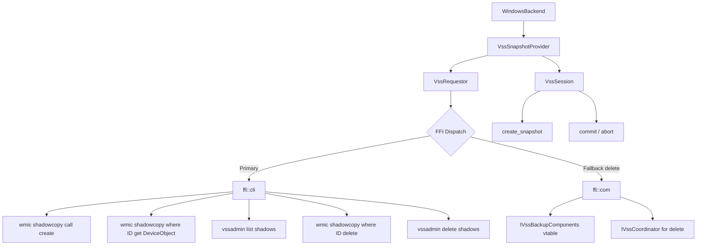
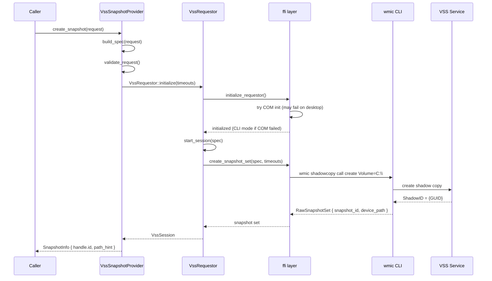
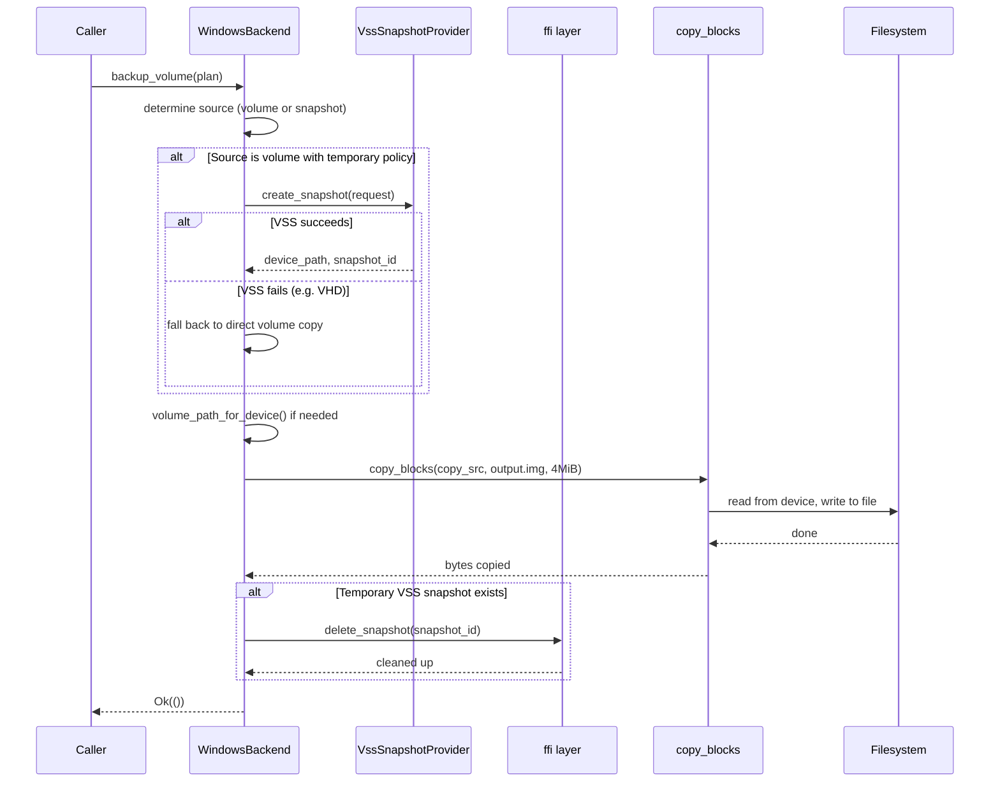
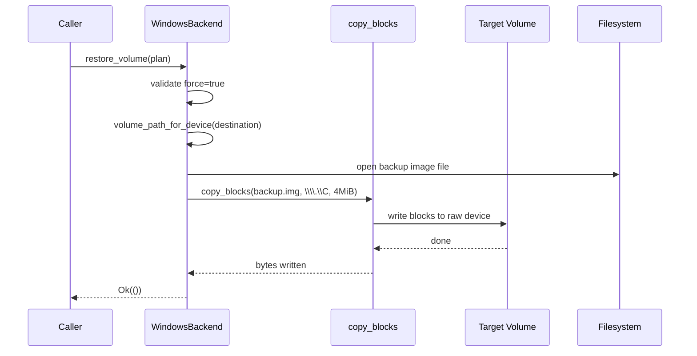
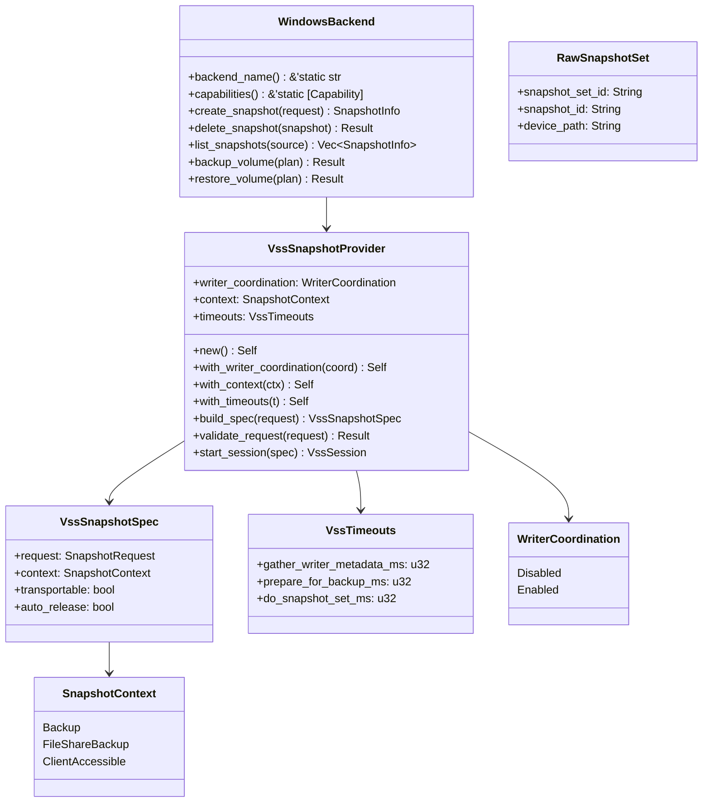

# Windows VSS Provider

The Windows VSS (Volume Shadow Copy Service) provider creates point-in-time snapshots of NTFS
volumes. It is the **only vpt-rs provider that supports application-consistent snapshots** by
coordinating with registered VSS writers (e.g. SQL Server, Exchange). The provider uses a
dual-path architecture: a CLI path (`wmic`/`vssadmin`) as the primary implementation, and a
COM API path as a fallback for deletion.

## Capabilities

| Capability | Supported | Notes |
|---|---|---|
| `crash_consistent_snapshot` | Yes | Via `wmic shadowcopy call create` |
| `application_consistent_snapshot` | Yes | Requires VSS writer coordination |
| `block_level_backup` | Yes | Via `copy_blocks` from snapshot device path |
| `block_level_restore` | Yes | Via `copy_blocks` to raw volume device |
| `incremental_send` | No | Every backup is a full block-level copy |
| `direct_device_access` | Yes | Converts drive letters to `\\.\C:` paths |
| `writable_snapshot_mount` | No | `mount_snapshot` returns `UnsupportedOperation` |
| `read_only_snapshot_mount` | No | `unmount` returns `UnsupportedOperation` |

:::tip
Application-consistent snapshots require VSS writer coordination to be enabled (the default).
If you explicitly disable writer coordination via `WriterCoordination::Disabled`, requesting
`SnapshotKind::ApplicationConsistent` returns a `MissingCapability` error.
:::

## Source Files

| File | Purpose |
|---|---|
| `src/platform/windows.rs` | `WindowsBackend` wrapper, backup/restore with VSS fallback |
| `src/platform/windows/vss.rs` | `VssSnapshotProvider`, session/context/timeout configuration |
| `src/platform/windows/vss/ffi.rs` | FFI dispatch layer: CLI primary, COM fallback |
| `src/platform/windows/vss/ffi/cli.rs` | CLI implementation using `wmic` and `vssadmin` |
| `src/platform/windows/vss/ffi/com.rs` | COM implementation using `IVssBackupComponents` vtable |
| `src/platform/windows/vss/requestor.rs` | `VssRequestor` that initializes COM and delegates to FFI |
| `src/platform/windows/vss/session.rs` | `VssSession` for commit/abort lifecycle |
| `src/copy.rs` | The `copy_blocks` function used for raw block I/O |

The provider is registered under the backend name `"windows-vss"` (`src/platform/windows/vss.rs:12`).

## Architecture Overview

The VSS provider is structured as a layered system. The `WindowsBackend` at the top delegates
to `VssSnapshotProvider`, which uses `VssRequestor` to initialize the FFI layer. The FFI layer
has two independent code paths: CLI (primary) and COM (fallback).



## Dual-Path Architecture (CLI vs COM)

The VSS FFI layer (`src/platform/windows/vss/ffi.rs`) uses two independent code paths to
interact with the Windows VSS subsystem. The design is documented in the module comment:

> On desktop Windows (Home/Pro), COM's `InitializeForBackup` fails due to interface version
> mismatches. The CLI path (`wmic` + `vssadmin`) works reliably on all editions.

### CLI Path (Primary)

The CLI path (`src/platform/windows/vss/ffi/cli.rs`) uses `wmic` for snapshot creation and
device path retrieval, and `vssadmin` for listing and deletion. This works on **all Windows
editions** (Home, Pro, Server) and does not require COM registration.

| Operation | Command | File:Line |
|---|---|---|
| Create snapshot | `wmic shadowcopy call create Volume=C:\\` | `src/platform/windows/vss/ffi/cli.rs:31` |
| Get device path | `wmic shadowcopy where ID='{GUID}' get DeviceObject` | `src/platform/windows/vss/ffi/cli.rs:170` |
| List snapshots | `vssadmin list shadows /for=C:\` | `src/platform/windows/vss/ffi/cli.rs:131` |
| Delete snapshot | `wmic shadowcopy where ID='{GUID}' delete` | `src/platform/windows/vss/ffi/cli.rs:78` |
| Delete fallback | `vssadmin delete shadows /shadow={GUID} /quiet` | `src/platform/windows/vss/ffi/cli.rs:93` |

The creation code (`src/platform/windows/vss/ffi/cli.rs:22`):

```rust
pub fn create_snapshot(volume_path: &str) -> Result<super::RawSnapshotSet> {
    let volume_wmic = format!(
        "{}\\\\",
        volume_path.trim_end_matches('\\').trim_end_matches('/')
    );
    info!(volume = %volume_path, "creating VSS snapshot via wmic");
    let output = Command::new("wmic")
        .args([
            "shadowcopy",
            "call",
            "create",
            &format!("Volume={volume_wmic}"),
        ])
        .output()
        .map_err(|e| Error::Message {
            message: format!("failed to run wmic: {e}"),
        })?;
    let stdout = decode_output(&output.stdout);
    if !output.status.success() || !stdout.contains("ReturnValue = 0") {
        warn!(stdout = %stdout.trim(), "wmic shadowcopy create failed");
        return Err(Error::Message {
            message: format!("wmic shadowcopy create failed: {}", stdout.trim()),
        });
    }
    let snapshot_id = parse_wmic_field(&stdout, "ShadowID").ok_or_else(|| Error::Message {
        message: format!("could not parse ShadowID from wmic output:\n{stdout}"),
    })?;
    // ... get device path ...
}
```

### COM Path (Fallback for Delete)

The COM path (`src/platform/windows/vss/ffi/com.rs`) dynamically loads `vssapi.dll` and calls
`CreateVssBackupComponentsInternal` to obtain an `IVssBackupComponents` interface. The COM
path is primarily used as a **fallback for deletion** when the CLI delete fails.

The dispatch logic in `ffi.rs` (`src/platform/windows/vss/ffi.rs:82`):

```rust
pub fn delete_snapshot(snapshot_id: &str) -> Result<()> {
    validate_snapshot_id(snapshot_id)?;
    match com::delete_snapshot(snapshot_id) {
        Ok(()) => return Ok(()),
        Err(e) => {
            warn!("COM delete failed ({}), trying CLI fallback", e);
        }
    }
    cli::delete_snapshot(snapshot_id)
}
```

And for initialization (`src/platform/windows/vss/ffi.rs:47`):

```rust
pub fn initialize_requestor() -> Result<()> {
    match com::initialize() {
        Ok(()) => {
            info!("VSS COM API initialized successfully");
            Ok(())
        }
        Err(e) => {
            warn!("COM init failed ({}), using CLI-only mode", e);
            cli::initialize()
        }
    }
}
```

:::caution
The COM vtable layout is empirically verified on Windows 10 build 19045. Some Windows editions
or future updates may have different vtable offsets, which can cause crashes. If you experience
issues, the CLI path is the safer option.
:::

### Snapshot Contexts

The VSS provider supports three snapshot contexts (`src/platform/windows/vss.rs:22`):

```rust
pub enum SnapshotContext {
    Backup,
    FileShareBackup,
    ClientAccessible,
}
```

| Context | Description | Use Case |
|---|---|---|
| `Backup` | Default. Coordinates with VSS writers for application consistency. | Regular backups |
| `FileShareBackup` | For file-share shadow copies. | Network share backups |
| `ClientAccessible` | Exposes snapshots to clients (e.g. Previous Versions). | End-user access |

## VssSnapshotProvider Configuration

The `VssSnapshotProvider` (`src/platform/windows/vss.rs:89`) supports several configuration
options:

```rust
pub struct VssSnapshotProvider {
    writer_coordination: WriterCoordination,
    context: SnapshotContext,
    timeouts: VssTimeouts,
}
```

### Writer Coordination

```rust
pub enum WriterCoordination {
    Disabled,
    Enabled,
}
```

When `Enabled` (the default), VSS asks registered writers (SQL Server, Exchange, etc.) to
quiesce their data before the snapshot. This produces application-consistent snapshots.
When `Disabled`, only crash-consistent snapshots are available.

### Timeouts

The `VssTimeouts` struct (`src/platform/windows/vss.rs:38`) controls async operation timeouts:

```rust
pub struct VssTimeouts {
    pub gather_writer_metadata_ms: u32,  // default: 15,000
    pub prepare_for_backup_ms: u32,      // default: 60,000
    pub do_snapshot_set_ms: u32,         // default: 60,000
}
```

| Timeout | Default | Controls |
|---|---|---|
| `gather_writer_metadata_ms` | 15s | Time to collect VSS writer metadata |
| `prepare_for_backup_ms` | 60s | Time for writers to prepare for backup |
| `do_snapshot_set_ms` | 60s | Time to create the snapshot set |

## GUID Validation

All snapshot IDs are validated as proper GUIDs before any VSS API call
(`src/platform/windows/vss/ffi.rs:19`):

```rust
fn validate_snapshot_id(id: &str) -> Result<()> {
    let trimmed = id.trim();
    if trimmed.starts_with('{')
        && trimmed.ends_with('}')
        && trimmed[1..trimmed.len() - 1].split('-').count() == 5
        && trimmed[1..trimmed.len() - 1]
            .chars()
            .all(|c| c.is_ascii_hexdigit() || c == '-')
    {
        Ok(())
    } else {
        Err(Error::InvalidArgument {
            message: format!(
                "invalid snapshot ID format (expected GUID like '{{12345678-ABCD-EF01-1122-334455667788}}'): `{id}`"
            ),
        })
    }
}
```

This validation:
- Requires the GUID to be wrapped in `{` and `}`
- Requires exactly 5 dash-separated segments
- Validates that all characters are hex digits or dashes
- Prevents command injection when passing IDs to `wmic`/`vssadmin`

:::warning
The GUID validation is a security measure. Snapshot IDs are interpolated into shell commands
(`wmic shadowcopy where ID='{id}'`), so malformed IDs could potentially inject arbitrary
commands. Always use snapshot IDs returned by the provider.
:::

## How Snapshots Work

### Creating a Snapshot

The `VssSnapshotProvider::create_snapshot` method builds a spec and starts a session
(`src/platform/windows/vss.rs:196`):

```rust
fn create_snapshot(&self, request: &SnapshotRequest) -> Result<SnapshotInfo> {
    let spec = self.build_spec(request.clone());
    let session = self.start_session(spec)?;
    session.create_snapshot()
}
```

The `start_session` method validates the request and initializes the FFI layer
(`src/platform/windows/vss.rs:167`):

```rust
pub fn start_session(&self, spec: VssSnapshotSpec) -> Result<session::VssSession> {
    self.validate_request(&spec.request)?;
    requestor::VssRequestor::initialize(self.timeouts)?.start_session(spec)
}
```

The validation (`src/platform/windows/vss.rs:135`) rejects `\\.\` device paths and
application-consistent requests when writer coordination is disabled:

```rust
pub fn validate_request(&self, request: &SnapshotRequest) -> Result<()> {
    if request.source.id.trim().is_empty() {
        return Err(Error::InvalidVolume { volume: request.source.id.clone() });
    }
    if request.source.id.starts_with(r"\\.\") {
        return Err(Error::InvalidArgument {
            message: format!(
                "VSS expects a volume GUID path or mounted volume path, got `{}`",
                request.source.id
            ),
        });
    }
    if matches!(
        (self.writer_coordination, request.kind),
        (WriterCoordination::Disabled, SnapshotKind::ApplicationConsistent)
    ) {
        return Err(Error::MissingCapability {
            capability: Capability::ApplicationConsistentSnapshot.as_str(),
            backend: BACKEND_NAME,
        });
    }
    Ok(())
}
```

The FFI `create_snapshot_set` function delegates to the CLI path
(`src/platform/windows/vss/ffi.rs:61`):

```rust
pub fn create_snapshot_set(
    spec: &super::VssSnapshotSpec,
    _timeouts: super::VssTimeouts,
) -> Result<RawSnapshotSet> {
    let volume = &spec.request.source.id;
    cli::create_snapshot(volume)
}
```



### Listing Snapshots

The `ffi::list_snapshots` function uses `vssadmin list shadows`
(`src/platform/windows/vss/ffi.rs:94`):

```rust
pub fn list_snapshots(source: &VolumeRef, backend: &'static str) -> Result<Vec<SnapshotInfo>> {
    cli::list_snapshots(source, backend)
}
```

The CLI implementation (`src/platform/windows/vss/ffi/cli.rs:125`) runs `vssadmin` and
parses the output:

```rust
pub fn list_snapshots(source: &VolumeRef, backend: &'static str) -> Result<Vec<SnapshotInfo>> {
    let volume_path = format!(
        "{}\\",
        source.id.trim_end_matches('\\').trim_end_matches('/')
    );
    let output = Command::new("vssadmin")
        .args(["list", "shadows", &format!("/for={volume_path}")])
        .output()
        .map_err(|e| Error::Message {
            message: format!("failed to run vssadmin: {e}"),
        })?;
    let stdout = decode_output(&output.stdout);
    let snapshots = parse_vssadmin_list_output(&stdout, &volume_path, backend);
    info!(volume = %volume_path, count = snapshots.len(), "VSS snapshots listed");
    Ok(snapshots)
}
```

The `parse_vssadmin_list_output` function (`src/platform/windows/vss/ffi/cli.rs:211`) is a
locale-independent parser that extracts GUIDs, device paths, and original volume information
from `vssadmin` output. It uses `extract_guid` to find GUID patterns and `matches_volume` for
case-insensitive volume matching:

```rust
fn parse_vssadmin_list_output(
    output: &str,
    volume_path: &str,
    backend: &'static str,
) -> Vec<SnapshotInfo> {
    let mut snapshots = Vec::new();
    let mut current_id: Option<String> = None;
    let mut current_original: Option<String> = None;
    let mut current_device: Option<String> = None;
    for line in output.lines() {
        let line = line.trim();
        if let Some(guid) = extract_guid(line) {
            let is_indented = line.starts_with("   ") || line.starts_with("\t");
            if is_indented {
                if let Some(prev_id) = current_id.take() {
                    if matches_volume(&current_original, volume_path) {
                        snapshots.push(SnapshotInfo { /* ... */ });
                    }
                }
                current_id = Some(guid);
                current_original = None;
                current_device = None;
            }
            continue;
        }
        if line.contains(r"\\?\GLOBALROOT\Device\") {
            // ... extract device path ...
        }
        if line.contains(r"\\?\Volume{") {
            // ... extract original volume ...
        }
    }
    // ... push final snapshot ...
    snapshots
}
```

### Deleting a Snapshot

The `ffi::delete_snapshot` function tries COM first, then falls back to CLI
(`src/platform/windows/vss/ffi.rs:82`):

```rust
pub fn delete_snapshot(snapshot_id: &str) -> Result<()> {
    validate_snapshot_id(snapshot_id)?;
    match com::delete_snapshot(snapshot_id) {
        Ok(()) => return Ok(()),
        Err(e) => {
            warn!("COM delete failed ({}), trying CLI fallback", e);
        }
    }
    cli::delete_snapshot(snapshot_id)
}
```

The CLI delete (`src/platform/windows/vss/ffi/cli.rs:75`) tries `wmic` first, then falls
back to `vssadmin`:

```rust
pub fn delete_snapshot(snapshot_id: &str) -> Result<()> {
    info!(snapshot_id = %snapshot_id, "deleting VSS snapshot via wmic");
    let output = Command::new("wmic")
        .args(["shadowcopy", "where", &format!("ID='{snapshot_id}'"), "delete"])
        .output()
        .map_err(|e| Error::Message {
            message: format!("failed to run wmic: {e}"),
        })?;
    if !output.status.success() {
        let stderr = decode_output(&output.stderr);
        let result = Command::new("vssadmin")
            .args(["delete", "shadows", &format!("/shadow={snapshot_id}"), "/quiet"])
            .output();
        // ... handle result ...
    }
    Ok(())
}
```

## How Backup Works

The `WindowsBackend::backup_volume` implementation (`src/platform/windows.rs:101`) handles
the full backup lifecycle with VSS fallback:

```rust
fn backup_volume(&self, plan: &BackupPlan) -> crate::error::Result<()> {
    let source_display = plan.source.to_string();
    info!(backend = self.backend_name(), source = %source_display, "backup_volume called");
    let result = (|| -> crate::error::Result<()> {
        let (copy_src, temp_snapshot_id) = match &plan.source {
            BackupSource::Snapshot(snapshot) => {
                let device_path = vss::ffi::get_snapshot_device_path(&snapshot.id)?;
                (std::path::PathBuf::from(device_path), None)
            }
            BackupSource::Volume(volume) => {
                match &plan.snapshot_policy {
                    SnapshotPolicy::Temporary { kind, label, .. } => {
                        let provider = vss::VssSnapshotProvider::new();
                        match provider.create_snapshot(&SnapshotRequest {
                            source: volume.clone(),
                            kind: *kind,
                            label: label.clone(),
                            read_only: true,
                        }) {
                            Ok(info) if info.path_hint.is_some() => {
                                let device_path = info.path_hint.as_ref().unwrap()
                                    .to_string_lossy().to_string();
                                if !device_path.trim().is_empty() {
                                    (PathBuf::from(&device_path), Some(info.handle.id))
                                } else {
                                    // ... fall back to direct copy ...
                                }
                            }
                            Err(e) => {
                                info!("VSS snapshot failed ({}), falling back to direct volume copy", e);
                                (PathBuf::from(volume_path_for_device(&volume.id)), None)
                            }
                            // ...
                        }
                    }
                    _ => { /* direct copy without snapshot */ }
                }
            }
        };
        let copy_dst = match &plan.target { /* ... */ };
        let block_size = plan.block_size.unwrap_or(crate::copy::DEFAULT_BLOCK_SIZE);
        let copy_result = crate::copy::copy_blocks(&copy_src, &copy_dst, block_size).map(|_| ());
        let cleanup_result = if let Some(snapshot_id) = &temp_snapshot_id {
            vss::ffi::delete_snapshot(snapshot_id).map(|_| ())
        } else { Ok(()) };
        match (copy_result, cleanup_result) { /* ... */ }
    })();
    // ...
}
```

The key design decision: if VSS snapshot creation fails (e.g. on VHD volumes or when the VSS
service is unavailable), the provider **falls back to direct volume copy** rather than failing.

### Volume Path Conversion

The `volume_path_for_device` function (`src/platform/windows.rs:321`) converts drive letters
to raw device paths for block-level I/O:

```rust
fn volume_path_for_device(id: &str) -> String {
    let trimmed = id.trim_end_matches('\\').trim_end_matches('/');
    if trimmed.len() == 2 && trimmed.as_bytes()[1] == b':' {
        format!(r"\\.\{}", trimmed)
    } else if trimmed.starts_with(r"\\?\Volume{") || trimmed.starts_with(r"\\.\Volume{") {
        trimmed.to_string()
    } else {
        trimmed.to_string()
    }
}
```

| Input | Output | Notes |
|---|---|---|
| `C:` | `\\.\C` | Drive letter to raw device |
| `C:\` | `\\.\C` | Trailing backslash stripped |
| `D:` | `\\.\D` | Drive letter to raw device |
| `\\?\Volume{GUID}\` | `\\?\Volume{GUID}` | Passed through (trailing `\` stripped) |



## How Restore Works

The `WindowsBackend::restore_volume` implementation (`src/platform/windows.rs:242`) validates
the source and destination, then uses `copy_blocks`:

```rust
fn restore_volume(&self, plan: &RestorePlan) -> crate::error::Result<()> {
    info!(backend = self.backend_name(), destination = %plan.destination, "restore_volume called");
    let result = (|| -> crate::error::Result<()> {
        let source = match &plan.source {
            crate::types::BackupTarget::ImageFile(path) => path.clone(),
            crate::types::BackupTarget::Device(path) => {
                return Err(crate::error::Error::InvalidArgument {
                    message: format!(
                        "vss restore currently supports only image-file sources, got `{}`",
                        path.display()
                    ),
                });
            }
        };
        if !plan.force {
            return Err(crate::error::Error::InvalidArgument {
                message: "vss restore requires `--force` because it overwrites the destination volume".to_string(),
            });
        }
        let destination = volume_path_for_device(&plan.destination.id);
        let block_size = plan.block_size.unwrap_or(crate::copy::DEFAULT_BLOCK_SIZE);
        crate::copy::copy_blocks(&source, std::path::Path::new(&destination), block_size)?;
        Ok(())
    })();
    // ...
}
```



## Internal Data Structures

### RawSnapshotSet

The result of a VSS snapshot creation (`src/platform/windows/vss/ffi.rs:39`):

```rust
#[derive(Debug, Clone)]
pub struct RawSnapshotSet {
    pub snapshot_set_id: String,
    pub snapshot_id: String,
    pub device_path: String,
}
```

### VssSnapshotSpec

Configuration for a snapshot creation request (`src/platform/windows/vss.rs:54`):

```rust
#[derive(Debug, Clone, PartialEq, Eq)]
pub struct VssSnapshotSpec {
    pub request: SnapshotRequest,
    pub context: SnapshotContext,
    pub transportable: bool,
    pub auto_release: bool,
}
```

### VssTimeouts

Timeout configuration for async VSS operations (`src/platform/windows/vss.rs:38`):

```rust
#[derive(Debug, Clone, Copy, PartialEq, Eq)]
pub struct VssTimeouts {
    pub gather_writer_metadata_ms: u32,
    pub prepare_for_backup_ms: u32,
    pub do_snapshot_set_ms: u32,
}
```



## Trait Implementations

### WindowsBackend

| Trait | File:Line | Notes |
|---|---|---|
| `Backend` | `src/platform/windows.rs:31` | Returns `"windows-vss"` and capabilities |
| `SnapshotProvider` | `src/platform/windows.rs:44` | Delegates to `VssSnapshotProvider` (when feature enabled) |
| `BackupExecutor` | `src/platform/windows.rs:100` | VSS snapshot + `copy_blocks` with fallback |
| `RestorePlanner` | `src/platform/windows.rs:241` | `copy_blocks` with `--force` required |
| `MountManager` | `src/platform/windows.rs:292` | Both methods return `UnsupportedOperation` |

### VssSnapshotProvider

| Trait | File:Line | Notes |
|---|---|---|
| `Backend` | `src/platform/windows/vss.rs:179` | Returns `"windows-vss"` and capabilities |
| `SnapshotProvider` | `src/platform/windows/vss.rs:195` | Full VSS lifecycle via session |

:::note
When the `windows-vss` Cargo feature is **not** enabled, all trait methods on `WindowsBackend`
return `UnsupportedOperation` errors (`src/platform/windows.rs:64-95`). This allows the crate
to compile on non-Windows platforms without VSS dependencies.
:::

## CLI Examples

### Query the current backend

```bash
vptcli snapshot backend
```

### List capabilities

```bash
vptcli snapshot capabilities --provider windows-vss
```

### Create a crash-consistent snapshot

```bash
vptcli snapshot create C: --provider windows-vss
```

### Create an application-consistent snapshot

```bash
vptcli snapshot create C: --provider windows-vss --kind application --label "pre-upgrade"
```

### List snapshots on a volume

```bash
vptcli snapshot list --provider windows-vss C:
```

### Delete a snapshot by GUID

```bash
vptcli snapshot delete --provider windows-vss {12345678-abcd-ef01-1122-334455667788}
```

### Backup a volume to an image file

```bash
vptcli backup C: --provider windows-vss --output E:\backups\c-drive.img
```

### Backup with custom block size

```bash
vptcli backup C: --provider windows-vss --output E:\backups\c-drive.img --block-size 8M
```

### Restore a volume from an image file

```bash
vptcli restore C: --provider windows-vss --input E:\backups\c-drive.img --force
```

## Rust Library Usage

### Creating a crash-consistent snapshot

```rust
use vpt_rs::{SnapshotRequest, SnapshotKind, VolumeRef, SnapshotProvider};
use vpt_rs::platform::windows::WindowsBackend;

let backend = WindowsBackend::new();
let request = SnapshotRequest {
    source: VolumeRef::new("C:"),
    kind: SnapshotKind::CrashConsistent,
    label: None,
    read_only: true,
};
let snapshot = backend.create_snapshot(&request)?;
println!("Snapshot ID: {}", snapshot.handle.id);
// Output: {12345678-abcd-ef01-1122-334455667788}
println!("Device path: {:?}", snapshot.path_hint);
// Output: Some("\\\\?\\GLOBALROOT\\Device\\HarddiskVolumeShadowCopy1")
```

### Creating an application-consistent snapshot

```rust
use vpt_rs::{SnapshotRequest, SnapshotKind, VolumeRef, SnapshotProvider};
use vpt_rs::platform::windows::WindowsBackend;

let backend = WindowsBackend::new();
let request = SnapshotRequest {
    source: VolumeRef::new("C:"),
    kind: SnapshotKind::ApplicationConsistent,
    label: Some("pre-migration".to_string()),
    read_only: true,
};
let snapshot = backend.create_snapshot(&request)?;
// VSS writers are coordinated to flush application data
```

### Using VssSnapshotProvider directly

```rust
use vpt_rs::platform::windows::vss::{
    VssSnapshotProvider, WriterCoordination, SnapshotContext, VssTimeouts,
};
use vpt_rs::{SnapshotRequest, SnapshotKind, VolumeRef, SnapshotProvider};

let provider = VssSnapshotProvider::new()
    .with_writer_coordination(WriterCoordination::Enabled)
    .with_context(SnapshotContext::Backup)
    .with_timeouts(VssTimeouts {
        gather_writer_metadata_ms: 15_000,
        prepare_for_backup_ms: 60_000,
        do_snapshot_set_ms: 60_000,
    });

let request = SnapshotRequest {
    source: VolumeRef::new("D:"),
    kind: SnapshotKind::CrashConsistent,
    label: None,
    read_only: true,
};
let spec = provider.build_spec(request);
let session = provider.start_session(spec)?;
let snapshot = session.create_snapshot()?;
```

### Backup a volume

```rust
use vpt_rs::{BackupPlan, BackupSource, BackupTarget, SnapshotPolicy, SnapshotKind, VolumeRef};
use vpt_rs::platform::windows::WindowsBackend;
use std::path::PathBuf;

let backend = WindowsBackend::new();
let plan = BackupPlan {
    source: BackupSource::Volume(VolumeRef::new("C:")),
    target: BackupTarget::ImageFile(PathBuf::from(r"E:\backups\c-drive.img")),
    snapshot_policy: SnapshotPolicy::temporary(
        SnapshotKind::CrashConsistent,
        Some("backup".to_string()),
        true,
    ),
    parent_snapshot: None,
    block_size: None,
};
backend.backup_volume(&plan)?;
```

### Restore a volume

```rust
use vpt_rs::{RestorePlan, BackupTarget, VolumeRef};
use vpt_rs::platform::windows::WindowsBackend;
use std::path::PathBuf;

let backend = WindowsBackend::new();
let plan = RestorePlan {
    source: BackupTarget::ImageFile(PathBuf::from(r"E:\backups\c-drive.img")),
    destination: VolumeRef::new("C:"),
    force: true,
    base_snapshot: None,
    block_size: None,
};
backend.restore_volume(&plan)?;
```

## Volume Path Formats

| Format | Example | Handled By | Notes |
|---|---|---|---|
| Drive letter | `C:` or `C:\` | `volume_path_for_device` | Converted to `\\.\C` for raw I/O |
| Volume GUID | `\\?\Volume{GUID}\` | `volume_path_for_device` | Passed through, trailing `\` stripped |
| Device path | `\\.\PhysicalDrive0` | `validate_request` | **Rejected** for snapshot creation |

:::danger
Device paths like `\\.\PhysicalDrive0` are rejected by the VSS provider because VSS operates
on volumes, not physical drives. Use drive letters or volume GUID paths instead. The rejection
happens in `validate_request` (`src/platform/windows/vss.rs:142`).
:::

## Limitations and Caveats

:::caution
Keep these limitations in mind when using the VSS provider:

- **COM vtable fragility**: The COM API path relies on empirically determined vtable offsets
  for `IVssBackupComponents`. These offsets may differ across Windows editions or updates.
  The CLI path (`wmic`/`vssadmin`) is more portable.
- **No incremental backup**: Unlike Btrfs and ZFS, there is no stream-diff mechanism. Every
  backup is a full block-level copy.
- **No mount/unmount**: The provider does not expose snapshot mount operations. Use Windows
  Disk Management or `mountvol` to access snapshot volumes manually.
- **Dynamic DLL loading**: The COM path loads `vssapi.dll` at runtime and searches for
  `CreateVssBackupComponentsInternal` by name. The export name varies across Windows editions
  (mangled C++ name on x64).
- **GUID validation**: Snapshot IDs must be valid GUIDs. Malformed identifiers are rejected
  before any VSS API call.
- **Image-file targets only**: Backup to raw block devices is not currently supported
  (`src/platform/windows.rs:185`).
:::

:::warning
The VSS fallback mechanism in `backup_volume` silently falls back to direct volume copy when
VSS is unavailable. This means the backup may be crash-consistent rather than
application-consistent, even if you requested application consistency. Check the logs for
"VSS snapshot failed" messages to detect this.
:::

:::tip
For the most reliable VSS behavior:
1. Run the backup process with Administrator privileges
2. Ensure the VSS service is running (`net start VSS`)
3. Use drive letters (`C:`) rather than volume GUID paths for simplicity
4. Set generous timeouts if backing up volumes with many VSS writers
:::

:::note
The `wmic` tool is deprecated in newer Windows versions. The VSS provider's CLI path uses
`wmic` for snapshot creation because it is the most portable command-line interface to VSS.
If `wmic` is removed in a future Windows release, the COM path will become the primary
implementation.
:::

## VSS COM Debug Notes

This section documents known issues with the COM API path. For the full technical analysis, see `TODO.md` in the project root.

### Known COM Issues

| # | Problem | Status |
|---|---------|--------|
| 1 | `CreateVssBackupComponents` not exported from `vssapi.dll` — must use `CreateVssBackupComponentsInternal` | ✅ Worked around via `GetProcAddress` |
| 2 | Vtable layout mismatch — `InitializeForBackup` at index 12, not 20 (SDK header) | ⚠️ Empirically verified, fragile |
| 3 | Post-init methods return `VSS_E_BAD_STATE` after successful `InitializeForBackup` | ❌ Blocks COM snapshot creation |
| 4 | `IVssCoordinator` vtable also shifted — `DeleteSnapshots` at index 11 | ✅ Works for deletion |
| 5 | `CVssBackupComponents` CLSID not registered — must use dynamic load | ✅ Worked around |

### Vtable Layout (Empirically Tested)

The vtable returned by `CreateVssBackupComponentsInternal` on Windows 10 Home build 19045:

| Index | Function | Result |
|-------|----------|--------|
| 0-2 | IUnknown | N/A |
| 3 | GetWriterMetadataCount | crash (write bad ptr) |
| 4 | GetWriterMetadata | VSS_E_BAD_STATE |
| 5 | FreeWriterMetadata | S_OK |
| **12** | **InitializeForBackup** | **S_OK** ✅ |
| 13 | Unknown | crash (read bad ptr) |
| 15 | Unknown | VSS_E_BAD_STATE |
| 18 | Unknown | VSS_E_BAD_STATE |
| 20 | Unknown | E_INVALIDARG |

:::danger
The vtable offsets are empirically determined and may differ across Windows editions. The COM snapshot creation path (`create_snapshot` in `com.rs`) is currently non-functional because post-init methods fail with `VSS_E_BAD_STATE`. Use the CLI path (wmic/vssadmin) for snapshot creation.
:::

### Hypotheses for COM Failures

1. **DLL version mismatch** — `vssapi.dll` on this system may have a different vtable layout than SDK headers target
2. **Extended interface** — `CreateVssBackupComponentsInternal` may return `IVssBackupComponentsEx4` with extra methods inserted
3. **COM apartment model** — `COINIT_APARTMENTTHREADED` might work where `COINIT_MULTITHREADED` fails
4. **VSS writer state** — failed writers could cause `VSS_E_BAD_STATE`
5. **Calling convention** — x64 should have one convention, but register state may differ

### Future Analysis Paths

- **Path A**: Compile C++ reference on target system, dump vtable addresses, compare
- **Path B**: Use `windows_core::imp::define_interface!` macro for correct vtable generation
- **Path C**: Use WMI `Win32_ShadowCopy` for ALL operations
- **Path D**: Query `IVssBackupComponentsEx` via `QueryInterface`
- **Path E**: Check VSS writer status (`vssadmin list writers`)
