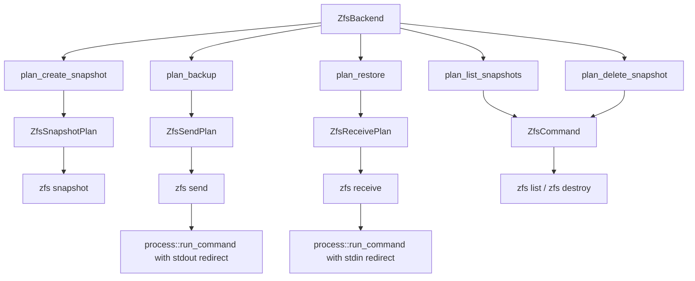
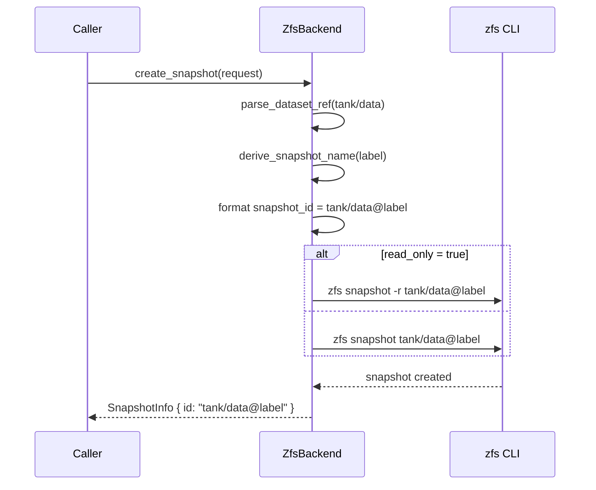
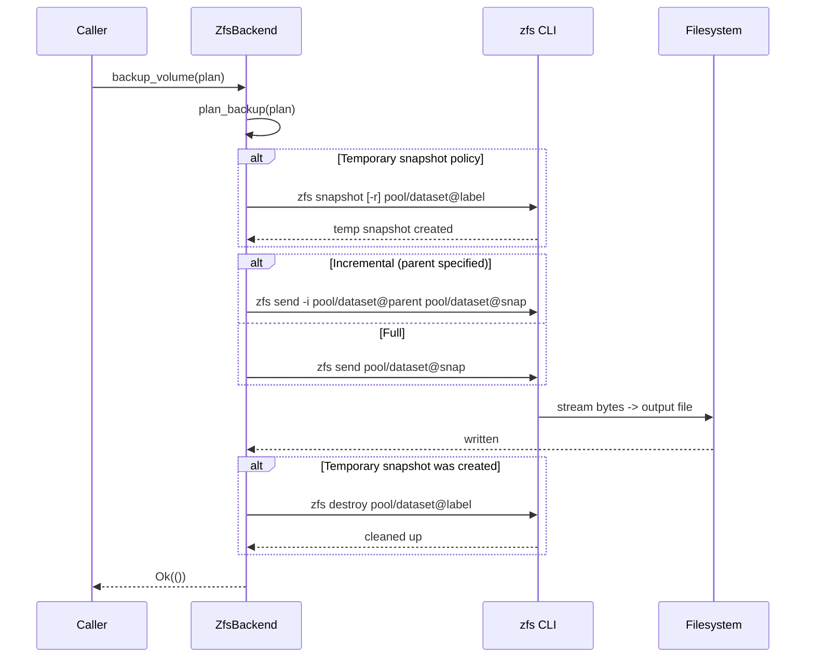
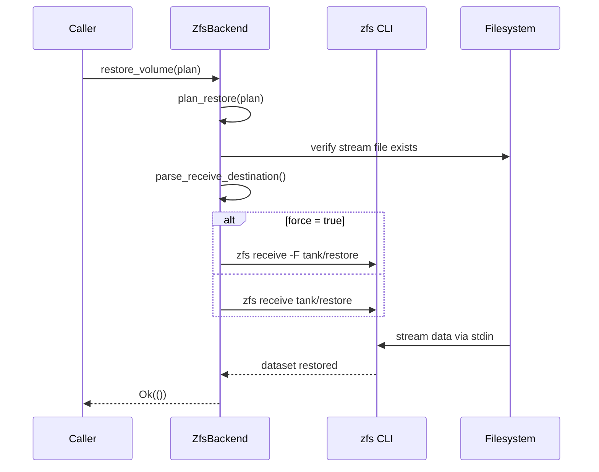
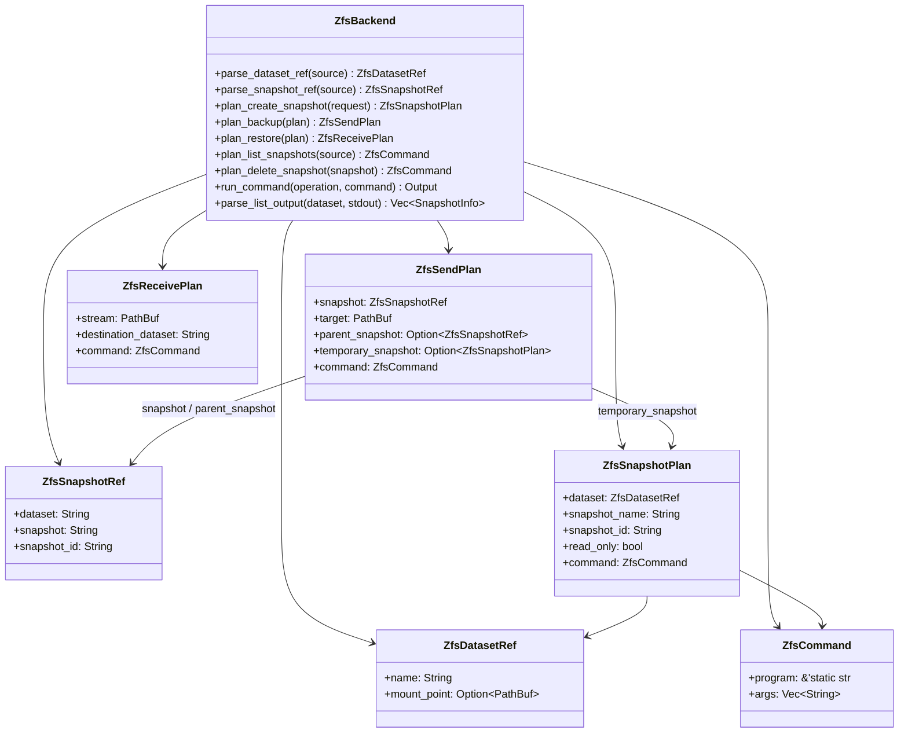

# ZFS Provider

The ZFS provider uses `zfs send` and `zfs receive` for stream-based backup of ZFS datasets.
It supports both full and incremental sends, making it efficient for regular backup schedules
where only changed blocks need to be transferred. ZFS snapshots are always read-only (an
inherent property of ZFS), and the provider leverages the ZFS `@` naming convention for
snapshot identification.

## Capabilities

| Capability | Supported | Notes |
|---|---|---|
| `crash_consistent_snapshot` | Yes | Uses `zfs snapshot` |
| `application_consistent_snapshot` | No | Returns `MissingCapability` error |
| `block_level_backup` | Yes | Via `zfs send` stream export |
| `block_level_restore` | Yes | Via `zfs receive` stream import |
| `incremental_send` | Yes | `zfs send -i <parent> <snap>` |
| `direct_device_access` | Yes | Operates on ZFS dataset names |
| `writable_snapshot_mount` | No | `mount_snapshot` returns `UnsupportedOperation` |
| `read_only_snapshot_mount` | No | `unmount` returns `UnsupportedOperation` |

:::info
The ZFS provider requires a snapshot source for `zfs send`. You must either pass an explicit
snapshot reference (e.g. `pool/data@snap1`) or use a temporary snapshot policy. Sending a live
dataset without a snapshot is not supported and returns an `InvalidArgument` error.
:::

## Source File

| File | Purpose |
|---|---|
| `src/platform/linux/zfs.rs` | Full provider implementation: snapshot, backup, restore, list, delete |

The provider is registered under the backend name `"linux-zfs"` (`src/platform/linux/zfs.rs:88`).

## Architecture Overview

ZFS uses a namespace-based naming scheme. Datasets are named like `pool/dataset` and snapshots
are named like `pool/dataset@snapshot_name`. The provider works with both bare dataset names
and mount paths, but enforces strict rules about which format is accepted for each operation.



## Dataset Reference Parsing

The provider parses two kinds of references: dataset names and snapshot identifiers.

### Dataset references (for snapshot creation, listing)

The `parse_dataset_ref` method (`src/platform/linux/zfs.rs:91`) accepts:

| Input | Result | Notes |
|---|---|---|
| `tank/data` | `name="tank/data"`, `mount_point=None` | Bare dataset name |
| `/tank/data` | `name="/tank/data"`, `mount_point=Some(...)` | Mount path, used as dataset name |
| `tank/data@snap1` | **Error** | Rejects snapshot identifiers |

```rust
pub fn parse_dataset_ref(&self, source: &VolumeRef) -> Result<ZfsDatasetRef> {
    let raw = source.id.trim();
    if raw.is_empty() {
        return Err(Error::InvalidVolume { volume: source.id.clone() });
    }
    if raw.contains('@') {
        return Err(Error::InvalidArgument {
            message: format!(
                "zfs provider expects a dataset name or mount path, not a snapshot id: `{raw}`"
            ),
        });
    }
    if raw.starts_with('/') {
        Ok(ZfsDatasetRef { name: raw.to_string(), mount_point: Some(PathBuf::from(raw)) })
    } else {
        Ok(ZfsDatasetRef { name: raw.to_string(), mount_point: None })
    }
}
```

### Snapshot references (for send, delete)

The `parse_snapshot_ref` method (`src/platform/linux/zfs.rs:174`) requires the `@` separator:

```rust
pub fn parse_snapshot_ref(&self, source: &VolumeRef) -> Result<ZfsSnapshotRef> {
    let raw = source.id.trim();
    if raw.is_empty() {
        return Err(Error::InvalidVolume { volume: source.id.clone() });
    }
    let Some((dataset, snapshot)) = raw.split_once('@') else {
        return Err(Error::InvalidArgument {
            message: format!(
                "zfs send requires a snapshot source like `pool/fs@snap`, got `{raw}`"
            ),
        });
    };
    if dataset.is_empty() || snapshot.is_empty() {
        return Err(Error::InvalidArgument {
            message: format!("invalid zfs snapshot identifier `{raw}`"),
        });
    }
    Ok(ZfsSnapshotRef {
        dataset: dataset.to_string(),
        snapshot: snapshot.to_string(),
        snapshot_id: raw.to_string(),
    })
}
```

### Receive destination parsing

The `parse_receive_destination` method (`src/platform/linux/zfs.rs:306`) enforces strict
rules:

| Input | Result |
|---|---|
| `tank/restore` | Accepted as dataset name |
| `/tank/restore` | **Error** -- mount paths are rejected |
| `tank/restore@snap` | **Error** -- snapshot identifiers are rejected |

```rust
fn parse_receive_destination(&self, destination: &VolumeRef) -> Result<String> {
    let raw = destination.id.trim();
    if raw.is_empty() {
        return Err(Error::InvalidVolume { volume: destination.id.clone() });
    }
    if raw.contains('@') {
        return Err(Error::InvalidArgument {
            message: format!("zfs receive expects a dataset destination, not a snapshot id: `{raw}`"),
        });
    }
    if raw.starts_with('/') {
        return Err(Error::InvalidArgument {
            message: format!("zfs receive expects a dataset name like `pool/fs`, not a mount path: `{raw}`"),
        });
    }
    Ok(raw.to_string())
}
```

:::caution
For `zfs receive`, the destination must be a dataset name like `pool/fs`. Mount paths (starting
with `/`) and snapshot identifiers (containing `@`) are rejected. This matches the behavior of
`zfs receive` itself, which operates in the ZFS namespace, not the filesystem namespace.
:::

## How Snapshots Work

### Creating a Snapshot

The `plan_create_snapshot` method constructs a `zfs snapshot` command
(`src/platform/linux/zfs.rs:120`):

```rust
pub fn plan_create_snapshot(&self, request: &SnapshotRequest) -> Result<ZfsSnapshotPlan> {
    if matches!(request.kind, SnapshotKind::ApplicationConsistent) {
        return Err(Error::MissingCapability {
            capability: Capability::ApplicationConsistentSnapshot.as_str(),
            backend: self.backend_name(),
        });
    }
    let dataset = self.parse_dataset_ref(&request.source)?;
    let snapshot_name = derive_snapshot_name(request.label.as_deref());
    let snapshot_id = format!("{}@{}", dataset.name, snapshot_name);
    let mut args = vec!["snapshot".to_string()];
    if request.read_only {
        args.push("-r".to_string());
    }
    args.push(snapshot_id.clone());
    Ok(ZfsSnapshotPlan {
        dataset,
        snapshot_name,
        snapshot_id,
        read_only: request.read_only,
        command: ZfsCommand::new(args),
    })
}
```

The snapshot name is derived from the label or a timestamp (`src/platform/linux/zfs.rs:544`):

```rust
fn derive_snapshot_name(label: Option<&str>) -> String {
    match label {
        Some(label) => sanitize_snapshot_segment(label),
        None => {
            let ts = SystemTime::now()
                .duration_since(UNIX_EPOCH)
                .map(|duration| duration.as_secs())
                .unwrap_or(0);
            format!("snapshot-{ts}")
        }
    }
}
```

The `SnapshotProvider::create_snapshot` trait implementation executes the plan
(`src/platform/linux/zfs.rs:397`):

```rust
fn create_snapshot(&self, request: &SnapshotRequest) -> Result<SnapshotInfo> {
    info!(backend = self.backend_name(), source = %request.source, read_only = request.read_only, "create_snapshot called");
    let result = (|| {
        let plan = self.plan_create_snapshot(request)?;
        self.run_command("create_snapshot", &plan.command)?;
        Ok(SnapshotInfo {
            handle: SnapshotHandle {
                id: plan.snapshot_id,
                source: Some(request.source.clone()),
            },
            backend: self.backend_name(),
            path_hint: plan.dataset.mount_point,
            read_only: plan.read_only,
        })
    })();
    if let Err(error) = &result {
        error!(backend = self.backend_name(), source = %request.source, error = %error, "create_snapshot failed");
    }
    result
}
```

The `-r` flag creates a **recursive snapshot** of the dataset and all its children. This is
useful for datasets with nested sub-datasets (e.g. `tank/data` with `tank/data/logs` and
`tank/data/db`).



### Deleting a Snapshot

The `plan_delete_snapshot` method builds a `zfs destroy` command
(`src/platform/linux/zfs.rs:146`):

```rust
pub fn plan_delete_snapshot(&self, snapshot: &SnapshotHandle) -> Result<ZfsCommand> {
    if snapshot.id.trim().is_empty() {
        return Err(Error::InvalidArgument {
            message: "snapshot id must not be empty".to_string(),
        });
    }
    Ok(ZfsCommand::new(vec![
        "destroy".to_string(),
        snapshot.id.clone(),
    ]))
}
```

### Listing Snapshots

The `plan_list_snapshots` method builds a `zfs list` command with tab-separated output
(`src/platform/linux/zfs.rs:159`):

```rust
pub fn plan_list_snapshots(&self, source: &VolumeRef) -> Result<(ZfsDatasetRef, ZfsCommand)> {
    let dataset = self.parse_dataset_ref(source)?;
    let command = ZfsCommand::new(vec![
        "list".to_string(),
        "-H".to_string(),
        "-t".to_string(),
        "snapshot".to_string(),
        "-o".to_string(),
        "name,mountpoint".to_string(),
        "-r".to_string(),
        dataset.name.clone(),
    ]);
    Ok((dataset, command))
}
```

The `-H` flag produces tab-separated, headerless output. The `-r` flag lists snapshots
recursively for all child datasets. The output is parsed by `parse_list_output`
(`src/platform/linux/zfs.rs:347`):

```rust
fn parse_list_output(&self, dataset: &ZfsDatasetRef, stdout: &[u8]) -> Vec<SnapshotInfo> {
    let mut snapshots = Vec::new();
    for line in String::from_utf8_lossy(stdout).lines() {
        let line = line.trim();
        if line.is_empty() { continue; }
        let mut parts = line.split('\t');
        let Some(name) = parts.next() else { continue; };
        let mountpoint = parts.next().unwrap_or("-");
        if !name.starts_with(&format!("{}@", dataset.name)) { continue; }
        let path_hint = match mountpoint {
            "-" | "legacy" | "none" => None,
            value => Some(PathBuf::from(value)),
        };
        snapshots.push(SnapshotInfo {
            handle: SnapshotHandle {
                id: name.to_string(),
                source: Some(VolumeRef::new(dataset.name.clone())),
            },
            backend: self.backend_name(),
            path_hint,
            read_only: true,
        });
    }
    snapshots
}
```

The parser filters for entries whose name starts with `{dataset}@` and treats `-`, `legacy`,
and `none` mountpoints as having no path hint.

## How Backup Works

### Plan Construction

The `plan_backup` method handles three source modes (`src/platform/linux/zfs.rs:203`):

1. **Explicit snapshot source** -- parses the `pool/fs@snap` reference directly.
2. **Volume source with `SnapshotPolicy::Temporary`** -- creates a temporary snapshot first,
   then sends it.
3. **Volume source with `SnapshotPolicy::Disabled`** -- **rejected** with an error, because
   `zfs send` always requires a snapshot.

```rust
pub fn plan_backup(&self, plan: &BackupPlan) -> Result<ZfsSendPlan> {
    let temporary_snapshot = match (&plan.source, &plan.snapshot_policy) {
        (BackupSource::Volume(volume), SnapshotPolicy::Temporary { kind, label, read_only }) => {
            Some(self.plan_create_snapshot(&SnapshotRequest {
                source: volume.clone(),
                kind: *kind,
                label: label.clone(),
                read_only: *read_only,
            })?)
        }
        _ => None,
    };
    let snapshot = match (&plan.source, &plan.snapshot_policy) {
        (BackupSource::Snapshot(snapshot), _) => {
            self.parse_snapshot_ref(&VolumeRef::new(snapshot.id.clone()))?
        }
        (BackupSource::Volume(_), SnapshotPolicy::Temporary { .. }) => {
            self.parse_snapshot_ref(&VolumeRef::new(
                temporary_snapshot.as_ref().unwrap().snapshot_id.clone(),
            ))?
        }
        (BackupSource::Volume(volume), SnapshotPolicy::Disabled) => {
            return Err(Error::InvalidArgument {
                message: format!(
                    "zfs send backup requires a snapshot source or temporary snapshot policy for `{}`",
                    volume
                ),
            });
        }
    };
    let parent_snapshot = match &plan.parent_snapshot {
        Some(snapshot) => Some(self.parse_snapshot_ref(&VolumeRef::new(snapshot.id.clone()))?),
        None => None,
    };
    let mut args = vec!["send".to_string()];
    if let Some(parent) = &parent_snapshot {
        args.push("-i".to_string());
        args.push(parent.snapshot_id.clone());
    }
    args.push(snapshot.snapshot_id.clone());
    let command = ZfsCommand::new(args);
    Ok(ZfsSendPlan {
        snapshot, target, parent_snapshot, temporary_snapshot, command,
    })
}
```

Note the difference from Btrfs: ZFS uses `-i` for incremental send, while Btrfs uses `-p`.

### Execution

The `BackupExecutor::backup_volume` implementation executes the send plan
(`src/platform/linux/zfs.rs:447`):

```rust
fn backup_volume(&self, plan: &BackupPlan) -> Result<()> {
    info!(backend = self.backend_name(), source = %plan.source, "backup_volume called");
    let send_plan = match self.plan_backup(plan) {
        Ok(plan) => plan,
        Err(error) => {
            error!(...);
            return Err(error);
        }
    };
    if let Some(snapshot_plan) = &send_plan.temporary_snapshot
        && let Err(error) = self.run_command("create_snapshot", &snapshot_plan.command)
    {
        error!(...);
        return Err(error);
    }
    let result = (|| {
        process::run_command(
            self.backend_name(),
            "backup_volume",
            send_plan.command.program,
            &send_plan.command.args,
            CommandIo {
                stdin_file: None,
                stdout_file: Some(send_plan.target.clone()),
            },
        )?;
        Ok(())
    })();
    if let Some(snapshot_plan) = &send_plan.temporary_snapshot
        && let Err(cleanup_err) = self.run_command(
            "delete_snapshot",
            &ZfsCommand::new(vec!["destroy".to_string(), snapshot_plan.snapshot_id.clone()]),
        )
    {
        tracing::warn!(...);
    }
    if let Err(error) = &result {
        error!(...);
    }
    result
}
```



## How Restore Works

The `plan_restore` method validates the stream file and destination dataset
(`src/platform/linux/zfs.rs:275`):

```rust
pub fn plan_restore(&self, plan: &RestorePlan) -> Result<ZfsReceivePlan> {
    let stream = match &plan.source {
        crate::types::BackupTarget::ImageFile(path) => path.clone(),
        crate::types::BackupTarget::Device(path) => {
            return Err(Error::InvalidArgument {
                message: format!(
                    "zfs receive restore requires an image file source, got device `{}`",
                    path.display()
                ),
            });
        }
    };
    if !stream.exists() {
        return Err(Error::MissingPath { path: stream });
    }
    let destination_dataset = self.parse_receive_destination(&plan.destination)?;
    let mut args = vec!["receive".to_string()];
    if plan.force {
        args.push("-F".to_string());
    }
    args.push(destination_dataset.clone());
    Ok(ZfsReceivePlan { stream, destination_dataset, command: ZfsCommand::new(args) })
}
```

When `force` is set, the `-F` flag is passed to `zfs receive`, which forces a rollback of the
destination dataset to the received state. This is necessary when the destination already
exists and has been modified.

The `RestorePlanner::restore_volume` implementation pipes the stream into `zfs receive`
(`src/platform/linux/zfs.rs:500`):

```rust
fn restore_volume(&self, plan: &RestorePlan) -> Result<()> {
    info!(backend = self.backend_name(), destination = %plan.destination, "restore_volume called");
    let result = (|| {
        let receive_plan = self.plan_restore(plan)?;
        process::run_command(
            self.backend_name(),
            "restore_volume",
            receive_plan.command.program,
            &receive_plan.command.args,
            CommandIo {
                stdin_file: Some(receive_plan.stream.clone()),
                stdout_file: None,
            },
        )?;
        Ok(())
    })();
    if let Err(error) = &result {
        error!(...);
    }
    result
}
```



## Internal Data Structures

### ZfsDatasetRef

Represents a parsed ZFS dataset reference (`src/platform/linux/zfs.rs:34`):

```rust
#[derive(Debug, Clone, PartialEq, Eq)]
pub struct ZfsDatasetRef {
    pub name: String,
    pub mount_point: Option<PathBuf>,
}
```

### ZfsSnapshotRef

Represents a parsed ZFS snapshot reference with `@` separator
(`src/platform/linux/zfs.rs:55`):

```rust
#[derive(Debug, Clone, PartialEq, Eq)]
pub struct ZfsSnapshotRef {
    pub dataset: String,
    pub snapshot: String,
    pub snapshot_id: String,
}
```

### ZfsCommand

Wraps a `zfs` CLI invocation (`src/platform/linux/zfs.rs:40`):

```rust
#[derive(Debug, Clone, PartialEq, Eq)]
pub struct ZfsCommand {
    pub program: &'static str,
    pub args: Vec<String>,
}
```

### ZfsSnapshotPlan

Represents a planned snapshot creation (`src/platform/linux/zfs.rs:46`):

```rust
#[derive(Debug, Clone, PartialEq, Eq)]
pub struct ZfsSnapshotPlan {
    pub dataset: ZfsDatasetRef,
    pub snapshot_name: String,
    pub snapshot_id: String,
    pub read_only: bool,
    pub command: ZfsCommand,
}
```

### ZfsSendPlan

Represents a planned backup operation (`src/platform/linux/zfs.rs:62`):

```rust
#[derive(Debug, Clone, PartialEq, Eq)]
pub struct ZfsSendPlan {
    pub snapshot: ZfsSnapshotRef,
    pub target: PathBuf,
    pub parent_snapshot: Option<ZfsSnapshotRef>,
    pub temporary_snapshot: Option<ZfsSnapshotPlan>,
    pub command: ZfsCommand,
}
```

### ZfsReceivePlan

Represents a planned restore operation (`src/platform/linux/zfs.rs:71`):

```rust
#[derive(Debug, Clone, PartialEq, Eq)]
pub struct ZfsReceivePlan {
    pub stream: PathBuf,
    pub destination_dataset: String,
    pub command: ZfsCommand,
}
```



## Trait Implementations

| Trait | File:Line | Notes |
|---|---|---|
| `Backend` | `src/platform/linux/zfs.rs:386` | Returns `"linux-zfs"` and capabilities |
| `SnapshotProvider` | `src/platform/linux/zfs.rs:396` | `create_snapshot`, `delete_snapshot`, `list_snapshots` |
| `BackupExecutor` | `src/platform/linux/zfs.rs:446` | `backup_volume` with temp snapshot + send + cleanup |
| `RestorePlanner` | `src/platform/linux/zfs.rs:500` | `restore_volume` with optional `-F` force flag |
| `MountManager` | `src/platform/linux/zfs.rs:524` | Both methods return `UnsupportedOperation` |

## CLI Examples

### Create a snapshot

```bash
vptcli snapshot create tank/data --provider linux-zfs --label "nightly"
```

### Create a recursive snapshot

```bash
vptcli snapshot create tank/data --provider linux-zfs --label "full" --recursive
```

### List snapshots for a dataset

```bash
vptcli snapshot list --provider linux-zfs tank/data
```

### Delete a snapshot

```bash
vptcli snapshot delete --provider linux-zfs tank/data@nightly
```

### Full backup with automatic temporary snapshot

```bash
vptcli backup tank/data \
  --provider linux-zfs \
  --output /backup/data.zfs \
  --snapshot-label "backup"
```

### Backup from an existing snapshot

```bash
vptcli backup tank/data@snap1 \
  --provider linux-zfs \
  --snapshot-source \
  --output /backup/snap1.zfs
```

### Incremental backup

```bash
vptcli backup tank/data@snap2 \
  --provider linux-zfs \
  --snapshot-source \
  --output /backup/incr.zfs \
  --parent-snapshot tank/data@snap1
```

### Restore to a dataset

```bash
vptcli restore tank/restore \
  --provider linux-zfs \
  --input /backup/data.zfs \
  --force
```

## Rust Library Usage

### Creating a snapshot

```rust
use vpt_rs::{SnapshotRequest, SnapshotKind, VolumeRef, SnapshotProvider};
use vpt_rs::platform::linux::zfs::ZfsBackend;

let backend = ZfsBackend::new();
let request = SnapshotRequest {
    source: VolumeRef::new("tank/data"),
    kind: SnapshotKind::CrashConsistent,
    label: Some("nightly".to_string()),
    read_only: true,
};
let snapshot = backend.create_snapshot(&request)?;
println!("Snapshot ID: {}", snapshot.handle.id);
// Output: tank/data@nightly
```

### Full backup with temporary snapshot

```rust
use vpt_rs::{BackupPlan, BackupSource, BackupTarget, SnapshotPolicy, SnapshotKind, VolumeRef};
use vpt_rs::platform::linux::zfs::ZfsBackend;
use std::path::PathBuf;

let backend = ZfsBackend::new();
let plan = BackupPlan {
    source: BackupSource::Volume(VolumeRef::new("tank/data")),
    target: BackupTarget::ImageFile(PathBuf::from("/backup/data.zfs")),
    snapshot_policy: SnapshotPolicy::temporary(
        SnapshotKind::CrashConsistent,
        Some("backup".to_string()),
        true,
    ),
    parent_snapshot: None,
    block_size: None,
};
backend.backup_volume(&plan)?;
```

### Incremental backup

```rust
use vpt_rs::{BackupPlan, BackupSource, BackupTarget, SnapshotPolicy, SnapshotRef, VolumeRef};
use vpt_rs::platform::linux::zfs::ZfsBackend;
use std::path::PathBuf;

let backend = ZfsBackend::new();
let plan = BackupPlan {
    source: BackupSource::Snapshot(
        SnapshotRef::new("tank/data@snap2")
            .with_origin(VolumeRef::new("tank/data")),
    ),
    target: BackupTarget::ImageFile(PathBuf::from("/backup/incr.zfs")),
    snapshot_policy: SnapshotPolicy::disabled(),
    parent_snapshot: Some(
        SnapshotRef::new("tank/data@snap1")
            .with_origin(VolumeRef::new("tank/data")),
    ),
    block_size: None,
};
backend.backup_volume(&plan)?;
```

### Restore to a dataset

```rust
use vpt_rs::{RestorePlan, BackupTarget, VolumeRef};
use vpt_rs::platform::linux::zfs::ZfsBackend;
use std::path::PathBuf;

let backend = ZfsBackend::new();
let plan = RestorePlan {
    source: BackupTarget::ImageFile(PathBuf::from("/backup/data.zfs")),
    destination: VolumeRef::new("tank/restore"),
    force: true,
    base_snapshot: None,
    block_size: None,
};
backend.restore_volume(&plan)?;
```

## Snapshot Command Reference

| Operation | CLI Command | Notes |
|---|---|---|
| Create snapshot | `zfs snapshot [-r] pool/dataset@name` | `-r` for recursive |
| List snapshots | `zfs list -H -t snapshot -o name,mountpoint -r pool/dataset` | Tab-separated |
| Delete snapshot | `zfs destroy pool/dataset@name` | Destructive |
| Full send | `zfs send pool/dataset@snap` | Stream to stdout |
| Incremental send | `zfs send -i pool/dataset@parent pool/dataset@snap` | `-i` not `-p` |
| Receive | `zfs receive [-F] pool/dataset` | `-F` to force rollback |

:::note
ZFS uses `-i` for incremental send (send the difference between parent and target snapshots),
while Btrfs uses `-p` for the same concept. This is a common source of confusion when
switching between providers.
:::

## Limitations and Caveats

:::caution
Keep these limitations in mind when using the ZFS provider:

- **Snapshot source required**: `zfs send` requires a snapshot reference (`pool/fs@snap`).
  Passing a bare dataset name without a snapshot policy returns an `InvalidArgument` error
  (`src/platform/linux/zfs.rs:234`).
- **No mount/unmount support**: The provider returns `UnsupportedOperation` for mount
  operations. Access ZFS snapshots via the `.zfs/snapshot/` directory manually.
- **No application-consistent snapshots**: Requesting `SnapshotKind::ApplicationConsistent`
  returns a `MissingCapability` error (`src/platform/linux/zfs.rs:121`).
- **Dataset names only for restore**: `zfs receive` requires a dataset name like `pool/fs`.
  Mount paths (e.g. `/tank/data`) and snapshot identifiers (containing `@`) are rejected
  (`src/platform/linux/zfs.rs:306`).
- **Stream-based only**: Backup and restore use image files. Raw block device targets are
  not supported.
:::

:::warning
When using `force` mode with `zfs receive -F`, the destination dataset is rolled back to
match the received stream. Any data on the destination that is not in the stream is lost.
Ensure the destination is correct before using `--force`.
:::

:::tip
For datasets with many child datasets, use the `-r` (recursive) flag on snapshot creation.
This ensures all child datasets are snapshotted atomically at the same point in time. The
ZFS provider passes `-r` when `read_only` is set to `true` in the snapshot request.
:::

:::note
The ZFS provider supports five capabilities, including `DirectDeviceAccess`. This means it
can work with both dataset names (ZFS namespace) and mount paths (filesystem namespace) for
snapshot creation. However, restore destinations must always be dataset names.
:::
