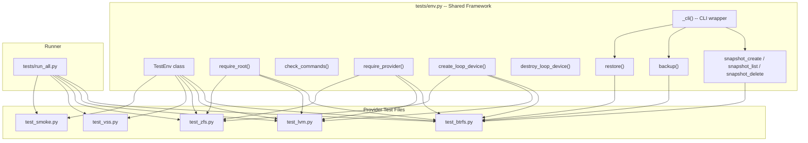
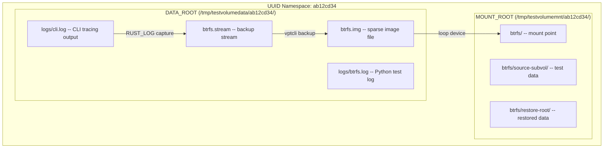
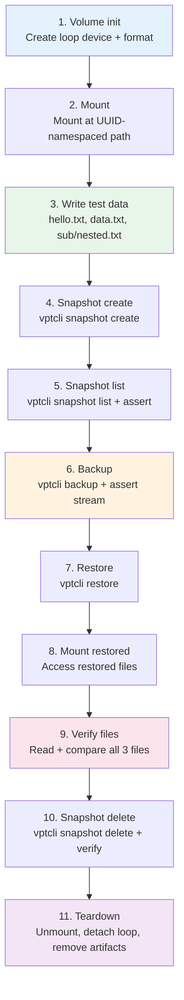
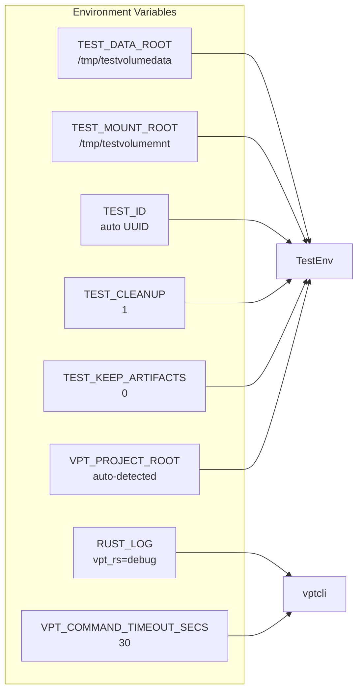
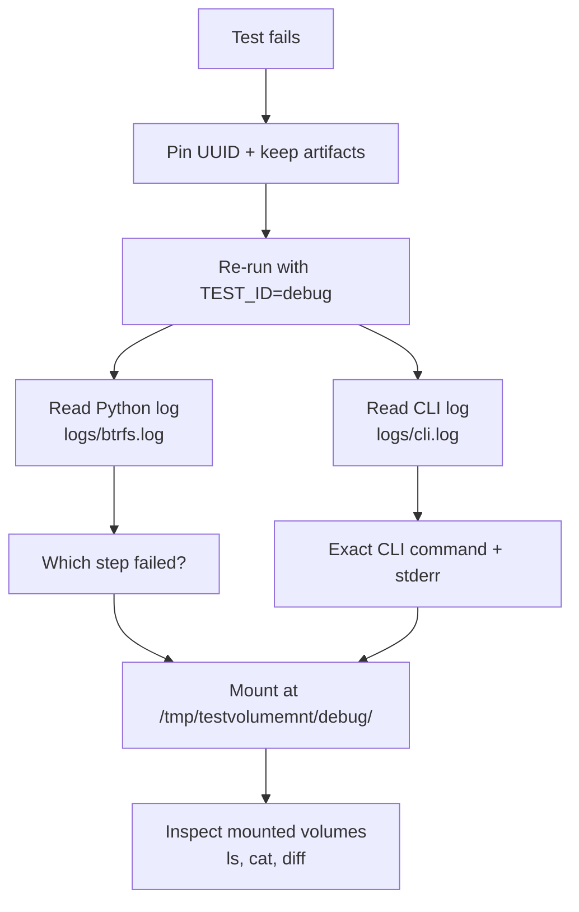

# Integration Test Guide

The integration tests exercise `vptcli` end-to-end against real storage
providers. They are written in Python and use loop devices (Linux) or VHD
files (Windows) to create disposable volumes that are torn down after each
test run.

## Test Framework Architecture

All tests share a common framework defined in `tests/env.py`. This module
provides privilege detection, command availability checks, UUID-based artifact
isolation, loop device lifecycle management, CLI wrappers for `vptcli`
subcommands, and structured logging.



### Key components of `tests/env.py`

The `TestEnv` class (`tests/env.py:177-299`) is the central object that
manages the test lifecycle. It handles:

- **Directory management**: Creates UUID-namespaced data and mount directories
  under `TEST_DATA_ROOT` and `TEST_MOUNT_ROOT`.
- **Logging**: Provides per-test loggers that write to both a file and the
  console.
- **CLI tracing capture**: All `RUST_LOG=debug` output from `vptcli`
  invocations is captured and appended to `cli.log`.

```python
# tests/env.py:177-199
class TestEnv:
    def __init__(self):
        self.data_root = Path(
            os.environ.get("TEST_DATA_ROOT", DATA_ROOT_DEFAULT)
        )
        self.mount_root = Path(
            os.environ.get("TEST_MOUNT_ROOT", MOUNT_ROOT_DEFAULT)
        )
        self.cleanup = os.environ.get("TEST_CLEANUP", "1") == "1"
        self.keep_artifacts = (
            os.environ.get("TEST_KEEP_ARTIFACTS", "0") == "1"
        )
        self.test_id = os.environ.get("TEST_ID") or str(uuid.uuid4())[:8]
        self.project_root = find_project_root()
        self.bin_dir = find_bin_dir()
        os.environ.setdefault("RUST_LOG", "vpt_rs=debug")
        ensure_built(self.bin_dir)
```

## UUID-Based Test Isolation

Every test run gets a unique 8-character UUID prefix. All artifacts -- images,
streams, mount points, and logs -- are namespaced under this UUID so parallel
or overlapping runs never collide. The UUID is auto-generated unless `TEST_ID`
is set in the environment.



The directory layout for a Btrfs test run looks like this:

```
/tmp/testvolumedata/ab12cd34/
    logs/
        btrfs.log              # Python step-by-step output
        cli.log                # vptcli tracing (RUST_LOG=debug)
    btrfs.img                  # Sparse image file (2 GB)
    btrfs.stream               # Backup stream output

/tmp/testvolumemnt/ab12cd34/
    btrfs/
        source-subvol/         # Original test data
        restore-root/          # Restored subvolume
```

## The 11-Step Test Lifecycle

Every provider test follows the same 11-step lifecycle. This ensures
consistent coverage across Btrfs, LVM, ZFS, and VSS:



| Step | CLI / System commands | Assertions |
|---|---|---|
| 1. Volume init | `truncate -s 2G`, `losetup --find --show`, `mkfs.btrfs -f` | Loop device path is non-empty |
| 2. Mount | `mount <loop> <mount>` | Mount succeeds (exit 0) |
| 3. Write data | `btrfs subvolume create`, `echo ... > hello.txt` | Files exist |
| 4. Snapshot create | `vptcli snapshot create --provider <P>` | Exit code 0 |
| 5. Snapshot list | `vptcli snapshot list --provider <P>` | Snapshot label appears in output |
| 6. Backup | `vptcli backup --provider <P> --output <stream>` | Exit 0, stream file exists, size > 0 |
| 7. Restore | `vptcli restore --provider <P> --input <stream>` | Exit code 0 |
| 8. Mount restored | Access files in restore directory | -- |
| 9. Verify files | `rglob("*.txt")`, `read_text()` | Content matches source data |
| 10. Snapshot delete | `vptcli snapshot delete --provider <P>` | Snapshot gone from list |
| 11. Teardown | `umount`, `losetup -d`, `rm` | Artifacts cleaned up |

## Provider-Specific Tests

### Btrfs (`tests/test_btrfs.py`)

The Btrfs test creates a btrfs filesystem on a loop device, creates a
subvolume, writes test data, and exercises the full snapshot-backup-restore
cycle.

From `tests/test_btrfs.py:33-151`:

```python
def test_btrfs_roundtrip(env: TestEnv):
    """Full lifecycle: init, mount, snapshot, backup, restore, verify, cleanup."""
    log = env.get_logger("btrfs")

    img = env.data_path("btrfs.img")
    mount = env.mount_path("btrfs")
    source_subvol = mount / "source-subvol"
    restore_root = mount / "restore-root"
    stream = env.data_path("btrfs.stream")
    loop_dev = None

    try:
        # Step 1: volume init
        loop_dev = create_loop_device(img)
        run_cmd(["mkfs.btrfs", "-f", loop_dev])

        # Step 2: mount
        env.mkdir(mount)
        run_cmd(["mount", loop_dev, str(mount)])

        # Step 3: write source data
        run_cmd(["btrfs", "subvolume", "create", str(source_subvol)])
        env.mkdir(restore_root)
        run_cmd(["bash", "-c",
            f"echo 'hello-from-btrfs' > '{source_subvol}/hello.txt' && "
            f"echo 'line2-data' > '{source_subvol}/data.txt' && "
            f"mkdir -p '{source_subvol}/sub' && "
            f"echo 'nested-file' > '{source_subvol}/sub/nested.txt'"
        ])

        # Step 4-5: snapshot create + list
        rc, out, err = snapshot_create(env, "btrfs", str(source_subvol), label="integ")
        assert rc == 0
        rc, out, err = snapshot_list(env, "btrfs", str(source_subvol))
        assert rc == 0
        assert "integ" in out

        # Step 6: backup
        rc, out, err = backup(env, "btrfs", str(source_subvol), str(stream))
        assert rc == 0
        assert stream.is_file()
        assert stream.stat().st_size > 0

        # Step 7-9: restore + verify
        rc, out, err = restore(env, "btrfs", str(stream), str(restore_root))
        assert rc == 0

        restored_hello = list(restore_root.rglob("hello.txt"))
        assert len(restored_hello) > 0
        assert restored_hello[0].read_text().strip() == "hello-from-btrfs"
        # ... verify data.txt and nested.txt

        # Step 10: snapshot delete
        snap_path = mount / ".vb-snapshots" / "integ"
        rc, out, err = snapshot_delete(env, "btrfs", str(snap_path))
        assert rc == 0

    finally:
        # Step 11: teardown
        if mount.exists():
            run_cmd(["umount", str(mount)], check=False)
        if loop_dev:
            destroy_loop_device(loop_dev)
        if not env.keep_artifacts:
            img.unlink(missing_ok=True)
            stream.unlink(missing_ok=True)
        env.cleanup_mount(mount)
```

Key details:
- **Init**: `truncate` -> loop device -> `mkfs.btrfs -f` -> mount -> `btrfs subvolume create`
- **Backup**: Auto-creates temporary snapshot, runs `btrfs send`, cleans up temp snapshot
- **Restore**: Runs `btrfs receive` into a restore directory
- **Verify**: Uses `rglob("*.txt")` to find files in the received subvolume
- **Temp snapshot cleanup**: Asserts no temporary snapshots remain after backup

### LVM (`tests/test_lvm.py`)

- **Init**: `truncate` -> loop -> `pvcreate` -> `vgcreate` -> 2x `lvcreate -L 512M` -> `mkfs.ext4`
- **Backup**: Auto-creates LVM snapshot, runs `dd` to image file, cleans up snapshot
- **Restore**: Runs `dd` image into destination LV with `--force`
- **Verify**: Mounts restored LV, reads files with `cat`, unmounts

### ZFS (`tests/test_zfs.py`)

- **Init**: `truncate` -> loop -> `zpool create -f` -> 2x `zfs create`
- **Backup**: Runs `zfs send` on explicit snapshot (`--snapshot-source`)
- **Restore**: Runs `zfs receive -F` into restore dataset
- **Verify**: Reads files from the auto-mounted restored dataset

### VSS (`tests/test_vss.py`) -- Windows only

- **Init**: `diskpart` creates VHD, attaches, formats NTFS
- **Snapshot**: COM API with fallback to `wmic`/`vssadmin` CLI
- **Backup**: COM snapshot + direct volume copy fallback
- **Restore**: Detach target VHD, raw block copy of backup.img, re-mount
- **Verify**: `Path.read_text()` on all 3 files

## CLI Wrapper Functions

The `tests/env.py` module provides wrapper functions that call `vptcli` and
capture tracing output to `cli.log`:

```python
# tests/env.py:328-398
def _cli(env: TestEnv, tool: str, args: List[str]) -> Tuple[int, str, str]:
    """Run a vpt CLI tool. Captures tracing output (stderr) to cli.log."""
    rc, stdout, stderr = run_cmd([str(env.bin_dir / tool)] + args, check=False)
    env._write_cli_log(tool, args, stderr)
    return rc, stdout, stderr

def snapshot_create(env, provider, volume, label=None, read_only=True):
    args = ["snapshot", "create", "--provider", provider]
    if label:
        args += ["--label", label]
    if not read_only:
        args += ["--read-write"]
    args.append(volume)
    return _cli(env, "vptcli", args)

def snapshot_list(env, provider, volume):
    return _cli(env, "vptcli", ["snapshot", "list", "--provider", provider, volume])

def snapshot_delete(env, provider, snapshot_id):
    return _cli(env, "vptcli", ["snapshot", "delete", "--provider", provider, snapshot_id])

def backup(env, provider, source, output, snapshot_source=False):
    args = ["backup", "--provider", provider, "--output", output]
    if snapshot_source:
        args.append("--snapshot-source")
    args.append(source)
    return _cli(env, "vptcli", args)

def restore(env, provider, input_file, destination, force=False):
    args = ["restore", "--provider", provider, "--input", input_file]
    if force:
        args.append("--force")
    args.append(destination)
    return _cli(env, "vptcli", args)
```

Each wrapper returns `(returncode, stdout, stderr)` as a tuple, making it
easy to assert on exit codes and output content.

## Environment Variables

| Variable | Default | Description |
|---|---|---|
| `TEST_DATA_ROOT` | `/tmp/testvolumedata` | Root for images, streams, logs |
| `TEST_MOUNT_ROOT` | `/tmp/testvolumemnt` | Root for mount points |
| `TEST_ID` | *(auto-generated UUID)* | Test run identifier for artifact isolation |
| `TEST_CLEANUP` | `1` | Set to `0` to keep mount directories |
| `TEST_KEEP_ARTIFACTS` | `0` | Set to `1` to keep image/stream files |
| `VPT_PROJECT_ROOT` | *(auto-detected)* | Path to project root (contains `Cargo.toml`) |
| `RUST_LOG` | `vpt_rs=debug` | Log level for CLI tracing |
| `VPT_COMMAND_TIMEOUT_SECS` | `30` | Timeout for external commands run by vptcli |



## Running Tests

### All providers

```bash
sudo python3 tests/run_all.py
```

### Single provider

```bash
sudo python3 tests/test_btrfs.py
sudo python3 tests/test_lvm.py
sudo python3 tests/test_zfs.py
```

### Selective providers via runner

```bash
sudo python3 tests/run_all.py --providers btrfs,smoke
```

### Build and test

```bash
sudo python3 tests/run_all.py --build
```

### Keep artifacts for debugging

```bash
sudo python3 tests/run_all.py --keep --no-cleanup
```

### Pin a UUID for reproducibility

```bash
TEST_ID=debug123 sudo python3 tests/run_all.py --providers btrfs --keep --no-cleanup
```

This creates artifacts at predictable paths:

```
/tmp/testvolumedata/debug123/logs/btrfs.log
/tmp/testvolumedata/debug123/logs/cli.log
/tmp/testvolumedata/debug123/btrfs.img
/tmp/testvolumedata/debug123/btrfs.stream
```

## Prerequisites

### System Packages

| Provider | Debian / Ubuntu package | Required commands |
|---|---|---|
| btrfs | `btrfs-progs` | `mkfs.btrfs`, `btrfs` |
| lvm | `lvm2` | `pvcreate`, `vgcreate`, `lvcreate`, `lvremove`, `vgremove`, `pvremove`, `mkfs.ext4` |
| zfs | `zfsutils-linux` | `zpool`, `zfs` |
| common | `util-linux` | `losetup`, `truncate` (usually pre-installed) |
| vss | *(built into Windows)* | `diskpart`, `vssadmin`, `wmic` |

Install everything in one shot:

```bash
sudo apt-get install -y btrfs-progs lvm2 zfsutils-linux
```

:::caution
ZFS requires the kernel module. Verify it is loaded:

```bash
lsmod | grep zfs
# If missing:
sudo modprobe zfs
```

On kernels without ZFS support (e.g. some ARM boards), the ZFS tests will fail
even with the package installed.
:::

### Build the CLI

All tests require the `vptcli` binary in release mode:

```bash
cargo build --release
```

Or use the `--build` flag with the runner:

```bash
sudo python3 tests/run_all.py --build
```

## Log Files and Debugging

Each test produces two log files under `<DATA_ROOT>/<UUID>/logs/`:

### Python test log

Step-by-step output with timestamps from the Python test framework:

```
/tmp/testvolumedata/ab12cd34/logs/btrfs.log
```

Example entry:

```
16:09:34 [INFO] Log file: /tmp/testvolumedata/ab12cd34/logs/btrfs.log
16:09:34 [INFO] Step 1: volume init
16:09:34 [INFO]   Loop device: /dev/loop0
16:09:35 [INFO] Step 2: mount
16:09:35 [INFO]   Mounted at /tmp/testvolumemnt/ab12cd34/btrfs
16:09:35 [INFO] Step 3: write source data
16:09:35 [INFO]   Source subvolume with 3 files: /tmp/testvolumemnt/ab12cd34/btrfs/source-subvol
```

### CLI tracing log

All `RUST_LOG=debug` output from `vptcli` invocations, separated by headers:

```
/tmp/testvolumedata/ab12cd34/logs/cli.log
```

Example entry:

```
============================================================
$ vptcli backup --provider btrfs --output /tmp/.../btrfs.stream /tmp/.../source-subvol
============================================================
 2026-06-07T08:21:03.456Z  INFO vpt_rs::platform::linux::btrfs: create_snapshot called
 2026-06-07T08:21:03.457Z DEBUG vpt_rs::process: starting external command command="btrfs subvolume snapshot -r ..."
 2026-06-07T08:21:03.460Z  INFO vpt_rs::platform::linux::btrfs: backup_volume called
 2026-06-07T08:21:03.461Z DEBUG vpt_rs::process: starting external command command="btrfs send /tmp/.../.vb-snapshots/tmp"
 2026-06-07T08:21:05.123Z  INFO vpt_rs::process: external command completed
```

### Debugging a failing test

Follow this procedure when a test fails:



1. Pin a UUID and keep all artifacts:
   ```bash
   TEST_ID=debug TEST_KEEP_ARTIFACTS=1 TEST_CLEANUP=0 \
     sudo python3 tests/test_btrfs.py
   ```

2. Check the Python log for which step failed:
   ```bash
   cat /tmp/testvolumedata/debug/logs/btrfs.log
   ```

3. Check `cli.log` for the exact CLI invocation and tracing output:
   ```bash
   cat /tmp/testvolumedata/debug/logs/cli.log
   ```

4. Inspect mounted volumes at `/tmp/testvolumemnt/debug/`:
   ```bash
   ls -la /tmp/testvolumemnt/debug/btrfs/
   sudo cat /tmp/testvolumemnt/debug/btrfs/source-subvol/hello.txt
   ```

### Common failure patterns

| Symptom | Likely cause | Fix |
|---|---|---|
| `require_root()` exits | Not running as root | Use `sudo` |
| `require_provider()` exits | Missing system package | Install `btrfs-progs` / `lvm2` / `zfsutils-linux` |
| `snapshot create` returns non-zero | Wrong provider name or missing source | Check CLI args in `cli.log` |
| `backup` returns non-zero | Snapshot creation failed | Check `cli.log` for `btrfs subvolume snapshot` stderr |
| `restore` returns non-zero | Stream file missing or corrupt | Check stream file size |
| Files not found in restore | `rglob` path mismatch | List restore directory contents |
| `umount` fails in teardown | Process still using mount point | `lsof` or `fuser` the mount point |
| ZFS `zpool create` fails | Kernel module not loaded | `sudo modprobe zfs` |

## Adding a New Provider Test

To add integration tests for a new provider (e.g. FreeBSD ZFS):

1. Create `tests/test_freebsd.py` following the pattern in `test_btrfs.py`.
2. Add provider commands to `PROVIDER_COMMANDS` in `tests/env.py:44-49`.
3. Implement the 11-step lifecycle using the wrapper functions from `env.py`.
4. Add the provider name to `run_all.py` if you want it included in full runs.
5. Run with `sudo python3 tests/test_freebsd.py`.
