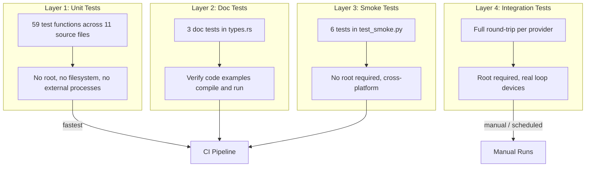
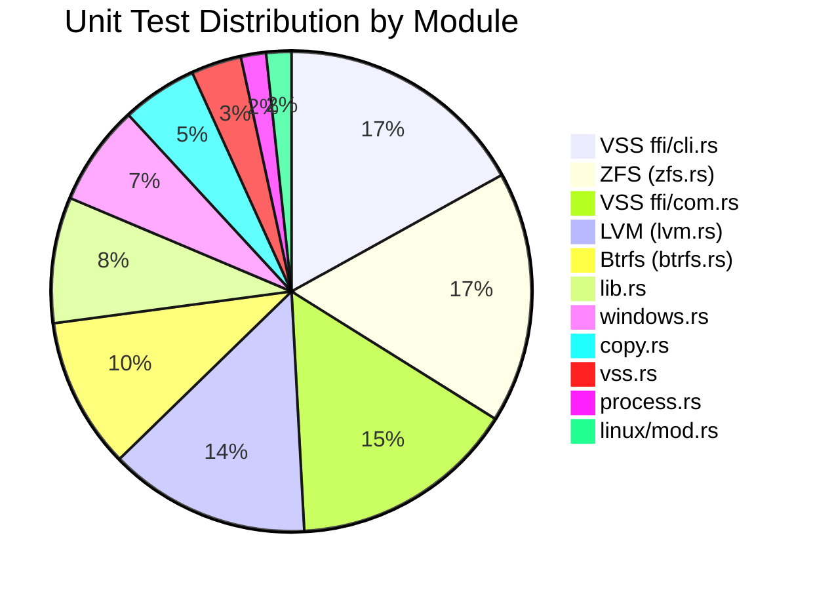
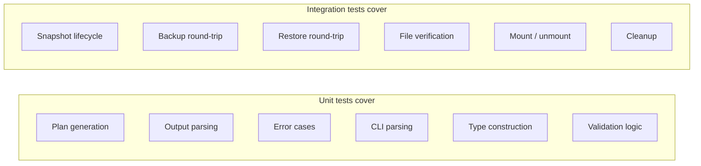
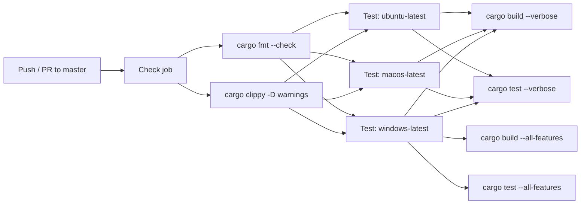
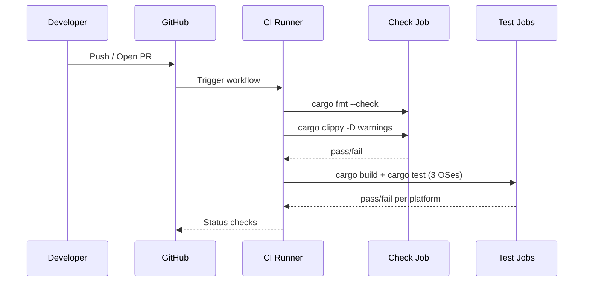

# Testing Strategy

vpt-rs uses a layered testing approach that balances speed, coverage, and
realism. Fast unit tests and doc tests run in CI on every platform, while
slower integration tests exercise real storage providers on Linux and Windows
with root privileges.

## Test Architecture

The test pyramid has four layers, each targeting a different confidence level:



## Unit Tests (59 tests)

Inline `#[test]` functions spread across the source modules test pure logic
without touching the filesystem or spawning external processes. The tests are
distributed across 11 source files:



### Btrfs backend tests (`src/platform/linux/btrfs.rs`)

Six tests verify plan generation, output parsing, and error handling for the
Btrfs provider:

| Test function | What it verifies |
|---|---|
| `create_plan_uses_hidden_snapshot_directory` | Snapshot path is derived into `.vb-snapshots/` with the correct label |
| `application_consistent_requests_are_rejected` | `MissingCapability` error for `ApplicationConsistent` kind |
| `list_output_parses_paths` | `btrfs subvolume list -s` output is parsed into `SnapshotInfo` entries |
| `backup_plan_uses_btrfs_send_to_image_file` | `btrfs send` command is generated with a temporary snapshot |
| `backup_plan_uses_parent_snapshot_for_incremental_send` | `btrfs send -p <parent> <source>` is generated for incremental backup |
| `restore_plan_uses_btrfs_receive_from_stream` | `btrfs receive <destination>` command is generated from stream input |

Example from `src/platform/linux/btrfs.rs:523-558`:

```rust
#[test]
fn create_plan_uses_hidden_snapshot_directory() {
    let backend = BtrfsBackend::new();
    let root = std::env::temp_dir().join(format!("vpt-rs-btrfs-plan-{}", std::process::id()));
    std::fs::create_dir_all(&root).unwrap();
    let source = root.join("subvol");
    std::fs::create_dir_all(&source).unwrap();

    let plan = backend
        .plan_create_snapshot(&SnapshotRequest {
            source: VolumeRef::new(source.display().to_string()),
            kind: SnapshotKind::CrashConsistent,
            label: Some("nightly backup".to_string()),
            read_only: true,
        })
        .unwrap();

    assert_eq!(
        plan.snapshot_path,
        root.join(".vb-snapshots").join("nightly-backup")
    );
    // ... asserts on command.args

    let _ = std::fs::remove_dir_all(&root);
}
```

### LVM backend tests (`src/platform/linux/lvm.rs`)

Eight tests cover volume path parsing, snapshot plan generation, list output
filtering, backup plan construction, and restore force-flag validation:

| Test function | What it verifies |
|---|---|
| `parses_standard_lvm_volume_path` | `/dev/vg0/data` is parsed into `vg_name="vg0"`, `lv_name="data"` |
| `create_plan_uses_lvcreate_snapshot_commands` | `lvcreate --snapshot --extents 20%ORIGIN` args are correct |
| `parse_list_output_filters_origin_snapshots` | Only snapshots whose `origin` matches the source are returned |
| `application_consistent_requests_are_rejected` | `MissingCapability` for `ApplicationConsistent` |
| `backup_plan_uses_temporary_snapshot_for_live_volume` | Temporary snapshot is created before block copy |
| `backup_plan_uses_explicit_snapshot_source_without_temporary_snapshot` | No temp snapshot when source is already a snapshot |
| `restore_plan_requires_force_flag` | `InvalidArgument` when `force: false` |
| `restore_plan_uses_copy_blocks_to_write_image_into_lv` | Copy source/destination and block size are set correctly |

### ZFS backend tests (`src/platform/linux/zfs.rs`)

Ten tests verify dataset reference parsing, snapshot command generation,
list output filtering, incremental send planning, and restore validation:

| Test function | What it verifies |
|---|---|
| `parses_dataset_name_without_mount_path` | `"tank/data"` is parsed as dataset name only |
| `parses_mount_path_as_dataset_reference` | `"/tank/data"` gets a mount_point hint |
| `create_plan_uses_zfs_snapshot_command` | `zfs snapshot -r tank/data@name` args are correct |
| `parse_list_output_filters_matching_dataset_snapshots` | Only snapshots for the target dataset are returned |
| `application_consistent_requests_are_rejected` | `MissingCapability` for `ApplicationConsistent` |
| `backup_plan_uses_zfs_send_with_snapshot_source` | `zfs send tank/data@snap1` command is generated |
| `backup_plan_rejects_non_snapshot_source` | `InvalidArgument` when volume source has no snapshot policy |
| `backup_plan_uses_parent_snapshot_for_incremental_send` | `zfs send -i parent source` args are correct |
| `restore_plan_uses_zfs_receive_dataset_destination` | `zfs receive -F dataset` command is generated |
| `restore_plan_rejects_mount_path_destination` | `InvalidArgument` for mount-path destinations |

### VSS backend tests

The Windows VSS provider has tests spread across four files:

**`src/platform/windows.rs`** (4 tests) -- backend identity and capabilities:

| Test function | What it verifies |
|---|---|
| `backend_has_expected_name` | Backend name is `"windows-vss"` |
| `backend_has_expected_capabilities` | All 5 expected capabilities are declared |
| `volume_path_converts_drive_letter` | `"C:"` becomes `"\\\\.\\C"` (feature-gated) |
| `volume_path_preserves_guid_path` | GUID paths are passed through unchanged (feature-gated) |

**`src/platform/windows/vss.rs`** (2 tests) -- request validation:

| Test function | What it verifies |
|---|---|
| `rejects_app_consistent_request_without_writers` | `MissingCapability` when writer coordination is disabled |
| `rejects_device_paths_as_vss_sources` | `InvalidArgument` for `\\.\PhysicalDrive0` |

**`src/platform/windows/vss/ffi/cli.rs`** (10 tests) -- CLI output parsing:

| Test function | What it verifies |
|---|---|
| `extract_guid_from_indented_line` | GUID extracted from `vssadmin list shadows` output |
| `extract_guid_returns_none_for_no_braces` | Returns `None` when no `{...}` found |
| `extract_guid_returns_none_for_wrong_segment_count` | Rejects `{1234-5678}` (not a valid GUID) |
| `parse_wmic_field_extracts_value` | Field value extracted from `wmic` output |
| `parse_wmic_field_returns_none_for_missing_field` | Returns `None` for missing field |
| `matches_volume_case_insensitive` | Volume matching is case-insensitive |
| `parse_vssadmin_list_output_parses_snapshots` | Full `vssadmin` output parsed into `SnapshotInfo` |
| `parse_vssadmin_list_output_returns_empty_for_no_match` | Returns empty for non-matching volume |
| `find_device_path_extracts_globalroot_path` | Device path extracted from shadow copy output |
| `find_device_path_returns_none_for_empty` | Returns `None` for missing device path |

**`src/platform/windows/vss/ffi/com.rs`** (9 tests) -- COM FFI helpers:

| Test function | What it verifies |
|---|---|
| `parse_guid_roundtrip` | GUID string parses and serializes back to the same value |
| `parse_guid_without_braces` | GUID without `{}` braces is accepted |
| `parse_guid_rejects_invalid_format` | Invalid strings are rejected |
| `normalize_volume_path_drive_letter` | `"C:"` normalized to `"C:\\"` |
| `normalize_volume_path_guid_passthrough` | GUID paths passed through unchanged |
| `wide_string_produces_null_terminated_utf16` | UTF-16 encoding is correct with NUL terminator |
| `from_wide_ptr_null_returns_empty` | Null pointer produces empty string |
| `from_wide_ptr_reads_utf16` | UTF-16 data read correctly from pointer |
| `vss_id_zero_is_all_zeros` | `VssId::ZERO` has all fields zeroed |

### Other unit tests

| Module | File | Tests | What they verify |
|---|---|---|---|
| `lib` | `src/lib.rs` | 5 | Platform descriptor non-empty, backend name matches, available backends non-empty, `SnapshotKind` parsing |
| `process` | `src/process.rs` | 1 | `wait_with_timeout` returns `None` for long-running child |
| `copy` | `src/copy.rs` | 3 | File contents copied correctly, empty file handled, zero block size rejected |
| `linux` | `src/platform/linux/mod.rs` | 1 | `available_descriptors()` returns btrfs, lvm, zfs |

### copy.rs tests in detail

The block-level copy helper in `src/copy.rs` is tested by three functions:

```rust
// src/copy.rs:117-153
#[test]
fn copies_file_contents() {
    let dir = tempdir().unwrap();
    let src = dir.path().join("source.bin");
    let dst = dir.path().join("dest.bin");
    let data = vec![0xAB_u8; 1024 * 1024 + 7]; // ~1 MiB, non-aligned
    fs::write(&src, &data).unwrap();

    let copied = copy_blocks(&src, &dst, 64 * 1024).unwrap();
    assert_eq!(copied, data.len() as u64);
    assert_eq!(fs::read(&dst).unwrap(), data);
}

#[test]
fn copies_empty_file() {
    // ... asserts 0 bytes copied, empty destination
}

#[test]
fn rejects_zero_block_size() {
    // ... asserts InvalidArgument for block_size = 0
}
```

### process.rs test in detail

The timeout test in `src/process.rs:167-179` spawns a `sleep 1` child process
and verifies that `wait_with_timeout` returns `None` after 50ms:

```rust
#[cfg(target_family = "unix")]
#[test]
fn wait_with_timeout_returns_none_for_long_running_child() {
    let mut child = Command::new("sh")
        .args(["-c", "sleep 1"])
        .spawn()
        .expect("spawn sleep");

    let status = wait_with_timeout(&mut child, Duration::from_millis(50)).unwrap();
    assert!(status.is_none());

    let _ = child.kill();
    let _ = child.wait();
}
```

### lib.rs tests in detail

The five tests in `src/lib.rs:39-77` verify the platform dispatch layer:

```rust
#[test]
fn current_platform_descriptor_is_not_empty() {
    assert!(!platform::current_platform().is_empty());
}

#[test]
fn current_backend_has_name() {
    let backend = platform::current_backend();
    assert!(!backend.backend_name().is_empty());
}

#[test]
fn descriptor_matches_backend_name() {
    let backend = platform::current_backend();
    let descriptor = platform::current_backend_descriptor();
    assert_eq!(descriptor.backend_name, backend.backend_name());
    assert!(!descriptor.capabilities.is_empty());
}

#[test]
fn available_backends_is_not_empty() {
    assert!(!platform::available_backend_descriptors().is_empty());
}

#[test]
fn snapshot_kind_parsing_accepts_short_forms() {
    assert_eq!(
        "crash".parse::<SnapshotKind>().unwrap(),
        SnapshotKind::CrashConsistent
    );
    assert_eq!(
        "application".parse::<SnapshotKind>().unwrap(),
        SnapshotKind::ApplicationConsistent
    );
}
```

Run all unit tests with:

```bash
cargo test --lib
```

:::tip
Unit tests never require root. They never write to real disks or spawn
privileged subprocesses. Plan-level tests create temporary directories via
`tempdir()` and clean up after themselves.
:::

## Doc Tests (3 tests)

Rust doc tests verify that the code examples in documentation comments actually
compile and run. They live in `///` doc comments on types in `src/types.rs`:

| Type | Example verifies |
|---|---|
| `VolumeRef` | `VolumeRef::new` construction and `Display` output |
| `SnapshotRequest` | Struct construction with all fields |
| `BackupPlan` | Full struct construction including `SnapshotPolicy::temporary` |

Run only doc tests:

```bash
cargo test --doc
```

:::note
The `Backend` trait doc test in `src/backend.rs` is marked `ignore` because it
requires a concrete backend instance that depends on the runtime platform.
:::

## Smoke Tests (6 tests, no root)

Smoke tests in `tests/test_smoke.py` verify basic CLI behavior without root
privileges. They run on any platform where `vptcli` is available:

| Test | What it checks |
|---|---|
| `backend_list` | `vptcli snapshot backend list` returns platform info |
| `capabilities_linux_providers` | `vptcli snapshot capabilities` works for each Linux provider |
| `snapshot_usage` | `vptcli snapshot` with no args shows usage (exit 0) |
| `backup_usage` | `vptcli backup` with no args shows usage (exit 0) |
| `restore_usage` | `vptcli restore` with no args shows usage (exit 0) |
| `snapshot_invalid_provider` | Unknown provider returns non-zero exit code |

Run smoke tests:

```bash
python3 tests/test_smoke.py
```

## Integration Tests (Python-based)

Full round-trip tests exercise `vptcli` against real storage providers. They
require root privileges and provider-specific system packages. See the
[Integration Tests](./integration-tests.md) page for the complete guide.

| Test file | Provider | Root required |
|---|---|---|
| `test_btrfs.py` | Btrfs | Yes |
| `test_lvm.py` | LVM | Yes |
| `test_zfs.py` | ZFS | Yes |
| `test_vss.py` | VSS | Yes (Admin) |
| `test_smoke.py` | -- | No |

## Coverage Matrix



| Area | Unit tests | Doc tests | Smoke tests | Integration tests |
|---|:---:|:---:|:---:|:---:|
| Type construction | yes | yes | | |
| Label sanitization | | yes | | |
| CLI argument parsing | yes | | yes | |
| Plan generation logic | yes | | | |
| Output parsing (btrfs, lvm, zfs, vss) | yes | | | |
| Error variant behavior | yes | | | |
| Timeout behavior | yes | | | |
| Block-level copy | yes | | | |
| Snapshot create/list/delete | | | | yes |
| Backup (send or dd) | | | | yes |
| Restore (receive or dd) | | | | yes |
| File content verification | | | | yes |
| CLI usage output | | | yes | |
| Backend discovery | | | yes | |

## What is NOT Tested in Unit Tests

Unit tests deliberately avoid:

- **Creating real snapshots** -- requires root and provider tools
- **Running `btrfs send`/`zfs send`/`dd`** -- privileged I/O operations
- **Mounting filesystems** -- requires mount permissions
- **Writing to block devices** -- requires device access
- **Network or remote operations** -- local-only testing

These scenarios are covered by the integration test suite, which runs with
root privileges and real loop devices.

## CI Pipeline

The CI workflow (`.github/workflows/ci.yml`) runs on every push and pull
request to `master`:



**Check job** (runs on `ubuntu-latest`):

1. `cargo fmt --all -- --check` -- enforces consistent formatting
2. `cargo clippy --all-targets -D warnings` -- catches common Rust mistakes

**Test jobs** (run in parallel on ubuntu-latest, macos-latest, windows-latest):

1. `cargo build --verbose`
2. `cargo test --verbose` -- runs all unit tests + doc tests
3. On Windows only: `cargo build --all-features` and `cargo test --all-features`
   to test the `windows-vss` feature gate



Integration tests are **not** part of CI because they require root privileges
and specific storage tools. They are run manually or in scheduled jobs.

## Running Tests Locally

### All unit and doc tests

```bash
cargo test
```

### Only unit tests (skip doc tests)

```bash
cargo test --lib
```

### Only doc tests

```bash
cargo test --doc
```

### Smoke tests (no root)

```bash
python3 tests/test_smoke.py
```

### Integration tests (root required)

```bash
# All providers
sudo python3 tests/run_all.py

# Single provider
sudo python3 tests/test_btrfs.py

# Build first, then test
sudo python3 tests/run_all.py --build
```

:::caution
Integration tests create loop devices, LVM volume groups, and ZFS pools.
Always run them in a disposable environment. Never run on a production system.
:::
