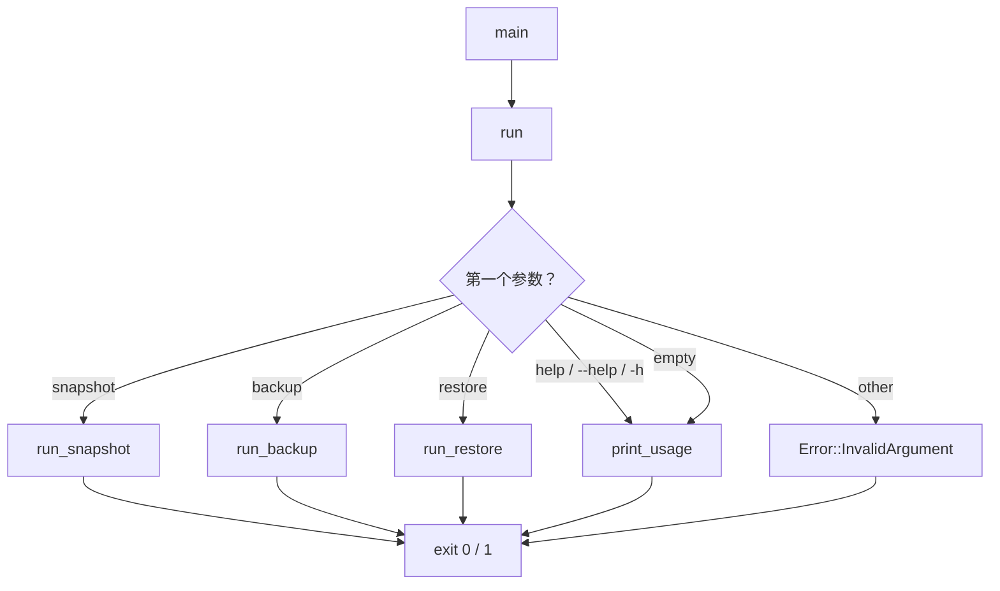
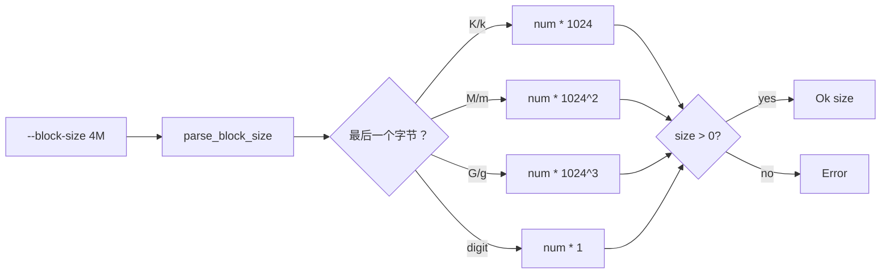

# CLI 概览

`vptcli` 是 **vpt-rs** 卷备份工具包的命令行界面。它将核心库操作 -- 快照管理、备份和恢复 -- 暴露为一个具有三个顶级子命令的二进制文件。

## 二进制文件

```
vptcli <command> [args]
```

不带参数运行 `vptcli`（或传递 `help`）查看可用命令。二进制文件成功时返回退出码 `0`，失败时返回 `1`。

## 子命令

| 子命令 | 描述 |
|--------|------|
| `snapshot` | 创建、列出、删除快照；查询后端和能力 |
| `backup` | 将卷备份到流或镜像文件 |
| `restore` | 从流或镜像文件恢复卷 |

每个子命令接受 `--help` 或 `-h` 打印其用法文本。

## 命令分发



## 通用选项

### `--provider`

`--provider <name>` 标志选择快照提供者后端。在每个子命令中都可用。在 Linux 上接受后端名称如 `btrfs`、`lvm` 或 `zfs`。

### `--block-size`

`--block-size <N[K|M|G]>` 标志控制块级别复制操作的 I/O 块大小。接受带可选后缀的数字值：

| 后缀 | 乘数 |
|------|------|
| （无） | 1 字节 |
| `K` 或 `k` | 1024 字节 |
| `M` 或 `m` | 1,048,576 字节 |
| `G` 或 `g` | 1,073,741,824 字节 |



## 错误处理

所有子命令返回 `vpt_rs::Result<()>`。错误以 `error: ` 前缀打印到 stderr。

## 示例

```bash
# 显示用法
vptcli
vptcli help
vptcli snapshot --help

# 在 Linux 上选择特定后端
vptcli snapshot --provider lvm list /dev/vg0/data

# 指定自定义块大小
vptcli backup /dev/vg0/data --output /tmp/backup.img --block-size 4M
```
