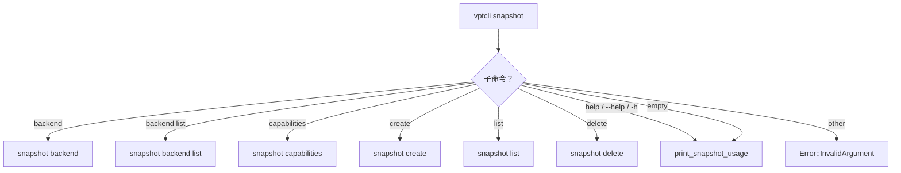

# vptcli snapshot

`snapshot` 子命令管理提供者管理的快照：创建、列出和删除它们。它还暴露后端发现和能力查询。

## 用法

```
vptcli snapshot <command> [args]
```

## 子命令

| 子命令 | 描述 |
|--------|------|
| `backend` | 打印当前平台后端描述符 |
| `backend list` | 列出所有可用后端描述符 |
| `capabilities` | 打印后端名称和能力列表 |
| `create` | 创建卷的新快照 |
| `list` | 列出卷上的现有快照 |
| `delete` | 通过 ID 删除现有快照 |



## `snapshot create`

创建卷的新快照。

```
vptcli snapshot create [--provider <name>] <volume> [--kind crash|application] [--label <name>] [--read-write]
```

| 标志 | 必需 | 默认值 | 描述 |
|------|------|--------|------|
| `<volume>` | 是 | -- | 卷路径或标识符 |
| `--provider <name>` | 否 | 平台默认 | 后端提供者 |
| `--kind crash\|application` | 否 | `crash` | 快照一致性类型 |
| `--label <name>` | 否 | （无） | 快照的人类可读标签 |
| `--read-write` | 否 | 只读 | 创建可写快照 |

## `snapshot list`

列出后端为给定卷管理的所有快照。

```
vptcli snapshot list [--provider <name>] <volume>
```

## `snapshot delete`

通过句柄 ID 删除现有快照。

```
vptcli snapshot delete [--provider <name>] <snapshot-id>
```

:::caution
删除快照是不可逆的。运行此命令前确保快照 ID 正确。
:::
