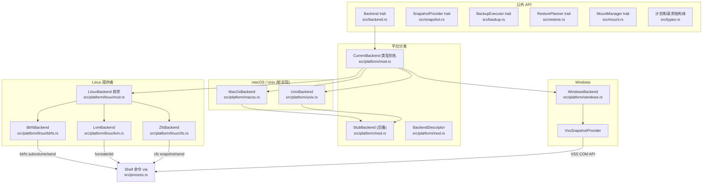
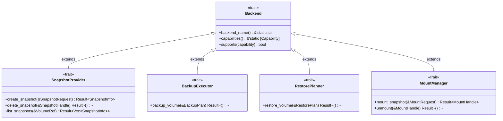
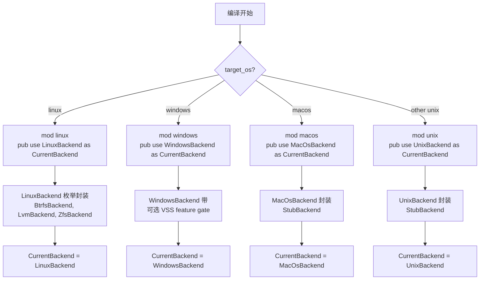
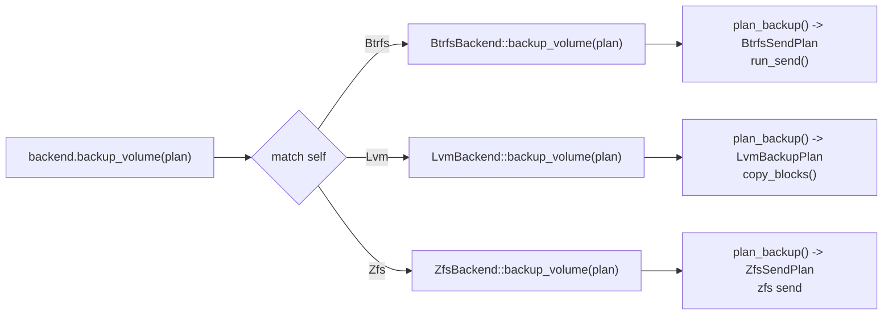
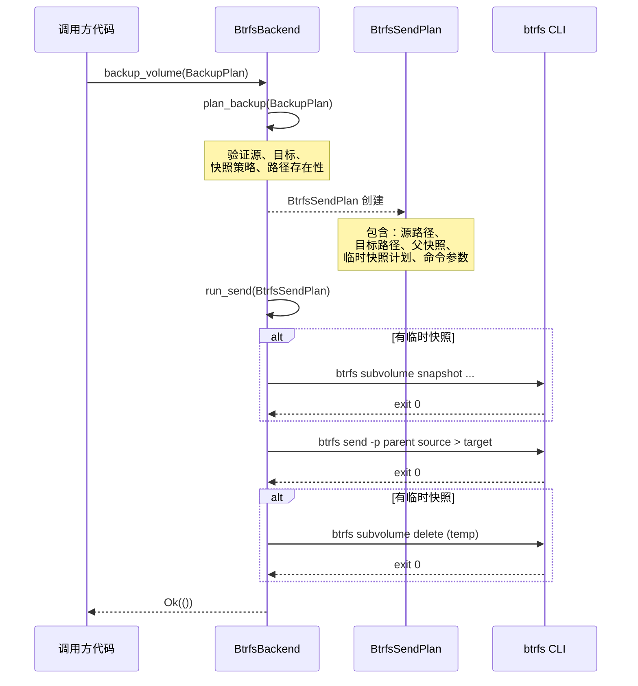

# 架构设计

本页解释 vpt-rs 的组织方式、各层之间的连接，以及备份请求如何从 CLI 流转到执行实际工作的平台特定工具。如果你是项目新手，请从这里开始。

## 高层概览

vpt-rs 由三层结构组成：

1. **公共 API** -- 五个 trait（`Backend`、`SnapshotProvider`、`BackupExecutor`、`RestorePlanner`、`MountManager`）以及调用者交互的计划/请求结构体。
2. **平台分发** -- 编译时 `cfg` 选择目标 OS 的正确后端，同时运行时辅助函数让 CLI 枚举可用后端。
3. **提供者实现** -- 每个后端封装一个原生工具（`btrfs`、`lvcreate`、`zfs`、VSS）并将计划转换为 shell 命令。



## 源文件地图

每个源文件都有明确的职责。此表是你浏览代码库的地图：

| 文件 | 用途 |
|------|------|
| `src/lib.rs` | 公共重导出；crate 的前门 |
| `src/backend.rs` | `Backend` 超级 trait（身份 + 能力） |
| `src/snapshot.rs` | `SnapshotProvider` trait（create/delete/list） |
| `src/backup.rs` | `BackupExecutor` trait（备份卷） |
| `src/restore.rs` | `RestorePlanner` trait（恢复卷） |
| `src/mount.rs` | `MountManager` trait（挂载/卸载快照） |
| `src/types.rs` | 所有计划/请求/句柄结构体和 `Capability` 枚举 |
| `src/error.rs` | `Error` 枚举和 `Result<T>` 别名 |
| `src/process.rs` | 带超时和 I/O 重定向的 shell 命令运行器 |
| `src/copy.rs` | 块级别复制辅助（LVM 后端使用） |
| `src/logging.rs` | Tracing/日志设置 |
| `src/platform/mod.rs` | `CurrentBackend` 别名、`StubBackend`、`BackendDescriptor` |
| `src/platform/linux/mod.rs` | `LinuxBackend` 枚举 + `delegate!` 宏 |
| `src/platform/linux/btrfs.rs` | `BtrfsBackend`（子卷快照 + send/receive） |
| `src/platform/linux/lvm.rs` | `LvmBackend`（LVM 快照 + 块复制） |
| `src/platform/linux/zfs.rs` | `ZfsBackend`（ZFS 快照 + send/receive） |
| `src/platform/windows.rs` | `WindowsBackend` + VSS 集成 |
| `src/platform/macos.rs` | `MacOsBackend`（桩） |
| `src/platform/unix.rs` | `UnixBackend`（桩） |

:::tip 如何浏览
从你想理解的 trait 开始（例如 `src/snapshot.rs` 中的 `SnapshotProvider`），然后跟随实现进入平台模块。每个后端文件都是自包含的 -- 它声明能力、实现 trait，并在同一个文件中定义内部计划类型。
:::

## Trait 层级

所有五个 trait 共享一个通用的超级 trait 模式。`Backend` 位于根部，提供身份（`backend_name()`）和能力元数据（`capabilities()`、`supports()`）。四个操作 trait 扩展它。



每个操作 trait 使用 `: Backend` 作为超级 trait 约束。这意味着如果你有一个 `Box<dyn SnapshotProvider>`，你总是可以在它上面调用 `backend_name()`，而无需向下转型。编译器保证该方法存在。

:::note
`Backend` trait 还要求 `Send + Sync`（`src/backend.rs:20`）。这意味着所有后端都是线程安全的 -- 这是异步执行器和线程池可能并发运行备份操作的要求。
:::

## 使用 cfg(target_os) 进行平台分发

`platform` 模块（`src/platform/mod.rs`）使用 Rust 的 `#[cfg(target_os)]` 属性为每个编译目标选择恰好一个后端类型。这在编译时发生，因此零运行时分支开销。



`src/platform/mod.rs` 中的关键代码：

```rust
// src/platform/mod.rs:1-12
#[cfg(target_os = "linux")]
mod linux;
#[cfg(target_os = "macos")]
mod macos;
#[cfg(all(
    target_family = "unix",
    not(target_os = "linux"),
    not(target_os = "macos")
))]
mod unix;
#[cfg(target_os = "windows")]
mod windows;
```

以及选择具体后端的类型别名：

```rust
// src/platform/mod.rs:14-16
#[cfg(target_os = "linux")]
pub use linux::LinuxBackend as CurrentBackend;
```

:::tip 为什么使用编译时分发？
使用 `cfg` 而不是 trait 对象意味着 `CurrentBackend` 是一个具体类型。这给了编译器完全的内联、单态化和死代码消除的可见性。没有 vtable 间接调用。
:::

## StubBackend 模式

`StubBackend`（`src/platform/mod.rs:88-170`）是一个具体结构体，实现了所有五个 trait 但对每个操作方法都返回 `Error::UnsupportedOperation`。它有两个用途：

1. **不支持平台的默认后端** -- macOS 和通用 Unix 后端封装一个 `StubBackend` 并委托给它。
2. **能力声明** -- 即使操作被桩化，后端仍然声明其能力，以便调用者可以检查*将*支持什么。

:::caution
`StubBackend` 不是无用的。它的 `capabilities()` 方法仍然返回真实数据。仅检查能力的代码（例如决定是否在 UI 中提供增量备份）即使在桩平台上也能正常工作。
:::

## LinuxBackend 和 delegate! 宏

在 Linux 上，三种快照技术共存（Btrfs、LVM、ZFS）。`LinuxBackend` 枚举（`src/platform/linux/mod.rs:34-39`）封装了所有三种：

```rust
// src/platform/linux/mod.rs:34-39
#[derive(Debug, Clone)]
pub enum LinuxBackend {
    Btrfs(BtrfsBackend),
    Lvm(LvmBackend),
    Zfs(ZfsBackend),
}
```

为避免为每个 trait 方法重复相同的 `match` 块，模块定义了一个 `delegate!` 宏：

```rust
// src/platform/linux/mod.rs:24-32
macro_rules! delegate {
    ($self:expr, $method:ident $(, $arg:expr)*) => {
        match $self {
            Self::Btrfs(inner) => inner.$method($($arg),*),
            Self::Lvm(inner) => inner.$method($($arg),*),
            Self::Zfs(inner) => inner.$method($($arg),*),
        }
    };
}
```



:::note
`delegate!` 宏消除了约 120 行样板代码，否则需要为 5 个 trait（Backend、SnapshotProvider、BackupExecutor、RestorePlanner、MountManager）的 6 个方法编写。向任何 trait 添加新方法只需要在 `LinuxBackend` 实现中添加一个额外的 `delegate!` 调用。
:::

## 先计划后执行模式

每个备份、恢复和快照操作都遵循两阶段模式：

1. **计划** -- 构建一个后端特定的计划结构体，描述*将要*发生什么。计划是纯数据；它们不接触文件系统。
2. **执行** -- 通过调用 shell 命令或复制例程来运行计划。



这种分离有具体的好处：

- **可测试性** -- 你可以在 `#[test]` 函数中调用 `BtrfsBackend` 上的 `plan_backup()`，无需 root 权限或真实 Btrfs 文件系统。计划结构体只是可以用 `assert_eq!` 检查的数据。
- **验证** -- 计划在任何工作开始前拒绝无效输入（缺失路径、不支持的快照类型）。
- **可组合性** -- 一个计划可以包含嵌套计划（例如发送计划中的临时快照计划）。

## 文件布局

```
src/
  lib.rs              -- 公共重导出（crate 的前门）
  backend.rs          -- Backend 超级 trait（20 行）
  snapshot.rs         -- SnapshotProvider trait（31 行）
  backup.rs           -- BackupExecutor trait（22 行）
  restore.rs          -- RestorePlanner trait（22 行）
  mount.rs            -- MountManager trait（17 行）
  types.rs            -- 计划/请求结构体、Capability 枚举（约 350 行）
  error.rs            -- Error 枚举、Result 别名（约 60 行）
  process.rs          -- 带超时和 I/O 重定向的 shell 命令运行器
  copy.rs             -- LVM 的块级别复制辅助
  logging.rs          -- tracing 设置
  platform/
    mod.rs            -- CurrentBackend 别名、StubBackend、BackendDescriptor
    linux/
      mod.rs          -- LinuxBackend 枚举 + delegate! 宏
      btrfs.rs        -- BtrfsBackend（约 700 行，含测试）
      lvm.rs          -- LvmBackend（约 670 行，含测试）
      zfs.rs          -- ZfsBackend（约 750 行，含测试）
    windows.rs        -- WindowsBackend + VSS 集成
    macos.rs          -- MacOsBackend（桩）
    unix.rs           -- UnixBackend（桩）
```

:::tip 如何探索
1. 从 `src/lib.rs` 开始，查看 crate 导出了什么。
2. 阅读 `src/backend.rs`（20 行）理解超级 trait。
3. 阅读 `src/types.rs` 理解数据结构。
4. 选择一个后端（例如 `src/platform/linux/btrfs.rs`）并跟踪一个操作从 trait 实现到计划创建再到执行的完整流程。
5. 返回 `src/platform/mod.rs` 理解分发是如何工作的。
:::

## 下一步

- [Traits](./traits.md) -- 深入了解五个 trait
- [Backends](./backends.md) -- 后端如何选择以及如何添加新后端
- [Capabilities](./capabilities.md) -- 能力系统和优雅降级
- [Plans](./plans.md) -- 先计划后执行模式详解
- [Error Handling](./error-handling.md) -- 带上下文的结构化错误
