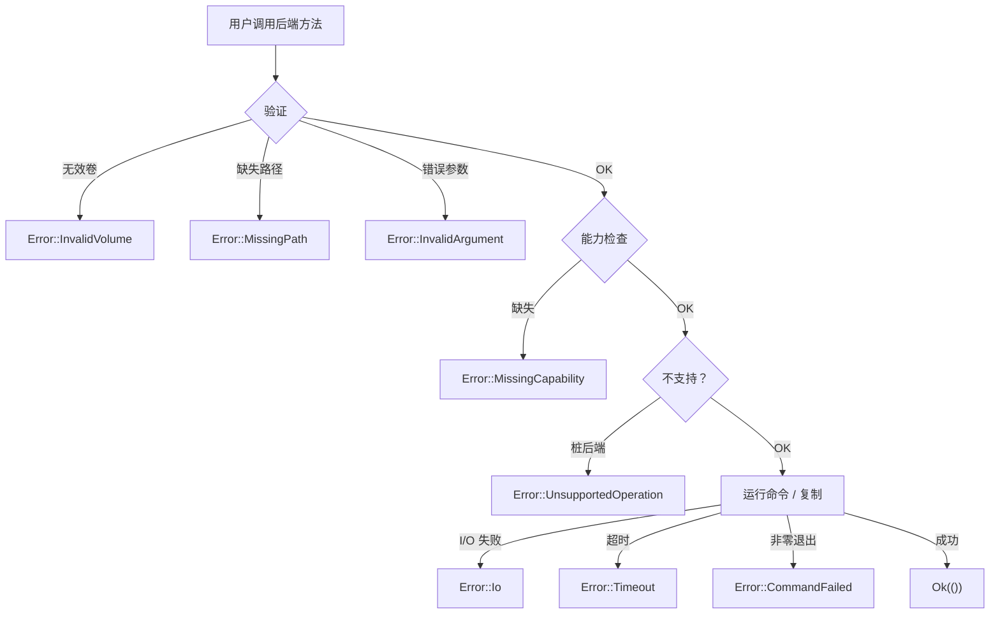

# 错误处理

vpt-rs 使用单个 `Error` 枚举，每个变体都携带结构化上下文。本页解释每种错误类型、如何匹配它们，以及在代码中处理错误的最佳实践。

## Error 枚举

```rust
#[derive(Debug, thiserror::Error)]
pub enum Error {
    UnsupportedOperation { operation: &'static str, backend: &'static str },
    MissingCapability    { capability: &'static str, backend: &'static str },
    InvalidVolume        { volume: String },
    MissingPath          { path: PathBuf },
    Io(#[from] std::io::Error),
    InvalidArgument      { message: String },
    CommandFailed        { command: String, status: i32, stderr: String },
    Timeout              { operation: &'static str, backend: &'static str, timeout_secs: u64 },
    Message              { message: String },
}
```

还有一个便捷别名：

```rust
pub type Result<T> = std::result::Result<T, Error>;
```

:::tip 设计原则
每个变体都携带结构化上下文 -- 而不仅仅是一个字符串。这意味着你可以匹配特定变体并以编程方式提取字段，而无需解析错误消息。
:::

## 错误变体详解

### UnsupportedOperation

当后端未实现特定操作时返回（如在 Btrfs 上调用 `mount_snapshot()`）。

### MissingCapability

当后端未声明所需能力时返回。比 `UnsupportedOperation` 更具体 -- 指明确切缺失的能力。

### InvalidVolume

当卷引用为空或格式错误时返回（如 Btrfs 的非绝对路径、LVM 的错误 `/dev/<vg>/<lv>` 格式）。

### MissingPath

当所需的文件系统路径不存在时返回。

### Io

`std::io::Error` 的包装器。涵盖权限被拒绝、磁盘满、断开的管道等。

:::note
`Error` 通过 `#[from]` 实现了 `From<std::io::Error>`，因此 I/O 操作上的 `?` 会自动包装错误。
:::

### InvalidArgument

当计划或请求包含无效值时返回（如 Btrfs send 的设备目标、LVM 恢复缺少 `force` 标志）。

### CommandFailed

当外部命令以非零状态退出时返回。生产中最常见的错误。字段：`command`、`status`、`stderr`。

:::tip
`stderr` 字段通常包含失败的确切原因。始终将其展示给用户。
:::

### Timeout

当外部命令超过配置的超时时间（默认 30 秒）时返回。使用 `timeout_secs()` 访问器进行编程访问。

:::note
超时可通过 `VPT_COMMAND_TIMEOUT_SECS` 配置。process 模块使用指数退避轮询（10ms 到 200ms）来检查完成状态。
:::

### Message

带有自由格式消息的通用错误。

## 匹配特定变体

```rust
let result = backend.backup_volume(&plan);

if matches!(&result, Err(Error::Timeout { .. })) {
    println!("Operation timed out");
}

// 穷举匹配
match result {
    Ok(()) => println!("Backup completed"),
    Err(Error::UnsupportedOperation { operation, backend }) => {
        eprintln!("{} not supported on {}", operation, backend);
    }
    Err(Error::CommandFailed { command, status, stderr }) => {
        eprintln!("Command `{}` failed (exit {}): {}", command, status, stderr);
    }
    Err(Error::Timeout { timeout_secs, .. }) => {
        eprintln!("Timed out after {}s", timeout_secs);
    }
    Err(e) => eprintln!("Error: {}", e),
}
```

## 错误流程图



## 最佳实践

1. **始终处理 `CommandFailed`** -- 它是生产中最常见的错误。将 `stderr` 字段展示给用户；它通常包含失败的确切原因。

2. **在调用操作前检查能力** -- 防止 `MissingCapability` 错误。在调用前调整你的计划（如回退到崩溃一致性）。

3. **使用 `?` 操作符** -- `Error` 实现了 `From<std::io::Error>`，因此库内的 I/O 错误通过 `?` 干净地传播。

4. **区分瞬态和永久错误** -- `Timeout` 和某些 `CommandFailed` 错误（退出码 13 = 权限被拒绝）可能可重试。`InvalidArgument` 和 `MissingCapability` 是永久的。

5. **使用 `timeout_secs()` 实现自适应行为** -- 如果发生超时，你可以通过 `VPT_COMMAND_TIMEOUT_SECS` 加倍超时并重试。

## 下一步

- [Architecture](./architecture.md) -- 错误如何融入整体设计
- [Traits](./traits.md) -- 每个 trait 可能返回哪些错误
- [Backends](./backends.md) -- 平台特定的错误场景
