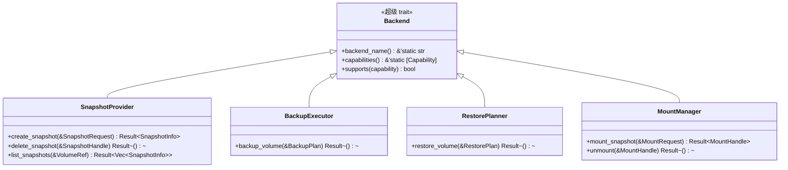

# Traits

vpt-rs 暴露了五个 trait，它们共同构成了完整的公共 API。本页从第一性原理解释每个 trait 并展示如何使用它们。

## Trait 层级一览



每个操作 trait 通过 `: Backend` 扩展 `Backend`。这是 Rust 的超级 trait 语法 -- 它意味着任何实现了 `SnapshotProvider` 的类型也*必须*实现 `Backend`。编译器强制执行这一点。

:::tip 为什么这很重要？
如果你有一个 `Box<dyn SnapshotProvider>`，你可以在它上面调用 `backend_name()` 而无需任何向下转型。超级 trait 约束保证该方法存在。
:::

## Backend

`Backend` 是基础。它不携带操作 -- 只有身份和能力元数据。

```rust
pub trait Backend: Send + Sync {
    fn backend_name(&self) -> &'static str;
    fn capabilities(&self) -> &'static [Capability];
    fn supports(&self, capability: Capability) -> bool {
        self.capabilities().contains(&capability)
    }
}
```

关键细节：

- **`Send + Sync`** -- 所有后端都可以安全地跨线程共享。这是必需的，因为备份操作可能在异步执行器或线程池上运行。
- **`backend_name()`** -- 返回静态字符串，如 `"linux-btrfs"`、`"linux-lvm"`、`"linux-zfs"` 或 `"windows-vss"`。用于日志消息和错误上下文。
- **`capabilities()`** -- 返回 `Capability` 变体的静态切片。默认的 `supports()` 方法检查此切片中的成员资格。

```rust
let backend = vpt_rs::platform::current_backend();
println!("Using backend: {}", backend.backend_name());

if backend.supports(Capability::IncrementalSend) {
    println!("Incremental backups are available");
}
```

## SnapshotProvider

`SnapshotProvider` 管理提供者原生快照的生命周期。每个平台有自己的机制（Btrfs 使用 `btrfs subvolume snapshot`，LVM 使用 `lvcreate --snapshot`，ZFS 使用 `zfs snapshot`，Windows 使用 VSS）。

```rust
pub trait SnapshotProvider: Backend {
    fn create_snapshot(&self, request: &SnapshotRequest) -> Result<SnapshotInfo>;
    fn delete_snapshot(&self, snapshot: &SnapshotHandle) -> Result<()>;
    fn list_snapshots(&self, source: &VolumeRef) -> Result<Vec<SnapshotInfo>>;
}
```

```rust
// 创建快照
let info = backend.create_snapshot(&SnapshotRequest {
    source: VolumeRef::new("/mnt/data/subvol"),
    kind: SnapshotKind::CrashConsistent,
    label: Some("nightly".to_string()),
    read_only: true,
})?;

// 列出并删除
let snapshots = backend.list_snapshots(&VolumeRef::new("/mnt/data/subvol"))?;
backend.delete_snapshot(&info.handle)?;
```

:::caution
快照删除是永久性的。在 Btrfs 和 ZFS 上会移除子卷或数据集。在 LVM 上会调用 `lvremove`。
:::

## BackupExecutor

`BackupExecutor` 将卷导出为流或镜像文件。不同后端使用不同机制（Btrfs/ZFS 使用 `send`，LVM/VSS 使用块级别复制）：

```rust
pub trait BackupExecutor: Backend {
    fn backup_volume(&self, plan: &BackupPlan) -> Result<()>;
}
```

```rust
let plan = BackupPlan {
    source: BackupSource::Volume(VolumeRef::new("/dev/vg0/data")),
    target: BackupTarget::ImageFile(PathBuf::from("/tmp/backup.img")),
    snapshot_policy: SnapshotPolicy::temporary(
        SnapshotKind::CrashConsistent, Some("backup".to_string()), true,
    ),
    parent_snapshot: None,
    block_size: None,
};

backend.backup_volume(&plan)?;
```

:::note
`snapshot_policy` 字段告诉后端在备份前是否创建临时快照。在没有快照的情况下备份活跃卷可能产生不一致的镜像。
:::

## RestorePlanner

`RestorePlanner` 从备份流或镜像文件导入卷。破坏性后端（LVM、VSS）需要 `force` 标志：

```rust
pub trait RestorePlanner: Backend {
    fn restore_volume(&self, plan: &RestorePlan) -> Result<()>;
}
```

```rust
let plan = RestorePlan {
    source: BackupTarget::ImageFile(PathBuf::from("/tmp/backup.img")),
    destination: VolumeRef::new("/dev/vg0/restore"),
    force: true,
    base_snapshot: None,
    block_size: None,
};

backend.restore_volume(&plan)?;
```

:::warning
恢复是破坏性的。LVM 直接写入设备。ZFS 将流接收到目标数据集。始终仔细检查目标。
:::

## MountManager

`MountManager` 挂载现有快照以供浏览或文件提取：

```rust
pub trait MountManager: Backend {
    fn mount_snapshot(&self, request: &MountRequest) -> Result<MountHandle>;
    fn unmount(&self, handle: &MountHandle) -> Result<()>;
}
```

```rust
let request = MountRequest {
    snapshot: SnapshotHandle { id: "tank/data@snap1".to_string(), source: None },
    mode: MountMode::ReadOnly,
    target: Some(PathBuf::from("/mnt/snap1")),
};

let handle = backend.mount_snapshot(&request)?;
// ... 在 handle.mount_point 浏览文件 ...
backend.unmount(&handle)?;
```

:::note
不是所有后端都支持挂载。调用前检查 `Capability::ReadOnlySnapshotMount` 和 `Capability::WritableSnapshotMount`。
:::

## 将 trait 用作 trait 对象

所有五个 trait 都是对象安全的。你可以将它们用作 trait 对象：

```rust
fn run_backup(executor: &dyn BackupExecutor, plan: &BackupPlan) -> vpt_rs::Result<()> {
    if !executor.supports(vpt_rs::Capability::BlockLevelBackup) {
        println!("Warning: backend does not support block-level backup");
    }
    executor.backup_volume(plan)
}
```

:::tip 尽可能使用具体类型
动态分发（`dyn Trait`）有来自 vtable 查找的少量运行时开销。当你在编译时知道后端类型时，使用具体类型以获得更好的性能和访问后端特定方法（如 `plan_backup()`）的能力。
:::

## 下一步

- [Backends](./backends.md) -- 后端如何选择和实现
- [Capabilities](./capabilities.md) -- 每个后端能做什么
- [Plans](./plans.md) -- 先计划后执行模式详解
