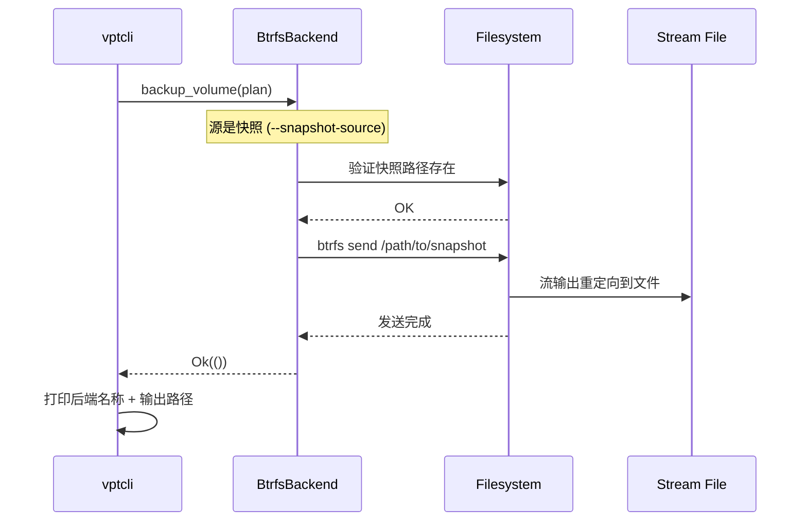
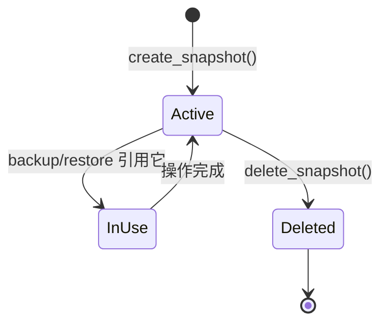
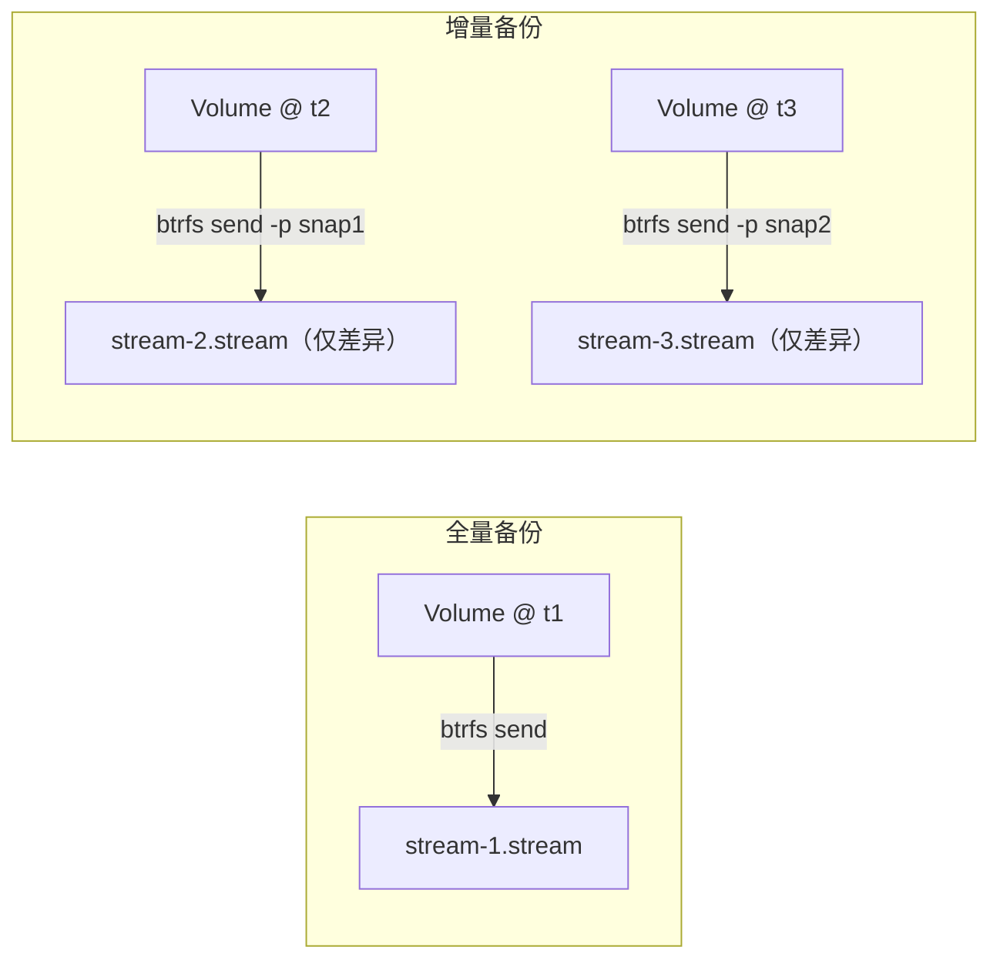

# 第一次备份 -- 深入了解

[快速开始](./quick-start.md)带你完成了使用 CLI 的完整备份循环。本指南解释**每一步发生了什么**，介绍快照策略和增量备份，并涵盖错误处理基础。

---

## 理解发生了什么

当你运行 `vptcli backup --snapshot-source ... --output ...` 时，执行了以下序列：



Btrfs 后端编译了一个 `BtrfsSendPlan`，包含：

1. 源快照路径。
2. 目标文件路径。
3. `btrfs send` 命令及其参数。
4. 没有临时快照（因为使用了 `--snapshot-source`）。

然后它执行发送，将 `btrfs send` 的 stdout 管道到输出文件。

---

## 快照生命周期

快照经历三个阶段：**创建**、**使用**和**删除**。



### 创建

```bash
sudo vptcli snapshot create --provider btrfs /mnt/data/subvol --label nightly
```

这会用 `SnapshotRequest` 调用 `SnapshotProvider::create_snapshot`：

```rust
use vpt_rs::{SnapshotRequest, SnapshotKind, VolumeRef};

let request = SnapshotRequest {
    source: VolumeRef::new("/mnt/data/subvol"),
    kind: SnapshotKind::CrashConsistent,
    label: Some("nightly".to_string()),
    read_only: true,
};
```

Btrfs 后端将其转换为 `btrfs subvolume snapshot -r /mnt/data/subvol /mnt/data/.vb-snapshots/nightly`。

### 使用

快照在备份和恢复操作期间被引用。它们作为卷的一致时间点视图。

### 删除

```bash
sudo vptcli snapshot delete --provider btrfs /mnt/data/.vb-snapshots/nightly
```

这会用 `SnapshotHandle` 调用 `SnapshotProvider::delete_snapshot`。在 btrfs 上，它转换为 `btrfs subvolume delete /mnt/data/.vb-snapshots/nightly`。

:::caution
删除快照是永久性的。运行此命令前请确保你不再需要它。
:::

---

## 备份源

vpt-rs 区分两种备份源：

| 源 | CLI 标志 | 描述 |
|---|---|---|
| **卷** | （默认） | 活跃文件系统或逻辑卷。如果快照策略允许，vptcli 会自动创建临时快照。 |
| **快照** | `--snapshot-source` | 现有快照。不创建临时快照。 |

### 备份活跃卷

```bash
# vptcli 创建临时快照，发送它，然后删除快照
sudo vptcli backup --provider btrfs /mnt/data/subvol --output /tmp/backup.stream
```

这等同于：

1. `btrfs subvolume snapshot -r /mnt/data/subvol /mnt/data/.vb-snapshots/tmp-snap`
2. `btrfs send /mnt/data/.vb-snapshots/tmp-snap > /tmp/backup.stream`
3. `btrfs subvolume delete /mnt/data/.vb-snapshots/tmp-snap`

### 备份现有快照

```bash
# 没有临时快照 -- 你自己管理生命周期
sudo vptcli backup --provider btrfs --snapshot-source \
    /mnt/data/.vb-snapshots/nightly \
    --output /tmp/backup.stream
```

:::tip
当你想完全控制快照何时创建和删除时使用 `--snapshot-source`，例如在自动化备份脚本中先创建带标签的快照，然后备份它。
:::

---

## 快照策略

快照策略控制后端如何获取用于备份的快照。有两种策略：

### 禁用

后端按原样使用源。不自动创建快照。

```bash
sudo vptcli backup --provider btrfs --no-snapshot \
    /mnt/data/subvol --output /tmp/backup.stream
```

在库代码中：

```rust
use vpt_rs::SnapshotPolicy;

let policy = SnapshotPolicy::disabled();
```

:::caution
在活跃卷上使用 `--no-snapshot` 意味着备份反映的是文件系统当时的任意状态。这对 btrfs 通常是没问题的（因为它是写时复制的），但在其他后端上可能产生不一致的结果。
:::

### 临时

后端创建临时快照，用于备份，然后删除它。这是**默认行为**。

```bash
# 默认：创建临时崩溃一致性快照
sudo vptcli backup --provider btrfs /mnt/data/subvol --output /tmp/backup.stream
```

你可以自定义快照类型和标签：

```bash
sudo vptcli backup --provider btrfs \
    --snapshot-kind crash \
    --snapshot-label "pre-upgrade" \
    /mnt/data/subvol --output /tmp/backup.stream
```

在库代码中：

```rust
use vpt_rs::{SnapshotPolicy, SnapshotKind};

let policy = SnapshotPolicy::temporary(
    SnapshotKind::CrashConsistent,
    Some("pre-upgrade".to_string()),
    true, // 只读
);
```

---

## 增量备份

第一次全量备份之后，后续备份可以是**增量的** -- 只传输自父快照以来的差异。这节省了时间和存储空间。



### 工作原理

1. 创建快照并备份（全量）。
2. 对卷进行更改。
3. 创建新快照。
4. 使用 `--parent-snapshot` 指向第一个快照来备份新快照。

```bash
# 步骤 1：全量备份
sudo vptcli snapshot create --provider btrfs /mnt/data/subvol --label base
sudo vptcli backup --provider btrfs --snapshot-source \
    /mnt/data/.vb-snapshots/base \
    --output /tmp/backup-full.stream

# 步骤 2：进行更改
echo "New data added later" | sudo tee /mnt/data/subvol/updated.txt

# 步骤 3：创建增量快照
sudo vptcli snapshot create --provider btrfs /mnt/data/subvol --label incremental-1

# 步骤 4：增量备份
sudo vptcli backup --provider btrfs --snapshot-source \
    /mnt/data/.vb-snapshots/incremental-1 \
    --parent-snapshot /mnt/data/.vb-snapshots/base \
    --output /tmp/backup-incr1.stream
```

增量流文件通常比全量备份小得多。

### 恢复增量备份

要恢复增量链，先恢复全量备份，然后按顺序应用每个增量：

```bash
# 恢复全量备份
sudo vptcli restore --provider btrfs \
    --input /tmp/backup-full.stream \
    /mnt/restore-target

# 应用增量（需要基础快照存在）
sudo vptcli restore --provider btrfs \
    --base-snapshot /mnt/data/.vb-snapshots/base \
    --input /tmp/backup-incr1.stream \
    /mnt/restore-target
```

:::note
Btrfs 后端使用 `btrfs send -p <parent> <source>` 进行增量发送，使用 `btrfs receive` 进行恢复。ZFS 后端使用 `zfs send -i <parent> <source>` 和 `zfs receive`。
:::

---

## 错误处理基础

vpt-rs 通过 `vpt_rs::Error` 枚举返回结构化错误。CLI 将它们打印到 stderr 并以代码 1 退出。

### 常见错误

| 错误 | 原因 | 修复方法 |
|------|------|----------|
| `MissingPath` | 卷或快照路径不存在 | 用 `ls` 检查路径 |
| `InvalidArgument` | 错误的 CLI 标志或值 | 运行 `vptcli <command> --help` |
| `CommandFailed` | 底层工具（btrfs, lvs, zfs）失败 | 读取 stderr 消息；检查工具是否已安装 |
| `MissingCapability` | 后端不支持请求的操作 | 使用 `vptcli snapshot capabilities --provider <name>` |
| `UnsupportedOperation` | 操作未在此后端实现 | 查看平台支持表 |
| `Timeout` | 外部命令超过时间限制 | 检查系统负载或增加超时 |

### 示例：路径缺失

```bash
sudo vptcli backup --provider btrfs /nonexistent --output /tmp/out.stream
```

```
error: path does not exist: /nonexistent
```

### 示例：错误的提供者

```bash
vptcli snapshot create --provider zfs /mnt/data/subvol
```

```
error: zfs send backup requires a snapshot source or temporary snapshot policy for `/mnt/data/subvol`
```

### 用于调试的日志

当出现意外情况时，启用调试日志：

```bash
RUST_LOG=vpt_rs=debug vptcli backup --provider btrfs \
    /mnt/data/subvol --output /tmp/out.stream 2>&1 | head -50
```

这会打印 vpt-rs 执行的每个外部命令，以及其退出状态和 stderr 输出。

---

## 清理最佳实践

备份操作完成后，你应该删除不再需要的快照。临时快照会被自动清理，但带标签的快照会一直保留直到你删除它们。

```bash
# 列出卷上的所有快照
sudo vptcli snapshot list --provider btrfs /mnt/data/subvol

# 逐个删除
sudo vptcli snapshot delete --provider btrfs /mnt/data/.vb-snapshots/quickstart
sudo vptcli snapshot delete --provider btrfs /mnt/data/.vb-snapshots/base
sudo vptcli snapshot delete --provider btrfs /mnt/data/.vb-snapshots/incremental-1
```

:::tip
在生产备份脚本中，始终在清理陷阱或 `finally` 块中删除快照，以避免积累过时快照：

```bash
#!/bin/bash
set -e

SNAP_LABEL="backup-$(date +%s)"
vptcli snapshot create --provider btrfs /mnt/data/subvol --label "$SNAP_LABEL"
trap 'vptcli snapshot delete --provider btrfs /mnt/data/.vb-snapshots/$SNAP_LABEL' EXIT

vptcli backup --provider btrfs --snapshot-source \
    /mnt/data/.vb-snapshots/$SNAP_LABEL \
    --output /backups/$(date +%F).stream
```
:::

---

## 总结

| 概念 | 含义 |
|------|------|
| **快照** | 卷的时间点只读副本 |
| **快照策略** | 控制是否自动创建临时快照 |
| **备份源** | 活跃卷或显式快照 |
| **增量备份** | 只传输自父快照以来的差异 |
| **流文件** | `btrfs send` / `zfs send` 的输出 -- 一种可移植的二进制格式 |
| **临时快照** | 在单次备份操作中创建、使用和删除 |

---

## 下一步

- [CLI 参考](../cli/overview.md) -- 每个 `vptcli` 命令和标志的完整文档。
- [库 API](../api/backend.md) -- 在你自己的应用程序中将 vpt-rs 作为 Rust 库使用。
- [提供者指南](../providers/btrfs.md) -- btrfs、LVM、ZFS 和 VSS 的平台特定详情。
