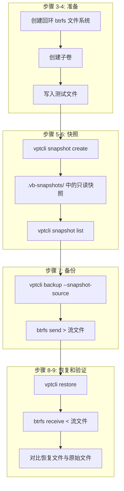

# 快速开始

本教程将引导你完成一个完整的备份-恢复循环，共九个步骤。完成后，你将创建一个快照、将其备份到流文件、恢复到新位置并验证数据 -- 全部通过命令行完成。

:::tip
本指南使用 Linux 上的 **btrfs** 提供者。如果你使用 LVM 或 ZFS，请在相应位置替换为 `--provider lvm` 或 `--provider zfs`。工作流程是相同的。
:::

---

## 概述

备份流程遵循以下序列：


---

## 步骤 1 -- 查看可用后端

列出 vpt-rs 在你系统上识别到的所有后端：

```bash
vptcli snapshot backend list
```

Linux 上的预期输出：

```
platform: linux
provider: btrfs
backend: linux-btrfs

platform: linux
provider: lvm
backend: linux-lvm

platform: linux
provider: zfs
backend: linux-zfs
```

:::note
在非 Linux 平台上只列出一个后端 -- 你操作系统的原生后端。
:::

## 步骤 2 -- 查看后端能力

查看 btrfs 后端支持哪些功能：

```bash
vptcli snapshot capabilities --provider btrfs
```

```
linux-btrfs
- crash_consistent_snapshot
- block_level_backup
- block_level_restore
- incremental_send
```

这告诉你后端支持崩溃一致性快照、块级别 I/O 和增量发送 -- 完整备份工作流所需的一切。

## 步骤 3 -- 创建测试卷

你需要一个真实的 btrfs 文件系统来实验。创建一个基于回环设备的 btrfs 卷：

```bash
# 创建一个 1 GB 稀疏文件
truncate -s 1G /tmp/vpt-test.img

# 格式化为 btrfs
sudo mkfs.btrfs -f /tmp/vpt-test.img

# 创建挂载点
sudo mkdir -p /mnt/vpt-test

# 挂载文件系统
sudo mount /tmp/vpt-test.img /mnt/vpt-test

# 创建子卷（btrfs 快照需要子卷）
sudo btrfs subvolume create /mnt/vpt-test/data
```

:::caution
这些命令需要 root 权限。如示例所示使用 `sudo`。
:::

## 步骤 4 -- 写入测试数据

用示例文件填充子卷：

```bash
echo "Hello from vpt-rs!" | sudo tee /mnt/vpt-test/data/greeting.txt
echo "This file will survive backup and restore." | sudo tee /mnt/vpt-test/data/note.txt
sudo mkdir /mnt/vpt-test/data/docs
echo "Documentation content" | sudo tee /mnt/vpt-test/data/docs/readme.txt
```

验证数据已写入：

```bash
sudo ls -la /mnt/vpt-test/data/
cat /mnt/vpt-test/data/greeting.txt
```

## 步骤 5 -- 创建快照

使用 `vptcli` 创建子卷的只读快照：

```bash
sudo vptcli snapshot create --provider btrfs /mnt/vpt-test/data --label quickstart
```

```
snapshot: /mnt/vpt-test/.vb-snapshots/quickstart
source: /mnt/vpt-test/data
backend: linux-btrfs
path: /mnt/vpt-test/.vb-snapshots/quickstart
```

快照存储在源子卷旁边的隐藏 `.vb-snapshots` 目录中。默认为只读，防止意外修改。

## 步骤 6 -- 列出快照

确认快照已创建：

```bash
sudo vptcli snapshot list --provider btrfs /mnt/vpt-test/data
```

```
/mnt/vpt-test/.vb-snapshots/quickstart - linux-btrfs
```

## 步骤 7 -- 备份到流文件

从快照创建备份流：

```bash
sudo vptcli backup --provider btrfs --snapshot-source \
    /mnt/vpt-test/.vb-snapshots/quickstart \
    --output /tmp/quickstart-backup.stream
```

```
backend: linux-btrfs
output: /tmp/quickstart-backup.stream
```

:::tip
`--snapshot-source` 标志告诉 vptcli 源参数是一个现有快照，而不是活跃卷。不加这个标志，vptcli 会先尝试创建临时快照。
:::

检查流文件大小：

```bash
ls -lh /tmp/quickstart-backup.stream
```

## 步骤 8 -- 恢复到新位置

创建一个新目标目录并恢复备份：

```bash
sudo mkdir -p /mnt/vpt-test/restore-target
sudo vptcli restore --provider btrfs \
    --input /tmp/quickstart-backup.stream \
    /mnt/vpt-test/restore-target
```

```
backend: linux-btrfs
input: /tmp/quickstart-backup.stream
```

Btrfs receive 在目标目录中创建一个新的子卷：

```bash
sudo ls /mnt/vpt-test/restore-target/
```

## 步骤 9 -- 验证数据

将恢复的文件与原始文件进行比较：

```bash
sudo cat /mnt/vpt-test/restore-target/*/greeting.txt
# 预期: Hello from vpt-rs!

sudo cat /mnt/vpt-test/restore-target/*/note.txt
# 预期: This file will survive backup and restore.

sudo cat /mnt/vpt-test/restore-target/*/docs/readme.txt
# 预期: Documentation content
```

你也可以运行递归 diff：

```bash
sudo diff -r /mnt/vpt-test/data /mnt/vpt-test/restore-target/<restored-subvol-name>
```

没有输出表示文件完全相同。

---

## 清理

实验完成后，卸载并删除测试资源：

```bash
# 删除快照
sudo vptcli snapshot delete --provider btrfs /mnt/vpt-test/.vb-snapshots/quickstart

# 卸载
sudo umount /mnt/vpt-test

# 删除回环镜像
rm /tmp/vpt-test.img

# 删除备份流
rm /tmp/quickstart-backup.stream
```

---

## 刚才发生了什么？

以下是你刚才完成的完整生命周期：



每个步骤对应库中的一个特定 trait 方法：

- `snapshot create` 调用 `SnapshotProvider::create_snapshot`
- `backup` 调用 `BackupExecutor::backup_volume`
- `restore` 调用 `RestorePlanner::restore_volume`

---

## 下一步

- 阅读[第一次备份](./first-backup.md)，深入了解快照策略、增量备份和错误处理。
- 浏览 [CLI 参考](../cli/overview.md)获取完整的命令文档。
- 如果你想将 vpt-rs 作为 Rust 库使用，请参阅[库 API](../api/backend.md)。
