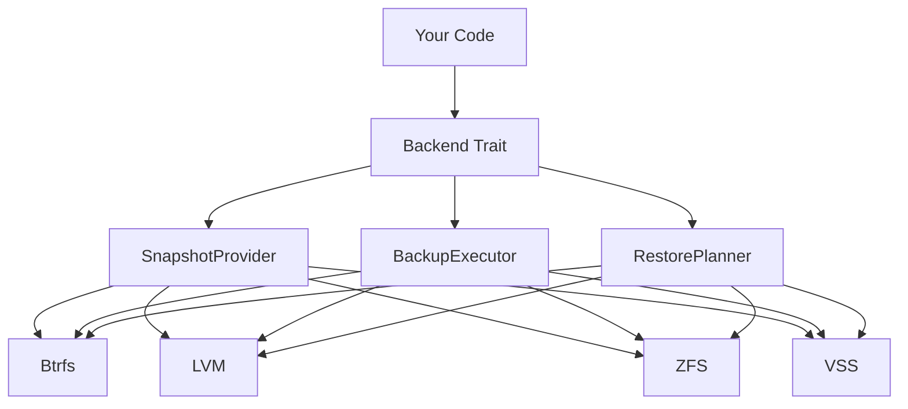

# vpt-rs 文档

**vpt-rs** 是一个用 Rust 编写的跨平台卷备份库和 CLI 工具。它提供了一套统一的 trait 架构，支持跨多种存储后端创建快照、块级别备份和恢复。

## 它能做什么？

vpt-rs 可以：

- **创建快照** -- 使用原生存储 API（Btrfs 子卷、LVM 快照、ZFS 快照、Windows VSS）创建卷快照
- **备份** -- 将卷备份到流文件或镜像文件（增量或全量）
- **恢复** -- 从备份文件恢复卷
- **管理** -- 快照生命周期管理（创建、列表、删除）

## 适用人群

- **系统管理员** -- 需要在不同存储后端之间进行可靠卷备份的运维人员
- **备份工具开发者** -- 希望使用一个能处理平台特定快照 API 复杂性的库
- **Rust 开发者** -- 需要在应用程序中集成卷备份功能

## 工作原理

vpt-rs 使用 **trait 架构**，每个存储后端实现同一组 trait：



这意味着你只需编写一次备份逻辑，就能在所有支持的存储后端上运行。

## 快速示例

```rust
use vpt_rs::platform;
use vpt_rs::{BackupExecutor, BackupPlan, BackupSource, BackupTarget, VolumeRef};

let backend = platform::current_backend();
let plan = BackupPlan {
    source: BackupSource::Volume(VolumeRef::new("/mnt/data")),
    target: BackupTarget::ImageFile("/tmp/backup.img".into()),
    ..Default::default()
};
backend.backup_volume(&plan)?;
```

## 支持的平台

| 平台 | 后端 | 状态 |
|------|------|------|
| Linux | Btrfs | 完全支持 |
| Linux | LVM | 完全支持 |
| Linux | ZFS | 完全支持 |
| Windows | VSS | 完全支持 |
| macOS | APFS | 桩实现 |
| Unix | Generic | 桩实现 |

## 下一步

- **[安装指南](./getting-started/installation)** -- 安装 vpt-rs
- **[快速开始](./getting-started/quick-start)** -- 5 分钟完成第一次备份
- **[架构设计](./concepts/architecture)** -- 了解 vpt-rs 的内部工作原理
