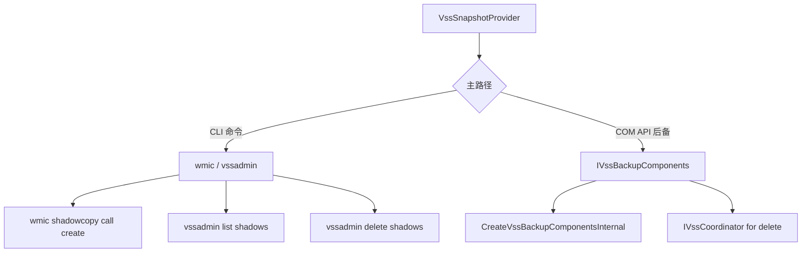

# Windows VSS 提供者

Windows VSS（卷影复制服务）提供者创建 NTFS 卷的时间点快照。它是唯一支持应用一致性快照的 vpt-rs 提供者，通过与注册的 VSS 写入器（如 SQL Server、Exchange）协调实现。

## 能力

| 能力 | 支持 |
|------|------|
| `crash_consistent_snapshot` | 是 |
| `application_consistent_snapshot` | 是 |
| `block_level_backup` | 是 |
| `block_level_restore` | 是 |
| `incremental_send` | 否 |
| `direct_device_access` | 是 |
| `writable_snapshot_mount` | 否 |
| `read_only_snapshot_mount` | 否 |

:::tip
应用一致性快照需要启用 VSS 写入器协调（默认启用）。如果你显式禁用写入器协调，请求 `SnapshotKind::ApplicationConsistent` 将返回 `MissingCapability` 错误。
:::

## 双路径架构

VSS 提供者使用两条独立的代码路径与 Windows VSS 子系统交互：



### CLI 路径（主路径）

使用 `wmic` 创建快照，使用 `vssadmin` 列出和删除。适用于所有 Windows 版本。

### COM 路径（后备）

动态加载 `vssapi.dll` 并调用 `CreateVssBackupComponentsInternal` 获取 `IVssBackupComponents` 接口。

## CLI 示例

```bash
# 创建崩溃一致性快照
vptcli snapshot create C: --provider windows-vss

# 创建应用一致性快照
vptcli snapshot create C: --provider windows-vss --kind application --label "pre-upgrade"

# 备份卷
vptcli backup C: --provider windows-vss --output E:\backups\c-drive.img

# 恢复卷
vptcli restore C: --provider windows-vss --input E:\backups\c-drive.img --force
```

## 已知限制

- **COM vtable 脆弱性**：COM API 路径依赖经验确定的 vtable 偏移量。CLI 路径更可移植。
- **不支持增量备份**：没有流差异机制。每次备份都是完整复制。
- **不支持挂载/卸载**：手动使用 Windows 磁盘管理或 `mountvol` 访问快照卷。
- **GUID 验证**：快照 ID 必须是有效的 GUID。格式错误的标识符在任何 VSS API 调用前被拒绝。
