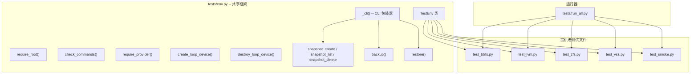
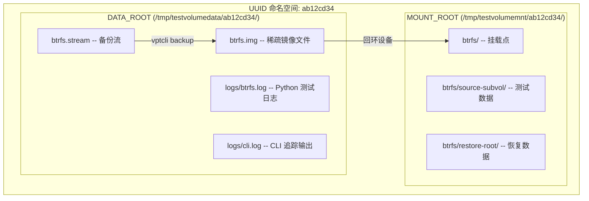
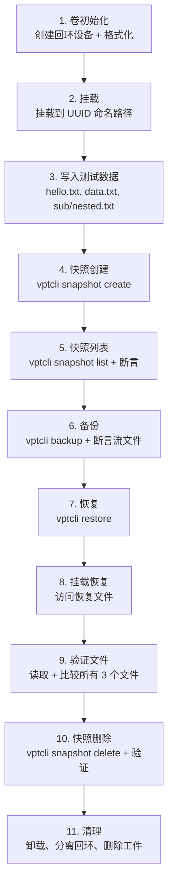
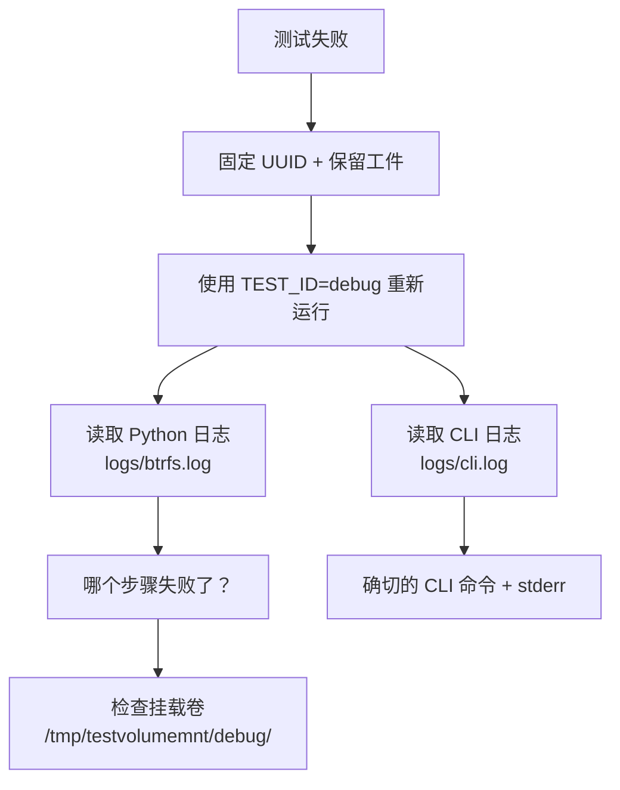

# 集成测试指南

集成测试在真实存储提供者上端到端地执行 `vptcli`。它们使用 Python 编写，在 Linux 上使用回环设备或在 Windows 上使用 VHD 文件创建可处置的卷。

## 测试框架架构

所有测试共享 `tests/env.py` 中定义的通用框架。该模块提供权限检测、命令可用性检查、基于 UUID 的工件隔离、回环设备生命周期管理、`vptcli` 子命令的 CLI 包装器和结构化日志。



## 基于 UUID 的测试隔离

每次测试运行获得一个唯一的 8 字符 UUID 前缀。所有工件 -- 镜像、流、挂载点和日志 -- 都在此 UUID 命名空间下，因此并行或重叠的运行永远不会冲突。



## 11 步测试生命周期

每个提供者测试遵循相同的 11 步生命周期：



| 步骤 | CLI / 系统命令 | 断言 |
|------|---------------|------|
| 1. 卷初始化 | `truncate -s 2G`、`losetup --find --show`、`mkfs.btrfs -f` | 回环设备路径非空 |
| 2. 挂载 | `mount <loop> <mount>` | 挂载成功（退出 0） |
| 3. 写入数据 | `btrfs subvolume create`、`echo ... > hello.txt` | 文件存在 |
| 4. 快照创建 | `vptcli snapshot create --provider <P>` | 退出码 0 |
| 5. 快照列表 | `vptcli snapshot list --provider <P>` | 快照标签出现在输出中 |
| 6. 备份 | `vptcli backup --provider <P> --output <stream>` | 退出 0，流文件存在，大小 > 0 |
| 7. 恢复 | `vptcli restore --provider <P> --input <stream>` | 退出码 0 |
| 9. 验证文件 | `rglob("*.txt")`、`read_text()` | 内容匹配源数据 |
| 10. 快照删除 | `vptcli snapshot delete --provider <P>` | 快照从列表中消失 |
| 11. 清理 | `umount`、`losetup -d`、`rm` | 工件已清理 |

## 提供者特定测试

### Btrfs (`tests/test_btrfs.py`)

- **初始化**：`truncate` -> 回环设备 -> `mkfs.btrfs -f` -> 挂载 -> `btrfs subvolume create`
- **备份**：自动创建临时快照，运行 `btrfs send`，清理临时快照
- **恢复**：运行 `btrfs receive` 到恢复目录
- **验证**：使用 `rglob("*.txt")` 在接收的子卷中查找文件

### LVM (`tests/test_lvm.py`)

- **初始化**：`truncate` -> 回环 -> `pvcreate` -> `vgcreate` -> 2x `lvcreate -L 512M` -> `mkfs.ext4`
- **备份**：自动创建 LVM 快照，运行 `dd` 到镜像文件，清理快照
- **恢复**：使用 `--force` 将 `dd` 镜像写入目标 LV
- **验证**：挂载恢复的 LV，用 `cat` 读取文件，卸载

### ZFS (`tests/test_zfs.py`)

- **初始化**：`truncate` -> 回环 -> `zpool create -f` -> 2x `zfs create`
- **备份**：在显式快照上运行 `zfs send`（`--snapshot-source`）
- **恢复**：运行 `zfs receive -F` 到恢复数据集
- **验证**：从自动挂载的恢复数据集读取文件

### VSS (`tests/test_vss.py`) -- 仅 Windows

- **初始化**：`diskpart` 创建 VHD，附加，格式化 NTFS
- **快照**：COM API，后备到 `wmic`/`vssadmin` CLI
- **备份**：COM 快照 + 直接卷复制后备
- **恢复**：分离目标 VHD，备份.img 的原始块复制，重新挂载
- **验证**：对所有 3 个文件使用 `Path.read_text()`

## 环境变量

| 变量 | 默认值 | 描述 |
|------|--------|------|
| `TEST_DATA_ROOT` | `/tmp/testvolumedata` | 镜像、流、日志的根目录 |
| `TEST_MOUNT_ROOT` | `/tmp/testvolumemnt` | 挂载点的根目录 |
| `TEST_ID` | *（自动生成 UUID）* | 测试运行标识符，用于工件隔离 |
| `TEST_CLEANUP` | `1` | 设为 `0` 保留挂载目录 |
| `TEST_KEEP_ARTIFACTS` | `0` | 设为 `1` 保留镜像/流文件 |
| `VPT_PROJECT_ROOT` | *（自动检测）* | 项目根目录路径（包含 `Cargo.toml`） |
| `RUST_LOG` | `vpt_rs=debug` | CLI 追踪的日志级别 |
| `VPT_COMMAND_TIMEOUT_SECS` | `30` | vptcli 运行的外部命令超时 |

## 运行测试

```bash
# 所有提供者
sudo python3 tests/run_all.py

# 单个提供者
sudo python3 tests/test_btrfs.py

# 选择性提供者
sudo python3 tests/run_all.py --providers btrfs,smoke

# 构建并测试
sudo python3 tests/run_all.py --build

# 保留工件用于调试
sudo python3 tests/run_all.py --keep --no-cleanup

# 固定 UUID 以重现
TEST_ID=debug123 sudo python3 tests/run_all.py --providers btrfs --keep --no-cleanup
```

## 前提条件

### 系统包

| 提供者 | Debian / Ubuntu 包 | 所需命令 |
|--------|-------------------|----------|
| btrfs | `btrfs-progs` | `mkfs.btrfs`、`btrfs` |
| lvm | `lvm2` | `pvcreate`、`vgcreate`、`lvcreate`、`lvremove`、`vgremove`、`pvremove`、`mkfs.ext4` |
| zfs | `zfsutils-linux` | `zpool`、`zfs` |
| common | `util-linux` | `losetup`、`truncate`（通常预装） |

```bash
sudo apt-get install -y btrfs-progs lvm2 zfsutils-linux
```

## 日志文件和调试

每个测试在 `<DATA_ROOT>/<UUID>/logs/` 下产生两个日志文件：

### Python 测试日志

```
/tmp/testvolumedata/ab12cd34/logs/btrfs.log
```

包含带时间戳的逐步输出。

### CLI 追踪日志

```
/tmp/testvolumedata/ab12cd34/logs/cli.log
```

包含来自 `vptcli` 调用的所有 `RUST_LOG=debug` 输出。

### 调试失败测试



1. 固定 UUID 并保留所有工件：
   ```bash
   TEST_ID=debug TEST_KEEP_ARTIFACTS=1 TEST_CLEANUP=0 \
     sudo python3 tests/test_btrfs.py
   ```
2. 检查 Python 日志确认哪个步骤失败。
3. 检查 `cli.log` 获取确切的 CLI 调用和追踪输出。
4. 检查 `/tmp/testvolumemnt/debug/` 处的挂载卷。
