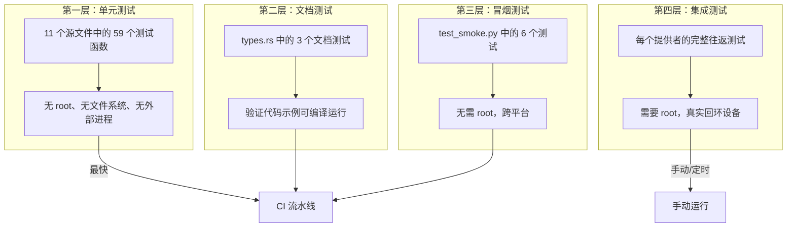
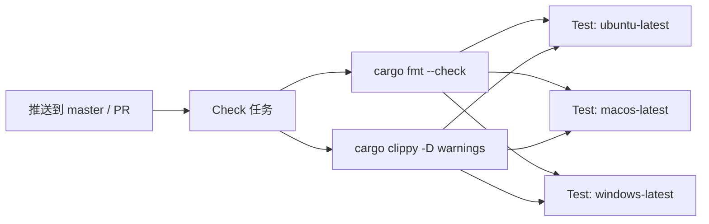

# 测试策略

vpt-rs 使用分层测试方法，在速度、覆盖率和真实性之间取得平衡。快速的单元测试和文档测试在每个平台的 CI 中运行，而较慢的集成测试在 Linux 和 Windows 上以 root 权限执行真实存储提供者的测试。

## 测试架构



## 单元测试（59 个测试）

单元测试分布在 11 个源文件中：

| 模块 | 文件 | 测试数 | 测试内容 |
|------|------|--------|----------|
| btrfs | `src/platform/linux/btrfs.rs` | 6 | 快照路径派生、btrfs send/receive 命令生成、增量备份、输出解析 |
| lvm | `src/platform/linux/lvm.rs` | 8 | 卷路径解析、lvcreate 命令、列表输出过滤、备份计划、force 标志 |
| zfs | `src/platform/linux/zfs.rs` | 10 | 数据集引用解析、zfs snapshot/send 命令、增量发送、恢复验证 |
| windows | `src/platform/windows.rs` | 4 | 后端名称、能力声明、卷路径转换 |
| vss | `src/platform/windows/vss.rs` | 2 | 请求验证、设备路径拒绝 |
| vss/ffi/cli | `src/platform/windows/vss/ffi/cli.rs` | 10 | GUID 提取、wmic 字段解析、vssadmin 输出解析 |
| vss/ffi/com | `src/platform/windows/vss/ffi/com.rs` | 9 | GUID 解析往返、卷路径规范化、宽字符串编码 |
| lib | `src/lib.rs` | 5 | 平台描述符、后端名称匹配、可用后端、SnapshotKind 解析 |
| process | `src/process.rs` | 1 | wait_with_timeout 对长时间运行子进程返回 None |
| copy | `src/copy.rs` | 3 | 文件内容复制、空文件处理、零块大小拒绝 |
| linux | `src/platform/linux/mod.rs` | 1 | available_descriptors 返回 btrfs、lvm、zfs |

运行所有单元测试：

```bash
cargo test --lib
```

:::tip
单元测试从不需要 root 权限。它们不写入真实磁盘或启动特权子进程。计划级测试通过 `tempdir()` 创建临时目录并在测试后清理。
:::

## 文档测试（3 个测试）

文档测试验证 `src/types.rs` 中文档注释里的代码示例能编译和运行：

| 类型 | 验证内容 |
|------|----------|
| `VolumeRef` | `VolumeRef::new` 构造和 `Display` 输出 |
| `SnapshotRequest` | 包含所有字段的结构体构造 |
| `BackupPlan` | 包含 `SnapshotPolicy::temporary` 的完整结构体构造 |

## 冒烟测试（6 个测试，无需 root）

`tests/test_smoke.py` 中的冒烟测试验证基本 CLI 行为，无需 root 权限：

| 测试 | 检查内容 |
|------|----------|
| `backend_list` | `vptcli snapshot backend list` 返回平台信息 |
| `capabilities_linux_providers` | `vptcli snapshot capabilities` 对每个 Linux 提供者有效 |
| `snapshot_usage` | 无参数的 `vptcli snapshot` 显示用法（退出 0） |
| `backup_usage` | 无参数的 `vptcli backup` 显示用法（退出 0） |
| `restore_usage` | 无参数的 `vptcli restore` 显示用法（退出 0） |
| `snapshot_invalid_provider` | 未知提供者返回非零退出码 |

## 集成测试

完整往返测试在真实存储提供者上执行 `vptcli`。需要 root 权限和提供者特定的系统包。详见[集成测试](./integration-tests.md)页面。

## CI 流水线

CI 工作流（`.github/workflows/ci.yml`）在每次推送到 `master` 和 PR 时运行：



**Check 任务**（在 `ubuntu-latest` 上运行）：

1. `cargo fmt --all -- --check` -- 强制一致格式化
2. `cargo clippy --all-targets -D warnings` -- 捕获常见 Rust 错误

**Test 任务**（在三个平台上并行运行）：

1. `cargo build --verbose`
2. `cargo test --verbose` -- 运行所有单元测试 + 文档测试
3. 仅 Windows：`cargo build --all-features` 和 `cargo test --all-features`

集成测试**不是** CI 的一部分，因为它们需要 root 权限和特定存储工具。

## 本地运行测试

```bash
# 所有单元和文档测试
cargo test

# 仅单元测试（跳过文档测试）
cargo test --lib

# 仅文档测试
cargo test --doc

# 冒烟测试（无需 root）
python3 tests/test_smoke.py

# 集成测试（需要 root）
sudo python3 tests/run_all.py
sudo python3 tests/test_btrfs.py
```

:::caution
集成测试创建回环设备、LVM 卷组和 ZFS 池。始终在可处置的环境中运行。永远不要在生产系统上运行。
:::
