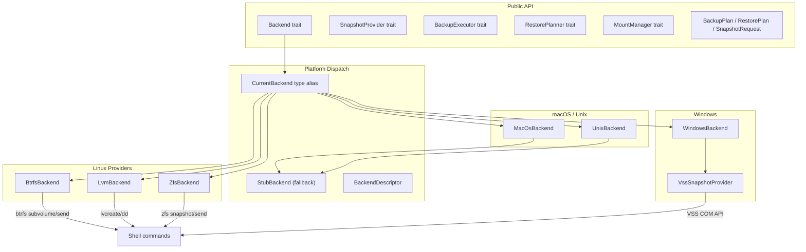
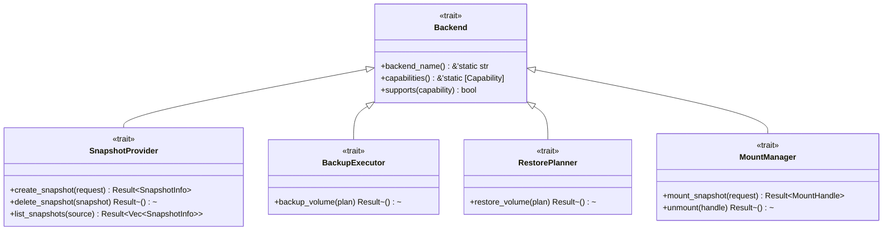
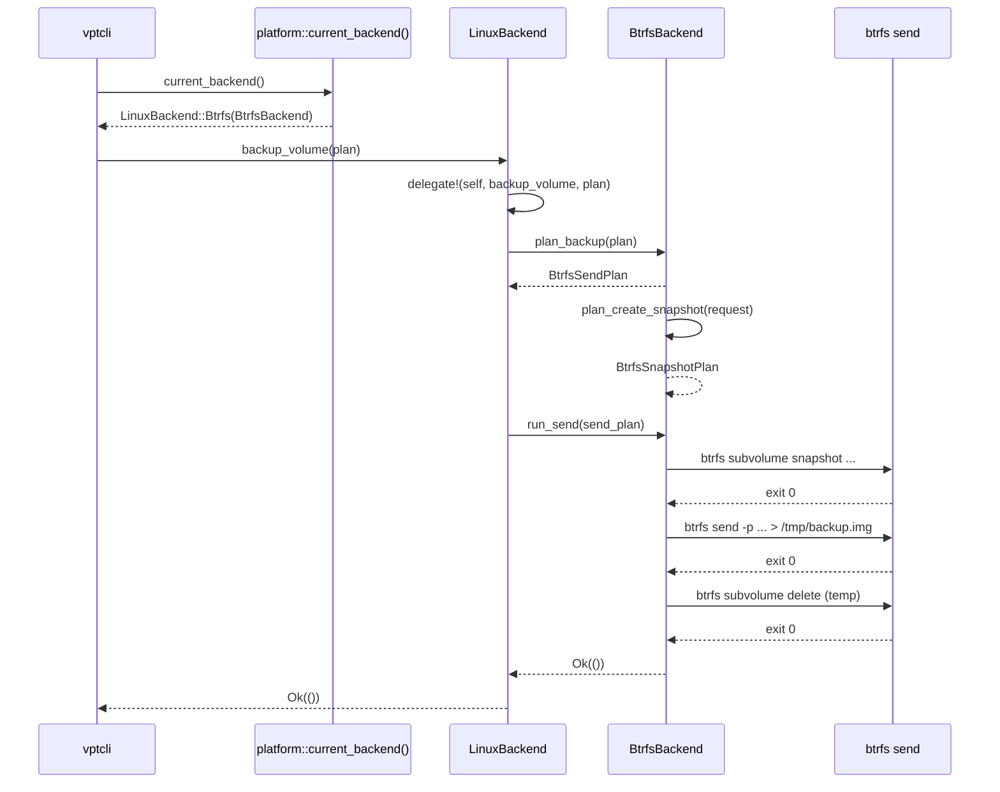

# Architecture

This page explains how vpt-rs is organized, how its layers connect, and how a
backup request flows from the CLI down to the platform-specific tool that does
the actual work.

## High-level overview

vpt-rs is structured as three layers:

1. **Public API** -- the five traits (`Backend`, `SnapshotProvider`,
   `BackupExecutor`, `RestorePlanner`, `MountManager`) and the plan/request
   structs that callers interact with.
2. **Platform dispatch** -- compile-time `cfg` selects the right backend for the
   target OS, while runtime helpers let the CLI enumerate available backends.
3. **Provider implementations** -- each backend wraps a native tool (`btrfs`,
   `lvcreate`, `zfs`, VSS) and translates plans into shell commands.



## The trait hierarchy

All five traits share a common supertrait pattern:



`Backend` is the supertrait. Every operational trait extends it via
`: Backend`, which means any code that holds a `SnapshotProvider` can also call
`backend_name()`, `capabilities()`, and `supports()`.

:::tip Why a supertrait?
The supertrait lets you write generic code that works with *any* backend
without knowing which operational trait it implements. For example, a CLI
progress reporter only needs `Backend` to display the backend name.
:::

## Platform dispatch

### Compile-time selection

The `platform` module uses `#[cfg(target_os = "...")]` to select exactly one
`CurrentBackend` type alias per build target:

| Target OS | `CurrentBackend` alias |
|-----------|----------------------|
| Linux     | `LinuxBackend`       |
| Windows   | `WindowsBackend`     |
| macOS     | `MacOsBackend`       |
| Other Unix| `UnixBackend`        |

This means the compiler only includes code for the target platform. There is
no runtime branching cost.

### Runtime provider selection (Linux only)

On Linux, three providers coexist (Btrfs, LVM, ZFS). The `LinuxBackend` enum
wraps all three and delegates every trait method with the `delegate!` macro:

```rust
macro_rules! delegate {
    ($self:expr, $method:ident $(, $arg:expr)*) => {
        match $self {
            Self::Btrfs(inner) => inner.$method($($arg),*),
            Self::Lvm(inner) => inner.$method($($arg),*),
            Self::Zfs(inner) => inner.$method($($arg),*),
        }
    };
}
```

:::note
The `delegate!` macro eliminates boilerplate. Without it, every trait method
would need a three-arm `match` block repeated for each of the six methods
across five traits.
:::

### The StubBackend pattern

`StubBackend` is a concrete struct that implements all five traits but returns
`Error::UnsupportedOperation` for every operational method. It serves two
purposes:

1. **Default backend for unsupported platforms** -- macOS and generic Unix
   backends wrap a `StubBackend` and delegate to it.
2. **Capability declaration** -- even when operations are stubbed, the backend
   still declares its capabilities (e.g. `BlockLevelBackup`) so callers can
   check what *would* be supported.

```rust
pub struct StubBackend {
    backend_name: &'static str,
    capabilities: &'static [Capability],
}

impl SnapshotProvider for StubBackend {
    fn create_snapshot(&self, _request: &SnapshotRequest) -> Result<SnapshotInfo> {
        Err(Error::UnsupportedOperation {
            operation: "create_snapshot",
            backend: self.backend_name,
        })
    }
    // ...
}
```

## The plan-then-execute pattern

Every backup, restore, and snapshot operation follows the same two-phase
pattern:

1. **Plan** -- build a backend-specific plan struct that describes *what* will
   happen. Plans are pure data; they do not touch the filesystem.
2. **Execute** -- run the plan by invoking shell commands or copy routines.


This separation has concrete benefits:

- **Unit testing** -- you can call `plan_backup()` on a `BtrfsBackend` in a
  test without root privileges or a real Btrfs filesystem. The plan struct is
  just data you can inspect with `assert_eq!`.
- **Validation** -- plans reject invalid inputs (missing paths, unsupported
  snapshot kinds) before any work begins.
- **Composability** -- a plan can include a nested plan (e.g. a temporary
  snapshot plan inside a send plan).

## How a backup flows end-to-end

Here is the full sequence when a user runs `vpt backup /mnt/data /tmp/backup.img`:



:::caution
Backends require elevated privileges. Btrfs snapshot operations, LVM
`lvcreate`, and Windows VSS all need root or Administrator access. The library
returns `Error::CommandFailed` with the stderr output if the underlying tool
is denied permission.
:::

## File layout

```
src/
  lib.rs            -- public re-exports
  backend.rs        -- Backend supertrait
  snapshot.rs       -- SnapshotProvider trait
  backup.rs         -- BackupExecutor trait
  restore.rs        -- RestorePlanner trait
  mount.rs          -- MountManager trait
  types.rs          -- plan/request structs, Capability enum
  error.rs          -- Error enum
  process.rs        -- shell command runner with timeout
  copy.rs           -- block-level copy helper
  logging.rs        -- tracing setup
  platform/
    mod.rs          -- CurrentBackend alias, StubBackend, BackendDescriptor
    linux/
      mod.rs        -- LinuxBackend enum + delegate! macro
      btrfs.rs      -- BtrfsBackend
      lvm.rs        -- LvmBackend
      zfs.rs        -- ZfsBackend
    windows.rs      -- WindowsBackend + VSS integration
    macos.rs        -- MacOsBackend (stub)
    unix.rs         -- UnixBackend (stub)
```

## Next steps

- [Traits](./traits.md) -- deep dive into each of the five traits
- [Backends](./backends.md) -- how backends are selected and how to add a new one
- [Capabilities](./capabilities.md) -- the capability system and graceful degradation
