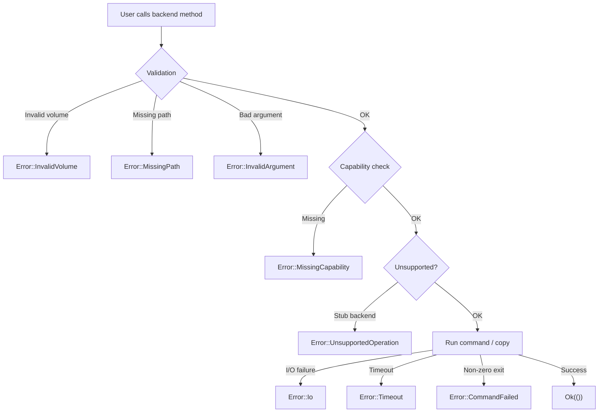

# Error Handling

vpt-rs uses a single `Error` enum with structured context on every variant.
This page explains each error type, how to match on them, and best practices
for handling errors in your code.

## The Error enum

```rust
#[derive(Debug, thiserror::Error)]
pub enum Error {
    UnsupportedOperation { operation: &'static str, backend: &'static str },
    MissingCapability    { capability: &'static str, backend: &'static str },
    InvalidVolume        { volume: String },
    MissingPath          { path: PathBuf },
    Io(#[from] std::io::Error),
    InvalidArgument      { message: String },
    CommandFailed        { command: String, status: i32, stderr: String },
    Timeout              { operation: &'static str, backend: &'static str, timeout_secs: u64 },
    Message              { message: String },
}
```

There is also a convenience alias:

```rust
pub type Result<T> = std::result::Result<T, Error>;
```

:::tip Design principle
Every variant carries structured context -- not just a string. This means you
can match on specific variants and extract fields programmatically, without
parsing error messages.
:::

## Error variants in detail

### UnsupportedOperation

Returned when a backend does not implement a particular operation (e.g.
calling `mount_snapshot()` on Btrfs).

```rust
match backend.mount_snapshot(&request) {
    Err(Error::UnsupportedOperation { operation, backend }) => {
        println!("The {} backend does not support {}", backend, operation);
    }
    // ...
}
```

### MissingCapability

Returned when a backend does not declare the required capability. More
specific than `UnsupportedOperation` -- names the exact missing capability.

```rust
match backend.create_snapshot(&request) {
    Err(Error::MissingCapability { capability, backend }) => {
        println!("The {} backend does not support `{}`", backend, capability);
    }
    // ...
}
```

### InvalidVolume

Returned when a volume reference is empty or malformed (e.g. non-absolute
path for Btrfs, wrong `/dev/<vg>/<lv>` format for LVM).

```rust
match backend.create_snapshot(&request) {
    Err(Error::InvalidVolume { volume }) => {
        println!("Bad volume reference: `{}`", volume);
    }
    // ...
}
```

### MissingPath

Returned when a required filesystem path does not exist.

```rust
match backend.backup_volume(&plan) {
    Err(Error::MissingPath { path }) => {
        println!("Path does not exist: {}", path.display());
    }
    // ...
}
```

### Io

A wrapper around `std::io::Error`. Covers permission denied, disk full,
broken pipes, etc.

```rust
match backend.backup_volume(&plan) {
    Err(Error::Io(io_err)) => {
        println!("I/O error (kind: {:?}): {}", io_err.kind(), io_err);
    }
    // ...
}
```

:::note
`Error` implements `From<std::io::Error>` via `#[from]`, so `?` on I/O
operations automatically wraps the error.
:::

### InvalidArgument

Returned when a plan or request contains invalid values (e.g. device target
for Btrfs send, missing `force` flag for LVM restore).

```rust
match backend.backup_volume(&plan) {
    Err(Error::InvalidArgument { message }) => {
        println!("Bad argument: {}", message);
    }
    // ...
}
```

### CommandFailed

Returned when an external command exits with a non-zero status. The most
common error in production. Fields: `command`, `status`, `stderr`.

```rust
match backend.backup_volume(&plan) {
    Err(Error::CommandFailed { command, status, stderr }) => {
        println!("Command `{}` failed (exit {}): {}", command, status, stderr);
    }
    // ...
}
```

:::tip
The `stderr` field often contains the exact reason for failure. Always surface
it to the user.
:::

### Timeout

Returned when an external command exceeds the configured timeout (default: 30
seconds). Use the `timeout_secs()` accessor for programmatic access.

```rust
match backend.backup_volume(&plan) {
    Err(Error::Timeout { operation, backend, timeout_secs }) => {
        println!("{} on {} timed out after {}s", operation, backend, timeout_secs);
    }
    // ...
}
```

:::note
The timeout is configurable via `VPT_COMMAND_TIMEOUT_SECS`. The process module
uses exponential backoff polling (10ms to 200ms) to check for completion.
:::

### Message

A generic error with a free-form message.

## Matching on specific variants

```rust
let result = backend.backup_volume(&plan);

if matches!(&result, Err(Error::Timeout { .. })) {
    println!("Operation timed out");
}

// Exhaustive match
match result {
    Ok(()) => println!("Backup completed"),
    Err(Error::UnsupportedOperation { operation, backend }) => {
        eprintln!("{} not supported on {}", operation, backend);
    }
    Err(Error::CommandFailed { command, status, stderr }) => {
        eprintln!("Command `{}` failed (exit {}): {}", command, status, stderr);
    }
    Err(Error::Timeout { timeout_secs, .. }) => {
        eprintln!("Timed out after {}s", timeout_secs);
    }
    Err(e) => eprintln!("Error: {}", e),
}
```

## Error context in logs

Every backend logs errors with structured `tracing` context before returning
them. You do not need to add your own logging for backend errors.

:::caution
Errors are logged before being returned. If your app also logs errors, you may
see duplicates. Log only at the application boundary (CLI, API handler).
:::

## Best practices

1. **Always handle `CommandFailed`** -- it is the most common error in
   production. Surface the `stderr` field to the user; it usually contains the
   exact reason for failure.

2. **Check capabilities before calling operations** -- prevents
   `MissingCapability` errors. Adjust your plan (e.g. fall back to
   crash-consistent) before calling.

3. **Use the `?` operator** -- `Error` implements `From<std::io::Error>`, so
   I/O errors inside the library propagate cleanly via `?`.

4. **Distinguish transient from permanent errors** -- `Timeout` and some
   `CommandFailed` errors (exit code 13 = permission denied) may be retryable.
   `InvalidArgument` and `MissingCapability` are permanent.

5. **Use `timeout_secs()` for adaptive behavior** -- if a timeout occurs, you
   can double the timeout via `VPT_COMMAND_TIMEOUT_SECS` and retry.

## Error flow diagram



## Next steps

- [Architecture](./architecture.md) -- how errors fit into the overall design
- [Traits](./traits.md) -- which errors each trait may return
- [Backends](./backends.md) -- platform-specific error scenarios
