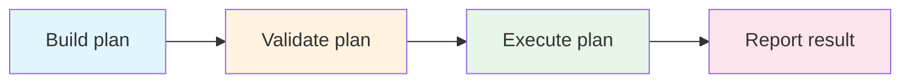
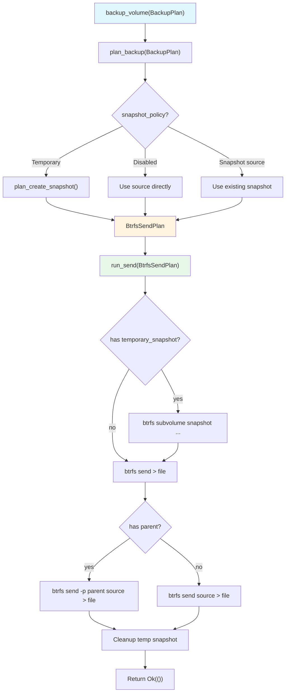

# Plans

vpt-rs uses a "plan-then-execute" pattern for all operations. A plan is a plain
data struct that describes *what* should happen. Execution is a separate step
that *makes* it happen. This page explains why this pattern exists and how to
use the plan types.

## Why plans?



Separating planning from execution gives you three concrete benefits:

1. **Testability** -- you can call `plan_backup()` on a `BtrfsBackend` in a
   `#[test]` function without root privileges or a real Btrfs filesystem. The
   plan is just a struct you can inspect with `assert_eq!`.

2. **Validation** -- plans reject invalid inputs (missing paths, unsupported
   snapshot kinds, wrong target types) before any work begins. No half-finished
   operations to clean up.

3. **Composability** -- a plan can contain a nested plan. For example,
   `BtrfsSendPlan` contains an optional `BtrfsSnapshotPlan` for the temporary
   snapshot it will create before sending.

:::tip The key insight
Plans are the "compiled" form of a user request. `BackupPlan` is the source
language; the backend-specific plan (e.g. `BtrfsSendPlan`) is the compiled
form with all ambiguities resolved.
:::

## BackupPlan

`BackupPlan` is the public plan type for backup operations. It is
provider-neutral -- it does not know about Btrfs, LVM, or ZFS.

```rust
#[derive(Debug, Clone, PartialEq, Eq)]
pub struct BackupPlan {
    pub source: BackupSource,
    pub target: BackupTarget,
    pub snapshot_policy: SnapshotPolicy,
    pub parent_snapshot: Option<SnapshotRef>,
    pub block_size: Option<usize>,
}
```

### Fields explained

| Field | Type | Description |
|-------|------|-------------|
| `source` | `BackupSource` | What to back up -- a live `Volume` or an existing `Snapshot`. |
| `target` | `BackupTarget` | Where to write -- an `ImageFile` path or a `Device` path. |
| `snapshot_policy` | `SnapshotPolicy` | Whether to create a temporary snapshot first. |
| `parent_snapshot` | `Option<SnapshotRef>` | Previous snapshot for incremental backups. |
| `block_size` | `Option<usize>` | I/O chunk size. `None` uses the default (4 MiB). |

### Creating a full backup

```rust
let plan = BackupPlan {
    source: BackupSource::Volume(VolumeRef::new("/dev/vg0/data")),
    target: BackupTarget::ImageFile(PathBuf::from("/backups/data.img")),
    snapshot_policy: SnapshotPolicy::temporary(
        SnapshotKind::CrashConsistent, Some("backup".to_string()), true,
    ),
    parent_snapshot: None,
    block_size: None,
};

backend.backup_volume(&plan)?;
```

### Creating an incremental backup

```rust
let plan = BackupPlan {
    source: BackupSource::Snapshot(
        SnapshotRef::new("tank/data@snap2").with_origin(VolumeRef::new("tank/data")),
    ),
    target: BackupTarget::ImageFile(PathBuf::from("/backups/data-incr.zfs")),
    snapshot_policy: SnapshotPolicy::disabled(),
    parent_snapshot: Some(
        SnapshotRef::new("tank/data@snap1").with_origin(VolumeRef::new("tank/data")),
    ),
    block_size: None,
};

backend.backup_volume(&plan)?;
```

## BackupSource

`BackupSource` tells the backend whether to work with a live volume or an
existing snapshot:

- **`Volume`** -- the backend may create a temporary snapshot or read directly.
- **`Snapshot`** -- the backend uses the existing snapshot as-is. Required for
  ZFS send unless a temporary snapshot policy is provided.

## SnapshotPolicy

`SnapshotPolicy` controls whether the backend should create a temporary
snapshot before backing up:

- **`Disabled`** -- back up the source as-is. Fine for snapshots, risky for
  live volumes.
- **`Temporary`** -- create a snapshot, back it up, then delete it. The
  recommended default for live volumes.

:::caution
Backing up a live volume without a temporary snapshot may produce an
inconsistent image, especially if applications are writing to the volume.
Always use `SnapshotPolicy::temporary()` for live volumes unless you have a
specific reason not to.
:::

## RestorePlan

`RestorePlan` describes how to restore a volume from a backup:

```rust
let plan = RestorePlan {
    source: BackupTarget::ImageFile(PathBuf::from("/backups/data.img")),
    destination: VolumeRef::new("/dev/vg0/restore"),
    force: true,  // required for LVM and VSS
    base_snapshot: None,
    block_size: None,
};

backend.restore_volume(&plan)?;
```

Key fields: `source` (backup file), `destination` (target volume), `force`
(required for destructive backends like LVM/VSS).

:::warning
The `force` flag is a safety mechanism. LVM and VSS restore operations
overwrite the entire destination volume.
:::

## SnapshotRequest

`SnapshotRequest` is used directly with `SnapshotProvider::create_snapshot()`:

```rust
let request = SnapshotRequest {
    source: VolumeRef::new("/mnt/data/subvol"),
    kind: SnapshotKind::CrashConsistent,
    label: Some("pre-upgrade".to_string()),
    read_only: true,
};

let info = backend.create_snapshot(&request)?;
```

## Backend-specific plan types

Each backend translates the public plan into an internal plan that describes
the exact commands to run. These are not part of the public API but help you
understand what happens under the hood.

| Backend | Internal plan type | Mechanism |
|---------|-------------------|-----------|
| Btrfs | `BtrfsSendPlan` | `btrfs send` stream piped to file |
| LVM | `LvmBackupPlan` | Block-level `dd`-style copy |
| ZFS | `ZfsSendPlan` | `zfs send` stream piped to file |

Each plan may contain a nested temporary snapshot plan. For example,
`BtrfsSendPlan` includes an optional `BtrfsSnapshotPlan` that describes the
`btrfs subvolume snapshot` command to run before sending.

## The plan-then-execute flow

Here is how `BtrfsBackend::backup_volume()` uses plans internally:



## Testing with plans

The plan-then-execute pattern makes unit testing straightforward:

```rust
#[test]
fn btrfs_backup_plan_uses_send_to_image_file() {
    let backend = BtrfsBackend::new();
    let root = std::env::temp_dir().join("test-plan");
    std::fs::create_dir_all(&root).unwrap();
    let source = root.join("subvol");
    std::fs::create_dir_all(&source).unwrap();

    let plan = backend.plan_backup(&BackupPlan {
        source: BackupSource::Volume(VolumeRef::new(source.display().to_string())),
        target: BackupTarget::ImageFile(root.join("backup.stream")),
        snapshot_policy: SnapshotPolicy::temporary(
            SnapshotKind::CrashConsistent, Some("tmp".to_string()), true,
        ),
        parent_snapshot: None,
        block_size: None,
    }).unwrap();

    // Verify the plan uses btrfs send with a temporary snapshot
    assert_eq!(plan.command.program, "btrfs");
    assert_eq!(plan.command.args[0], "send");
    assert!(plan.temporary_snapshot.is_some());
    assert_eq!(
        plan.temporary_snapshot.unwrap().snapshot_path,
        root.join(".vb-snapshots").join("tmp")
    );

    let _ = std::fs::remove_dir_all(&root);
}
```

:::tip
The `plan_*` methods on backend structs are public. You can call them directly
in tests without root privileges or real volumes.
:::

## Next steps

- [Error Handling](./error-handling.md) -- what happens when plans fail
- [Capabilities](./capabilities.md) -- how capabilities affect plan validation
- [Traits](./traits.md) -- the traits that accept plans
