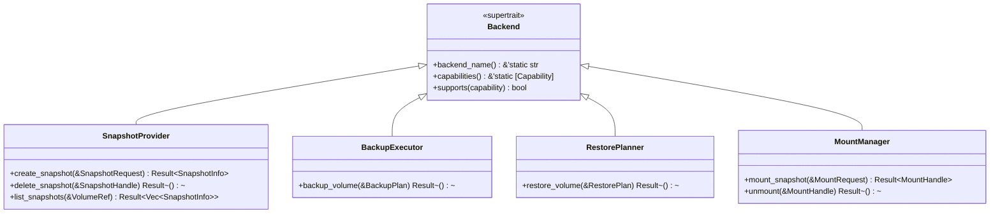

# Traits

vpt-rs exposes five traits that together form the complete public API. This
page explains each trait from first principles and shows how to use them.

## Trait hierarchy at a glance



Every operational trait extends `Backend` with `: Backend`. This is Rust's
supertrait syntax -- it means any type that implements `SnapshotProvider` must
*also* implement `Backend`. The compiler enforces this.

:::tip Why does this matter?
If you have a `Box<dyn SnapshotProvider>`, you can call `backend_name()` on it
without any downcasting. The supertrait bound guarantees the method exists.
:::

## Backend

`Backend` is the foundation. It carries no operations -- only identity and
capability metadata.

```rust
pub trait Backend: Send + Sync {
    fn backend_name(&self) -> &'static str;
    fn capabilities(&self) -> &'static [Capability];
    fn supports(&self, capability: Capability) -> bool {
        self.capabilities().contains(&capability)
    }
}
```

Key details:

- **`Send + Sync`** -- all backends are safe to share across threads. This is
  required because backup operations may run on async executors or thread
  pools.
- **`backend_name()`** -- returns a static string like `"linux-btrfs"`,
  `"linux-lvm"`, `"linux-zfs"`, or `"windows-vss"`. Used in log messages and
  error context.
- **`capabilities()`** -- returns a static slice of `Capability` variants.
  The default `supports()` method checks membership in this slice.

```rust
let backend = vpt_rs::platform::current_backend();
println!("Using backend: {}", backend.backend_name());

if backend.supports(Capability::IncrementalSend) {
    println!("Incremental backups are available");
}
```

## SnapshotProvider

`SnapshotProvider` manages the lifecycle of provider-native snapshots. Each
platform has its own mechanism (Btrfs uses `btrfs subvolume snapshot`, LVM uses
`lvcreate --snapshot`, ZFS uses `zfs snapshot`, Windows uses VSS).

```rust
pub trait SnapshotProvider: Backend {
    fn create_snapshot(&self, request: &SnapshotRequest) -> Result<SnapshotInfo>;
    fn delete_snapshot(&self, snapshot: &SnapshotHandle) -> Result<()>;
    fn list_snapshots(&self, source: &VolumeRef) -> Result<Vec<SnapshotInfo>>;
}
```

```rust
// Create a snapshot
let info = backend.create_snapshot(&SnapshotRequest {
    source: VolumeRef::new("/mnt/data/subvol"),
    kind: SnapshotKind::CrashConsistent,
    label: Some("nightly".to_string()),
    read_only: true,
})?;

// List and delete
let snapshots = backend.list_snapshots(&VolumeRef::new("/mnt/data/subvol"))?;
backend.delete_snapshot(&info.handle)?;
```

:::caution
Snapshot deletion is permanent. On Btrfs and ZFS this removes the subvolume
or dataset. On LVM it calls `lvremove`.
:::

## BackupExecutor

`BackupExecutor` exports a volume to a stream or image file. Different
backends use different mechanisms (Btrfs/ZFS use `send`, LVM/VSS use
block-level copy):

```rust
pub trait BackupExecutor: Backend {
    fn backup_volume(&self, plan: &BackupPlan) -> Result<()>;
}
```

```rust
let plan = BackupPlan {
    source: BackupSource::Volume(VolumeRef::new("/dev/vg0/data")),
    target: BackupTarget::ImageFile(PathBuf::from("/tmp/backup.img")),
    snapshot_policy: SnapshotPolicy::temporary(
        SnapshotKind::CrashConsistent, Some("backup".to_string()), true,
    ),
    parent_snapshot: None,
    block_size: None,
};

backend.backup_volume(&plan)?;
```

:::note
The `snapshot_policy` field tells the backend whether to create a temporary
snapshot before backing up. Backing up a live volume without a snapshot may
produce an inconsistent image.
:::

## RestorePlanner

`RestorePlanner` imports a volume from a backup stream or image file.
Destructive backends (LVM, VSS) require the `force` flag:

```rust
pub trait RestorePlanner: Backend {
    fn restore_volume(&self, plan: &RestorePlan) -> Result<()>;
}
```

```rust
let plan = RestorePlan {
    source: BackupTarget::ImageFile(PathBuf::from("/tmp/backup.img")),
    destination: VolumeRef::new("/dev/vg0/restore"),
    force: true,
    base_snapshot: None,
    block_size: None,
};

backend.restore_volume(&plan)?;
```

:::warning
Restoring is destructive. LVM writes directly to the device. ZFS receives the
stream into the destination dataset. Always double-check the destination.
:::

## MountManager

`MountManager` mounts an existing snapshot for browsing or file extraction:

```rust
pub trait MountManager: Backend {
    fn mount_snapshot(&self, request: &MountRequest) -> Result<MountHandle>;
    fn unmount(&self, handle: &MountHandle) -> Result<()>;
}
```

```rust
let request = MountRequest {
    snapshot: SnapshotHandle { id: "tank/data@snap1".to_string(), source: None },
    mode: MountMode::ReadOnly,
    target: Some(PathBuf::from("/mnt/snap1")),
};

let handle = backend.mount_snapshot(&request)?;
// ... browse files at handle.mount_point ...
backend.unmount(&handle)?;
```

:::note
Not all backends support mounting. Check `Capability::ReadOnlySnapshotMount`
and `Capability::WritableSnapshotMount` before calling.
:::

## Using traits as trait objects

All five traits are object-safe. You can use them as trait objects:

```rust
fn run_backup(executor: &dyn BackupExecutor, plan: &BackupPlan) -> vpt_rs::Result<()> {
    if !executor.supports(vpt_rs::Capability::BlockLevelBackup) {
        println!("Warning: backend does not support block-level backup");
    }
    executor.backup_volume(plan)
}
```

:::tip Prefer concrete types when possible
Dynamic dispatch (`dyn Trait`) has a small runtime cost from vtable lookups.
When you know the backend type at compile time, use the concrete type for
better performance and access to backend-specific methods like `plan_backup()`.
:::

## Next steps

- [Backends](./backends.md) -- how backends are selected and implemented
- [Capabilities](./capabilities.md) -- what each backend can do
- [Plans](./plans.md) -- the plan-then-execute pattern in detail
