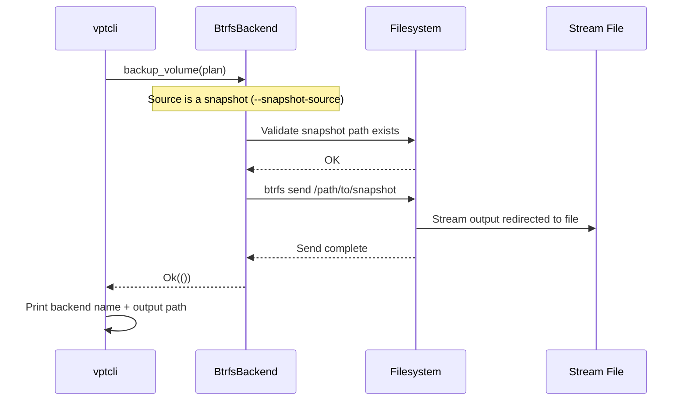
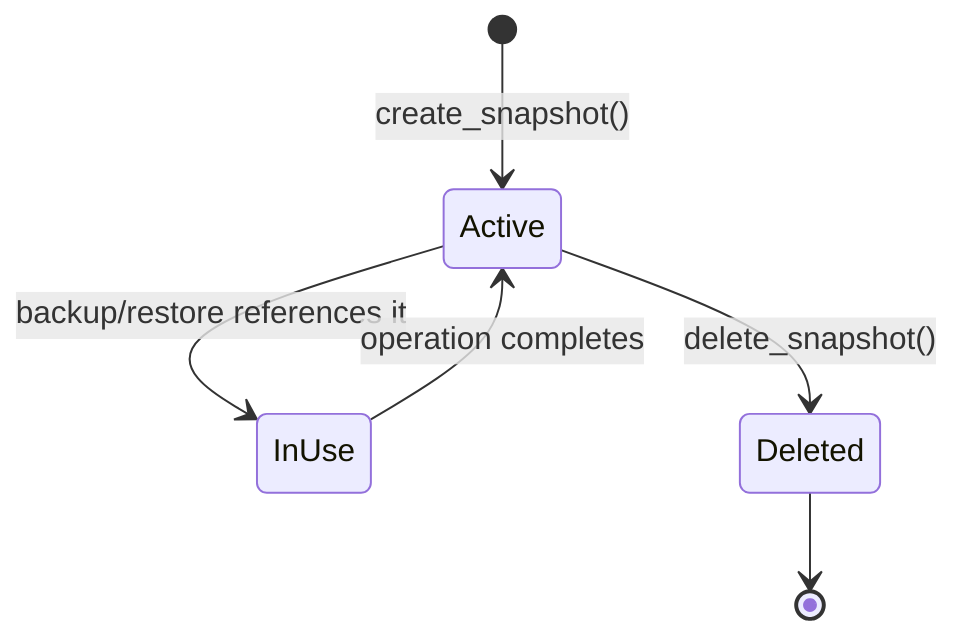
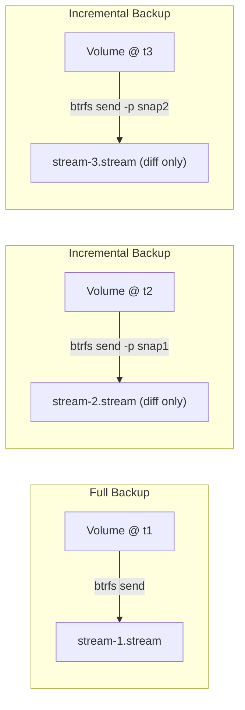

# First Backup -- A Deeper Dive

The [Quick Start](./quick-start.md) walked you through a complete backup cycle using the CLI. This guide explains **what happened at each step**, introduces snapshot policies and incremental backups, and covers error handling basics.

---

## Understanding What Happened

When you ran `vptcli backup --snapshot-source ... --output ...`, the following sequence executed:



The btrfs backend compiled a `BtrfsSendPlan` that contained:

1. The source snapshot path.
2. The target file path.
3. The `btrfs send` command and its arguments.
4. No temporary snapshot (because `--snapshot-source` was used).

It then executed the send, piping `btrfs send` stdout into the output file.

---

## The Snapshot Lifecycle

A snapshot goes through three phases: **create**, **use**, and **delete**.



### Create

```bash
sudo vptcli snapshot create --provider btrfs /mnt/data/subvol --label nightly
```

This calls `SnapshotProvider::create_snapshot` with a `SnapshotRequest`:

```rust
use vpt_rs::{SnapshotRequest, SnapshotKind, VolumeRef};

let request = SnapshotRequest {
    source: VolumeRef::new("/mnt/data/subvol"),
    kind: SnapshotKind::CrashConsistent,
    label: Some("nightly".to_string()),
    read_only: true,
};
```

The btrfs backend translates this into `btrfs subvolume snapshot -r /mnt/data/subvol /mnt/data/.vb-snapshots/nightly`.

### Use

Snapshots are referenced during backup and restore operations. They serve as a consistent point-in-time view of the volume.

### Delete

```bash
sudo vptcli snapshot delete --provider btrfs /mnt/data/.vb-snapshots/nightly
```

This calls `SnapshotProvider::delete_snapshot` with a `SnapshotHandle`. On btrfs, it translates to `btrfs subvolume delete /mnt/data/.vb-snapshots/nightly`.

:::caution
Deleting a snapshot is permanent. Make sure you no longer need it before running this command.
:::

---

## Backup Sources

vpt-rs distinguishes two kinds of backup source:

| Source | CLI Flag | Description |
|--------|----------|-------------|
| **Volume** | (default) | A live filesystem or logical volume. vptcli will create a temporary snapshot automatically if the snapshot policy allows it. |
| **Snapshot** | `--snapshot-source` | An existing snapshot. No temporary snapshot is created. |

### Backing Up a Live Volume

```bash
# vptcli creates a temporary snapshot, sends it, then deletes the snapshot
sudo vptcli backup --provider btrfs /mnt/data/subvol --output /tmp/backup.stream
```

This is equivalent to:

1. `btrfs subvolume snapshot -r /mnt/data/subvol /mnt/data/.vb-snapshots/tmp-snap`
2. `btrfs send /mnt/data/.vb-snapshots/tmp-snap > /tmp/backup.stream`
3. `btrfs subvolume delete /mnt/data/.vb-snapshots/tmp-snap`

### Backing Up an Existing Snapshot

```bash
# No temporary snapshot -- you manage the lifecycle yourself
sudo vptcli backup --provider btrfs --snapshot-source \
    /mnt/data/.vb-snapshots/nightly \
    --output /tmp/backup.stream
```

:::tip
Use `--snapshot-source` when you want full control over when snapshots are created and deleted, for example in an automated backup script that creates a labeled snapshot first, then backs it up.
:::

---

## Snapshot Policies

The snapshot policy controls how the backend obtains a snapshot for backup. There are two policies:

### Disabled

The backend uses the source as-is. No snapshot is created automatically.

```bash
sudo vptcli backup --provider btrfs --no-snapshot \
    /mnt/data/subvol --output /tmp/backup.stream
```

In library code:

```rust
use vpt_rs::SnapshotPolicy;

let policy = SnapshotPolicy::disabled();
```

:::caution
Using `--no-snapshot` on a live volume means the backup reflects whatever state the filesystem happens to be in at the moment. This is usually fine for btrfs (which is copy-on-write), but may produce inconsistent results on other backends.
:::

### Temporary

The backend creates a temporary snapshot, uses it for the backup, then deletes it. This is the **default behavior**.

```bash
# Default: creates a temporary crash-consistent snapshot
sudo vptcli backup --provider btrfs /mnt/data/subvol --output /tmp/backup.stream
```

You can customize the snapshot kind and label:

```bash
sudo vptcli backup --provider btrfs \
    --snapshot-kind crash \
    --snapshot-label "pre-upgrade" \
    /mnt/data/subvol --output /tmp/backup.stream
```

In library code:

```rust
use vpt_rs::{SnapshotPolicy, SnapshotKind};

let policy = SnapshotPolicy::temporary(
    SnapshotKind::CrashConsistent,
    Some("pre-upgrade".to_string()),
    true, // read-only
);
```

---

## Incremental Backups

After the first full backup, subsequent backups can be **incremental** -- only the differences since a parent snapshot are sent. This saves time and storage.



### How It Works

1. Create a snapshot and back it up (full).
2. Make changes to the volume.
3. Create a new snapshot.
4. Back up the new snapshot with `--parent-snapshot` pointing to the first snapshot.

```bash
# Step 1: Full backup
sudo vptcli snapshot create --provider btrfs /mnt/data/subvol --label base
sudo vptcli backup --provider btrfs --snapshot-source \
    /mnt/data/.vb-snapshots/base \
    --output /tmp/backup-full.stream

# Step 2: Make changes
echo "New data added later" | sudo tee /mnt/data/subvol/updated.txt

# Step 3: Create incremental snapshot
sudo vptcli snapshot create --provider btrfs /mnt/data/subvol --label incremental-1

# Step 4: Incremental backup
sudo vptcli backup --provider btrfs --snapshot-source \
    /mnt/data/.vb-snapshots/incremental-1 \
    --parent-snapshot /mnt/data/.vb-snapshots/base \
    --output /tmp/backup-incr1.stream
```

The incremental stream file is typically much smaller than the full backup.

### Restoring Incremental Backups

To restore an incremental chain, restore the full backup first, then apply each incremental in order:

```bash
# Restore the full backup
sudo vptcli restore --provider btrfs \
    --input /tmp/backup-full.stream \
    /mnt/restore-target

# Apply incremental (requires the base snapshot to exist)
sudo vptcli restore --provider btrfs \
    --base-snapshot /mnt/data/.vb-snapshots/base \
    --input /tmp/backup-incr1.stream \
    /mnt/restore-target
```

:::note
The btrfs backend uses `btrfs send -p <parent> <source>` for incremental sends and `btrfs receive` for restores. The ZFS backend uses `zfs send -i <parent> <source>` and `zfs receive`.
:::

---

## Error Handling Basics

vpt-rs returns structured errors through the `vpt_rs::Error` enum. The CLI prints them to stderr and exits with code 1.

### Common Errors

| Error | Cause | Fix |
|-------|-------|-----|
| `MissingPath` | The volume or snapshot path does not exist | Check the path with `ls` |
| `InvalidArgument` | Bad CLI flag or value | Run `vptcli <command> --help` |
| `CommandFailed` | The underlying tool (btrfs, lvs, zfs) failed | Read the stderr message; check if the tool is installed |
| `MissingCapability` | The backend does not support the requested operation | Use `vptcli snapshot capabilities --provider <name>` |
| `UnsupportedOperation` | The operation is not implemented for this backend | Check the platform support table |
| `Timeout` | An external command exceeded the time limit | Check system load or increase timeout |

### Example: Missing Path

```bash
sudo vptcli backup --provider btrfs /nonexistent --output /tmp/out.stream
```

```
error: path does not exist: /nonexistent
```

### Example: Wrong Provider

```bash
vptcli snapshot create --provider zfs /mnt/data/subvol
```

```
error: zfs send backup requires a snapshot source or temporary snapshot policy for `/mnt/data/subvol`
```

### Logging for Debugging

When something unexpected happens, enable debug logging:

```bash
RUST_LOG=vpt_rs=debug vptcli backup --provider btrfs \
    /mnt/data/subvol --output /tmp/out.stream 2>&1 | head -50
```

This prints every external command that vpt-rs executes, along with its exit status and stderr output.

---

## Cleanup Best Practices

After a backup operation, you should delete snapshots you no longer need. Temporary snapshots are cleaned up automatically, but labeled snapshots persist until you delete them.

```bash
# List all snapshots on a volume
sudo vptcli snapshot list --provider btrfs /mnt/data/subvol

# Delete each one
sudo vptcli snapshot delete --provider btrfs /mnt/data/.vb-snapshots/quickstart
sudo vptcli snapshot delete --provider btrfs /mnt/data/.vb-snapshots/base
sudo vptcli snapshot delete --provider btrfs /mnt/data/.vb-snapshots/incremental-1
```

:::tip
In production backup scripts, always delete snapshots in a cleanup trap or `finally` block to avoid accumulating stale snapshots:

```bash
#!/bin/bash
set -e

SNAP_LABEL="backup-$(date +%s)"
vptcli snapshot create --provider btrfs /mnt/data/subvol --label "$SNAP_LABEL"
trap 'vptcli snapshot delete --provider btrfs /mnt/data/.vb-snapshots/$SNAP_LABEL' EXIT

vptcli backup --provider btrfs --snapshot-source \
    /mnt/data/.vb-snapshots/$SNAP_LABEL \
    --output /backups/$(date +%F).stream
```
:::

---

## Summary

| Concept | What It Means |
|---------|---------------|
| **Snapshot** | A point-in-time, read-only copy of a volume |
| **Snapshot policy** | Controls whether a temporary snapshot is created automatically |
| **Backup source** | Either a live volume or an explicit snapshot |
| **Incremental backup** | Only sends differences since a parent snapshot |
| **Stream file** | The output of `btrfs send` / `zfs send` -- a portable binary format |
| **Temporary snapshot** | Created, used, and deleted in a single backup operation |

---

## Next Steps

- [CLI Reference](../cli/overview.md) -- Full documentation of every `vptcli` command and flag.
- [Library API](../api/backend.md) -- Use vpt-rs as a Rust library in your own applications.
- [Provider Guides](../providers/btrfs.md) -- Platform-specific details for btrfs, LVM, ZFS, and VSS.
