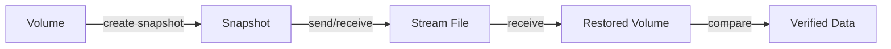
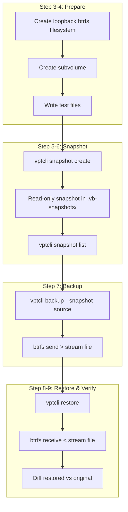

# Quick Start

This tutorial walks you through a complete backup-and-restore cycle in nine steps. By the end you will have created a snapshot, backed it up to a stream file, restored it to a new location, and verified the data -- all from the command line.

:::tip
This guide uses the **btrfs** provider on Linux. If you are using LVM or ZFS, substitute `--provider lvm` or `--provider zfs` where shown. The workflow is the same.
:::

---

## Overview

The backup flow follows this sequence:



---

## Step 1 -- Check Available Backends

List every backend that vpt-rs knows about on your system:

```bash
vptcli snapshot backend list
```

Expected output on Linux:

```
platform: linux
provider: btrfs
backend: linux-btrfs

platform: linux
provider: lvm
backend: linux-lvm

platform: linux
provider: zfs
backend: linux-zfs
```

:::note
On non-Linux platforms only one backend is listed -- the native one for your OS.
:::

## Step 2 -- Check Backend Capabilities

Inspect what the btrfs backend can do:

```bash
vptcli snapshot capabilities --provider btrfs
```

```
linux-btrfs
- crash_consistent_snapshot
- block_level_backup
- block_level_restore
- incremental_send
```

This tells you the backend supports crash-consistent snapshots, block-level I/O, and incremental send -- everything you need for a full backup workflow.

## Step 3 -- Create a Test Volume

You need a real btrfs filesystem to experiment with. Create a loopback-backed btrfs volume:

```bash
# Create a 1 GB sparse file
truncate -s 1G /tmp/vpt-test.img

# Format it as btrfs
sudo mkfs.btrfs -f /tmp/vpt-test.img

# Create a mount point
sudo mkdir -p /mnt/vpt-test

# Mount the filesystem
sudo mount /tmp/vpt-test.img /mnt/vpt-test

# Create a subvolume (btrfs snapshots require subvolumes)
sudo btrfs subvolume create /mnt/vpt-test/data
```

:::caution
These commands require root privileges. Use `sudo` as shown.
:::

## Step 4 -- Write Some Test Data

Populate the subvolume with sample files:

```bash
echo "Hello from vpt-rs!" | sudo tee /mnt/vpt-test/data/greeting.txt
echo "This file will survive backup and restore." | sudo tee /mnt/vpt-test/data/note.txt
sudo mkdir /mnt/vpt-test/data/docs
echo "Documentation content" | sudo tee /mnt/vpt-test/data/docs/readme.txt
```

Verify the data is there:

```bash
sudo ls -la /mnt/vpt-test/data/
cat /mnt/vpt-test/data/greeting.txt
```

## Step 5 -- Create a Snapshot

Use `vptcli` to create a read-only snapshot of the subvolume:

```bash
sudo vptcli snapshot create --provider btrfs /mnt/vpt-test/data --label quickstart
```

```
snapshot: /mnt/vpt-test/.vb-snapshots/quickstart
source: /mnt/vpt-test/data
backend: linux-btrfs
path: /mnt/vpt-test/.vb-snapshots/quickstart
```

The snapshot is stored in a hidden `.vb-snapshots` directory next to the source subvolume. It is read-only by default, which prevents accidental modification.

## Step 6 -- List Snapshots

Confirm the snapshot was created:

```bash
sudo vptcli snapshot list --provider btrfs /mnt/vpt-test/data
```

```
/mnt/vpt-test/.vb-snapshots/quickstart - linux-btrfs
```

## Step 7 -- Back Up to a Stream File

Create a backup stream from the snapshot:

```bash
sudo vptcli backup --provider btrfs --snapshot-source \
    /mnt/vpt-test/.vb-snapshots/quickstart \
    --output /tmp/quickstart-backup.stream
```

```
backend: linux-btrfs
output: /tmp/quickstart-backup.stream
```

:::tip
The `--snapshot-source` flag tells vptcli that the source argument is an existing snapshot, not a live volume. Without it, vptcli would attempt to create a temporary snapshot first.
:::

Check the stream file size:

```bash
ls -lh /tmp/quickstart-backup.stream
```

## Step 8 -- Restore to a New Location

Create a fresh destination directory and restore the backup:

```bash
sudo mkdir -p /mnt/vpt-test/restore-target
sudo vptcli restore --provider btrfs \
    --input /tmp/quickstart-backup.stream \
    /mnt/vpt-test/restore-target
```

```
backend: linux-btrfs
input: /tmp/quickstart-backup.stream
```

Btrfs receive creates a new subvolume inside the destination directory:

```bash
sudo ls /mnt/vpt-test/restore-target/
```

## Step 9 -- Verify the Data

Compare the restored files with the originals:

```bash
sudo cat /mnt/vpt-test/restore-target/*/greeting.txt
# Expected: Hello from vpt-rs!

sudo cat /mnt/vpt-test/restore-target/*/note.txt
# Expected: This file will survive backup and restore.

sudo cat /mnt/vpt-test/restore-target/*/docs/readme.txt
# Expected: Documentation content
```

You can also run a recursive diff:

```bash
sudo diff -r /mnt/vpt-test/data /mnt/vpt-test/restore-target/<restored-subvol-name>
```

No output means the files are identical.

---

## Cleanup

When you are done experimenting, unmount and remove the test resources:

```bash
# Delete the snapshot
sudo vptcli snapshot delete --provider btrfs /mnt/vpt-test/.vb-snapshots/quickstart

# Unmount
sudo umount /mnt/vpt-test

# Remove the loopback image
rm /tmp/vpt-test.img

# Remove the backup stream
rm /tmp/quickstart-backup.stream
```

---

## What Just Happened?

Here is the full lifecycle you just completed:



Each step maps to a specific trait method in the library:

- `snapshot create` calls `SnapshotProvider::create_snapshot`
- `backup` calls `BackupExecutor::backup_volume`
- `restore` calls `RestorePlanner::restore_volume`

---

## Next Steps

- Read [First Backup](./first-backup.md) for a deeper understanding of snapshot policies, incremental backups, and error handling.
- Explore the [CLI Reference](../cli/overview.md) for full command documentation.
- See the [Library API](../api/backend.md) if you want to use vpt-rs as a Rust library.
