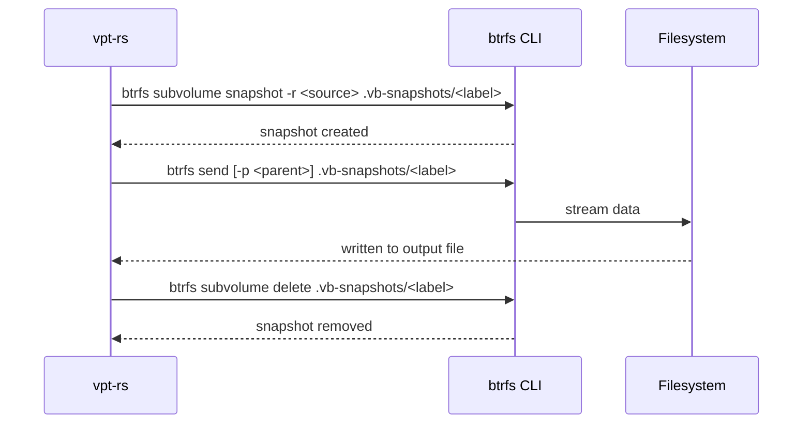
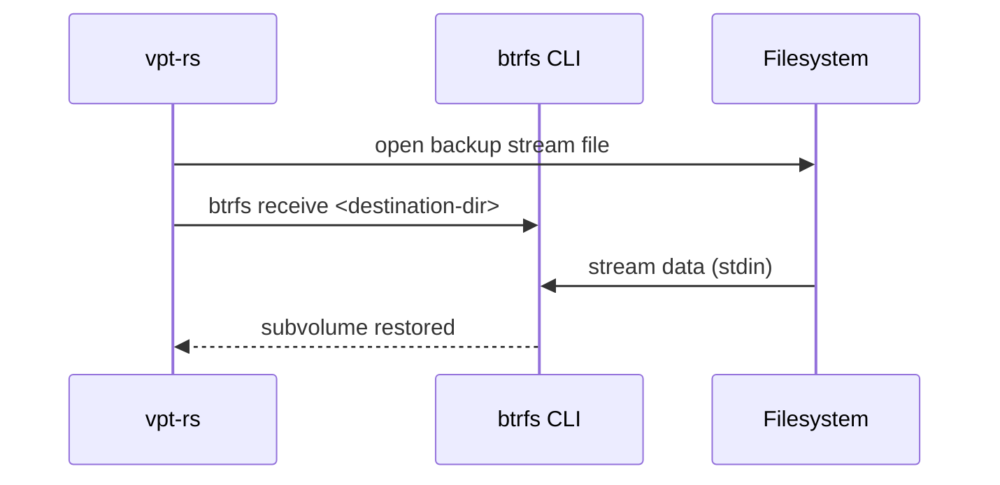

# Btrfs Provider

The Btrfs provider uses `btrfs send` and `btrfs receive` for stream-based volume backup. It creates read-only snapshots of Btrfs subvolumes and exports them as binary streams that can be saved to files or piped across the network.

## Capabilities

| Capability | Supported |
|---|---|
| `crash_consistent_snapshot` | Yes |
| `application_consistent_snapshot` | No |
| `block_level_backup` | Yes |
| `block_level_restore` | Yes |
| `incremental_send` | Yes |
| `direct_device_access` | No |
| `writable_snapshot_mount` | No |
| `read_only_snapshot_mount` | No |

:::info
The Btrfs provider does not support mount or unmount operations. To browse snapshot contents, mount the snapshot subvolume manually using standard Linux tools.
:::

## How It Works

The provider manages snapshots in a hidden directory called `.vb-snapshots/` located in the parent directory of the source subvolume. For example, a subvolume at `/mnt/data/subvol` will have its snapshots stored under `/mnt/data/.vb-snapshots/`.

When you request a backup with a temporary snapshot policy, the provider:

1. Creates a read-only snapshot under `.vb-snapshots/`
2. Runs `btrfs send` to export the snapshot as a stream
3. Cleans up the temporary snapshot

Snapshot names are sanitized to only contain `[a-zA-Z0-9\-_.+:]` characters. If you provide a label like `"nightly backup"`, it becomes `nightly-backup`.

## Rust API

### Creating a Snapshot

```rust
use vpt_rs::{SnapshotRequest, SnapshotKind, VolumeRef, SnapshotProvider};

let request = SnapshotRequest {
    source: VolumeRef::new("/mnt/data/subvol"),
    kind: SnapshotKind::CrashConsistent,
    label: Some("nightly".to_string()),
    read_only: true,
};

let snapshot = backend.create_snapshot(&request)?;
println!("Snapshot ID: {}", snapshot.handle.id);
// Output: /mnt/data/.vb-snapshots/nightly
```

### Full Backup with Temporary Snapshot

```rust
use vpt_rs::{BackupPlan, BackupSource, BackupTarget, SnapshotPolicy, SnapshotKind, VolumeRef};
use std::path::PathBuf;

let plan = BackupPlan {
    source: BackupSource::Volume(VolumeRef::new("/mnt/data/subvol")),
    target: BackupTarget::ImageFile(PathBuf::from("/backup/subvol.stream")),
    snapshot_policy: SnapshotPolicy::temporary(
        SnapshotKind::CrashConsistent,
        Some("backup".to_string()),
        true,
    ),
    parent_snapshot: None,
    block_size: None,
};

backend.backup_volume(&plan)?;
```

### Incremental Backup

```rust
use vpt_rs::{BackupPlan, BackupSource, BackupTarget, SnapshotPolicy, SnapshotRef, VolumeRef};
use std::path::PathBuf;

let plan = BackupPlan {
    source: BackupSource::Snapshot(
        SnapshotRef::new("/mnt/data/.vb-snapshots/snap2")
            .with_origin(VolumeRef::new("/mnt/data/subvol")),
    ),
    target: BackupTarget::ImageFile(PathBuf::from("/backup/incr.stream")),
    snapshot_policy: SnapshotPolicy::disabled(),
    parent_snapshot: Some(
        SnapshotRef::new("/mnt/data/.vb-snapshots/snap1")
            .with_origin(VolumeRef::new("/mnt/data/subvol")),
    ),
    block_size: None,
};

backend.backup_volume(&plan)?;
```

### Restore from Stream

```rust
use vpt_rs::{RestorePlan, BackupTarget, VolumeRef};
use std::path::PathBuf;

let plan = RestorePlan {
    source: BackupTarget::ImageFile(PathBuf::from("/backup/subvol.stream")),
    destination: VolumeRef::new("/mnt/restore"),
    force: false,
    base_snapshot: None,
    block_size: None,
};

backend.restore_volume(&plan)?;
```

## Backup Flow



## Restore Flow



## Snapshot Commands

| Operation | Command |
|---|---|
| Create read-only snapshot | `btrfs subvolume snapshot -r <source> <path>` |
| List snapshots | `btrfs subvolume list -s <path>` |
| Delete snapshot | `btrfs subvolume delete <path>` |
| Full backup | `btrfs send <snapshot> > output.stream` |
| Incremental backup | `btrfs send -p <parent> <snapshot> > output.stream` |
| Restore | `btrfs receive <destination-dir> < input.stream` |

## CLI Examples

### Create a snapshot

```bash
vptcli snapshot create /mnt/data/subvol --provider linux-btrfs --label "nightly"
```

### List snapshots for a subvolume

```bash
vptcli snapshot list --provider linux-btrfs /mnt/data/subvol
```

### Delete a snapshot

```bash
vptcli snapshot delete --provider linux-btrfs /mnt/data/.vb-snapshots/nightly
```

### Full backup (automatic temporary snapshot)

```bash
vptcli backup /mnt/data/subvol \
  --provider linux-btrfs \
  --output /backup/subvol.stream \
  --snapshot-label "backup"
```

### Incremental backup using a parent snapshot

```bash
vptcli backup /mnt/data/.vb-snapshots/snap2 \
  --provider linux-btrfs \
  --snapshot-source \
  --output /backup/incr.stream \
  --parent-snapshot /mnt/data/.vb-snapshots/snap1
```

### Restore from a stream file

```bash
vptcli restore /mnt/restore \
  --provider linux-btrfs \
  --input /backup/subvol.stream
```

## Limitations

:::caution
Keep these limitations in mind when using the Btrfs provider:

- **No mount/unmount support**: The provider returns `UnsupportedOperation` for `mount_snapshot` and `unmount`. Mount subvolumes manually if you need to browse contents.
- **No application-consistent snapshots**: Requesting `SnapshotKind::ApplicationConsistent` returns a `MissingCapability` error. Btrfs snapshots are crash-consistent only.
- **Stream-based only**: Backup and restore operate on image files (streams), not raw block devices. Passing a `Device` target returns an error.
- **Subvolume path required**: The source must be an absolute path to a Btrfs subvolume. Relative paths are rejected.
:::

## Under the Hood

The Btrfs provider implements four core traits from the vpt-rs library:

- **`Backend`**: Reports the backend name (`linux-btrfs`) and capabilities.
- **`SnapshotProvider`**: Creates, lists, and deletes Btrfs snapshots via `btrfs subvolume` commands.
- **`BackupExecutor`**: Runs `btrfs send` with stdout redirected to the target image file.
- **`RestorePlanner`**: Runs `btrfs receive` with stdin sourced from the backup stream file.

All external commands are executed through the library's `process::run_command` helper, which handles logging, error propagation, and I/O redirection.
