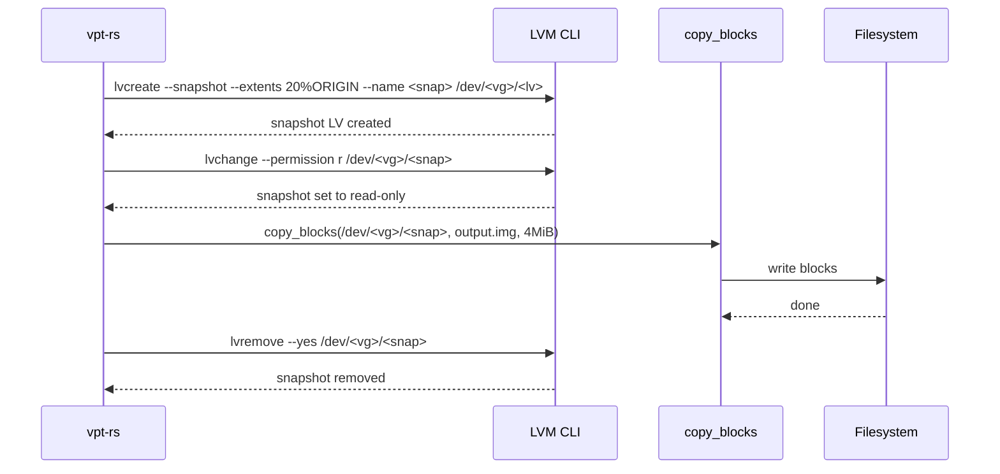
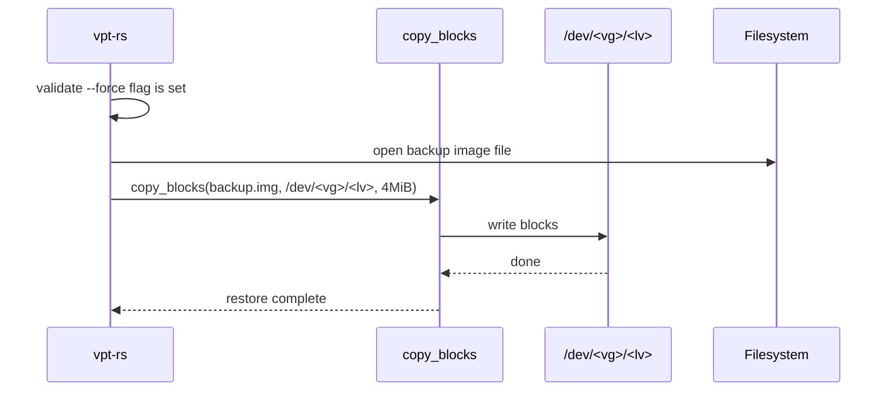

# LVM Provider

The LVM provider uses Linux Logical Volume Manager (LVM) snapshots combined with block-level copying (`copy_blocks`) to back up and restore logical volumes. It creates temporary LVM snapshots, copies the raw blocks to an image file, and then cleans up.

## Capabilities

| Capability | Supported |
|---|---|
| `crash_consistent_snapshot` | Yes |
| `application_consistent_snapshot` | No |
| `block_level_backup` | Yes |
| `block_level_restore` | Yes |
| `incremental_send` | No |
| `direct_device_access` | Yes |
| `writable_snapshot_mount` | No |
| `read_only_snapshot_mount` | No |

:::info
The LVM provider does not support incremental backups. Every backup is a full block-level copy of the source volume.
:::

## How It Works

The provider operates on LVM logical volumes identified by their device paths in the format `/dev/<vg_name>/<lv_name>`. When you request a backup with a temporary snapshot policy, the provider:

1. Creates an LVM snapshot using `lvcreate --snapshot --extents 20%ORIGIN`
2. Sets the snapshot to read-only with `lvchange --permission r`
3. Copies all blocks from the snapshot device to the output image file using `copy_blocks`
4. Removes the temporary snapshot with `lvremove --yes`

The snapshot size defaults to 20% of the origin volume. This provides enough space for copy-on-write tracking during the backup operation.

### Volume Path Parsing

The provider requires absolute paths in the form `/dev/<vg>/<lv>`:

| Valid | Invalid |
|---|---|
| `/dev/vg0/data` | `vg0/data` (relative) |
| `/dev/vg_data/backup` | `/dev/vg0` (missing LV name) |
| | `/dev` (incomplete) |

## Rust API

### Creating a Snapshot

```rust
use vpt_rs::{SnapshotRequest, SnapshotKind, VolumeRef, SnapshotProvider};

let request = SnapshotRequest {
    source: VolumeRef::new("/dev/vg0/data"),
    kind: SnapshotKind::CrashConsistent,
    label: Some("nightly".to_string()),
    read_only: true,
};

let snapshot = backend.create_snapshot(&request)?;
println!("Snapshot path: {}", snapshot.handle.id);
// Output: /dev/vg0/nightly
```

### Backup with Temporary Snapshot

```rust
use vpt_rs::{BackupPlan, BackupSource, BackupTarget, SnapshotPolicy, SnapshotKind, VolumeRef};
use std::path::PathBuf;

let plan = BackupPlan {
    source: BackupSource::Volume(VolumeRef::new("/dev/vg0/data")),
    target: BackupTarget::ImageFile(PathBuf::from("/backup/data.img")),
    snapshot_policy: SnapshotPolicy::temporary(
        SnapshotKind::CrashConsistent,
        Some("backup".to_string()),
        true,
    ),
    parent_snapshot: None,
    block_size: None, // uses default 4 MiB
};

backend.backup_volume(&plan)?;
```

### Backup from an Existing Snapshot

```rust
use vpt_rs::{BackupPlan, BackupSource, BackupTarget, SnapshotPolicy, SnapshotRef, VolumeRef};
use std::path::PathBuf;

let plan = BackupPlan {
    source: BackupSource::Snapshot(
        SnapshotRef::new("/dev/vg0/snap1")
            .with_origin(VolumeRef::new("/dev/vg0/data")),
    ),
    target: BackupTarget::ImageFile(PathBuf::from("/backup/data.img")),
    snapshot_policy: SnapshotPolicy::disabled(),
    parent_snapshot: None,
    block_size: None,
};

backend.backup_volume(&plan)?;
```

### Restore (requires `--force`)

```rust
use vpt_rs::{RestorePlan, BackupTarget, VolumeRef};
use std::path::PathBuf;

let plan = RestorePlan {
    source: BackupTarget::ImageFile(PathBuf::from("/backup/data.img")),
    destination: VolumeRef::new("/dev/vg0/restore"),
    force: true, // required for LVM restore
    base_snapshot: None,
    block_size: None,
};

backend.restore_volume(&plan)?;
```

:::warning
LVM restore is destructive. It overwrites the entire destination logical volume with the contents of the backup image. The `force` flag must be set to `true`, or the provider returns an `InvalidArgument` error.
:::

## Backup Flow



## Restore Flow



## Snapshot Commands

| Operation | Command |
|---|---|
| Create snapshot | `lvcreate --snapshot --extents 20%ORIGIN --name <name> /dev/<vg>/<lv>` |
| Set read-only | `lvchange --permission r /dev/<vg>/<name>` |
| List snapshots | `lvs --noheadings --separator "\|" --options lv_name,origin,lv_path,lv_attr <vg>` |
| Delete snapshot | `lvremove --yes /dev/<vg>/<name>` |

The `lvs` output is filtered by the provider to show only snapshots whose `origin` matches the source volume. Snapshot LV attributes starting with `s` or `S` indicate a snapshot volume.

## CLI Examples

### Create a snapshot

```bash
vptcli snapshot create /dev/vg0/data --provider linux-lvm --label "pre-upgrade"
```

### List snapshots for a volume

```bash
vptcli snapshot list --provider linux-lvm /dev/vg0/data
```

### Delete a snapshot

```bash
vptcli snapshot delete --provider linux-lvm /dev/vg0/pre-upgrade
```

### Full backup (automatic temporary snapshot)

```bash
vptcli backup /dev/vg0/data \
  --provider linux-lvm \
  --output /backup/data.img \
  --snapshot-label "nightly"
```

### Backup with custom block size

```bash
vptcli backup /dev/vg0/data \
  --provider linux-lvm \
  --output /backup/data.img \
  --block-size 8M
```

### Restore to a logical volume

```bash
vptcli restore /dev/vg0/restore \
  --provider linux-lvm \
  --input /backup/data.img \
  --force
```

## Limitations

:::caution
Keep these limitations in mind when using the LVM provider:

- **No incremental backups**: Every backup copies all blocks from the source. There is no equivalent of Btrfs or ZFS incremental send.
- **Destructive restore**: Restoring overwrites the entire destination LV. The `--force` flag is mandatory.
- **Snapshot space**: The snapshot uses 20% of the origin volume's size. Very active volumes may exhaust snapshot space during a long backup, causing the snapshot to become invalid.
- **No application-consistent snapshots**: Requesting `SnapshotKind::ApplicationConsistent` returns a `MissingCapability` error.
- **No mount/unmount support**: The provider returns `UnsupportedOperation` for mount operations. Use `mount` manually if you need to access snapshot contents.
- **Image-file targets only**: Backup to raw block devices is not currently supported.
:::

## Under the Hood

The LVM provider implements four core traits:

- **`Backend`**: Reports the backend name (`linux-lvm`) and capabilities.
- **`SnapshotProvider`**: Creates, lists, and deletes LVM snapshots via `lvcreate`, `lvs`, and `lvremove` commands.
- **`BackupExecutor`**: Uses `copy_blocks` to perform a raw block-level copy from the snapshot device (or source LV) to the image file. Reports progress every 5 seconds.
- **`RestorePlanner`**: Uses `copy_blocks` to write the image file contents directly into the destination logical volume. Requires `--force`.

The `copy_blocks` function reads and writes in fixed-size chunks (default 4 MiB), calls `fsync` on the destination after completion, and logs throughput metrics.
