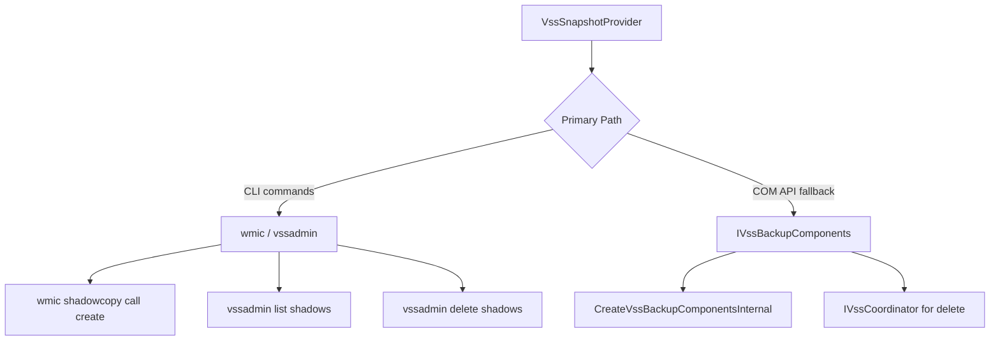
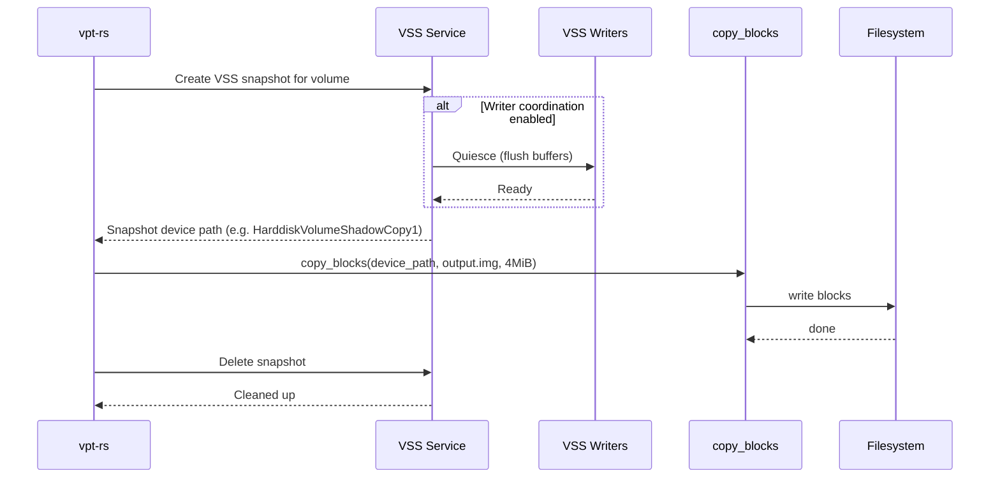
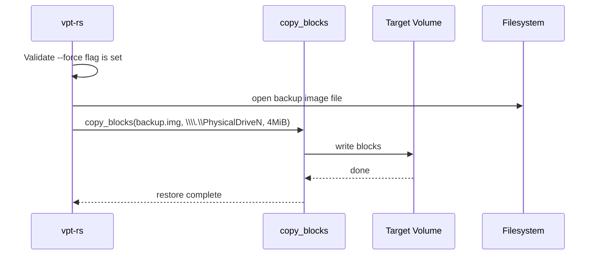

# Windows VSS Provider

The Windows VSS (Volume Shadow Copy Service) provider creates point-in-time snapshots of NTFS volumes. It is the only vpt-rs provider that supports application-consistent snapshots by coordinating with registered VSS writers (e.g. SQL Server, Exchange).

## Capabilities

| Capability | Supported |
|---|---|
| `crash_consistent_snapshot` | Yes |
| `application_consistent_snapshot` | Yes |
| `block_level_backup` | Yes |
| `block_level_restore` | Yes |
| `incremental_send` | No |
| `direct_device_access` | Yes |
| `writable_snapshot_mount` | No |
| `read_only_snapshot_mount` | No |

:::tip
Application-consistent snapshots require VSS writer coordination to be enabled (the default). If you explicitly disable writer coordination, requesting `SnapshotKind::ApplicationConsistent` returns a `MissingCapability` error.
:::

## How VSS Works

VSS is a Windows framework that coordinates between backup applications, data providers (snapshot engines), and writers (applications that need to flush their data before a snapshot).

1. **Writer coordination**: When enabled, VSS asks registered writers (SQL Server, etc.) to quiesce their data.
2. **Snapshot creation**: The VSS provider engine creates a point-in-time copy of the volume.
3. **Device path**: The snapshot is exposed as a device path like `\\?\GLOBALROOT\Device\HarddiskVolumeShadowCopy1`.

### Snapshot Contexts

| Context | Description |
|---|---|
| `Backup` | Default. Coordinates with VSS writers for application consistency. |
| `FileShareBackup` | For file-share shadow copies. |
| `ClientAccessible` | Exposes snapshots to clients (e.g. Previous Versions). |

## Dual-Path Architecture

The VSS provider uses two independent code paths to interact with the Windows VSS subsystem:



### CLI Path (Primary)

The CLI path uses `wmic` for snapshot creation and `vssadmin` for listing and deletion. This works on all Windows editions (Home, Pro, Server) and does not require COM registration.

| Operation | Command |
|---|---|
| Create snapshot | `wmic shadowcopy call create Volume=C:\\` |
| Get device path | `wmic shadowcopy where ID='{GUID}' get DeviceObject` |
| List snapshots | `vssadmin list shadows /for=C:\` |
| Delete snapshot | `wmic shadowcopy where ID='{GUID}' delete` |
| Delete fallback | `vssadmin delete shadows /shadow={GUID} /quiet` |

### COM Path (Fallback)

The COM path dynamically loads `vssapi.dll` and calls `CreateVssBackupComponentsInternal` to obtain an `IVssBackupComponents` interface. It follows the same workflow as the official C++ VSS SDK samples:

1. `InitializeForBackup()`
2. `SetContext(VSS_CTX_APP_ROLLBACK)`
3. `SetBackupState(true, false, VSS_BT_FULL, false)`
4. `StartSnapshotSet()`
5. `AddToSnapshotSet(volume)`
6. `PrepareForBackup()` (async)
7. `DoSnapshotSet()` (async)
8. `GetSnapshotProperties()` to retrieve the device path

:::caution
The COM vtable layout is empirically verified on Windows 10 build 19045. Some Windows editions or future updates may have different vtable offsets, which can cause crashes. If you experience issues, the CLI path is the safer option.
:::

### GUID Validation

All snapshot IDs are validated as proper GUIDs with the format `{XXXXXXXX-XXXX-XXXX-XXXX-XXXXXXXXXXXX}`. The parser checks for exactly 5 dash-separated segments and validates hex encoding. This prevents injection attacks through malformed snapshot identifiers.

## Rust API

### Creating a Crash-Consistent Snapshot

```rust
use vpt_rs::{SnapshotRequest, SnapshotKind, VolumeRef, SnapshotProvider};

let request = SnapshotRequest {
    source: VolumeRef::new("C:"),
    kind: SnapshotKind::CrashConsistent,
    label: None,
    read_only: true,
};

let snapshot = backend.create_snapshot(&request)?;
println!("Snapshot ID: {}", snapshot.handle.id);
// Output: {GUID}
println!("Device path: {:?}", snapshot.path_hint);
// Output: \\?\GLOBALROOT\Device\HarddiskVolumeShadowCopy1
```

### Creating an Application-Consistent Snapshot

```rust
use vpt_rs::{SnapshotRequest, SnapshotKind, VolumeRef, SnapshotProvider};

let request = SnapshotRequest {
    source: VolumeRef::new("C:"),
    kind: SnapshotKind::ApplicationConsistent,
    label: Some("pre-migration".to_string()),
    read_only: true,
};

let snapshot = backend.create_snapshot(&request)?;
// VSS writers are coordinated to flush application data
```

### Using the VssSnapshotProvider Directly

```rust
use vpt_rs::platform::windows::vss::{
    VssSnapshotProvider, WriterCoordination, SnapshotContext, VssTimeouts,
};

let provider = VssSnapshotProvider::new()
    .with_writer_coordination(WriterCoordination::Enabled)
    .with_context(SnapshotContext::Backup)
    .with_timeouts(VssTimeouts {
        gather_writer_metadata_ms: 15_000,
        prepare_for_backup_ms: 60_000,
        do_snapshot_set_ms: 60_000,
    });

let spec = provider.build_spec(SnapshotRequest {
    source: VolumeRef::new("D:"),
    kind: SnapshotKind::CrashConsistent,
    label: None,
    read_only: true,
});

let session = provider.start_session(spec)?;
let snapshot = session.create_snapshot()?;
```

### List and Delete Snapshots

```rust
use vpt_rs::{VolumeRef, SnapshotHandle, SnapshotProvider};

// List all snapshots on C:
let snapshots = backend.list_snapshots(&VolumeRef::new("C:"))?;
for snap in &snapshots {
    println!("{} -> {:?}", snap.handle.id, snap.path_hint);
}

// Delete a specific snapshot
backend.delete_snapshot(&SnapshotHandle {
    id: "{12345678-abcd-ef01-1122-334455667788}".to_string(),
    source: None,
})?;
```

## Backup Flow



## Restore Flow



:::warning
VSS restore is destructive and overwrites the entire target volume. The `--force` flag is required.
:::

## Volume Path Formats

| Format | Example | Notes |
|---|---|---|
| Drive letter | `C:` | Normalized to `C:\` internally |
| Volume GUID | `\\?\Volume{GUID}\` | Passed through as-is |
| Device path | `\\.\PhysicalDrive0` | **Rejected** for snapshot creation |

:::danger
Device paths like `\\.\PhysicalDrive0` are rejected by the VSS provider because VSS operates on volumes, not physical drives. Use drive letters or volume GUID paths instead.
:::

## CLI Examples

### Query the current backend

```bash
vptcli snapshot backend
```

### List capabilities

```bash
vptcli snapshot capabilities --provider windows-vss
```

### Create a crash-consistent snapshot

```bash
vptcli snapshot create C: --provider windows-vss
```

### Create an application-consistent snapshot

```bash
vptcli snapshot create C: --provider windows-vss --kind application --label "pre-upgrade"
```

### List snapshots on a volume

```bash
vptcli snapshot list --provider windows-vss C:
```

### Delete a snapshot by GUID

```bash
vptcli snapshot delete --provider windows-vss {12345678-abcd-ef01-1122-334455667788}
```

### Backup a volume

```bash
vptcli backup C: --provider windows-vss --output E:\backups\c-drive.img
```

### Restore a volume

```bash
vptcli restore C: --provider windows-vss --input E:\backups\c-drive.img --force
```

## Known Limitations

:::caution
- **COM vtable fragility**: The COM API path relies on empirically determined vtable offsets for `IVssBackupComponents`. These offsets may differ across Windows editions or updates. The CLI path (wmic/vssadmin) is more portable.
- **No incremental backup**: Unlike Btrfs and ZFS, there is no stream-diff mechanism. Every backup is a full copy.
- **No mount/unmount**: The provider does not expose snapshot mount operations. Use Windows disk management or `mountvol` to access snapshot volumes manually.
- **Dynamic DLL loading**: The COM path loads `vssapi.dll` at runtime and searches for `CreateVssBackupComponentsInternal` by name. The export name varies across Windows editions (mangled C++ name on x64).
- **GUID validation**: Snapshot IDs must be valid GUIDs. Malformed identifiers are rejected before any VSS API call.
:::

## Under the Hood

The VSS provider is structured as a layered system:

- **`VssSnapshotProvider`** (top level): Configuration builder with writer coordination, context, and timeout settings. Implements `Backend` and `SnapshotProvider`.
- **`VssRequestor`**: Initializes the COM runtime and delegates to the FFI layer for snapshot set creation, deletion, and enumeration.
- **`VssSession`**: Represents an in-progress snapshot set. Commits or aborts the snapshot.
- **`ffi::cli`**: CLI-based implementation using `wmic` and `vssadmin`. Locale-independent parsing with GUID extraction and volume matching.
- **`ffi::com`**: Native COM implementation using raw vtable pointers. Loads `vssapi.dll` dynamically. Uses `IVssCoordinator` for deletion (its CLSID is registered unlike `CVssBackupComponents`).
