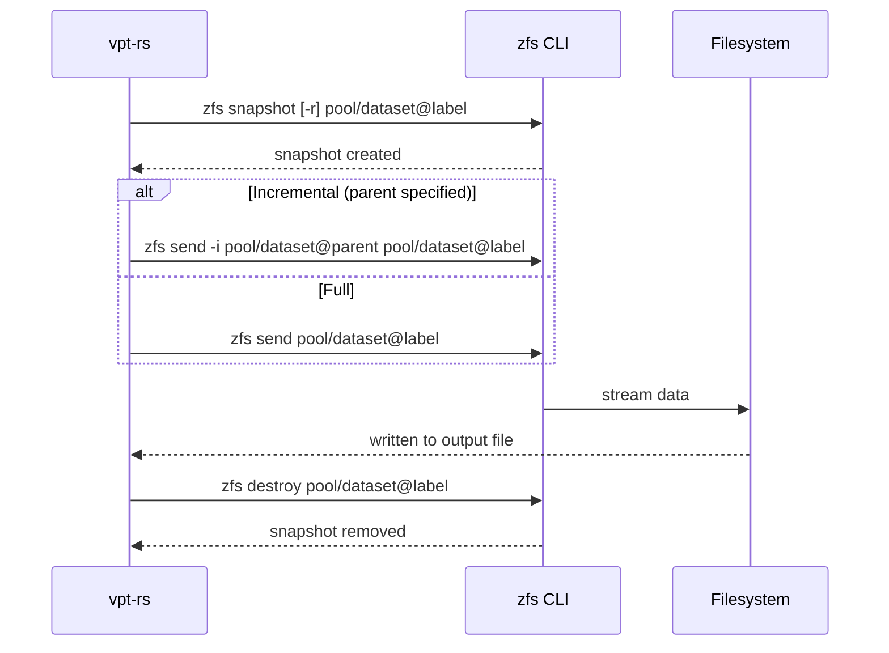
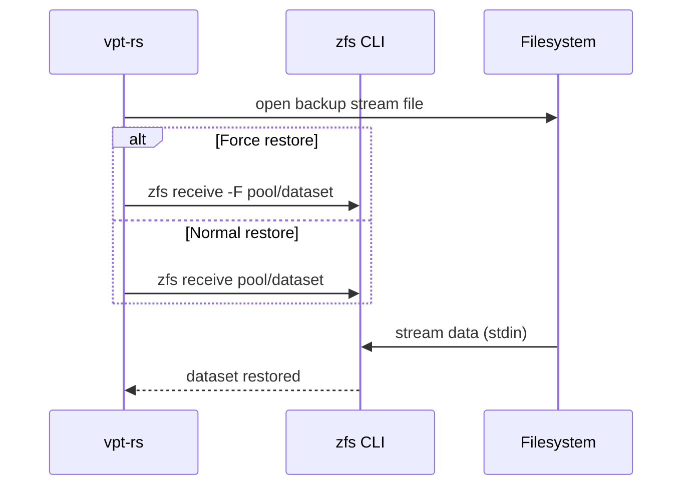

# ZFS Provider

The ZFS provider uses `zfs send` and `zfs receive` for stream-based backup of ZFS datasets. It supports both full and incremental sends, making it efficient for regular backup schedules where only changed blocks need to be transferred.

## Capabilities

| Capability | Supported |
|---|---|
| `crash_consistent_snapshot` | Yes |
| `application_consistent_snapshot` | No |
| `block_level_backup` | Yes |
| `block_level_restore` | Yes |
| `incremental_send` | Yes |
| `direct_device_access` | Yes |
| `writable_snapshot_mount` | No |
| `read_only_snapshot_mount` | No |

:::info
The ZFS provider requires a snapshot source for `zfs send`. You must either pass an explicit snapshot reference (e.g. `tank/data@snap1`) or use a temporary snapshot policy. Sending a live dataset without a snapshot is not supported.
:::

## How It Works

ZFS uses a dataset-based naming scheme. A snapshot is identified as `pool/dataset@snapshot_name`. The provider works with two kinds of references:

- **Dataset name**: `tank/data` (used for creating snapshots, receiving restores)
- **Mount path**: `/tank/data` (accepted for snapshot creation, but not for restore destinations)

When you request a backup with a temporary snapshot policy, the provider:

1. Creates a snapshot: `zfs snapshot [-r] pool/dataset@label`
2. Runs `zfs send [-i parent] pool/dataset@label > output_file`
3. Destroys the temporary snapshot: `zfs destroy pool/dataset@label`

### Dataset Reference Parsing

| Input | Interpretation |
|---|---|
| `tank/data` | Dataset name |
| `/tank/data` | Mount path (treated as dataset name for snapshot creation) |
| `tank/data@snap1` | Snapshot identifier (rejected when a dataset is expected) |

:::caution
For `zfs receive`, the destination must be a dataset name like `pool/fs`. Mount paths (starting with `/`) and snapshot identifiers (containing `@`) are rejected.
:::

## Rust API

### Creating a Snapshot

```rust
use vpt_rs::{SnapshotRequest, SnapshotKind, VolumeRef, SnapshotProvider};

let request = SnapshotRequest {
    source: VolumeRef::new("tank/data"),
    kind: SnapshotKind::CrashConsistent,
    label: Some("nightly".to_string()),
    read_only: true,
};

let snapshot = backend.create_snapshot(&request)?;
println!("Snapshot ID: {}", snapshot.handle.id);
// Output: tank/data@nightly
```

### Full Backup with Temporary Snapshot

```rust
use vpt_rs::{BackupPlan, BackupSource, BackupTarget, SnapshotPolicy, SnapshotKind, VolumeRef};
use std::path::PathBuf;

let plan = BackupPlan {
    source: BackupSource::Volume(VolumeRef::new("tank/data")),
    target: BackupTarget::ImageFile(PathBuf::from("/backup/data.zfs")),
    snapshot_policy: SnapshotPolicy::temporary(
        SnapshotKind::CrashConsistent,
        Some("backup".to_string()),
        true,
    ),
    parent_snapshot: None,
    block_size: None,
};

backend.backup_volume(&plan)?;
```

### Backup from an Explicit Snapshot

```rust
use vpt_rs::{BackupPlan, BackupSource, BackupTarget, SnapshotPolicy, SnapshotRef};
use std::path::PathBuf;

let plan = BackupPlan {
    source: BackupSource::Snapshot(SnapshotRef::new("tank/data@snap1")),
    target: BackupTarget::ImageFile(PathBuf::from("/backup/data.zfs")),
    snapshot_policy: SnapshotPolicy::disabled(),
    parent_snapshot: None,
    block_size: None,
};

backend.backup_volume(&plan)?;
```

### Incremental Backup

```rust
use vpt_rs::{BackupPlan, BackupSource, BackupTarget, SnapshotPolicy, SnapshotRef, VolumeRef};
use std::path::PathBuf;

let plan = BackupPlan {
    source: BackupSource::Snapshot(
        SnapshotRef::new("tank/data@snap2")
            .with_origin(VolumeRef::new("tank/data")),
    ),
    target: BackupTarget::ImageFile(PathBuf::from("/backup/incr.zfs")),
    snapshot_policy: SnapshotPolicy::disabled(),
    parent_snapshot: Some(
        SnapshotRef::new("tank/data@snap1")
            .with_origin(VolumeRef::new("tank/data")),
    ),
    block_size: None,
};

backend.backup_volume(&plan)?;
```

### Restore to a Dataset

```rust
use vpt_rs::{RestorePlan, BackupTarget, VolumeRef};
use std::path::PathBuf;

let plan = RestorePlan {
    source: BackupTarget::ImageFile(PathBuf::from("/backup/data.zfs")),
    destination: VolumeRef::new("tank/restore"),
    force: true, // passes -F to zfs receive
    base_snapshot: None,
    block_size: None,
};

backend.restore_volume(&plan)?;
```

## Backup Flow



## Restore Flow



## Snapshot Commands

| Operation | Command |
|---|---|
| Create snapshot | `zfs snapshot [-r] pool/dataset@name` |
| List snapshots | `zfs list -H -t snapshot -o name,mountpoint -r pool/dataset` |
| Delete snapshot | `zfs destroy pool/dataset@name` |
| Full send | `zfs send pool/dataset@snap > output.zfs` |
| Incremental send | `zfs send -i pool/dataset@parent pool/dataset@snap > output.zfs` |
| Receive | `zfs receive [-F] pool/dataset < input.zfs` |

The `-r` flag on snapshot creation creates a recursive snapshot of the dataset and all its children.

## CLI Examples

### Create a snapshot

```bash
vptcli snapshot create tank/data --provider linux-zfs --label "nightly"
```

### List snapshots for a dataset

```bash
vptcli snapshot list --provider linux-zfs tank/data
```

### Delete a snapshot

```bash
vptcli snapshot delete --provider linux-zfs tank/data@nightly
```

### Full backup (automatic temporary snapshot)

```bash
vptcli backup tank/data \
  --provider linux-zfs \
  --output /backup/data.zfs \
  --snapshot-label "backup"
```

### Backup from an existing snapshot

```bash
vptcli backup tank/data@snap1 \
  --provider linux-zfs \
  --snapshot-source \
  --output /backup/snap1.zfs
```

### Incremental backup

```bash
vptcli backup tank/data@snap2 \
  --provider linux-zfs \
  --snapshot-source \
  --output /backup/incr.zfs \
  --parent-snapshot tank/data@snap1
```

### Restore to a dataset

```bash
vptcli restore tank/restore \
  --provider linux-zfs \
  --input /backup/data.zfs \
  --force
```

## Limitations

:::caution
Keep these limitations in mind when using the ZFS provider:

- **Snapshot source required**: `zfs send` requires a snapshot reference (`pool/fs@snap`). Passing a bare dataset name without a snapshot policy returns an `InvalidArgument` error.
- **No mount/unmount support**: The provider returns `UnsupportedOperation` for mount operations. Access ZFS snapshots via the `.zfs/snapshot/` directory manually.
- **No application-consistent snapshots**: Requesting `SnapshotKind::ApplicationConsistent` returns a `MissingCapability` error.
- **Dataset names only for restore**: `zfs receive` requires a dataset name like `pool/fs`. Mount paths (e.g. `/tank/data`) are rejected because `zfs receive` operates on the ZFS namespace, not the filesystem namespace.
- **Stream-based only**: Backup and restore use image files. Raw block device targets are not supported.
:::

## Under the Hood

The ZFS provider implements four core traits:

- **`Backend`**: Reports the backend name (`linux-zfs`) and capabilities.
- **`SnapshotProvider`**: Creates, lists, and destroys ZFS snapshots via `zfs snapshot`, `zfs list -t snapshot`, and `zfs destroy`.
- **`BackupExecutor`**: Runs `zfs send` with stdout redirected to the target image file. Handles temporary snapshot creation and cleanup.
- **`RestorePlanner`**: Runs `zfs receive` with stdin sourced from the backup stream. Passes `-F` when `force` is set.

The snapshot list parser uses tab-separated output (`-H` flag) and filters by dataset prefix. Mount points are reported when available, but `-`, `legacy`, and `none` values are treated as having no mount hint.
