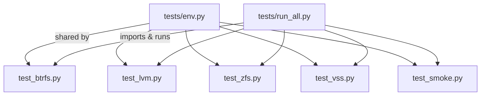
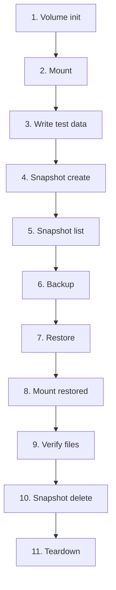

# Integration Test Guide

The integration tests exercise `vptcli` end-to-end against real storage
providers. They are written in Python and use loop devices (Linux) or VHD
files (Windows) to create disposable volumes.

## Test Framework

All tests share a common framework in `tests/env.py`. It provides:

- Root privilege detection
- Command availability checks with clear error messages
- UUID-based artifact isolation
- Loop device lifecycle management
- CLI wrappers for `vptcli` subcommands (`snapshot`, `backup`, `restore`)
- Structured logging to per-test log files
- CLI tracing capture (`RUST_LOG` output to `cli.log`)



## Test Isolation

Every test run gets a unique 8-character UUID prefix. All artifacts -- images,
streams, mount points, and logs -- are namespaced under this UUID so parallel
or overlapping runs never collide.

```
/tmp/testvolumedata/ab12cd34/
    logs/
        btrfs.log
        cli.log
    btrfs.img
    btrfs.stream

/tmp/testvolumemnt/ab12cd34/
    btrfs/
        restore-root/
```

## Test Lifecycle

Each provider test follows the same 11-step lifecycle:



| Step | Description |
|------|-------------|
| 1. Volume init | Create loop device, format, mount, create provider-specific structure |
| 2. Mount | Mount the source volume at a UUID-namespaced path |
| 3. Write data | Create 3 test files: `hello.txt`, `data.txt`, `sub/nested.txt` |
| 4. Snapshot create | `vptcli snapshot create --provider <P>` |
| 5. Snapshot list | `vptcli snapshot list --provider <P>` -- assert the snapshot appears |
| 6. Backup | `vptcli backup --provider <P>` -- assert stream/image file exists and is non-empty |
| 7. Restore | `vptcli restore --provider <P>` -- assert exit code 0 |
| 8. Mount restored | Mount the restored volume for verification |
| 9. Verify files | Read all 3 files, assert content matches the source data |
| 10. Snapshot delete | `vptcli snapshot delete --provider <P>` -- assert gone from list |
| 11. Teardown | Unmount, detach loop device, remove LVs / pools |

## Provider-Specific Tests

### Btrfs (`test_btrfs.py`)

- **Init:** `truncate` -> loop device -> `mkfs.btrfs -f` -> mount -> `btrfs subvolume create`
- **Backup:** Auto-creates temporary snapshot, runs `btrfs send`, cleans up temp snapshot
- **Restore:** Runs `btrfs receive` into a restore directory
- **Verify:** Uses `rglob("*.txt")` to find files in the received subvolume

### LVM (`test_lvm.py`)

- **Init:** `truncate` -> loop -> `pvcreate` -> `vgcreate` -> 2x `lvcreate -L 512M` -> `mkfs.ext4`
- **Backup:** Auto-creates LVM snapshot, runs `dd` to image file, cleans up snapshot
- **Restore:** Runs `dd` image into destination LV with `--force`
- **Verify:** Mounts restored LV, reads files with `cat`, unmounts

### ZFS (`test_zfs.py`)

- **Init:** `truncate` -> loop -> `zpool create -f` -> 2x `zfs create`
- **Backup:** Runs `zfs send` on explicit snapshot (`--snapshot-source`)
- **Restore:** Runs `zfs receive -F` into restore dataset
- **Verify:** Reads files from the auto-mounted restored dataset

### VSS (`test_vss.py`) -- Windows only

- **Init:** `diskpart` creates VHD, attaches, formats NTFS
- **Snapshot:** COM API with fallback to `wmic`/`vssadmin` CLI
- **Backup:** COM snapshot + direct volume copy fallback
- **Restore:** Detach target VHD, raw block copy of backup.img, re-mount
- **Verify:** `Path.read_text()` on all 3 files

## Smoke Tests

Smoke tests run without root and verify basic CLI behavior.

| Test                     | What it checks                                         |
|--------------------------|--------------------------------------------------------|
| `backend_list`           | `vptcli snapshot backend list` returns platform info   |
| `capabilities`           | `vptcli snapshot capabilities` works per Linux provider|
| `snapshot_usage`         | `vptcli snapshot` with no args shows usage (exit 0)    |
| `backup_usage`           | `vptcli backup` with no args shows usage (exit 0)      |
| `restore_usage`          | `vptcli restore` with no args shows usage (exit 0)     |
| `snapshot_invalid_provider` | Unknown provider returns non-zero exit code          |

```bash
python3 tests/test_smoke.py
```

## Running Tests

### All providers

```bash
sudo python3 tests/run_all.py
```

### Single provider

```bash
sudo python3 tests/test_btrfs.py
sudo python3 tests/test_lvm.py
sudo python3 tests/test_zfs.py
```

### Selective providers

```bash
sudo python3 tests/run_all.py --providers btrfs,smoke
```

### Build and test

```bash
sudo python3 tests/run_all.py --build
```

### Keep artifacts for debugging

```bash
sudo python3 tests/run_all.py --keep --no-cleanup
```

### Pin a UUID for reproducibility

```bash
TEST_ID=debug123 sudo python3 tests/run_all.py --providers btrfs --keep --no-cleanup
```

This creates artifacts at predictable paths:

```
/tmp/testvolumedata/debug123/logs/btrfs.log
/tmp/testvolumedata/debug123/logs/cli.log
/tmp/testvolumedata/debug123/btrfs.img
/tmp/testvolumedata/debug123/btrfs.stream
```

## Configuration

### Environment Variables

| Variable              | Default                    | Description                                 |
|-----------------------|----------------------------|---------------------------------------------|
| `TEST_DATA_ROOT`      | `/tmp/testvolumedata`      | Root for images, streams, logs              |
| `TEST_MOUNT_ROOT`     | `/tmp/testvolumemnt`       | Root for mount points                       |
| `TEST_ID`             | *(auto-generated UUID)*    | Test run identifier for artifact isolation  |
| `TEST_CLEANUP`        | `1`                        | Set to `0` to keep mount directories        |
| `TEST_KEEP_ARTIFACTS` | `0`                        | Set to `1` to keep image/stream files       |
| `VPT_PROJECT_ROOT`    | *(auto-detected)*          | Path to project root (contains Cargo.toml)  |
| `RUST_LOG`            | `vpt_rs=debug`             | Log level for CLI tracing                   |
| `VPT_COMMAND_TIMEOUT_SECS` | `30`                   | Timeout for external commands run by vptcli |

### Runner CLI Flags

| Flag               | Equivalent             | Description                            |
|--------------------|------------------------|----------------------------------------|
| `--providers LIST` | --                     | Comma-separated providers to run       |
| `--data-root PATH` | `TEST_DATA_ROOT`       | Override data directory                |
| `--mount-root PATH`| `TEST_MOUNT_ROOT`      | Override mount directory               |
| `--keep`           | `TEST_KEEP_ARTIFACTS=1`| Keep images and streams after test     |
| `--no-cleanup`     | `TEST_CLEANUP=0`       | Keep mount directories after test      |
| `--build`          | --                     | Run `cargo build --release` first      |
| `--timeout N`      | --                     | Per-test timeout in seconds (default 180) |

## Prerequisites

### System Packages

| Provider | Debian / Ubuntu package | Required commands                                  |
|----------|------------------------|---------------------------------------------------|
| btrfs    | `btrfs-progs`          | `mkfs.btrfs`, `btrfs`                             |
| lvm      | `lvm2`                 | `pvcreate`, `vgcreate`, `lvcreate`, `lvremove`, `vgremove`, `pvremove`, `mkfs.ext4` |
| zfs      | `zfsutils-linux`       | `zpool`, `zfs`                                    |
| common   | `util-linux`           | `losetup`, `truncate` (usually pre-installed)     |
| vss      | *(built into Windows)* | `diskpart`, `vssadmin`, `wmic`                    |

Install everything in one shot:

```bash
sudo apt-get install -y btrfs-progs lvm2 zfsutils-linux
```

:::caution
ZFS requires the kernel module. Verify it is loaded:

```bash
lsmod | grep zfs
# If missing:
sudo modprobe zfs
```

On kernels without ZFS support (e.g. some ARM boards), the ZFS tests will fail
even with the package installed.
:::

### Build the CLI

All tests require the `vptcli` binary in release mode:

```bash
cargo build --release
```

Or use the `--build` flag with the runner:

```bash
sudo python3 tests/run_all.py --build
```

## Log Files and Debugging

Each test produces two log files under `<DATA_ROOT>/<UUID>/logs/`:

### Python test log

Step-by-step output with timestamps from the Python test framework:

```
/tmp/testvolumedata/ab12cd34/logs/btrfs.log
```

Example entry:

```
16:09:34 [INFO] Log file: /tmp/testvolumedata/ab12cd34/logs/btrfs.log
16:09:34 [INFO] Creating loop device for btrfs
16:09:35 [INFO] Formatting btrfs filesystem
16:09:35 [INFO] Writing test files
```

### CLI tracing log

All `RUST_LOG=debug` output from `vptcli` invocations, separated by headers:

```
/tmp/testvolumedata/ab12cd34/logs/cli.log
```

Example entry:

```
============================================================
$ vptcli backup --provider btrfs --output /tmp/.../btrfs.stream /tmp/.../source-subvol
============================================================
 2026-06-07T08:21:03.456Z  INFO vpt_rs::platform::linux::btrfs: create_snapshot called
 2026-06-07T08:21:03.457Z DEBUG vpt_rs::process: starting external command command="btrfs subvolume snapshot -r ..."
```

### Debugging a failing test

1. Pin a UUID and keep all artifacts:
   ```bash
   TEST_ID=debug TEST_KEEP_ARTIFACTS=1 TEST_CLEANUP=0 \
     sudo python3 tests/test_btrfs.py
   ```
2. Check the Python log for which step failed.
3. Check `cli.log` for the exact CLI invocation and tracing output.
4. Inspect mounted volumes at `/tmp/testvolumemnt/debug/`.
