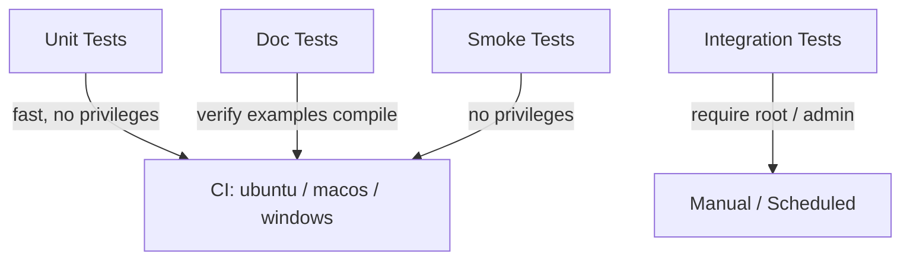
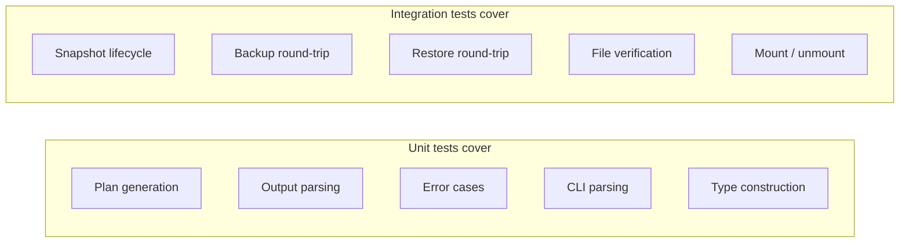
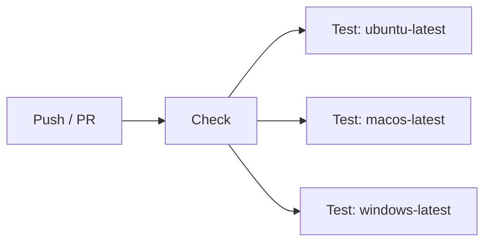

# Testing Strategy

vpt-rs uses a layered testing approach: fast unit tests and doc tests run in CI
on every platform, while slower integration tests exercise real storage providers
on Linux and Windows.



## Test Layers

### Unit Tests (34 tests)

Inline `#[test]` functions spread across the source modules. These test pure
logic without touching the filesystem or spawning external processes.

| Module          | What is tested                                                   |
|-----------------|------------------------------------------------------------------|
| `lib`           | Platform descriptor is non-empty, backend name matches descriptor, available backends list is non-empty, `SnapshotKind` parsing accepts short forms |
| `process`       | `wait_with_timeout` returns `None` for a long-running child      |
| `types`         | `VolumeRef` construction, `Display`, `From` impls, label sanitization |
| `error`         | `timeout_secs()` accessor returns correct values                 |
| `platform/*`    | Backend-specific plan generation, output parsing, error cases    |
| `bin/vptcli`    | CLI argument parsing and subcommand routing                      |

Run all unit tests with:

```bash
cargo test
```

:::tip
Unit tests never require root. They never write to real disks or spawn
privileged subprocesses. All I/O is either mocked or uses temporary files.
:::

### Doc Tests (3 tests)

Rust doc tests verify that the code examples in documentation comments actually
compile and run. They live in the `///` doc comments on types like `VolumeRef`,
`SnapshotRequest`, and `BackupPlan`.

```bash
cargo test --doc
```

Current doc tests:

| Source file   | Example verifies                                     |
|---------------|------------------------------------------------------|
| `types.rs`    | `VolumeRef::new` + `Display` output                  |
| `types.rs`    | `SnapshotRequest` struct construction                |
| `types.rs`    | `BackupPlan` struct construction with all fields     |

:::note
The `Backend` trait doc test is marked `ignore` because it requires a concrete
backend instance that depends on the runtime platform.
:::

### Integration Tests (Python-based)

Full round-trip tests that exercise `vptcli` against real storage providers.
These require root privileges and provider-specific system packages.

See the [Integration Tests](./integration-tests.md) page for details.

| Test file         | Provider | Root required |
|-------------------|----------|---------------|
| `test_btrfs.py`   | Btrfs    | Yes           |
| `test_lvm.py`     | LVM      | Yes           |
| `test_zfs.py`     | ZFS      | Yes           |
| `test_vss.py`     | VSS      | Yes (Admin)   |
| `test_smoke.py`   | --       | No            |

### Smoke Tests

A subset of the integration test suite that runs without root. These tests
verify CLI behavior that does not require privileged operations:

- `vptcli snapshot backend list` returns platform info
- `vptcli snapshot capabilities` works for each Linux provider
- `vptcli snapshot`, `backup`, `restore` with no args show usage text
- Invalid provider name returns a non-zero exit code

```bash
python3 tests/test_smoke.py
```

## What is Tested



| Area                     | Unit tests | Doc tests | Integration tests |
|--------------------------|:----------:|:---------:|:-----------------:|
| Type construction        |     yes    |    yes    |                   |
| CLI argument parsing     |     yes    |           |                   |
| Plan generation logic    |     yes    |           |                   |
| Output parsing           |     yes    |           |                   |
| Error variant behavior   |     yes    |           |                   |
| Label sanitization       |     yes    |    yes    |                   |
| Snapshot create/list/delete |         |           |       yes         |
| Backup (send or dd)      |            |           |       yes         |
| Restore (receive or dd)  |            |           |       yes         |
| File content verification|            |           |       yes         |
| CLI usage output         |            |           |       yes         |

## What is NOT Tested in Unit Tests

Unit tests deliberately avoid:

- **Creating real snapshots** -- requires root and provider tools
- **Running `btrfs send`/`zfs send`/`dd`** -- privileged I/O operations
- **Mounting filesystems** -- requires mount permissions
- **Writing to block devices** -- requires device access

These scenarios are covered by the integration test suite, which runs with
root privileges and real loop devices.

## CI Pipeline

The CI workflow runs on every push and pull request to `master`:



**Check job** (runs on `ubuntu-latest`):
1. `cargo fmt --all -- --check`
2. `cargo clippy --all-targets -D warnings`

**Test jobs** (run in parallel on all three platforms):
1. `cargo build --verbose`
2. `cargo test --verbose`
3. On Windows only: `cargo build --all-features` and `cargo test --all-features`

Integration tests are not part of CI because they require root and specific
storage tools. They are run manually or in scheduled jobs.

## Running Tests Locally

### All unit and doc tests

```bash
cargo test
```

### Only unit tests (skip doc tests)

```bash
cargo test --lib
```

### Only doc tests

```bash
cargo test --doc
```

### Smoke tests (no root)

```bash
python3 tests/test_smoke.py
```

### Integration tests (root required)

```bash
# All providers
sudo python3 tests/run_all.py

# Single provider
sudo python3 tests/test_btrfs.py

# Build first, then test
sudo python3 tests/run_all.py --build
```

:::caution
Integration tests create loop devices, LVM volume groups, and ZFS pools.
Always run them in a disposable environment. Never run on a production system.
:::
